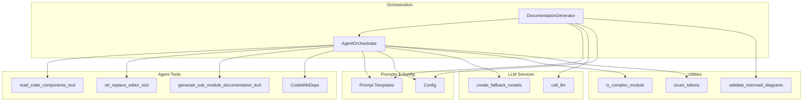
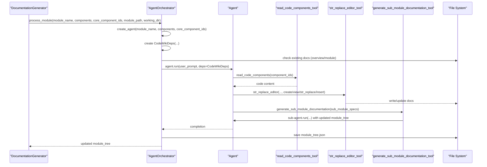
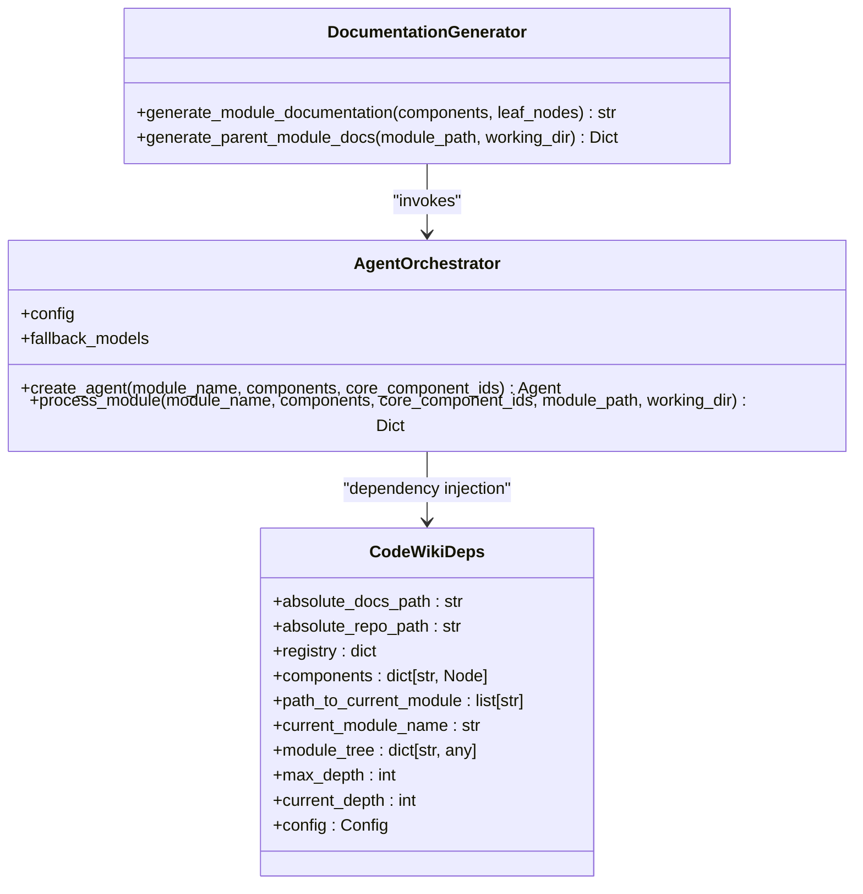
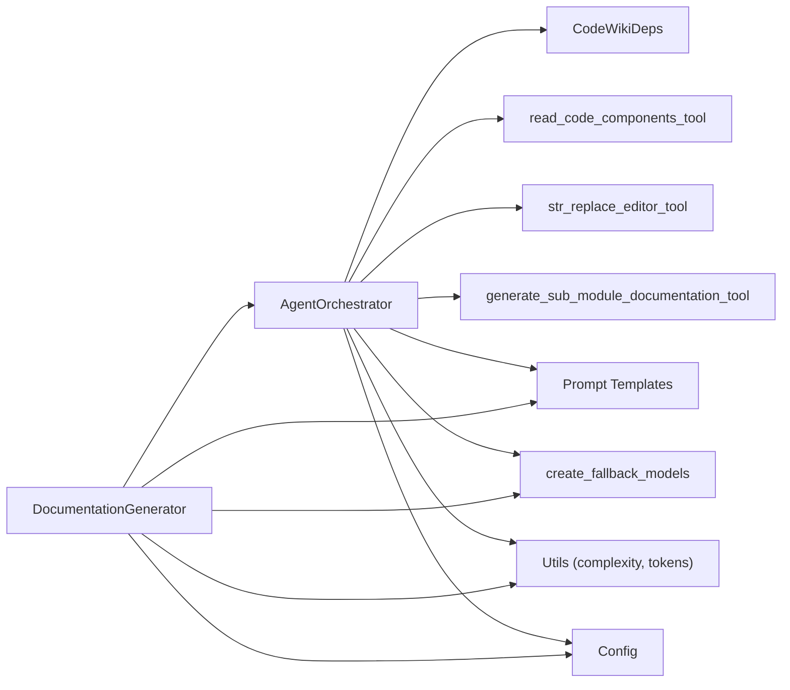

# Agent Orchestration and Documentation Generation

<cite>
**Referenced Files in This Document**
- [agent_orchestrator.py](file://codewiki/src/be/agent_orchestrator.py)
- [documentation_generator.py](file://codewiki/src/be/documentation_generator.py)
- [deps.py](file://codewiki/src/be/agent_tools/deps.py)
- [read_code_components.py](file://codewiki/src/be/agent_tools/read_code_components.py)
- [str_replace_editor.py](file://codewiki/src/be/agent_tools/str_replace_editor.py)
- [generate_sub_module_documentations.py](file://codewiki/src/be/agent_tools/generate_sub_module_documentations.py)
- [prompt_template.py](file://codewiki/src/be/prompt_template.py)
- [utils.py](file://codewiki/src/be/utils.py)
- [config.py](file://codewiki/src/config.py)
- [llm_services.py](file://codewiki/src/be/llm_services.py)
- [cluster_modules.py](file://codewiki/src/be/cluster_modules.py)
- [core.py](file://codewiki/src/be/dependency_analyzer/models/core.py)
- [api_errors.py](file://codewiki/cli/utils/api_errors.py)
</cite>

## Table of Contents
1. [Introduction](#introduction)
2. [Project Structure](#project-structure)
3. [Core Components](#core-components)
4. [Architecture Overview](#architecture-overview)
5. [Detailed Component Analysis](#detailed-component-analysis)
6. [Dependency Analysis](#dependency-analysis)
7. [Performance Considerations](#performance-considerations)
8. [Troubleshooting Guide](#troubleshooting-guide)
9. [Conclusion](#conclusion)

## Introduction
This document explains the agent orchestration and documentation generation sub-feature. It focuses on the AgentOrchestrator class and its role in managing AI agents for documentation creation. It describes how agents are dynamically configured based on module complexity, how the process_module() workflow initializes agents, injects dependencies, executes agents, and updates the module tree. It also documents redundancy prevention, error handling and logging, and provides troubleshooting guidance for common LLM API failures and agent execution issues.

## Project Structure
The agent orchestration feature spans several modules:
- Orchestrator and generator: AgentOrchestrator and DocumentationGenerator coordinate the end-to-end pipeline.
- Agent tools: Tools for reading code, editing documentation, and spawning sub-agents for submodules.
- Prompting and configuration: System prompts, user prompt formatting, and configuration constants.
- Utilities: Complexity checks, token counting, and Mermaid validation.
- LLM services: Model creation and fallback model chains.
- Clustering: Module grouping for complex repositories.

**Diagram sources**
- [documentation_generator.py](file://codewiki/src/be/documentation_generator.py#L1-L292)
- [agent_orchestrator.py](file://codewiki/src/be/agent_orchestrator.py#L1-L149)
- [read_code_components.py](file://codewiki/src/be/agent_tools/read_code_components.py#L1-L22)
- [str_replace_editor.py](file://codewiki/src/be/agent_tools/str_replace_editor.py#L1-L783)
- [generate_sub_module_documentations.py](file://codewiki/src/be/agent_tools/generate_sub_module_documentations.py#L1-L93)
- [prompt_template.py](file://codewiki/src/be/prompt_template.py#L1-L337)
- [utils.py](file://codewiki/src/be/utils.py#L1-L207)
- [config.py](file://codewiki/src/config.py#L1-L114)
- [llm_services.py](file://codewiki/src/be/llm_services.py#L1-L86)
- [cluster_modules.py](file://codewiki/src/be/cluster_modules.py#L1-L113)

**Section sources**
- [documentation_generator.py](file://codewiki/src/be/documentation_generator.py#L1-L292)
- [agent_orchestrator.py](file://codewiki/src/be/agent_orchestrator.py#L1-L149)

## Core Components
- AgentOrchestrator: Creates and runs agents per module, injects dependencies, and manages module tree updates.
- DocumentationGenerator: Drives the overall generation pipeline, including dependency graph building, module clustering, processing order, and parent module overview generation.
- Agent Tools: read_code_components, str_replace_editor, and generate_sub_module_documentation.
- CodeWikiDeps: Dependency injection container passed to agents.
- Prompt Template: System prompts and user prompt formatting.
- Utilities: Complexity checks, token counting, Mermaid validation.
- LLM Services: Fallback model chain and direct LLM calls for overview generation.
- Configuration: Paths, constants, and LLM settings.

**Section sources**
- [agent_orchestrator.py](file://codewiki/src/be/agent_orchestrator.py#L1-L149)
- [documentation_generator.py](file://codewiki/src/be/documentation_generator.py#L1-L292)
- [deps.py](file://codewiki/src/be/agent_tools/deps.py#L1-L16)
- [prompt_template.py](file://codewiki/src/be/prompt_template.py#L1-L337)
- [utils.py](file://codewiki/src/be/utils.py#L1-L207)
- [config.py](file://codewiki/src/config.py#L1-L114)
- [llm_services.py](file://codewiki/src/be/llm_services.py#L1-L86)

## Architecture Overview
The orchestration pipeline:
- DocumentationGenerator builds the dependency graph and module tree, determines processing order, and invokes AgentOrchestrator for leaf modules.
- AgentOrchestrator creates an Agent with tools and system prompts based on module complexity, injects CodeWikiDeps, and executes agent.run().
- Agents use tools to read code, edit documentation, and spawn sub-agents for submodules.
- The module tree is updated and persisted after successful processing.

**Diagram sources**
- [documentation_generator.py](file://codewiki/src/be/documentation_generator.py#L124-L198)
- [agent_orchestrator.py](file://codewiki/src/be/agent_orchestrator.py#L90-L149)
- [read_code_components.py](file://codewiki/src/be/agent_tools/read_code_components.py#L1-L22)
- [str_replace_editor.py](file://codewiki/src/be/agent_tools/str_replace_editor.py#L709-L783)
- [generate_sub_module_documentations.py](file://codewiki/src/be/agent_tools/generate_sub_module_documentations.py#L1-L93)
- [prompt_template.py](file://codewiki/src/be/prompt_template.py#L242-L305)

## Detailed Component Analysis

### AgentOrchestrator
Responsibilities:
- Dynamically configure agents based on module complexity using is_complex_module().
- Select tools: read_code_components, str_replace_editor, and optionally generate_sub_module_documentation.
- Assign system prompts: SYSTEM_PROMPT for complex modules, LEAF_SYSTEM_PROMPT for simpler ones.
- Initialize CodeWikiDeps with absolute paths, components, module tree, depth limits, and config.
- Prevent redundant processing by checking for existing overview.md and module_name.md.
- Execute agent.run() with formatted user prompt and save updated module tree.

Key methods and flows:
- create_agent(): Chooses tools and system prompt based on complexity.
- process_module(): Loads module tree, checks for existing docs, constructs CodeWikiDeps, runs agent, and persists module_tree.json.

**Diagram sources**
- [agent_orchestrator.py](file://codewiki/src/be/agent_orchestrator.py#L62-L149)
- [deps.py](file://codewiki/src/be/agent_tools/deps.py#L1-L16)
- [documentation_generator.py](file://codewiki/src/be/documentation_generator.py#L124-L198)

**Section sources**
- [agent_orchestrator.py](file://codewiki/src/be/agent_orchestrator.py#L62-L149)
- [utils.py](file://codewiki/src/be/utils.py#L15-L24)
- [prompt_template.py](file://codewiki/src/be/prompt_template.py#L1-L76)

### Agent Tools

#### read_code_components_tool
- Purpose: Read source code for given component IDs from the injected components map.
- Behavior: Iterates component IDs, retrieves source code, and returns concatenated results. Skips missing components.

**Section sources**
- [read_code_components.py](file://codewiki/src/be/agent_tools/read_code_components.py#L1-L22)

#### str_replace_editor_tool
- Purpose: File system operations for documentation files: view, create, str_replace, insert, undo_edit.
- Behavior: Validates paths, enforces working_dir restrictions, writes/edits files, maintains file history, and validates Mermaid diagrams for markdown edits.

**Section sources**
- [str_replace_editor.py](file://codewiki/src/be/agent_tools/str_replace_editor.py#L350-L783)
- [utils.py](file://codewiki/src/be/utils.py#L45-L200)

#### generate_sub_module_documentation_tool
- Purpose: Spawn sub-agents for submodules when a module is complex and token limits require subdivision.
- Behavior: Updates module_tree with submodules, creates sub-agents with appropriate system prompts and tools, runs them, and restores context.

**Section sources**
- [generate_sub_module_documentations.py](file://codewiki/src/be/agent_tools/generate_sub_module_documentations.py#L1-L93)

### Prompt Template and User Prompt Formatting
- System prompts define roles, objectives, documentation structure, and available tools.
- format_user_prompt organizes module tree and core component files into a structured prompt for the agent.

**Section sources**
- [prompt_template.py](file://codewiki/src/be/prompt_template.py#L1-L127)
- [prompt_template.py](file://codewiki/src/be/prompt_template.py#L242-L337)

### Complexity and Token Utilities
- is_complex_module: Determines complexity by counting distinct files among core components.
- count_tokens: Estimates token usage for prompt construction and branching decisions.
- validate_mermaid_diagrams: Validates Mermaid diagrams in generated markdown.

**Section sources**
- [utils.py](file://codewiki/src/be/utils.py#L15-L24)
- [utils.py](file://codewiki/src/be/utils.py#L30-L40)
- [utils.py](file://codewiki/src/be/utils.py#L45-L200)

### LLM Services and Configuration
- create_fallback_models: Builds a FallbackModel chain from main and fallback models.
- call_llm: Direct LLM invocation for overview generation.
- Config: Provides paths, constants, and LLM settings.

**Section sources**
- [llm_services.py](file://codewiki/src/be/llm_services.py#L1-L86)
- [config.py](file://codewiki/src/config.py#L1-L114)

### DocumentationGenerator Workflow
- Builds dependency graph and clusters modules when needed.
- Determines processing order (leaf modules first) and invokes AgentOrchestrator for each leaf.
- Generates parent module overviews using LLM calls and prompt templates.
- Creates metadata and renames overview file when processing the whole repository.

**Section sources**
- [documentation_generator.py](file://codewiki/src/be/documentation_generator.py#L1-L292)
- [cluster_modules.py](file://codewiki/src/be/cluster_modules.py#L1-L113)

## Dependency Analysis
- AgentOrchestrator depends on:
  - CodeWikiDeps for dependency injection.
  - Tool modules for agent capabilities.
  - Prompt templates for system/user prompts.
  - LLM services for fallback models.
  - Utils for complexity and token checks.
  - Config for paths and constants.
- DocumentationGenerator composes AgentOrchestrator and uses LLM services for overview generation.
- Agent tools depend on CodeWikiDeps and file system utilities.

**Diagram sources**
- [agent_orchestrator.py](file://codewiki/src/be/agent_orchestrator.py#L62-L149)
- [documentation_generator.py](file://codewiki/src/be/documentation_generator.py#L1-L292)
- [deps.py](file://codewiki/src/be/agent_tools/deps.py#L1-L16)
- [prompt_template.py](file://codewiki/src/be/prompt_template.py#L1-L337)
- [utils.py](file://codewiki/src/be/utils.py#L1-L207)
- [config.py](file://codewiki/src/config.py#L1-L114)
- [llm_services.py](file://codewiki/src/be/llm_services.py#L1-L86)

**Section sources**
- [agent_orchestrator.py](file://codewiki/src/be/agent_orchestrator.py#L62-L149)
- [documentation_generator.py](file://codewiki/src/be/documentation_generator.py#L1-L292)

## Performance Considerations
- Complexity-driven agent configuration reduces unnecessary tool usage for simple modules.
- Token estimation and branching prevent oversized prompts and excessive recursion.
- Redundant processing checks avoid re-generating existing docs.
- Fallback models improve resilience to API failures.

[No sources needed since this section provides general guidance]

## Troubleshooting Guide

Common issues and solutions:
- LLM API failures (rate limit, authentication, timeout, network):
  - Use the CLI API error handler utilities to detect and guide resolution steps.
  - Retry after addressing quotas, update API keys, verify connectivity, or adjust timing.
- Agent execution problems:
  - Validate Mermaid diagrams in generated markdown; invalid diagrams cause validation failures.
  - Ensure working_dir restrictions are respected for repo vs docs operations.
  - Confirm that component IDs exist in the components map before invoking read_code_components.
- Redundant processing:
  - If overview.md or module_name.md exists, processing is skipped to avoid duplication.
- Module tree updates:
  - The module tree is saved after successful agent runs; verify file persistence and correct paths.

Concrete examples from the code:
- Agent creation and tool selection based on complexity:
  - [create_agent()](file://codewiki/src/be/agent_orchestrator.py#L66-L89)
- Agent initialization and dependency injection:
  - [process_module() dependency injection](file://codewiki/src/be/agent_orchestrator.py#L103-L114)
- Execution via agent.run() with formatted user prompt:
  - [process_module() agent.run()](file://codewiki/src/be/agent_orchestrator.py#L130-L139)
- Redundancy prevention:
  - [Overview and module existence checks](file://codewiki/src/be/agent_orchestrator.py#L116-L127)
- Error handling and logging:
  - [AgentOrchestrator error handling](file://codewiki/src/be/agent_orchestrator.py#L146-L149)
  - [DocumentationGenerator error handling](file://codewiki/src/be/documentation_generator.py#L172-L176)
  - [LLM call error handling](file://codewiki/src/be/llm_services.py#L58-L86)
  - [API error handling utilities](file://codewiki/cli/utils/api_errors.py#L1-L140)
- Sub-agent generation and module tree updates:
  - [generate_sub_module_documentation() updates module_tree](file://codewiki/src/be/agent_tools/generate_sub_module_documentations.py#L33-L39)
  - [Sub-agent run and context restoration](file://codewiki/src/be/agent_tools/generate_sub_module_documentations.py#L73-L89)
- Mermaid validation:
  - [validate_mermaid_diagrams() invoked by str_replace_editor](file://codewiki/src/be/agent_tools/str_replace_editor.py#L762-L766)

**Section sources**
- [agent_orchestrator.py](file://codewiki/src/be/agent_orchestrator.py#L90-L149)
- [documentation_generator.py](file://codewiki/src/be/documentation_generator.py#L124-L198)
- [generate_sub_module_documentations.py](file://codewiki/src/be/agent_tools/generate_sub_module_documentations.py#L1-L93)
- [str_replace_editor.py](file://codewiki/src/be/agent_tools/str_replace_editor.py#L709-L783)
- [api_errors.py](file://codewiki/cli/utils/api_errors.py#L1-L140)

## Conclusion
AgentOrchestrator centralizes agent lifecycle management for documentation generation. It dynamically configures agents based on module complexity, injects a rich dependency context, and coordinates tool usage to produce modular, well-structured documentation. Built-in redundancy checks, robust error handling, and Mermaid validation ensure reliable and high-quality outputs. The DocumentationGenerator complements this by orchestrating the broader pipeline, including clustering, processing order, and parent module overviews.