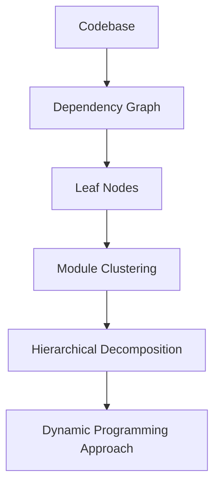
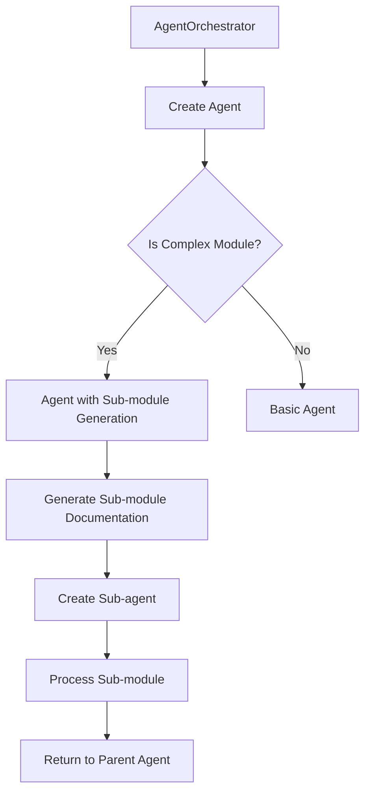
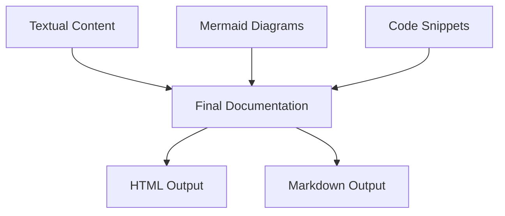
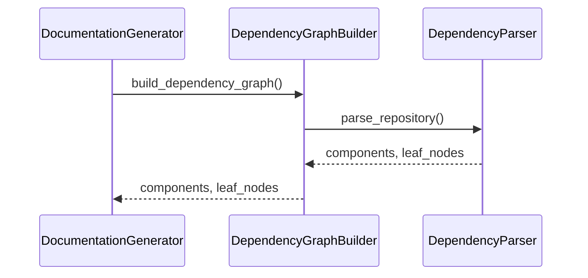
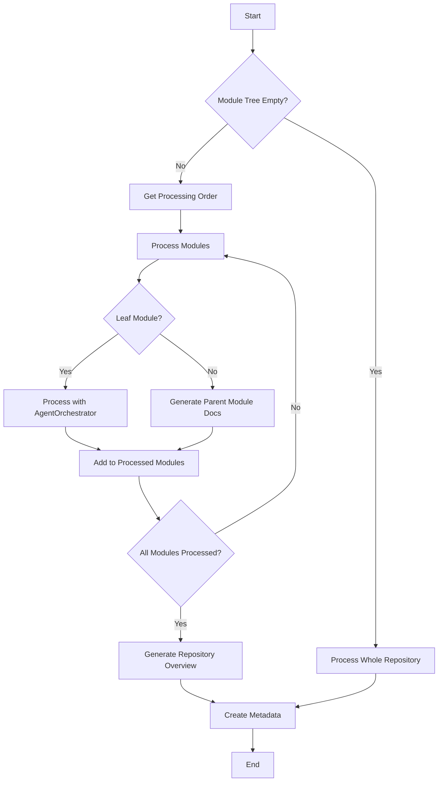
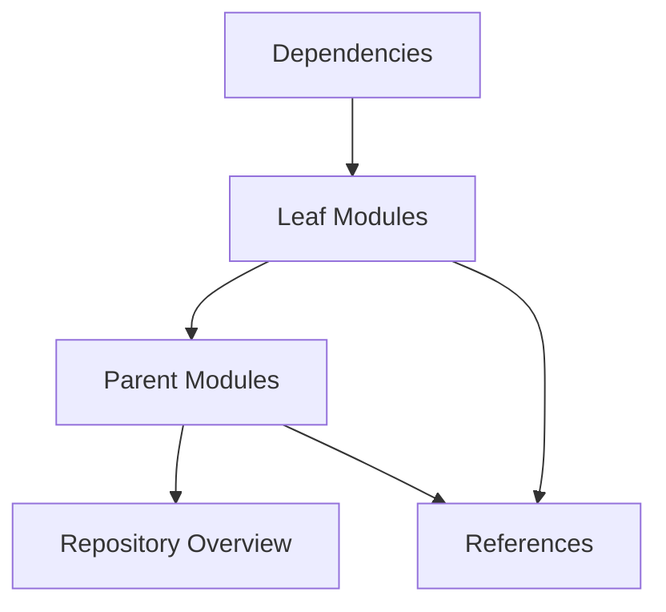

# Documentation Generation Process Overview

<cite>
**Referenced Files in This Document**   
- [codewiki/src/be/documentation_generator.py](file://codewiki/src/be/documentation_generator.py)
- [codewiki/src/be/agent_orchestrator.py](file://codewiki/src/be/agent_orchestrator.py)
- [codewiki/src/be/cluster_modules.py](file://codewiki/src/be/cluster_modules.py)
- [codewiki/src/be/dependency_analyzer/dependency_graphs_builder.py](file://codewiki/src/be/dependency_analyzer/dependency_graphs_builder.py)
- [codewiki/src/be/prompt_template.py](file://codewiki/src/be/prompt_template.py)
- [codewiki/src/config.py](file://codewiki/src/config.py)
- [codewiki/src/be/agent_tools/generate_sub_module_documentations.py](file://codewiki/src/be/agent_tools/generate_sub_module_documentations.py)
- [codewiki/src/be/utils.py](file://codewiki/src/be/utils.py)
</cite>

## Table of Contents
1. [Introduction](#introduction)
2. [Three-Stage Architecture](#three-stage-architecture)
3. [Main Orchestrator: DocumentationGenerator](#main-orchestrator-documentationgenerator)
4. [Execution Flow of run() Method](#execution-flow-of-run-method)
5. [Repository Size Handling Strategy](#repository-size-handling-strategy)
6. [Metadata Generation and Output Organization](#metadata-generation-and-output-organization)
7. [Processing Order Determination](#processing-order-determination)
8. [Failure Handling Mechanisms](#failure-handling-mechanisms)
9. [Performance Considerations and Optimization Strategies](#performance-considerations-and-optimization-strategies)
10. [Conclusion](#conclusion)

## Introduction

The documentation generation process in CodeWiki is a sophisticated system designed to automatically create comprehensive documentation for software repositories. The system employs a three-stage architecture that combines hierarchical decomposition, recursive multi-agent processing, and multi-modal synthesis to produce high-quality documentation. This document provides an in-depth analysis of the end-to-end workflow from codebase analysis to final output, focusing on the core components and their interactions.

The system is designed to handle both small and large repositories efficiently, using dynamic programming-inspired algorithms to optimize the documentation generation process. At its core, the DocumentationGenerator class orchestrates the entire process, coordinating various components to analyze code dependencies, cluster related modules, and generate documentation using AI agents.

**Section sources**
- [codewiki/src/be/documentation_generator.py](file://codewiki/src/be/documentation_generator.py#L29-L292)
- [codewiki/src/be/main.py](file://codewiki/src/be/main.py#L46-L66)

## Three-Stage Architecture

The documentation generation system follows a three-stage architecture that enables efficient and comprehensive documentation creation:

### Hierarchical Decomposition Using Dynamic Programming-Inspired Algorithms

The first stage involves hierarchical decomposition of the codebase using dynamic programming-inspired algorithms. This approach breaks down the documentation problem into smaller subproblems that can be solved independently and then combined to form the complete documentation.

The system uses a topological sorting algorithm to determine the processing order of modules, ensuring that leaf modules (those with no dependencies) are processed first, followed by their parent modules. This approach mirrors the principle of dynamic programming by solving smaller problems first and using their solutions to build up to larger ones.



**Diagram sources**
- [codewiki/src/be/dependency_analyzer/topo_sort.py](file://codewiki/src/be/dependency_analyzer/topo_sort.py#L121-L169)
- [codewiki/src/be/documentation_generator.py](file://codewiki/src/be/documentation_generator.py#L74-L92)

### Recursive Multi-Agent Processing with Dynamic Delegation

The second stage employs recursive multi-agent processing with dynamic delegation. The system uses AI agents to generate documentation for different parts of the codebase, with the ability to delegate sub-tasks to sub-agents when necessary.

The AgentOrchestrator class creates specialized agents based on module complexity. For complex modules (those spanning multiple files), the system creates agents with additional capabilities, including the ability to generate sub-module documentation. This recursive delegation allows the system to handle complex codebases by breaking them down into manageable components.



**Diagram sources**
- [codewiki/src/be/agent_orchestrator.py](file://codewiki/src/be/agent_orchestrator.py#L66-L88)
- [codewiki/src/be/agent_tools/generate_sub_module_documentations.py](file://codewiki/src/be/agent_tools/generate_sub_module_documentations.py#L17-L93)

### Multi-Modal Synthesis Combining Textual and Visual Artifacts

The third stage involves multi-modal synthesis that combines textual and visual artifacts to create comprehensive documentation. The system generates both textual descriptions and visual diagrams (using Mermaid) to provide multiple perspectives on the codebase.

The documentation includes architecture diagrams, dependency graphs, data flow diagrams, and other visual representations that complement the textual content. This multi-modal approach enhances understanding by catering to different learning styles and providing both high-level overviews and detailed technical information.



**Diagram sources**
- [codewiki/src/be/prompt_template.py](file://codewiki/src/be/prompt_template.py#L1-L45)
- [codewiki/src/be/utils.py](file://codewiki/src/be/utils.py#L45-L207)

## Main Orchestrator: DocumentationGenerator

The DocumentationGenerator class serves as the main orchestrator for the entire documentation generation process. It coordinates the various components and ensures that the documentation is generated in the correct order and with the appropriate dependencies.

### Class Structure and Initialization

The DocumentationGenerator class is initialized with a configuration object and an optional commit ID. It sets up the necessary components for the documentation process, including the dependency graph builder and agent orchestrator.

```python
class DocumentationGenerator:
    def __init__(self, config: Config, commit_id: str = None):
        self.config = config
        self.commit_id = commit_id
        self.graph_builder = DependencyGraphBuilder(config)
        self.agent_orchestrator = AgentOrchestrator(config)
```

The initialization process creates instances of the DependencyGraphBuilder and AgentOrchestrator classes, which are used throughout the documentation generation process. The DependencyGraphBuilder is responsible for analyzing code dependencies, while the AgentOrchestrator manages the AI agents that generate the documentation.

**Section sources**
- [codewiki/src/be/documentation_generator.py](file://codewiki/src/be/documentation_generator.py#L29-L37)

### Core Methods and Responsibilities

The DocumentationGenerator class has several core methods that handle different aspects of the documentation generation process:

- **create_documentation_metadata**: Creates a metadata file with information about the documentation generation process
- **get_processing_order**: Determines the order in which modules should be processed using topological sorting
- **generate_module_documentation**: Generates documentation for all modules using a dynamic programming approach
- **generate_parent_module_docs**: Generates documentation for parent modules based on their children's documentation
- **run**: Executes the complete documentation generation process

Each method plays a specific role in the overall process, with the run() method serving as the main entry point that coordinates all other operations.

**Section sources**
- [codewiki/src/be/documentation_generator.py](file://codewiki/src/be/documentation_generator.py#L38-L248)

## Execution Flow of run() Method

The run() method is the main entry point for the documentation generation process. It orchestrates the entire workflow from dependency analysis to final documentation generation.

### Phase 1: Dependency Graph Building

The first phase involves building a dependency graph of the codebase. This is accomplished by calling the build_dependency_graph() method of the DependencyGraphBuilder class.



The dependency graph building process involves parsing the repository to identify all code components and their dependencies. The system analyzes source files to extract information about classes, functions, and their relationships. This information is used to create a comprehensive dependency graph that serves as the foundation for the rest of the documentation process.

**Diagram sources**
- [codewiki/src/be/dependency_analyzer/dependency_graphs_builder.py](file://codewiki/src/be/dependency_analyzer/dependency_graphs_builder.py#L18-L63)

### Phase 2: Module Clustering

The second phase involves clustering related modules based on their dependencies and functionality. This is accomplished using the cluster_modules() function, which groups related components into logical modules.

The clustering process uses a dynamic approach that considers both the dependencies between components and their file locations. The system creates a module tree that represents the hierarchical structure of the codebase, with parent modules containing related child modules.

```python
# Check if module tree exists
if os.path.exists(first_module_tree_path):
    module_tree = file_manager.load_json(first_module_tree_path)
else:
    module_tree = cluster_modules(leaf_nodes, components, self.config)
    file_manager.save_json(module_tree, first_module_tree_path)
```

The module clustering phase is crucial for organizing the documentation in a logical and intuitive way. By grouping related components together, the system creates a structure that reflects the actual architecture of the codebase.

**Section sources**
- [codewiki/src/be/documentation_generator.py](file://codewiki/src/be/documentation_generator.py#L265-L274)
- [codewiki/src/be/cluster_modules.py](file://codewiki/src/be/cluster_modules.py#L44-L113)

### Phase 3: Documentation Generation

The third phase involves generating the actual documentation for each module. This is accomplished using a dynamic programming approach that processes leaf modules first, then parent modules, and finally the repository overview.



The documentation generation phase uses the processing order determined by the get_processing_order() method to ensure that modules are processed in the correct sequence. This approach ensures that when a parent module is processed, all of its child modules have already been documented, allowing the parent documentation to reference the child documentation appropriately.

**Diagram sources**
- [codewiki/src/be/documentation_generator.py](file://codewiki/src/be/documentation_generator.py#L278-L280)

## Repository Size Handling Strategy

The system employs different strategies for handling small and large repositories, optimizing the documentation process based on the size and complexity of the codebase.

### Large Repositories: Hierarchical Decomposition

For large repositories that exceed the context window of the LLM, the system uses hierarchical decomposition to break the documentation problem into smaller, manageable pieces. This approach involves:

1. Analyzing the entire codebase to identify all components and their dependencies
2. Clustering related components into logical modules
3. Processing each module independently, starting with leaf modules
4. Combining the module documentation to create a comprehensive repository overview

This hierarchical approach allows the system to handle large codebases by focusing on one module at a time, ensuring that each part of the documentation is generated with the appropriate context and detail.

```python
if len(module_tree) > 0:
    for module_path, module_name in processing_order:
        if self.is_leaf_module(module_info):
            final_module_tree = await self.agent_orchestrator.process_module(
                module_name, components, module_info["components"], module_path, working_dir
            )
        else:
            final_module_tree = await self.generate_parent_module_docs(
                module_path, working_dir
            )
```

**Section sources**
- [codewiki/src/be/documentation_generator.py](file://codewiki/src/be/documentation_generator.py#L143-L175)

### Small Repositories: Whole-Repository Processing

For small repositories that can fit within the context window of the LLM, the system processes the entire repository as a single unit. This approach is more efficient for small codebases and allows the LLM to consider the entire codebase when generating documentation.

```python
else:
    logger.info(f"Processing whole repo because repo can fit in the context window")
    repo_name = os.path.basename(os.path.normpath(self.config.repo_path))
    final_module_tree = await self.agent_orchestrator.process_module(
        repo_name, components, leaf_nodes, [], working_dir
    )
```

This approach simplifies the documentation process for small repositories by eliminating the need for module clustering and hierarchical processing. The system can generate comprehensive documentation in a single pass, leveraging the full context of the codebase.

**Section sources**
- [codewiki/src/be/documentation_generator.py](file://codewiki/src/be/documentation_generator.py#L183-L187)

## Metadata Generation and Output Organization

The system generates comprehensive metadata and organizes the output in a structured and accessible way.

### Metadata Generation Process

The metadata generation process creates a JSON file that contains information about the documentation generation process, including:

- Generation timestamp
- LLM model used
- Generator version
- Repository path and commit ID
- Statistics about the codebase (total components, leaf nodes, etc.)
- List of generated files

```python
def create_documentation_metadata(self, working_dir: str, components: Dict[str, Any], num_leaf_nodes: int):
    metadata = {
        "generation_info": {
            "timestamp": datetime.now().isoformat(),
            "main_model": self.config.main_model,
            "generator_version": "1.0.1",
            "repo_path": self.config.repo_path,
            "commit_id": self.commit_id
        },
        "statistics": {
            "total_components": len(components),
            "leaf_nodes": num_leaf_nodes,
            "max_depth": self.config.max_depth
        },
        "files_generated": [
            "overview.md",
            "module_tree.json",
            "first_module_tree.json"
        ]
    }
```

The metadata serves as a record of the documentation generation process and provides valuable information for auditing and debugging purposes.

**Section sources**
- [codewiki/src/be/documentation_generator.py](file://codewiki/src/be/documentation_generator.py#L38-L71)

### Output Organization Structure

The system organizes the generated documentation in a structured directory hierarchy:

```
output/
├── docs/
│   ├── {repo_name}-docs/
│   │   ├── overview.md
│   │   ├── module_tree.json
│   │   ├── first_module_tree.json
│   │   ├── metadata.json
│   │   ├── {module1}.md
│   │   ├── {module2}.md
│   │   └── ...
│   └── index.html
└── dependency_graphs/
    └── {repo_name}_dependency_graph.json
```

This organization ensures that all generated files are easily accessible and properly categorized. The main documentation files are stored in the docs directory, while dependency graphs and other analysis artifacts are stored separately.

**Section sources**
- [codewiki/src/config.py](file://codewiki/src/config.py#L9-L14)

## Processing Order Determination

The system uses a sophisticated algorithm to determine the processing order of modules, ensuring that dependencies are resolved correctly and documentation is generated in the optimal sequence.

### Topological Sorting Algorithm

The processing order is determined using a topological sorting algorithm that ensures leaf modules are processed before their parent modules. This approach mirrors the principle of dynamic programming by solving smaller problems first and using their solutions to build up to larger ones.

```python
def get_processing_order(self, module_tree: Dict[str, Any], parent_path: List[str] = []) -> List[tuple[List[str], str]]:
    processing_order = []
    
    def collect_modules(tree: Dict[str, Any], path: List[str]):
        for module_name, module_info in tree.items():
            current_path = path + [module_name]
            
            if module_info.get("children") and isinstance(module_info["children"], dict) and module_info["children"]:
                collect_modules(module_info["children"], current_path)
                processing_order.append((current_path, module_name))
            else:
                processing_order.append((current_path, module_name))
    
    collect_modules(module_tree, parent_path)
    return processing_order
```

The algorithm recursively traverses the module tree, adding child modules to the processing order before their parent modules. This ensures that when a parent module is processed, all of its child modules have already been documented.

**Section sources**
- [codewiki/src/be/documentation_generator.py](file://codewiki/src/be/documentation_generator.py#L74-L92)

### Dynamic Programming-Inspired Approach

The processing order determination follows a dynamic programming-inspired approach by breaking down the problem into smaller subproblems and solving them in the optimal sequence. This approach ensures that:

1. Leaf modules (those with no dependencies) are processed first
2. Parent modules are processed after their child modules
3. The repository overview is generated last, after all modules have been documented

This sequence ensures that each module can reference the documentation of its dependencies, creating a coherent and interconnected documentation structure.



**Diagram sources**
- [codewiki/src/be/documentation_generator.py](file://codewiki/src/be/documentation_generator.py#L285-L286)

## Failure Handling Mechanisms

The system implements robust failure handling mechanisms to ensure that the documentation generation process can continue even when individual components fail.

### Graceful Error Recovery

The system uses try-except blocks to catch and handle exceptions at multiple levels of the documentation generation process. When an error occurs while processing a module, the system logs the error and continues with the next module, rather than terminating the entire process.

```python
try:
    # Process the module
    if self.is_leaf_module(module_info):
        final_module_tree = await self.agent_orchestrator.process_module(
            module_name, components, module_info["components"], module_path, working_dir
        )
    else:
        final_module_tree = await self.generate_parent_module_docs(
            module_path, working_dir
        )
    
    processed_modules.add(module_key)
    
except Exception as e:
    logger.error(f"Failed to process module {module_key}: {str(e)}")
    logger.error(f"Traceback: {traceback.format_exc()}")
    continue
```

This approach ensures that a failure in one part of the system does not prevent the documentation of other parts, maximizing the amount of documentation that can be generated.

**Section sources**
- [codewiki/src/be/documentation_generator.py](file://codewiki/src/be/documentation_generator.py#L172-L175)

### Comprehensive Logging

The system implements comprehensive logging to track the progress of the documentation generation process and record any errors that occur. This logging provides valuable information for debugging and troubleshooting.

```python
logger.info(f"📄 Processing leaf module: {module_key}")
logger.info(f"📁 Processing parent module: {module_key}")
logger.error(f"Failed to process module {module_key}: {str(e)}")
logger.debug(f"Documentation generation completed successfully")
```

The logging system uses different log levels (info, error, debug) to provide appropriate detail for different types of messages. This allows users to monitor the progress of the documentation generation process and identify any issues that need to be addressed.

**Section sources**
- [codewiki/src/be/documentation_generator.py](file://codewiki/src/be/documentation_generator.py#L160-L161)

## Performance Considerations and Optimization Strategies

The system employs several performance considerations and optimization strategies to ensure efficient documentation generation.

### Caching and Reuse

The system implements caching mechanisms to avoid redundant processing and improve performance. For example, it checks whether module documentation already exists before attempting to generate it:

```python
# check if overview docs already exists
overview_docs_path = os.path.join(working_dir, OVERVIEW_FILENAME)
if os.path.exists(overview_docs_path):
    logger.info(f"✓ Overview docs already exists at {overview_docs_path}")
    return module_tree

# check if module docs already exists
docs_path = os.path.join(working_dir, f"{module_name}.md")
if os.path.exists(docs_path):
    logger.info(f"✓ Module docs already exists at {docs_path}")
    return module_tree
```

This optimization prevents unnecessary processing and reduces the overall time required to generate documentation.

**Section sources**
- [codewiki/src/be/agent_orchestrator.py](file://codewiki/src/be/agent_orchestrator.py#L116-L126)

### Asynchronous Processing

The system uses asynchronous processing to improve performance and responsiveness. The main methods are implemented as async functions, allowing for non-blocking operations and better resource utilization.

```python
async def generate_module_documentation(self, components: Dict[str, Any], leaf_nodes: List[str]) -> str:
    # Process modules in dependency order
    for module_path, module_name in processing_order:
        try:
            # Process the module
            if self.is_leaf_module(module_info):
                final_module_tree = await self.agent_orchestrator.process_module(
                    module_name, components, module_info["components"], module_path, working_dir
                )
```

The use of asynchronous processing allows the system to handle multiple operations concurrently, improving overall performance and reducing the time required to generate documentation.

**Section sources**
- [codewiki/src/be/documentation_generator.py](file://codewiki/src/be/documentation_generator.py#L124-L125)

### Memory and Resource Management

The system implements efficient memory and resource management strategies to handle large codebases without excessive resource consumption. This includes:

- Using generators and iterators to process large datasets efficiently
- Implementing proper error handling to prevent resource leaks
- Optimizing data structures for minimal memory footprint

These strategies ensure that the system can handle large repositories while maintaining good performance and resource utilization.

```python
# Use efficient data structures
module_tree = file_manager.load_json(module_tree_path)
processing_order = self.get_processing_order(first_module_tree)
```

**Section sources**
- [codewiki/src/be/documentation_generator.py](file://codewiki/src/be/documentation_generator.py#L130-L133)

## Conclusion

The documentation generation process in CodeWiki is a sophisticated system that combines hierarchical decomposition, recursive multi-agent processing, and multi-modal synthesis to create comprehensive documentation for software repositories. The system is designed to handle both small and large codebases efficiently, using dynamic programming-inspired algorithms to optimize the documentation generation process.

The main orchestrator, DocumentationGenerator, coordinates the entire process, from dependency analysis to final output. It uses a three-stage architecture that breaks down the documentation problem into smaller, manageable pieces, processes them in the optimal order, and combines the results into a comprehensive documentation set.

The system implements robust failure handling mechanisms to ensure that the documentation generation process can continue even when individual components fail. It also employs several performance optimizations, including caching, asynchronous processing, and efficient resource management, to ensure fast and reliable documentation generation.

Overall, the documentation generation process in CodeWiki represents a sophisticated approach to automated documentation that combines advanced algorithms, AI agents, and careful system design to create high-quality documentation for software repositories.