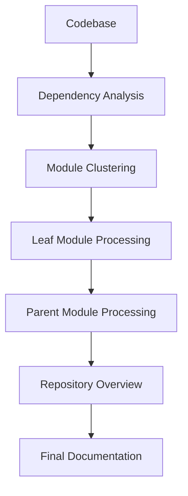
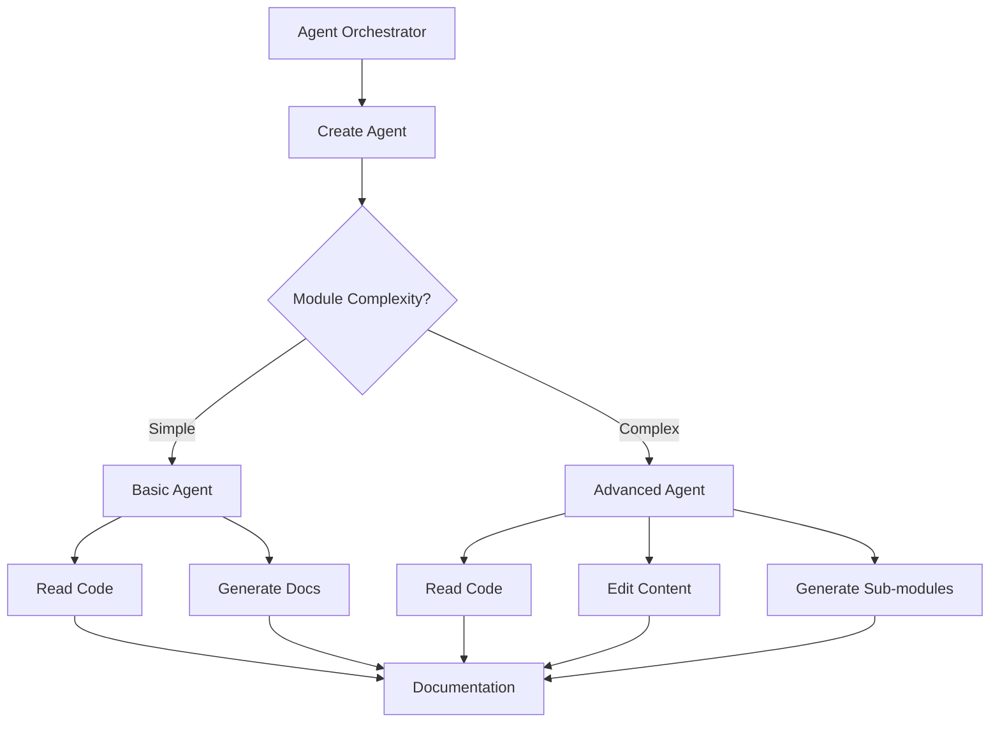
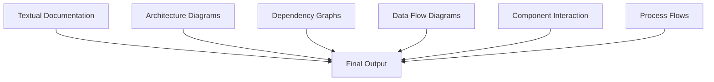
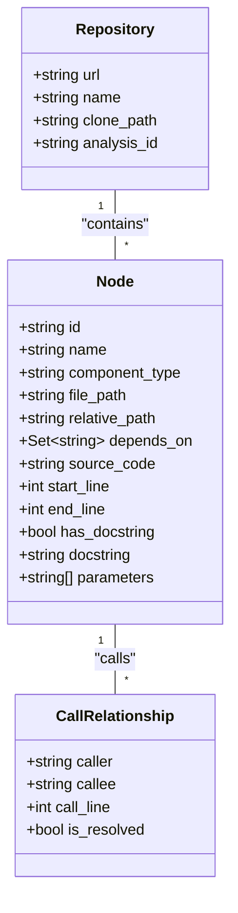
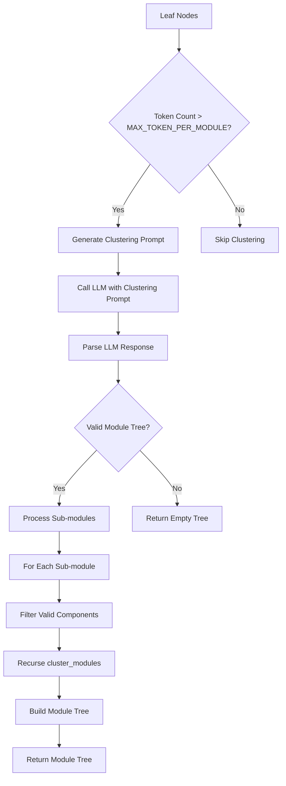
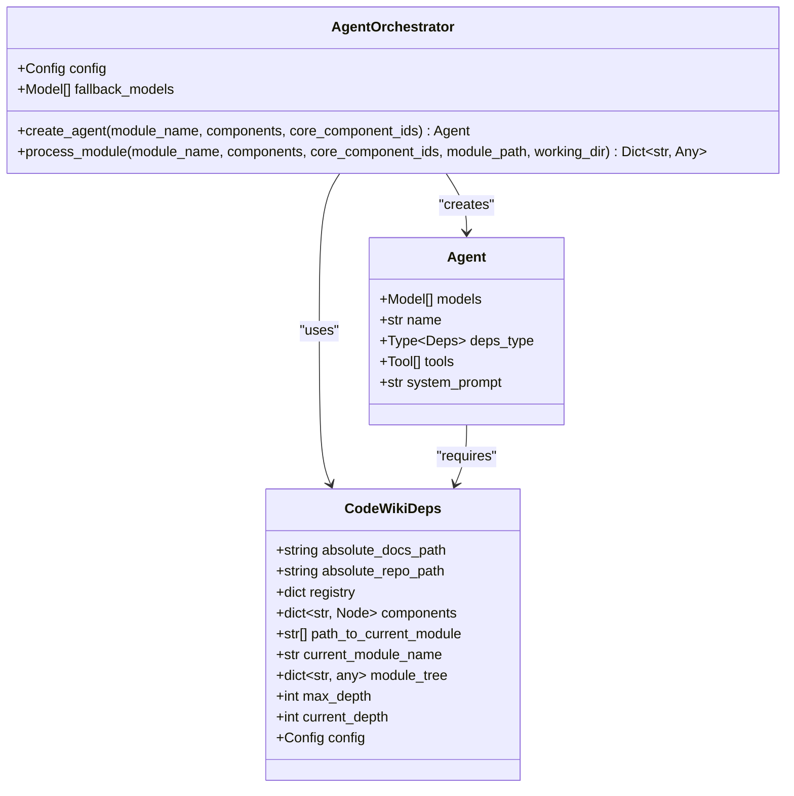
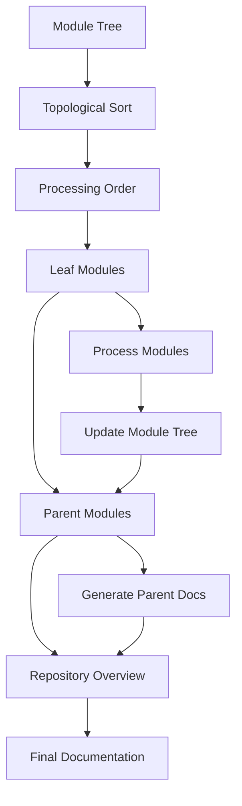
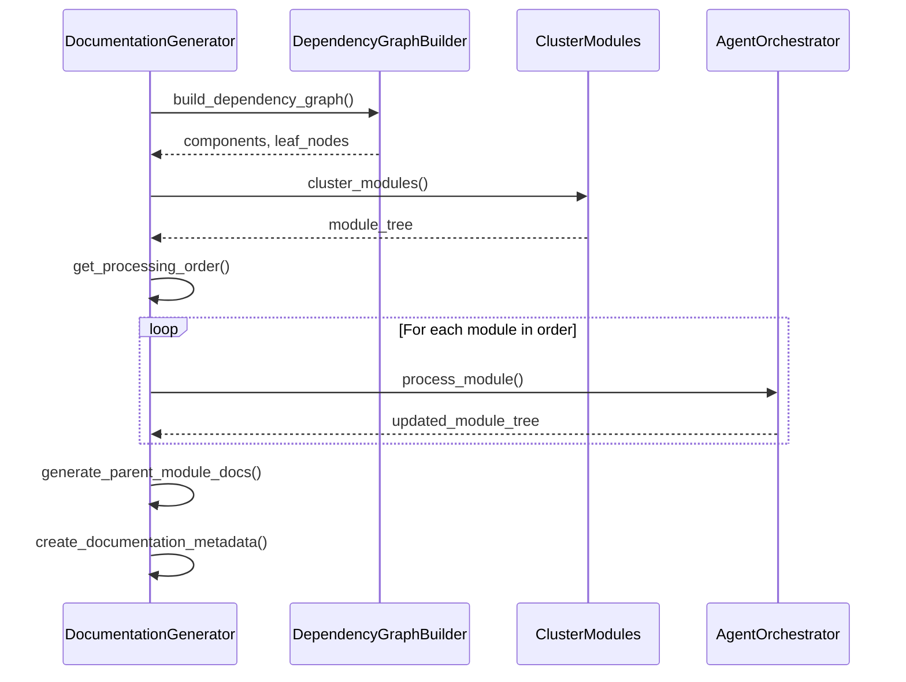

# Documentation Generation Process

<cite>
**Referenced Files in This Document**   
- [main.py](file://codewiki/src/be/main.py)
- [documentation_generator.py](file://codewiki/src/be/documentation_generator.py)
- [agent_orchestrator.py](file://codewiki/src/be/agent_orchestrator.py)
- [cluster_modules.py](file://codewiki/src/be/cluster_modules.py)
- [dependency_graphs_builder.py](file://codewiki/src/be/dependency_analyzer/dependency_graphs_builder.py)
- [ast_parser.py](file://codewiki/src/be/dependency_analyzer/ast_parser.py)
- [topo_sort.py](file://codewiki/src/be/dependency_analyzer/topo_sort.py)
- [prompt_template.py](file://codewiki/src/be/prompt_template.py)
- [core.py](file://codewiki/src/be/dependency_analyzer/models/core.py)
- [deps.py](file://codewiki/src/be/agent_tools/deps.py)
- [python.py](file://codewiki/src/be/dependency_analyzer/analyzers/python.py)
- [javascript.py](file://codewiki/src/be/dependency_analyzer/analyzers/javascript.py)
- [typescript.py](file://codewiki/src/be/dependency_analyzer/analyzers/typescript.py)
- [java.py](file://codewiki/src/be/dependency_analyzer/analyzers/java.py)
- [csharp.py](file://codewiki/src/be/dependency_analyzer/analyzers/csharp.py)
</cite>

## Table of Contents
1. [Introduction](#introduction)
2. [Three-Stage Architecture](#three-stage-architecture)
3. [Dependency Analysis with AST Parsing](#dependency-analysis-with-ast-parsing)
4. [Module Clustering Process](#module-clustering-process)
5. [Agent Orchestration System](#agent-orchestration-system)
6. [Hierarchical Assembly Process](#hierarchical-assembly-process)
7. [Dynamic Programming Approach and Processing Order](#dynamic-programming-approach-and-processing-order)
8. [Conclusion](#conclusion)

## Introduction
The CodeWiki documentation generation system implements a sophisticated end-to-end workflow that transforms raw codebases into comprehensive, structured documentation. This process leverages advanced techniques in code analysis, artificial intelligence, and software engineering principles to create documentation that accurately reflects the architecture and functionality of complex software systems. The system follows a three-stage architecture that combines hierarchical decomposition, recursive multi-agent processing, and multi-modal synthesis to produce high-quality documentation artifacts.

The workflow begins with comprehensive code analysis using AST parsing across multiple programming languages, followed by intelligent module clustering that preserves architectural context. The system then employs a dynamic programming-inspired approach to process documentation in a specific order, starting with leaf modules and progressing to parent modules and the overall repository overview. This hierarchical processing ensures that documentation is generated in a logical sequence that mirrors the dependency structure of the codebase.

**Section sources**
- [main.py](file://codewiki/src/be/main.py#L1-L66)
- [documentation_generator.py](file://codewiki/src/be/documentation_generator.py#L1-L292)

## Three-Stage Architecture

The documentation generation process follows a three-stage architecture that enables systematic and comprehensive documentation creation. This architecture combines hierarchical decomposition using dynamic programming-inspired algorithms, recursive multi-agent processing with dynamic delegation, and multi-modal synthesis combining textual and visual artifacts.

### Hierarchical Decomposition with Dynamic Programming-Inspired Algorithms
The first stage of the architecture implements hierarchical decomposition using algorithms inspired by dynamic programming principles. This approach breaks down the documentation generation problem into smaller, manageable subproblems that can be solved independently and then combined to form the complete documentation. The system identifies leaf modules (modules without dependencies) as base cases and processes them first, then uses their documentation to inform the generation of parent module documentation.

This dynamic programming approach is evident in the `generate_module_documentation` method of the `DocumentationGenerator` class, which processes modules in topological order, ensuring that dependencies are documented before the modules that depend on them. The method first processes leaf modules, then parent modules, and finally generates the repository overview, creating an optimal processing order that minimizes redundant work and maximizes information reuse.

**Diagram sources**
- [documentation_generator.py](file://codewiki/src/be/documentation_generator.py#L124-L196)

### Recursive Multi-Agent Processing with Dynamic Delegation
The second stage employs recursive multi-agent processing with dynamic delegation, where specialized AI agents are created to handle documentation generation for different modules. The `AgentOrchestrator` class manages this process, creating appropriate agents based on module complexity. For complex modules, agents are equipped with multiple tools including code reading, content editing, and sub-module documentation generation capabilities.

The system dynamically delegates tasks to these agents based on the characteristics of each module. Simple modules receive streamlined agents with basic capabilities, while complex modules receive more sophisticated agents with extended toolsets. This dynamic delegation ensures that computational resources are allocated efficiently and that each module receives appropriate attention based on its complexity.

**Diagram sources**
- [agent_orchestrator.py](file://codewiki/src/be/agent_orchestrator.py#L59-L149)

### Multi-Modal Synthesis Combining Textual and Visual Artifacts
The third stage focuses on multi-modal synthesis, combining textual documentation with visual artifacts to create comprehensive documentation. The system generates Mermaid diagrams for architecture visualization, dependency graphs, data flow representations, and component interactions. These visual elements are integrated with textual descriptions to provide multiple perspectives on the codebase.

The prompt templates used by the AI agents explicitly request the inclusion of visual documentation, ensuring that diagrams are generated alongside textual content. This multi-modal approach enhances understanding by catering to different learning styles and providing both high-level overviews and detailed technical information.

**Diagram sources**
- [prompt_template.py](file://codewiki/src/be/prompt_template.py#L1-L337)

**Section sources**
- [documentation_generator.py](file://codewiki/src/be/documentation_generator.py#L1-L292)
- [agent_orchestrator.py](file://codewiki/src/be/agent_orchestrator.py#L1-L149)
- [prompt_template.py](file://codewiki/src/be/prompt_template.py#L1-L337)

## Dependency Analysis with AST Parsing

The system performs comprehensive dependency analysis using AST (Abstract Syntax Tree) parsing with Tree-sitter across seven programming languages. This analysis forms the foundation for understanding code structure, relationships, and dependencies within the codebase.

### AST Parsing Implementation
The dependency analysis begins with the `DependencyParser` class, which uses Tree-sitter parsers to extract code components from multi-language repositories. The parser supports Python, JavaScript, TypeScript, Java, C#, C, and C++ through dedicated analyzer classes in the `analyzers` module. Each language-specific analyzer implements the same interface but leverages language-specific Tree-sitter grammars to accurately parse code structure.

The parsing process extracts various code elements including classes, interfaces, functions, methods, and their relationships. For each component, the system captures metadata such as name, type, file path, source code, parameters, and docstrings. This information is stored in `Node` objects that form the basis of the dependency graph.

**Diagram sources**
- [core.py](file://codewiki/src/be/dependency_analyzer/models/core.py#L1-L64)
- [ast_parser.py](file://codewiki/src/be/dependency_analyzer/ast_parser.py#L1-L146)

### Cross-Language Analysis
The system's ability to analyze multiple programming languages simultaneously enables comprehensive dependency analysis across polyglot codebases. The `AnalysisService` coordinates the analysis of different file types, applying the appropriate parser based on file extension. This cross-language capability is essential for modern software projects that often combine multiple languages in a single repository.

For each supported language, the system implements specific analysis logic to handle language-specific features. For example, the JavaScript analyzer handles module imports and exports, while the Python analyzer processes imports and function calls. Despite these language-specific implementations, the system maintains a consistent data model, allowing dependencies to be tracked across language boundaries.

**Section sources**
- [ast_parser.py](file://codewiki/src/be/dependency_analyzer/ast_parser.py#L1-L146)
- [python.py](file://codewiki/src/be/dependency_analyzer/analyzers/python.py#L1-L267)
- [javascript.py](file://codewiki/src/be/dependency_analyzer/analyzers/javascript.py#L1-L706)
- [typescript.py](file://codewiki/src/be/dependency_analyzer/analyzers/typescript.py#L1-L800)
- [java.py](file://codewiki/src/be/dependency_analyzer/analyzers/java.py#L1-L356)
- [csharp.py](file://codewiki/src/be/dependency_analyzer/analyzers/csharp.py#L1-L298)

## Module Clustering Process

The module clustering process partitions repositories into coherent modules while preserving architectural context. This process transforms the flat structure of individual code components into a hierarchical organization that reflects the logical architecture of the system.

### Clustering Algorithm
The clustering is performed by the `cluster_modules` function, which uses a recursive approach to group related components into modules. The algorithm begins by identifying potential core components and then uses AI-powered analysis to group them into meaningful modules. The process is guided by the `CLUSTER_REPO_PROMPT` and `CLUSTER_MODULE_PROMPT` templates, which instruct the AI to reason about component relationships and group them accordingly.

The clustering algorithm operates recursively, first creating top-level modules and then applying the same process to each module to create sub-modules. This hierarchical clustering preserves the architectural context by maintaining the relationships between modules at different levels of the hierarchy.

**Diagram sources**
- [cluster_modules.py](file://codewiki/src/be/cluster_modules.py#L1-L113)
- [prompt_template.py](file://codewiki/src/be/prompt_template.py#L129-L196)

### Context Preservation
The clustering process is designed to preserve architectural context by maintaining information about component relationships and dependencies. The resulting module tree includes not only the grouped components but also their hierarchical relationships and dependencies. This preserved context is essential for generating accurate documentation that reflects the true architecture of the system.

The system also handles edge cases such as invalid components or missing files, ensuring robustness in the face of incomplete or inconsistent codebases. When components are not found in the repository, they are filtered out with appropriate warnings, preventing errors in subsequent processing stages.

**Section sources**
- [cluster_modules.py](file://codewiki/src/be/cluster_modules.py#L1-L113)
- [prompt_template.py](file://codewiki/src/be/prompt_template.py#L129-L196)

## Agent Orchestration System

The agent orchestration system coordinates documentation generation across modules using a sophisticated agent-based approach. This system manages the creation, configuration, and execution of AI agents responsible for generating documentation for individual modules.

### Agent Creation and Management
The `AgentOrchestrator` class is responsible for creating and managing AI agents. It determines the appropriate agent configuration based on module complexity, creating simpler agents for basic modules and more sophisticated agents for complex ones. The agent creation process considers factors such as the number of components, file count, and structural complexity to determine the appropriate toolset for each agent.

Agents are equipped with various tools to perform their documentation tasks, including:
- `read_code_components_tool`: For exploring additional code dependencies
- `str_replace_editor_tool`: For creating and editing documentation files
- `generate_sub_module_documentation_tool`: For generating documentation for sub-modules in complex modules

**Diagram sources**
- [agent_orchestrator.py](file://codewiki/src/be/agent_orchestrator.py#L1-L149)
- [deps.py](file://codewiki/src/be/agent_tools/deps.py#L1-L16)

### Dynamic Delegation
The system implements dynamic delegation by assigning different capabilities to agents based on their assigned tasks. For leaf modules (modules without children), the orchestrator creates agents with a simplified toolset focused on basic documentation generation. For complex modules that can be further decomposed, agents receive additional tools to generate sub-module documentation.

This dynamic delegation optimizes resource usage and ensures that each agent has precisely the capabilities needed for its task. The system also handles concurrency, allowing multiple agents to work in parallel on different modules when possible, significantly improving processing efficiency.

**Section sources**
- [agent_orchestrator.py](file://codewiki/src/be/agent_orchestrator.py#L1-L149)
- [deps.py](file://codewiki/src/be/agent_tools/deps.py#L1-L16)

## Hierarchical Assembly Process

The hierarchical assembly process organizes documentation generation in a specific order that respects module dependencies and architectural hierarchy. This process ensures that documentation is created in a logical sequence that builds from the most fundamental components to the highest-level overviews.

### Processing Order
The system implements a hierarchical processing order that begins with leaf modules (modules without dependencies), progresses to parent modules, and concludes with the repository overview. This order is determined by topological sorting of the dependency graph, ensuring that all dependencies are documented before the modules that depend on them.

The `get_processing_order` method in the `DocumentationGenerator` class implements this topological sort using a recursive approach that collects modules in dependency order. Leaf modules are processed first, followed by their parent modules, creating a bottom-up processing flow that mirrors the dependency structure of the codebase.

**Diagram sources**
- [documentation_generator.py](file://codewiki/src/be/documentation_generator.py#L74-L92)

### Assembly Strategy
The assembly strategy combines the documentation from individual modules into a cohesive whole. After processing all modules, the system generates a repository overview that synthesizes the individual module documentation into a comprehensive high-level view. This overview includes references to the detailed module documentation, creating a navigable hierarchy of information.

The system also creates metadata files that track documentation generation information, including timestamps, model versions, and statistics about the documentation process. This metadata provides valuable context for understanding the documentation's provenance and quality.

**Section sources**
- [documentation_generator.py](file://codewiki/src/be/documentation_generator.py#L74-L92)
- [documentation_generator.py](file://codewiki/src/be/documentation_generator.py#L197-L247)

## Dynamic Programming Approach and Processing Order

The system employs a dynamic programming approach to optimize the documentation generation process, leveraging the principle of solving smaller subproblems first and using their solutions to build solutions to larger problems.

### Dynamic Programming Implementation
The dynamic programming approach is evident in the `generate_module_documentation` method, which processes modules in a specific order that maximizes information reuse. The algorithm follows these key principles:

1. **Optimal Substructure**: The documentation of parent modules depends on the documentation of their child modules, creating a natural hierarchy of subproblems.

2. **Overlapping Subproblems**: Common components and patterns may appear across multiple modules, allowing documentation elements to be reused.

3. **Bottom-Up Processing**: The system processes leaf modules first, then uses their documentation to inform the generation of parent module documentation.

The processing order is determined by the `get_processing_order` method, which implements a topological sort of the module dependency graph. This ensures that modules are processed in an order where all dependencies are resolved before a module is documented.

**Diagram sources**
- [documentation_generator.py](file://codewiki/src/be/documentation_generator.py#L249-L292)
- [topo_sort.py](file://codewiki/src/be/dependency_analyzer/topo_sort.py#L1-L350)

### Processing Order Details
The processing order follows a strict hierarchy:
1. **Leaf Modules**: Individual components with no dependencies are processed first
2. **Parent Modules**: Modules that contain other modules are processed after their children
3. **Repository Overview**: The final step creates a high-level overview of the entire repository

This order ensures that when generating documentation for a parent module, the documentation for its child modules is already available and can be referenced. The system also handles special cases, such as when the entire repository can fit within the context window of the language model, allowing for direct processing without intermediate steps.

**Section sources**
- [documentation_generator.py](file://codewiki/src/be/documentation_generator.py#L135-L196)
- [topo_sort.py](file://codewiki/src/be/dependency_analyzer/topo_sort.py#L1-L350)

## Conclusion
The CodeWiki documentation generation system implements a sophisticated end-to-end workflow that transforms raw codebases into comprehensive, structured documentation. By combining hierarchical decomposition, recursive multi-agent processing, and multi-modal synthesis, the system creates documentation that accurately reflects the architecture and functionality of complex software systems.

The three-stage architecture enables systematic processing of codebases, beginning with comprehensive dependency analysis using AST parsing across multiple programming languages. The module clustering process organizes the codebase into coherent modules while preserving architectural context, and the agent orchestration system coordinates documentation generation across these modules using dynamically configured AI agents.

The hierarchical assembly process follows a dynamic programming-inspired approach, processing leaf modules first, then parent modules, and finally creating the repository overview. This bottom-up processing order ensures that documentation is generated in a logical sequence that respects module dependencies and maximizes information reuse.

The system's sophisticated design enables it to handle complex, polyglot codebases and produce high-quality documentation that serves both technical and non-technical audiences. By combining textual and visual artifacts, the system creates multi-modal documentation that enhances understanding and provides multiple perspectives on the codebase architecture.