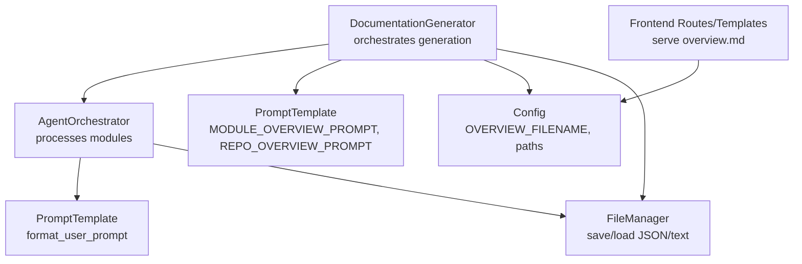
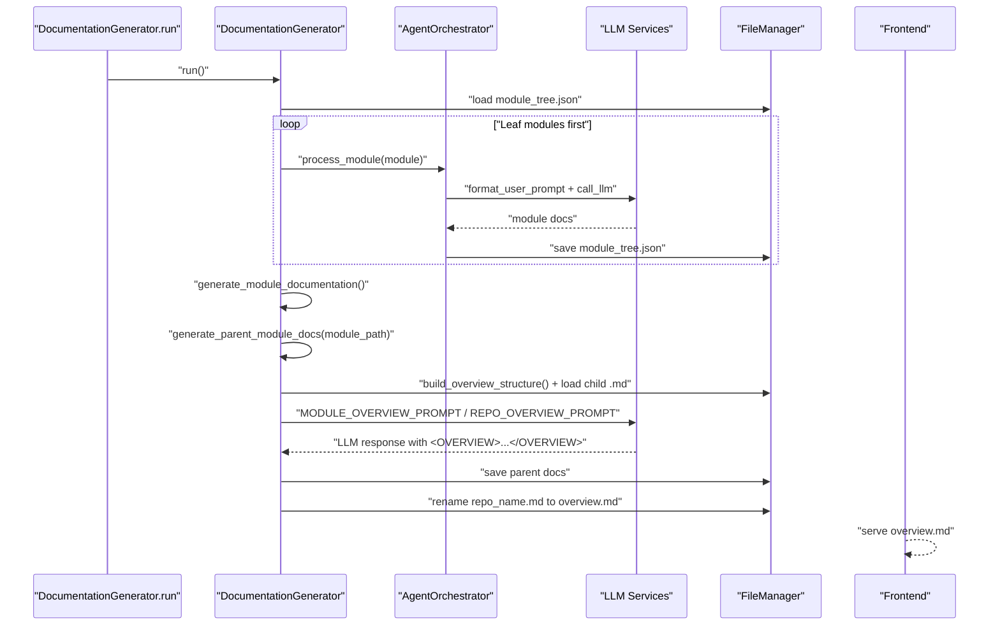
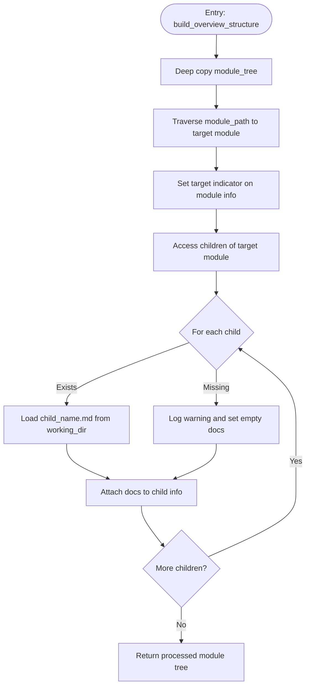
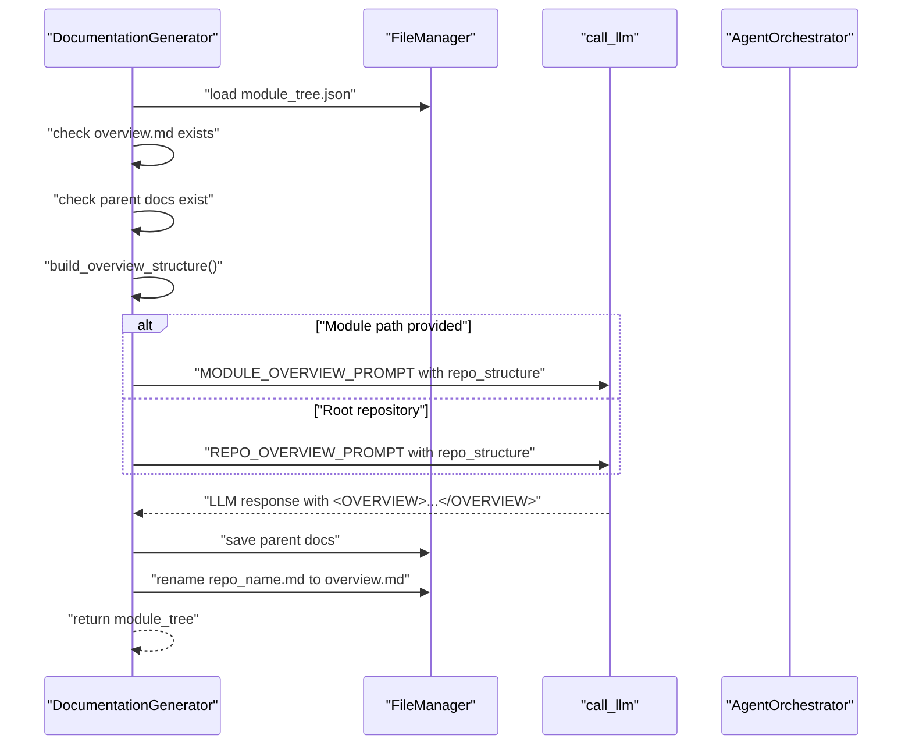
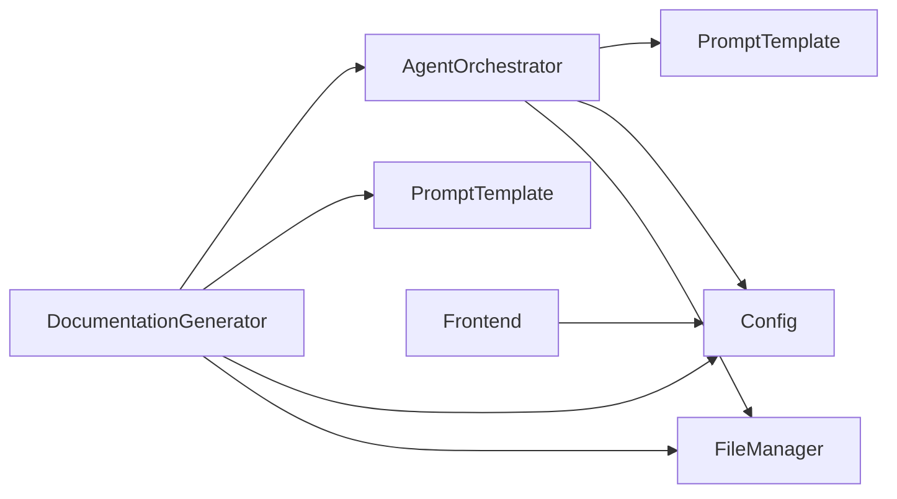

# Hierarchical Assembly and Overview Generation

<cite>
**Referenced Files in This Document**
- [documentation_generator.py](file://codewiki/src/be/documentation_generator.py)
- [prompt_template.py](file://codewiki/src/be/prompt_template.py)
- [config.py](file://codewiki/src/config.py)
- [agent_orchestrator.py](file://codewiki/src/be/agent_orchestrator.py)
- [utils.py](file://codewiki/src/utils.py)
- [cluster_modules.py](file://codewiki/src/be/cluster_modules.py)
- [routes.py](file://codewiki/src/fe/routes.py)
- [templates.py](file://codewiki/src/fe/templates.py)
- [web_app.py](file://codewiki/src/fe/web_app.py)
- [visualise_docs.py](file://codewiki/src/fe/visualise_docs.py)
</cite>

## Table of Contents
1. [Introduction](#introduction)
2. [Project Structure](#project-structure)
3. [Core Components](#core-components)
4. [Architecture Overview](#architecture-overview)
5. [Detailed Component Analysis](#detailed-component-analysis)
6. [Dependency Analysis](#dependency-analysis)
7. [Performance Considerations](#performance-considerations)
8. [Troubleshooting Guide](#troubleshooting-guide)
9. [Conclusion](#conclusion)

## Introduction
This document explains the hierarchical assembly and overview generation sub-feature. It focuses on how the system synthesizes parent module documentation by combining child module documents, how it loads child markdown files and embeds them into the repository structure for context, and how specialized prompts guide the LLM to produce cohesive overviews. It also documents the target indicator that marks modules for overview generation, the file naming convention that renames repository-level documentation to overview.md, and how overview content is extracted from LLM responses using <OVERVIEW> tags. Finally, it provides troubleshooting guidance for common issues such as missing child documentation and assembly failures.

## Project Structure
The hierarchical assembly and overview generation feature spans backend orchestration, prompt templates, configuration, and frontend serving. The key files are:
- Backend orchestrator and LLM integration
- Prompt templates for module and repository overviews
- Configuration constants for filenames and directories
- Frontend routes and templates that serve overview.md

**Diagram sources**
- [documentation_generator.py](file://codewiki/src/be/documentation_generator.py#L29-L121)
- [agent_orchestrator.py](file://codewiki/src/be/agent_orchestrator.py#L90-L149)
- [prompt_template.py](file://codewiki/src/be/prompt_template.py#L90-L127)
- [config.py](file://codewiki/src/config.py#L1-L20)
- [utils.py](file://codewiki/src/utils.py#L10-L46)
- [routes.py](file://codewiki/src/fe/routes.py#L170-L185)
- [templates.py](file://codewiki/src/fe/templates.py#L570-L595)
- [web_app.py](file://codewiki/src/fe/web_app.py#L60-L75)

**Section sources**
- [documentation_generator.py](file://codewiki/src/be/documentation_generator.py#L29-L121)
- [prompt_template.py](file://codewiki/src/be/prompt_template.py#L90-L127)
- [config.py](file://codewiki/src/config.py#L1-L20)

## Core Components
- DocumentationGenerator: Central orchestrator that builds the overview structure, generates parent module docs, and manages repository-level overview renaming.
- AgentOrchestrator: Creates agents and runs them to generate leaf module documentation; also checks for existing overview/module docs to avoid redundant work.
- PromptTemplate: Provides MODULE_OVERVIEW_PROMPT and REPO_OVERVIEW_PROMPT used to synthesize overviews.
- Config: Defines OVERVIEW_FILENAME and other constants.
- FileManager: Utility for saving/loading JSON and text files.
- Frontend: Routes and templates that serve overview.md.

**Section sources**
- [documentation_generator.py](file://codewiki/src/be/documentation_generator.py#L29-L121)
- [agent_orchestrator.py](file://codewiki/src/be/agent_orchestrator.py#L90-L149)
- [prompt_template.py](file://codewiki/src/be/prompt_template.py#L90-L127)
- [config.py](file://codewiki/src/config.py#L1-L20)
- [utils.py](file://codewiki/src/utils.py#L10-L46)

## Architecture Overview
The system follows a dynamic programming approach:
- Leaf modules are documented first.
- Parent modules are documented next by synthesizing child documentation.
- The repository overview is generated last and renamed to overview.md.

**Diagram sources**
- [documentation_generator.py](file://codewiki/src/be/documentation_generator.py#L124-L196)
- [documentation_generator.py](file://codewiki/src/be/documentation_generator.py#L199-L247)
- [agent_orchestrator.py](file://codewiki/src/be/agent_orchestrator.py#L90-L149)
- [prompt_template.py](file://codewiki/src/be/prompt_template.py#L90-L127)
- [routes.py](file://codewiki/src/fe/routes.py#L170-L185)
- [web_app.py](file://codewiki/src/fe/web_app.py#L60-L75)

## Detailed Component Analysis

### build_overview_structure()
Purpose:
- Builds a temporary module tree snapshot with a target indicator and embeds child documentation for the selected module’s immediate children.

Key behaviors:
- Marks the target module for overview generation by setting a flag in the module info.
- Iterates over the module’s immediate children and loads their markdown docs from the working directory.
- If a child’s markdown file is missing, logs a warning and stores an empty string for that child’s docs.
- Returns a deep-copied module tree with embedded child docs and the target indicator.

Implementation highlights:
- Uses a deep copy to avoid mutating the original module tree.
- Traverses the module path to reach the target module and sets the target indicator.
- Loads child docs using the working directory and child name, then attaches them to child entries.

**Diagram sources**
- [documentation_generator.py](file://codewiki/src/be/documentation_generator.py#L99-L122)

**Section sources**
- [documentation_generator.py](file://codewiki/src/be/documentation_generator.py#L99-L122)

### generate_parent_module_docs()
Purpose:
- Generates parent module documentation by prompting the LLM with a synthesized structure containing child docs and a target indicator.

Key behaviors:
- Loads the module tree from disk.
- Checks if overview docs or parent docs already exist to avoid redundant generation.
- Calls build_overview_structure() to prepare the repo structure snapshot.
- Selects either MODULE_OVERVIEW_PROMPT or REPO_OVERVIEW_PROMPT depending on whether a module path is provided.
- Calls the LLM with the constructed prompt.
- Extracts the overview content from the LLM response using <OVERVIEW> tags and saves it to a markdown file named after the module or repository.
- Handles exceptions and logs detailed traces.

**Diagram sources**
- [documentation_generator.py](file://codewiki/src/be/documentation_generator.py#L199-L247)
- [prompt_template.py](file://codewiki/src/be/prompt_template.py#L90-L127)

**Section sources**
- [documentation_generator.py](file://codewiki/src/be/documentation_generator.py#L199-L247)

### Specialized Prompts: MODULE_OVERVIEW_PROMPT and REPO_OVERVIEW_PROMPT
- MODULE_OVERVIEW_PROMPT: Guides the LLM to produce a concise module overview that includes purpose, architecture (with diagrams), and references to core components documentation. The prompt receives a structured repo_structure JSON that includes child docs and the target indicator.
- REPO_OVERVIEW_PROMPT: Guides the LLM to produce a concise repository overview with purpose, end-to-end architecture (diagrams), and references to core modules documentation. It also receives the repo_structure JSON.

Both prompts enforce the use of <OVERVIEW> tags to encapsulate the generated content, enabling deterministic extraction.

**Section sources**
- [prompt_template.py](file://codewiki/src/be/prompt_template.py#L90-L127)

### Target Indicator: is_target_for_overview_generation
- During build_overview_structure(), the system sets a flag on the target module to mark it for overview generation. This allows downstream logic to distinguish the module being synthesized and tailor the prompt accordingly.

**Section sources**
- [documentation_generator.py](file://codewiki/src/be/documentation_generator.py#L104-L110)

### File Naming Convention: overview.md
- Repository-level documentation is initially generated with a name derived from the repository name. After the final module tree is computed, the system renames the repository-level markdown file to overview.md so it becomes the main landing page for the generated documentation.
- The constant OVERVIEW_FILENAME is defined centrally and used consistently across the system.

**Section sources**
- [documentation_generator.py](file://codewiki/src/be/documentation_generator.py#L191-L196)
- [config.py](file://codewiki/src/config.py#L1-L20)

### Loading Child Markdown Files and Embedding Context
- For each child module, the system checks if a corresponding markdown file exists in the working directory and loads it into the repo structure snapshot.
- If a child’s markdown is missing, the system logs a warning and stores an empty string for that child’s docs. This ensures the synthesis prompt still has a structure to reference, while highlighting missing content.

**Section sources**
- [documentation_generator.py](file://codewiki/src/be/documentation_generator.py#L114-L121)

### Extracting Overview Content from LLM Responses
- The LLM responses are expected to be wrapped in <OVERVIEW>...</OVERVIEW> tags. The system splits on these tags to extract the overview content and writes it to the appropriate markdown file.

**Section sources**
- [documentation_generator.py](file://codewiki/src/be/documentation_generator.py#L233-L239)

### Frontend Serving of overview.md
- The frontend routes and templates consistently reference overview.md as the main overview document, ensuring users can navigate to the generated overview after generation completes.

**Section sources**
- [routes.py](file://codewiki/src/fe/routes.py#L170-L185)
- [templates.py](file://codewiki/src/fe/templates.py#L570-L595)
- [web_app.py](file://codewiki/src/fe/web_app.py#L60-L75)

## Dependency Analysis
- DocumentationGenerator depends on:
  - AgentOrchestrator for leaf module documentation.
  - PromptTemplate for constructing prompts.
  - Config for constants like OVERVIEW_FILENAME.
  - FileManager for file I/O.
- AgentOrchestrator depends on:
  - PromptTemplate for formatting user prompts.
  - Config for constants.
  - FileManager for saving updated module trees.
- Frontend components depend on OVERVIEW_FILENAME to serve the overview.

**Diagram sources**
- [documentation_generator.py](file://codewiki/src/be/documentation_generator.py#L29-L121)
- [agent_orchestrator.py](file://codewiki/src/be/agent_orchestrator.py#L90-L149)
- [prompt_template.py](file://codewiki/src/be/prompt_template.py#L90-L127)
- [config.py](file://codewiki/src/config.py#L1-L20)

**Section sources**
- [documentation_generator.py](file://codewiki/src/be/documentation_generator.py#L29-L121)
- [agent_orchestrator.py](file://codewiki/src/be/agent_orchestrator.py#L90-L149)
- [prompt_template.py](file://codewiki/src/be/prompt_template.py#L90-L127)
- [config.py](file://codewiki/src/config.py#L1-L20)

## Performance Considerations
- Dynamic programming ordering ensures leaf modules are documented first, minimizing context size and avoiding repeated work.
- build_overview_structure() operates on a shallow copy and only loads child docs for the target module’s immediate children, reducing I/O overhead.
- The system avoids regenerating existing docs by checking for overview.md and module-specific .md files before invoking the LLM.

[No sources needed since this section provides general guidance]

## Troubleshooting Guide

Common issues and solutions:
- Missing child documentation:
  - Symptom: Warnings indicating child docs not found during build_overview_structure().
  - Cause: Child markdown files were not generated or not placed in the working directory with the expected naming convention.
  - Solution: Ensure leaf modules are processed first so their .md files are created. Verify the working directory contains child_name.md files for all intended children. Re-run generation if necessary.

- LLM response missing <OVERVIEW> tags:
  - Symptom: Extraction fails or empty content is saved.
  - Cause: The LLM response did not wrap the overview in the expected tags.
  - Solution: Regenerate parent docs and ensure the prompt is correctly formatted. Confirm that MODULE_OVERVIEW_PROMPT or REPO_OVERVIEW_PROMPT is used and that the LLM adheres to the tag requirement.

- Repository overview not served:
  - Symptom: overview.md not found by frontend.
  - Cause: The repository-level markdown was not renamed to overview.md.
  - Solution: Verify that the final step renames repo_name.md to overview.md. Check the working directory contents and confirm the rename occurred.

- Redundant generation:
  - Symptom: Excessive LLM calls or duplicate files.
  - Cause: Docs already exist but the system still attempts to regenerate.
  - Solution: The system checks for overview.md and module-specific .md files before generating. If regeneration is desired, remove the existing files or adjust the workflow.

**Section sources**
- [documentation_generator.py](file://codewiki/src/be/documentation_generator.py#L114-L121)
- [documentation_generator.py](file://codewiki/src/be/documentation_generator.py#L233-L239)
- [documentation_generator.py](file://codewiki/src/be/documentation_generator.py#L191-L196)
- [agent_orchestrator.py](file://codewiki/src/be/agent_orchestrator.py#L116-L126)

## Conclusion
The hierarchical assembly and overview generation feature integrates careful orchestration, targeted prompt engineering, and robust file management to produce cohesive parent and repository overviews. By marking targets, embedding child docs, and enforcing consistent naming conventions, the system reliably synthesizes high-quality documentation while minimizing redundant work and handling edge cases gracefully.