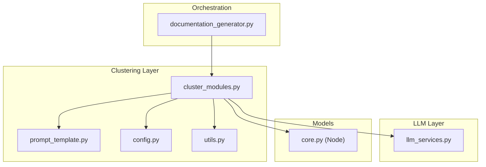
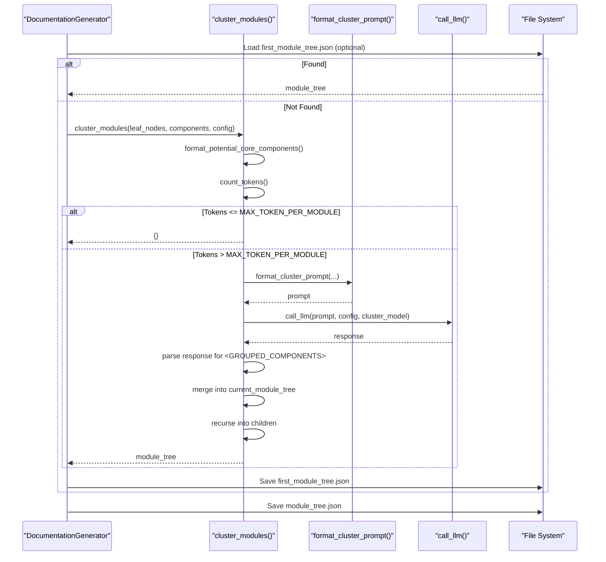
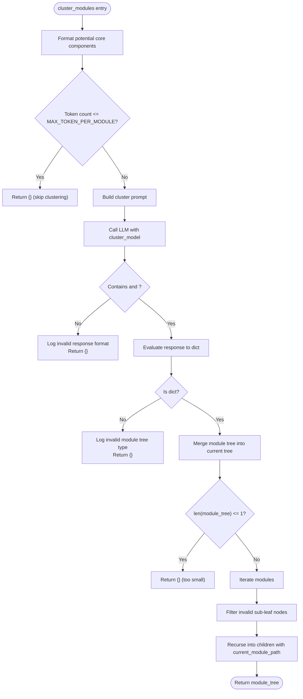
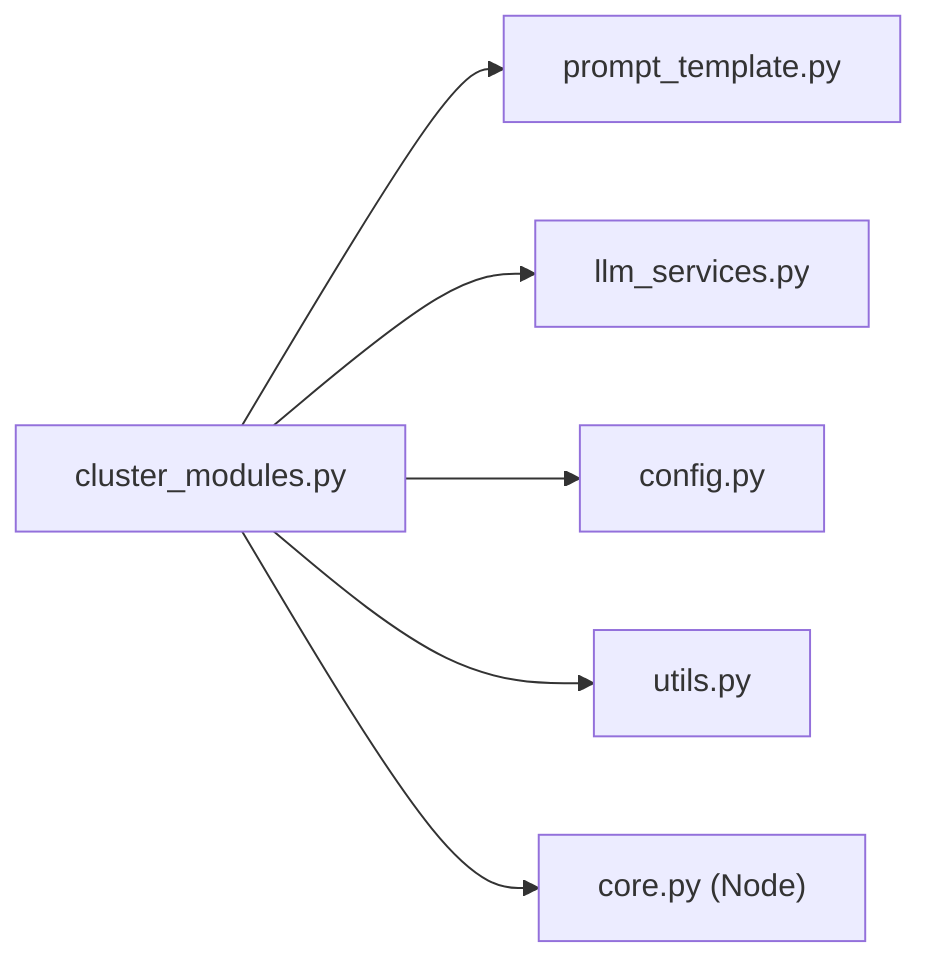

# Module Clustering and Hierarchical Decomposition

<cite>
**Referenced Files in This Document**
- [cluster_modules.py](file://codewiki/src/be/cluster_modules.py)
- [prompt_template.py](file://codewiki/src/be/prompt_template.py)
- [llm_services.py](file://codewiki/src/be/llm_services.py)
- [documentation_generator.py](file://codewiki/src/be/documentation_generator.py)
- [config.py](file://codewiki/src/config.py)
- [core.py](file://codewiki/src/be/dependency_analyzer/models/core.py)
- [utils.py](file://codewiki/src/be/utils.py)
</cite>

## Table of Contents
1. [Introduction](#introduction)
2. [Project Structure](#project-structure)
3. [Core Components](#core-components)
4. [Architecture Overview](#architecture-overview)
5. [Detailed Component Analysis](#detailed-component-analysis)
6. [Dependency Analysis](#dependency-analysis)
7. [Performance Considerations](#performance-considerations)
8. [Troubleshooting Guide](#troubleshooting-guide)
9. [Conclusion](#conclusion)

## Introduction
This document explains the module clustering and hierarchical decomposition sub-feature. It focuses on the cluster_modules() function and its recursive behavior to build a hierarchical module tree. It describes how leaf nodes and potential core components are analyzed to form meaningful groupings, the token-based threshold that decides when clustering is necessary, and the LLM-powered clustering process using format_cluster_prompt. It also documents the module tree data structure (components, children, path), how architectural context is preserved during decomposition, and how edge cases are handled. Finally, it provides concrete examples from the code and practical troubleshooting guidance for common issues like invalid LLM responses.

## Project Structure
The clustering feature is implemented in the backend service and integrates with prompts, LLM services, configuration, and the documentation generator. The key files are:
- cluster_modules.py: Implements the clustering logic and recursive decomposition
- prompt_template.py: Provides prompts for repository and module-level clustering
- llm_services.py: LLM client and call interface
- documentation_generator.py: Orchestrates clustering and subsequent documentation generation
- config.py: Global constants and configuration (including token thresholds)
- core.py: Data model for code components (Node)
- utils.py: Token counting utility used by clustering

**Diagram sources**
- [cluster_modules.py](file://codewiki/src/be/cluster_modules.py#L1-L113)
- [prompt_template.py](file://codewiki/src/be/prompt_template.py#L1-L337)
- [llm_services.py](file://codewiki/src/be/llm_services.py#L1-L86)
- [documentation_generator.py](file://codewiki/src/be/documentation_generator.py#L1-L292)
- [config.py](file://codewiki/src/config.py#L1-L114)
- [core.py](file://codewiki/src/be/dependency_analyzer/models/core.py#L1-L64)
- [utils.py](file://codewiki/src/be/utils.py#L1-L207)

**Section sources**
- [cluster_modules.py](file://codewiki/src/be/cluster_modules.py#L1-L113)
- [prompt_template.py](file://codewiki/src/be/prompt_template.py#L1-L337)
- [llm_services.py](file://codewiki/src/be/llm_services.py#L1-L86)
- [documentation_generator.py](file://codewiki/src/be/documentation_generator.py#L1-L292)
- [config.py](file://codewiki/src/config.py#L1-L114)
- [core.py](file://codewiki/src/be/dependency_analyzer/models/core.py#L1-L64)
- [utils.py](file://codewiki/src/be/utils.py#L1-L207)

## Core Components
- cluster_modules(): Recursive function that clusters leaf nodes into modules, builds a hierarchical module tree, and continues decomposing subtrees.
- format_potential_core_components(): Formats leaf nodes grouped by file into two forms: one with component names only and another with code content appended.
- format_cluster_prompt(): Builds a structured prompt for clustering either at repository level or module level, embedding the current module tree context.
- call_llm(): LLM invocation wrapper that sends prompts and returns text responses.
- count_tokens(): Token counter used to decide whether clustering is necessary.
- Config: Holds token thresholds and LLM model settings used by clustering.
- Node: Data model for code components with file path, relative path, and source code.

Key responsibilities:
- Token threshold gating: Skips clustering when the token count is below MAX_TOKEN_PER_MODULE.
- Prompt construction: Uses repository/module prompts and includes the current module tree context.
- Structured response parsing: Validates presence of <GROUPED_COMPONENTS> tags and evaluates the returned dictionary.
- Tree assembly: Merges returned module trees into the current module tree and recurses into children.
- Edge case handling: Logs warnings for invalid leaf nodes and skips invalid entries; returns empty dictionaries on parsing or validation failures.

**Section sources**
- [cluster_modules.py](file://codewiki/src/be/cluster_modules.py#L1-L113)
- [prompt_template.py](file://codewiki/src/be/prompt_template.py#L129-L196)
- [llm_services.py](file://codewiki/src/be/llm_services.py#L58-L86)
- [utils.py](file://codewiki/src/be/utils.py#L26-L40)
- [config.py](file://codewiki/src/config.py#L15-L18)
- [core.py](file://codewiki/src/be/dependency_analyzer/models/core.py#L7-L45)

## Architecture Overview
The clustering pipeline is invoked by the documentation generator. It builds a dependency graph, collects leaf nodes, and calls cluster_modules() to produce a hierarchical module tree. The tree is persisted and later used to drive documentation generation in a topological order (leaf-first).

**Diagram sources**
- [documentation_generator.py](file://codewiki/src/be/documentation_generator.py#L249-L292)
- [cluster_modules.py](file://codewiki/src/be/cluster_modules.py#L44-L113)
- [prompt_template.py](file://codewiki/src/be/prompt_template.py#L308-L337)
- [llm_services.py](file://codewiki/src/be/llm_services.py#L58-L86)
- [config.py](file://codewiki/src/config.py#L15-L18)

## Detailed Component Analysis

### cluster_modules() Implementation and Recursion
The function performs:
- Formatting potential core components from leaf nodes
- Token counting to decide whether clustering is needed
- Prompt construction and LLM call
- Structured response parsing with strict tag validation
- Merging returned module trees into the current tree
- Recursive decomposition of children with preserved path context

**Diagram sources**
- [cluster_modules.py](file://codewiki/src/be/cluster_modules.py#L44-L113)

**Section sources**
- [cluster_modules.py](file://codewiki/src/be/cluster_modules.py#L44-L113)

### format_potential_core_components()
- Filters invalid leaf nodes not present in components
- Groups valid leaf nodes by file path
- Produces two strings:
  - Names only
  - Names plus source code content appended

This ensures the LLM receives both component identifiers and code context for grouping decisions.

**Section sources**
- [cluster_modules.py](file://codewiki/src/be/cluster_modules.py#L14-L41)
- [core.py](file://codewiki/src/be/dependency_analyzer/models/core.py#L7-L45)

### format_cluster_prompt()
- Builds a repository-level or module-level prompt depending on whether module_tree is empty
- Embeds the current module tree context with core components and children
- Uses CLUSTER_REPO_PROMPT or CLUSTER_MODULE_PROMPT templates
- Returns a prompt string ready for LLM consumption

**Section sources**
- [prompt_template.py](file://codewiki/src/be/prompt_template.py#L129-L196)
- [prompt_template.py](file://codewiki/src/be/prompt_template.py#L308-L337)

### Token Threshold and count_tokens()
- MAX_TOKEN_PER_MODULE is the threshold constant
- count_tokens() uses a tokenizer to estimate prompt size
- If token count is below threshold, clustering is skipped to avoid unnecessary LLM calls

**Section sources**
- [config.py](file://codewiki/src/config.py#L15-L18)
- [utils.py](file://codewiki/src/be/utils.py#L26-L40)
- [cluster_modules.py](file://codewiki/src/be/cluster_modules.py#L55-L60)

### LLM Integration and call_llm()
- call_llm() constructs an OpenAI-compatible client and sends chat completions
- Uses config.main_model or config.cluster_model depending on context
- Returns raw text responses consumed by clustering

**Section sources**
- [llm_services.py](file://codewiki/src/be/llm_services.py#L58-L86)
- [cluster_modules.py](file://codewiki/src/be/cluster_modules.py#L61-L62)

### Module Tree Data Structure
Each module in the tree is represented as a dictionary with:
- path: string indicating the module’s path (file or directory)
- components: list of component IDs belonging to the module
- children: dict representing submodules (empty initially; populated recursively)

The recursive merging logic:
- If current_module_tree is empty, initialize it with the returned module tree
- Otherwise, traverse current_module_path to reach the correct parent and attach new modules
- Remove path from module_info before insertion to keep the tree consistent

Edge cases:
- Invalid leaf nodes are filtered out and logged as warnings
- If the returned module tree has only one module or fewer than two modules, clustering is skipped

**Section sources**
- [cluster_modules.py](file://codewiki/src/be/cluster_modules.py#L87-L113)
- [prompt_template.py](file://codewiki/src/be/prompt_template.py#L129-L196)

### Preservation of Architectural Context During Decomposition
- The prompt includes the current module tree context so the LLM understands how modules relate to each other
- The recursion maintains current_module_path to correctly attach children under the right parent
- The original path information is stored in the returned module tree and later removed before insertion to preserve a clean internal representation

**Section sources**
- [prompt_template.py](file://codewiki/src/be/prompt_template.py#L308-L337)
- [cluster_modules.py](file://codewiki/src/be/cluster_modules.py#L87-L113)

### Concrete Examples from the Code
- Example of skipping clustering due to token threshold:
  - See the token check and early return in [cluster_modules.py](file://codewiki/src/be/cluster_modules.py#L55-L60).
- Example of invalid LLM response handling:
  - Missing tags or invalid type cause logs and early returns in [cluster_modules.py](file://codewiki/src/be/cluster_modules.py#L64-L85).
- Example of recursive subtree attachment:
  - Merging and recursing into children occurs in [cluster_modules.py](file://codewiki/src/be/cluster_modules.py#L87-L113).
- Example of prompt selection:
  - Repository vs module prompt selection in [prompt_template.py](file://codewiki/src/be/prompt_template.py#L334-L337).

**Section sources**
- [cluster_modules.py](file://codewiki/src/be/cluster_modules.py#L55-L113)
- [prompt_template.py](file://codewiki/src/be/prompt_template.py#L308-L337)

## Dependency Analysis
The clustering feature has clear, focused dependencies:
- cluster_modules depends on:
  - format_potential_core_components for input formatting
  - count_tokens for threshold gating
  - format_cluster_prompt for prompt construction
  - call_llm for inference
  - Config for thresholds and model selection
  - Node for component metadata

**Diagram sources**
- [cluster_modules.py](file://codewiki/src/be/cluster_modules.py#L1-L113)
- [prompt_template.py](file://codewiki/src/be/prompt_template.py#L1-L337)
- [llm_services.py](file://codewiki/src/be/llm_services.py#L1-L86)
- [config.py](file://codewiki/src/config.py#L1-L114)
- [core.py](file://codewiki/src/be/dependency_analyzer/models/core.py#L1-L64)
- [utils.py](file://codewiki/src/be/utils.py#L1-L207)

**Section sources**
- [cluster_modules.py](file://codewiki/src/be/cluster_modules.py#L1-L113)
- [prompt_template.py](file://codewiki/src/be/prompt_template.py#L1-L337)
- [llm_services.py](file://codewiki/src/be/llm_services.py#L1-L86)
- [config.py](file://codewiki/src/config.py#L1-L114)
- [core.py](file://codewiki/src/be/dependency_analyzer/models/core.py#L1-L64)
- [utils.py](file://codewiki/src/be/utils.py#L1-L207)

## Performance Considerations
- Token threshold prevents unnecessary LLM calls when the workload is small, reducing cost and latency.
- Recursive decomposition reduces prompt sizes by splitting large sets of components into smaller subtrees.
- Using a tokenizer for token counting provides reliable gating; ensure prompt formatting remains efficient to stay under the threshold.
- Consider batching or caching repeated prompts if the same contexts occur frequently.

[No sources needed since this section provides general guidance]

## Troubleshooting Guide
Common issues and solutions:
- Invalid LLM response format:
  - Symptom: Missing <GROUPED_COMPONENTS> tags or non-dictionary response.
  - Behavior: Logs an error and returns {}.
  - Solution: Ensure the LLM prompt explicitly instructs returning a dictionary inside <GROUPED_COMPONENTS>. Verify model settings and prompt formatting.
  - Reference: [cluster_modules.py](file://codewiki/src/be/cluster_modules.py#L64-L85)
- Too small module tree:
  - Symptom: Returned tree has one or zero modules.
  - Behavior: Logs and returns {}.
  - Solution: Increase token threshold or reduce component set size to encourage meaningful grouping.
  - Reference: [cluster_modules.py](file://codewiki/src/be/cluster_modules.py#L82-L85)
- Invalid leaf nodes:
  - Symptom: Warnings about skipping nodes not found in components.
  - Behavior: Filters out invalid nodes and continues.
  - Solution: Validate leaf node IDs and ensure components mapping is complete.
  - Reference: [cluster_modules.py](file://codewiki/src/be/cluster_modules.py#L18-L25), [cluster_modules.py](file://codewiki/src/be/cluster_modules.py#L100-L107)
- Token threshold too low/high:
  - Symptom: Clustering runs too often or not enough.
  - Behavior: Controlled by MAX_TOKEN_PER_MODULE.
  - Solution: Adjust MAX_TOKEN_PER_MODULE in configuration based on model context window.
  - Reference: [config.py](file://codewiki/src/config.py#L15-L18)
- Prompt selection confusion:
  - Symptom: Wrong prompt used (repository vs module).
  - Behavior: Determined by module_tree == {}.
  - Solution: Ensure current_module_tree is passed correctly to maintain context.
  - Reference: [prompt_template.py](file://codewiki/src/be/prompt_template.py#L334-L337)

**Section sources**
- [cluster_modules.py](file://codewiki/src/be/cluster_modules.py#L18-L25)
- [cluster_modules.py](file://codewiki/src/be/cluster_modules.py#L55-L113)
- [config.py](file://codewiki/src/config.py#L15-L18)
- [prompt_template.py](file://codewiki/src/be/prompt_template.py#L334-L337)

## Conclusion
The module clustering and hierarchical decomposition feature uses a robust, token-gated, LLM-powered approach to organize components into meaningful modules. The cluster_modules() function is designed to be recursive, preserving architectural context and handling edge cases gracefully. By combining structured prompts, strict response parsing, and careful tree assembly, the system produces a hierarchical module tree suitable for downstream documentation generation. Proper configuration of token thresholds and prompt formatting is essential for reliable operation.