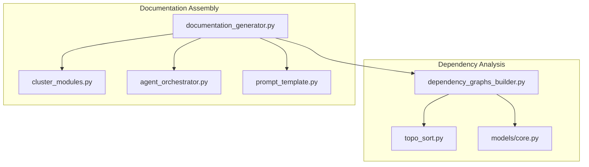
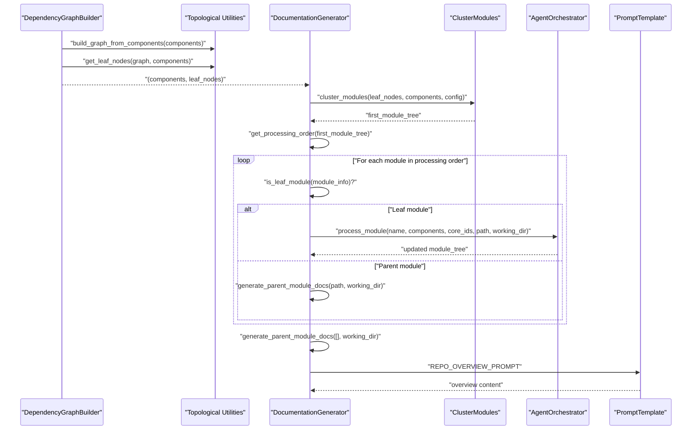
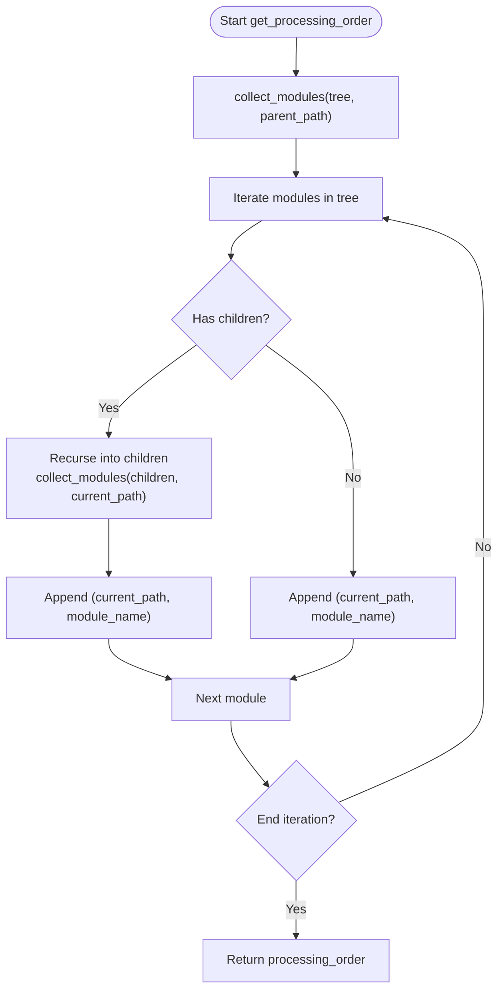
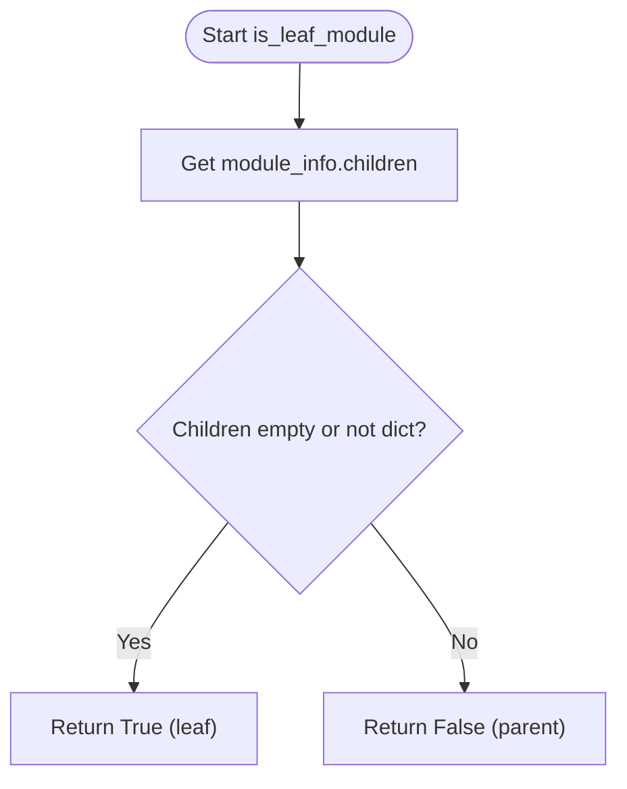
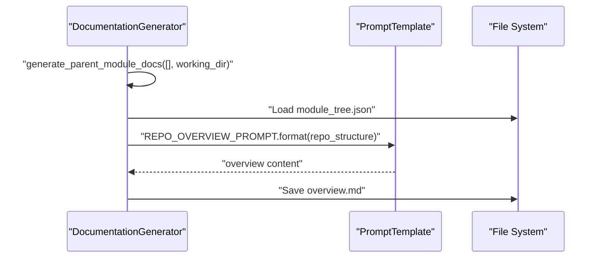
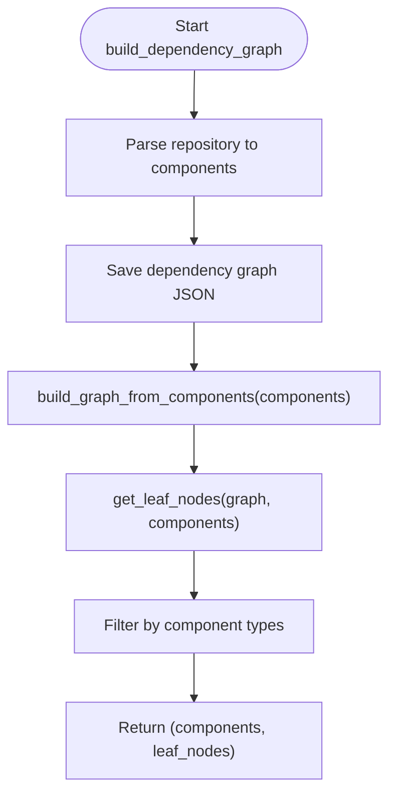
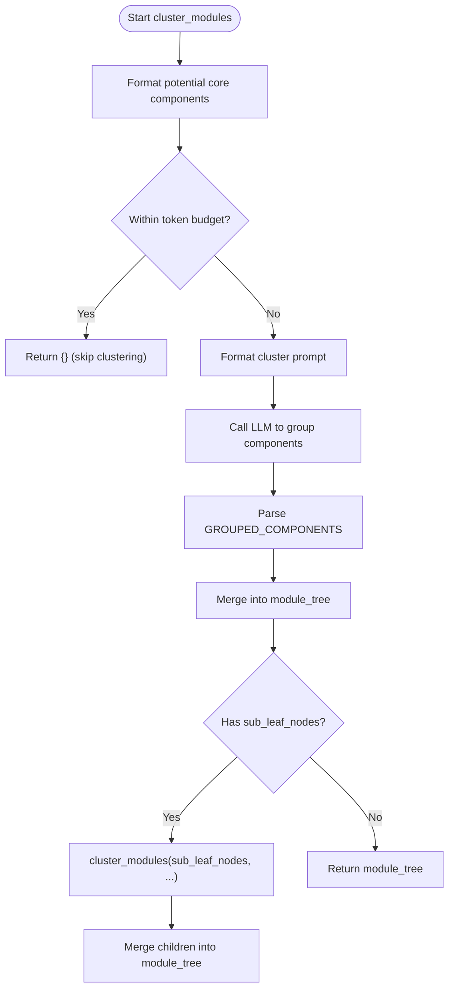
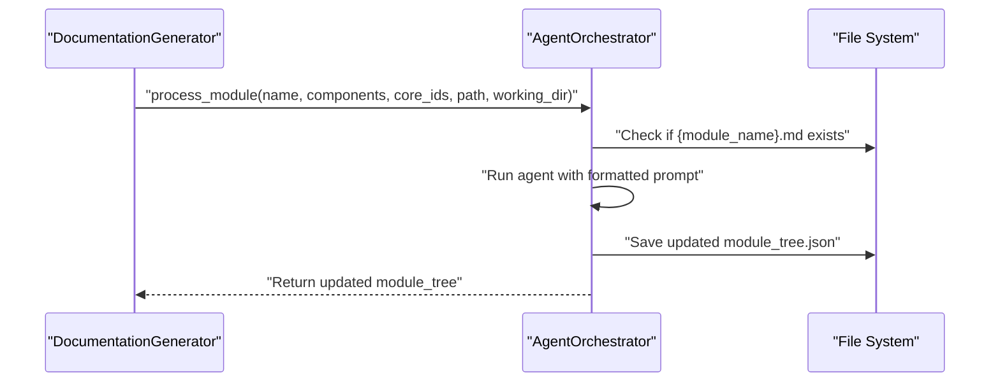
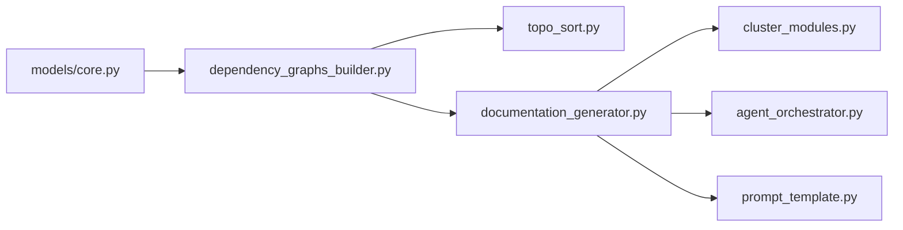

# Processing Order and Dependency Management

<cite>
**Referenced Files in This Document**
- [topo_sort.py](file://codewiki/src/be/dependency_analyzer/topo_sort.py)
- [dependency_graphs_builder.py](file://codewiki/src/be/dependency_analyzer/dependency_graphs_builder.py)
- [documentation_generator.py](file://codewiki/src/be/documentation_generator.py)
- [cluster_modules.py](file://codewiki/src/be/cluster_modules.py)
- [core.py](file://codewiki/src/be/dependency_analyzer/models/core.py)
- [prompt_template.py](file://codewiki/src/be/prompt_template.py)
- [agent_orchestrator.py](file://codewiki/src/be/agent_orchestrator.py)
</cite>

## Table of Contents
1. [Introduction](#introduction)
2. [Project Structure](#project-structure)
3. [Core Components](#core-components)
4. [Architecture Overview](#architecture-overview)
5. [Detailed Component Analysis](#detailed-component-analysis)
6. [Dependency Analysis](#dependency-analysis)
7. [Performance Considerations](#performance-considerations)
8. [Troubleshooting Guide](#troubleshooting-guide)
9. [Conclusion](#conclusion)

## Introduction
This document explains the processing order and dependency management sub-feature that ensures leaf modules are processed before their parents during hierarchical documentation assembly. It covers:
- The get_processing_order() function and how it uses a recursive traversal to produce a leaf-first ordering.
- The role of is_leaf_module() in distinguishing leaf vs parent modules.
- State management via processed_modules to prevent reprocessing.
- The significance of processing dependencies in the correct order for hierarchical documentation assembly.
- Special handling for repository overview generation.
- Strategies for detecting and resolving circular dependencies.
- Practical troubleshooting steps for common processing order issues.

## Project Structure
The processing order and dependency management feature spans several modules:
- Topological utilities for dependency graphs and leaf detection
- Dependency graph builder that constructs the component graph and selects leaf nodes
- Documentation generator that orchestrates processing order and parent/leaf handling
- Clustering module that builds hierarchical module trees
- Agent orchestrator that executes module documentation generation
- Prompt templates that define overview prompts for repository and module-level overviews

**Diagram sources**
- [topo_sort.py](file://codewiki/src/be/dependency_analyzer/topo_sort.py#L1-L350)
- [dependency_graphs_builder.py](file://codewiki/src/be/dependency_analyzer/dependency_graphs_builder.py#L1-L94)
- [documentation_generator.py](file://codewiki/src/be/documentation_generator.py#L1-L292)
- [cluster_modules.py](file://codewiki/src/be/cluster_modules.py#L1-L113)
- [core.py](file://codewiki/src/be/dependency_analyzer/models/core.py#L1-L64)
- [prompt_template.py](file://codewiki/src/be/prompt_template.py#L1-L200)
- [agent_orchestrator.py](file://codewiki/src/be/agent_orchestrator.py#L120-L149)

**Section sources**
- [topo_sort.py](file://codewiki/src/be/dependency_analyzer/topo_sort.py#L1-L350)
- [dependency_graphs_builder.py](file://codewiki/src/be/dependency_analyzer/dependency_graphs_builder.py#L1-L94)
- [documentation_generator.py](file://codewiki/src/be/documentation_generator.py#L1-L292)
- [cluster_modules.py](file://codewiki/src/be/cluster_modules.py#L1-L113)
- [core.py](file://codewiki/src/be/dependency_analyzer/models/core.py#L1-L64)
- [prompt_template.py](file://codewiki/src/be/prompt_template.py#L1-L200)
- [agent_orchestrator.py](file://codewiki/src/be/agent_orchestrator.py#L120-L149)

## Core Components
- Topological utilities: cycle detection, cycle resolution, topological sort, and leaf node discovery.
- Dependency graph builder: parses components, saves dependency graphs, and filters leaf nodes.
- Documentation generator: orchestrates processing order, handles leaf vs parent modules, and generates repository/module overviews.
- Clustering: builds hierarchical module trees from leaf nodes.
- Agent orchestrator: executes module documentation generation and saves updated module trees.
- Prompt templates: define repository overview and module overview prompts.

Key responsibilities:
- topo_sort.py: Provides robust cycle detection and resolution, and exposes helpers to build dependency graphs from components and to extract leaf nodes.
- dependency_graphs_builder.py: Builds the dependency graph from parsed components and selects valid leaf nodes based on component types.
- documentation_generator.py: Implements get_processing_order() and is_leaf_module(), manages processed_modules state, and coordinates parent/leaf processing and overview generation.
- cluster_modules.py: Clusters potential core components into hierarchical module trees and recurses into submodules.
- agent_orchestrator.py: Executes module documentation generation and updates module trees.
- prompt_template.py: Supplies repository and module overview prompts.

**Section sources**
- [topo_sort.py](file://codewiki/src/be/dependency_analyzer/topo_sort.py#L1-L350)
- [dependency_graphs_builder.py](file://codewiki/src/be/dependency_analyzer/dependency_graphs_builder.py#L1-L94)
- [documentation_generator.py](file://codewiki/src/be/documentation_generator.py#L74-L198)
- [cluster_modules.py](file://codewiki/src/be/cluster_modules.py#L44-L113)
- [agent_orchestrator.py](file://codewiki/src/be/agent_orchestrator.py#L120-L149)
- [prompt_template.py](file://codewiki/src/be/prompt_template.py#L91-L127)

## Architecture Overview
The processing order and dependency management feature follows a layered pipeline:
- Dependency graph construction and leaf selection
- Hierarchical module tree clustering
- Deterministic processing order (leaf-first)
- Parent module documentation synthesis
- Repository overview generation

**Diagram sources**
- [dependency_graphs_builder.py](file://codewiki/src/be/dependency_analyzer/dependency_graphs_builder.py#L18-L94)
- [topo_sort.py](file://codewiki/src/be/dependency_analyzer/topo_sort.py#L239-L350)
- [documentation_generator.py](file://codewiki/src/be/documentation_generator.py#L134-L198)
- [cluster_modules.py](file://codewiki/src/be/cluster_modules.py#L44-L113)
- [agent_orchestrator.py](file://codewiki/src/be/agent_orchestrator.py#L120-L149)
- [prompt_template.py](file://codewiki/src/be/prompt_template.py#L91-L127)

## Detailed Component Analysis

### get_processing_order(): Leaf-First Traversal
The get_processing_order() function performs a recursive traversal of the module tree to produce a deterministic processing order that ensures leaf modules are processed before their parents. The traversal collects modules in a list of tuples containing the path and module name. For each module:
- If it has children, the function recurses into the children first, then appends the parent module to the processing order.
- If it is a leaf module, it appends the leaf immediately.

This guarantees a dependency-first order: dependencies (children) are processed before dependents (parents).

**Diagram sources**
- [documentation_generator.py](file://codewiki/src/be/documentation_generator.py#L74-L92)

**Section sources**
- [documentation_generator.py](file://codewiki/src/be/documentation_generator.py#L74-L92)

### collect_modules(): Recursive Tree Traversal
The internal collect_modules() function implements the recursive traversal logic:
- Maintains the current path as it descends into child modules.
- Recurses into children before appending the current module to the order.
- Ensures leaf modules are appended immediately upon encountering them.

This design naturally aligns with topological ordering: children are processed before parents, reflecting dependency relationships.

**Section sources**
- [documentation_generator.py](file://codewiki/src/be/documentation_generator.py#L74-L92)

### is_leaf_module(): Leaf Detection
The is_leaf_module() function determines whether a module is a leaf (no children or empty children). This flag controls the processing path:
- Leaf modules trigger direct documentation generation via the agent orchestrator.
- Parent modules trigger overview generation based on child documentation.

**Diagram sources**
- [documentation_generator.py](file://codewiki/src/be/documentation_generator.py#L94-L98)

**Section sources**
- [documentation_generator.py](file://codewiki/src/be/documentation_generator.py#L94-L98)

### State Management: processed_modules
To prevent reprocessing the same module, the system tracks processed modules using a set keyed by the module’s path string. Before processing a module, the code checks if the path is already in processed_modules and skips if so. This ensures idempotent processing and avoids redundant work.

**Section sources**
- [documentation_generator.py](file://codewiki/src/be/documentation_generator.py#L143-L175)

### Significance of Correct Processing Order
Processing dependencies in the correct order is crucial for hierarchical documentation assembly:
- Leaf modules provide atomic units of documentation that can be synthesized into parent-level overviews.
- Parent modules rely on child documentation being present to generate coherent summaries.
- Without dependency-first ordering, parent overviews would reference child documentation that has not yet been generated, leading to incomplete or inconsistent outputs.

**Section sources**
- [documentation_generator.py](file://codewiki/src/be/documentation_generator.py#L134-L198)

### Repository Overview Generation
After processing all modules, the system generates a repository overview by invoking generate_parent_module_docs with an empty path. This triggers the repository overview prompt, which synthesizes a high-level view of the entire repository using the module tree and child documentation.

**Diagram sources**
- [documentation_generator.py](file://codewiki/src/be/documentation_generator.py#L177-L196)
- [prompt_template.py](file://codewiki/src/be/prompt_template.py#L91-L108)

**Section sources**
- [documentation_generator.py](file://codewiki/src/be/documentation_generator.py#L177-L196)
- [prompt_template.py](file://codewiki/src/be/prompt_template.py#L91-L108)

### Dependency Graph Construction and Leaf Selection
The dependency graph builder:
- Parses components and saves the dependency graph.
- Builds a dependency graph from components using build_graph_from_components().
- Extracts leaf nodes using get_leaf_nodes(), filtering by component types and validity.

**Diagram sources**
- [dependency_graphs_builder.py](file://codewiki/src/be/dependency_analyzer/dependency_graphs_builder.py#L18-L94)
- [topo_sort.py](file://codewiki/src/be/dependency_analyzer/topo_sort.py#L239-L350)

**Section sources**
- [dependency_graphs_builder.py](file://codewiki/src/be/dependency_analyzer/dependency_graphs_builder.py#L18-L94)
- [topo_sort.py](file://codewiki/src/be/dependency_analyzer/topo_sort.py#L239-L350)

### Clustering and Hierarchical Module Trees
The clustering module builds hierarchical module trees from leaf nodes:
- Formats potential core components grouped by file.
- Calls the LLM to group components into modules.
- Recursively clusters submodules and merges results into the module tree.

**Diagram sources**
- [cluster_modules.py](file://codewiki/src/be/cluster_modules.py#L44-L113)

**Section sources**
- [cluster_modules.py](file://codewiki/src/be/cluster_modules.py#L44-L113)

### Agent Execution and Module Tree Updates
The agent orchestrator executes module documentation generation:
- Checks if module docs already exist to avoid redundant work.
- Runs the agent with a formatted prompt that includes module name, core component IDs, components, and module tree.
- Saves the updated module tree after processing.

**Diagram sources**
- [agent_orchestrator.py](file://codewiki/src/be/agent_orchestrator.py#L120-L149)
- [documentation_generator.py](file://codewiki/src/be/documentation_generator.py#L159-L169)

**Section sources**
- [agent_orchestrator.py](file://codewiki/src/be/agent_orchestrator.py#L120-L149)
- [documentation_generator.py](file://codewiki/src/be/documentation_generator.py#L159-L169)

## Dependency Analysis
The processing order relies on a clean separation of concerns:
- topo_sort.py provides graph utilities and leaf detection.
- dependency_graphs_builder.py produces the component graph and leaf sets.
- documentation_generator.py orchestrates processing order and parent/leaf handling.
- cluster_modules.py constructs hierarchical module trees.
- agent_orchestrator.py executes module documentation generation.
- prompt_template.py supplies repository/module overview prompts.

**Diagram sources**
- [core.py](file://codewiki/src/be/dependency_analyzer/models/core.py#L1-L64)
- [dependency_graphs_builder.py](file://codewiki/src/be/dependency_analyzer/dependency_graphs_builder.py#L1-L94)
- [topo_sort.py](file://codewiki/src/be/dependency_analyzer/topo_sort.py#L1-L350)
- [documentation_generator.py](file://codewiki/src/be/documentation_generator.py#L1-L292)
- [cluster_modules.py](file://codewiki/src/be/cluster_modules.py#L1-L113)
- [agent_orchestrator.py](file://codewiki/src/be/agent_orchestrator.py#L120-L149)
- [prompt_template.py](file://codewiki/src/be/prompt_template.py#L91-L127)

**Section sources**
- [core.py](file://codewiki/src/be/dependency_analyzer/models/core.py#L1-L64)
- [dependency_graphs_builder.py](file://codewiki/src/be/dependency_analyzer/dependency_graphs_builder.py#L1-L94)
- [topo_sort.py](file://codewiki/src/be/dependency_analyzer/topo_sort.py#L1-L350)
- [documentation_generator.py](file://codewiki/src/be/documentation_generator.py#L1-L292)
- [cluster_modules.py](file://codewiki/src/be/cluster_modules.py#L1-L113)
- [agent_orchestrator.py](file://codewiki/src/be/agent_orchestrator.py#L120-L149)
- [prompt_template.py](file://codewiki/src/be/prompt_template.py#L91-L127)

## Performance Considerations
- Traversal complexity: get_processing_order() visits each module once, yielding O(N) traversal over the module tree.
- Cycle handling: topo_sort.py resolves cycles by removing edges, ensuring topological sorting can proceed efficiently.
- Token budgeting: cluster_modules() checks token counts and skips clustering when appropriate, reducing unnecessary LLM calls.
- Idempotency: processed_modules prevents repeated processing, avoiding redundant work and improving throughput.

[No sources needed since this section provides general guidance]

## Troubleshooting Guide
Common issues and solutions:
- Circular dependencies
  - Symptom: Topological sort warnings or incomplete ordering.
  - Resolution: The system detects and resolves cycles by removing edges. Verify logs for cycle detection messages and review the dependency graph JSON to confirm resolution.
  - Section sources
    - [topo_sort.py](file://codewiki/src/be/dependency_analyzer/topo_sort.py#L78-L119)
    - [topo_sort.py](file://codewiki/src/be/dependency_analyzer/topo_sort.py#L121-L169)

- Leaf node filtering
  - Symptom: Fewer leaf nodes than expected.
  - Resolution: Ensure component types match valid leaf types (class, interface, struct, or function for C-based projects). Review filtering logic in the dependency graph builder.
  - Section sources
    - [dependency_graphs_builder.py](file://codewiki/src/be/dependency_analyzer/dependency_graphs_builder.py#L64-L94)

- Repeated processing
  - Symptom: Redundant module documentation generation.
  - Resolution: Confirm processed_modules is populated and module paths are correctly tracked. Check for path mismatches (e.g., relative vs absolute paths).
  - Section sources
    - [documentation_generator.py](file://codewiki/src/be/documentation_generator.py#L143-L175)

- Missing child documentation for parent overviews
  - Symptom: Parent overview references missing child docs.
  - Resolution: Ensure child modules are processed before parent overviews. Verify that generate_parent_module_docs is invoked after the leaf-to-parent processing loop completes.
  - Section sources
    - [documentation_generator.py](file://codewiki/src/be/documentation_generator.py#L134-L198)

- Repository overview not generated
  - Symptom: No overview.md file.
  - Resolution: Confirm the final parent overview call occurs after processing all modules. Check that the overview prompt is applied and that the output file is saved.
  - Section sources
    - [documentation_generator.py](file://codewiki/src/be/documentation_generator.py#L177-L196)
    - [prompt_template.py](file://codewiki/src/be/prompt_template.py#L91-L108)

## Conclusion
The processing order and dependency management sub-feature ensures reliable hierarchical documentation assembly by:
- Using a recursive traversal to produce a leaf-first processing order.
- Distinguishing leaf vs parent modules via is_leaf_module().
- Managing state with processed_modules to prevent reprocessing.
- Leveraging topological utilities to handle cycles and maintain a consistent order.
- Generating repository overviews after all modules are documented.

These mechanisms collectively enable scalable, coherent documentation generation across complex codebases.