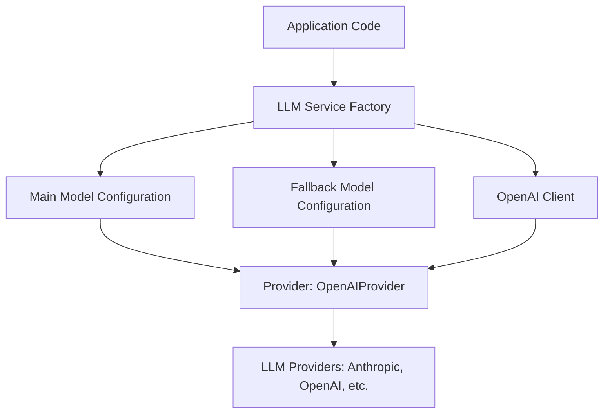
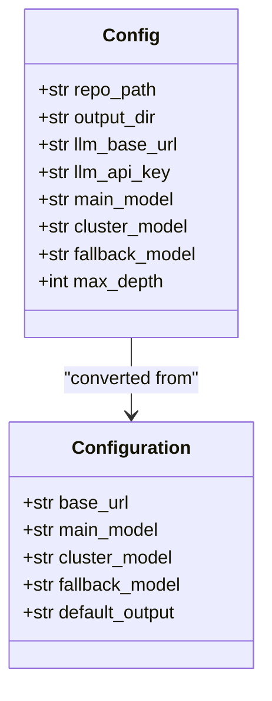
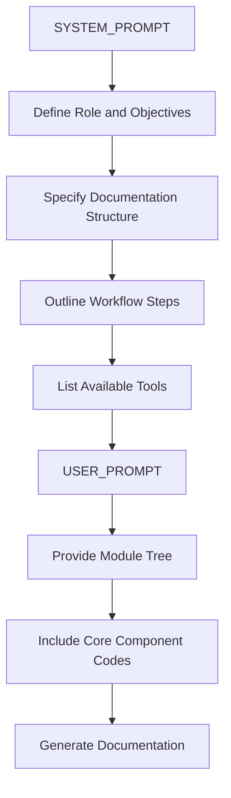
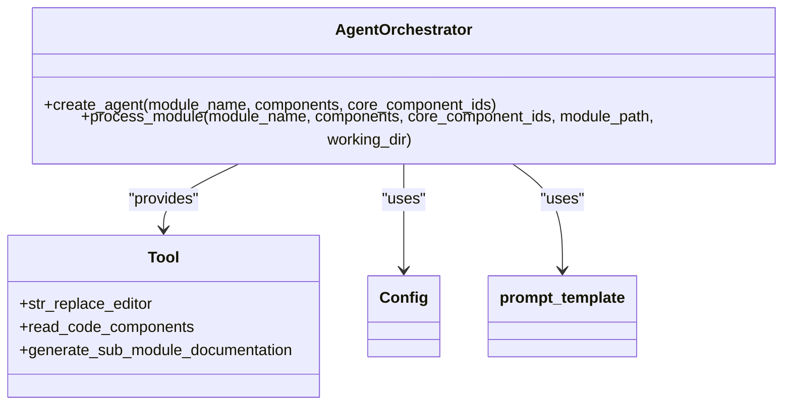
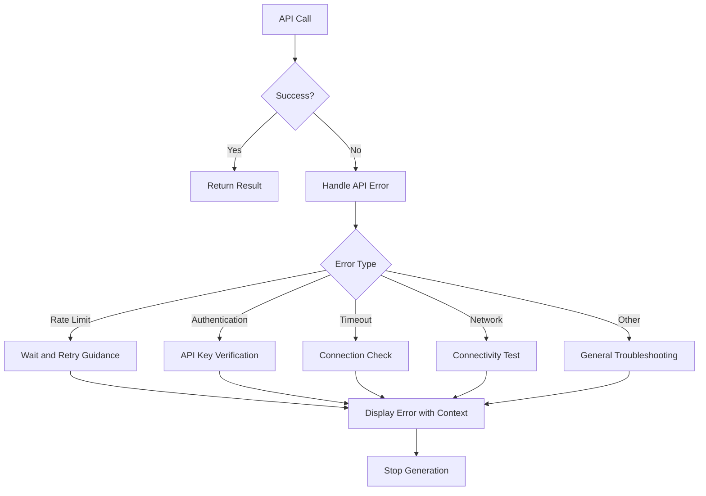
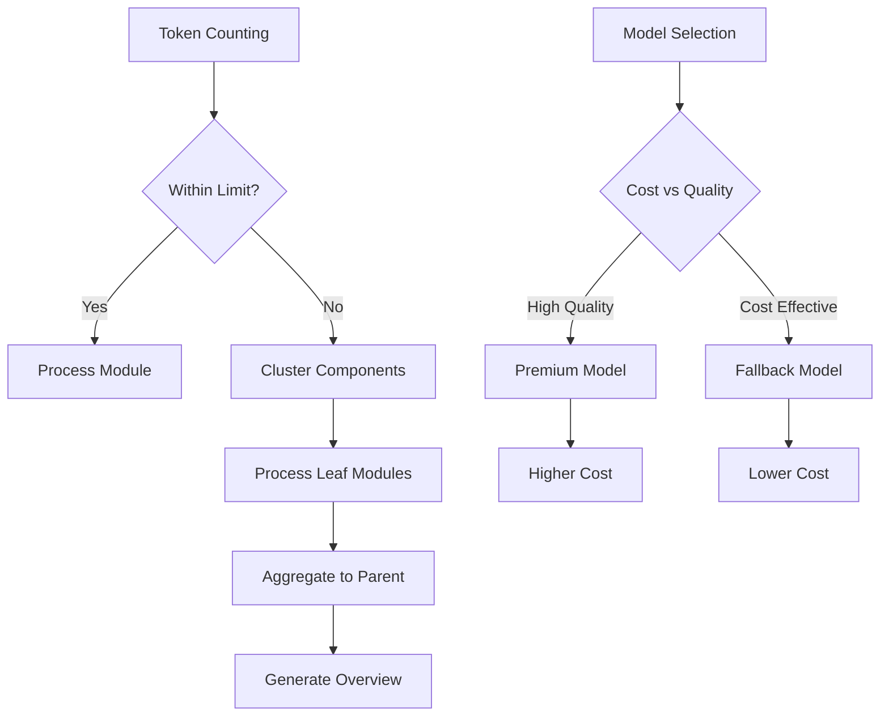
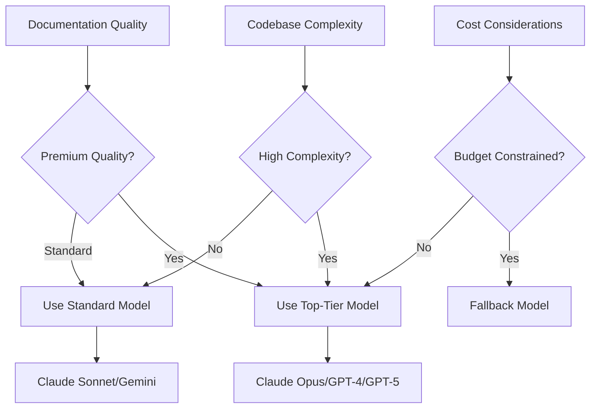
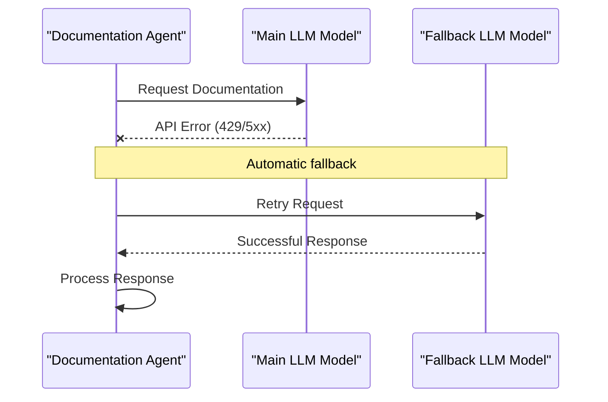

# LLM Integration and Configuration

<cite>
**Referenced Files in This Document**   
- [llm_services.py](file://codewiki/src/be/llm_services.py)
- [prompt_template.py](file://codewiki/src/be/prompt_template.py)
- [agent_orchestrator.py](file://codewiki/src/be/agent_orchestrator.py)
- [config.py](file://codewiki/src/config.py)
- [documentation_generator.py](file://codewiki/src/be/documentation_generator.py)
- [cluster_modules.py](file://codewiki/src/be/cluster_modules.py)
- [api_errors.py](file://codewiki/cli/utils/api_errors.py)
- [doc_generator.py](file://codewiki/cli/adapters/doc_generator.py)
- [config.py](file://codewiki/cli/models/config.py)
</cite>

## Table of Contents
1. [Introduction](#introduction)
2. [LLM Interface and Litellm Abstraction](#llm-interface-and-litellm-abstraction)
3. [Model Configuration](#model-configuration)
4. [Prompt Engineering Strategy](#prompt-engineering-strategy)
5. [Agent Tool System](#agent-tool-system)
6. [Error Handling and Retry Mechanisms](#error-handling-and-retry-mechanisms)
7. [Rate Limiting and Cost Optimization](#rate-limiting-and-cost-optimization)
8. [Model Selection Guidance](#model-selection-guidance)
9. [Fallback Model Mechanism](#fallback-model-mechanism)

## Introduction
CodeWiki implements a sophisticated LLM integration system that leverages the Litellm abstraction layer to interface with multiple large language model providers, including Anthropic and OpenAI. This system is designed to generate comprehensive documentation for codebases by analyzing source code, identifying components, and creating structured documentation with visual diagrams. The architecture supports multiple processing scenarios through configurable main, cluster, and fallback models, ensuring reliable operation across different use cases and provider availability. The system incorporates advanced prompt engineering, agent-based tooling, and robust error handling to deliver high-quality documentation generation capabilities.

## LLM Interface and Litellm Abstraction
CodeWiki utilizes the Litellm abstraction layer to provide a unified interface for interacting with various LLM providers. This abstraction enables seamless integration with different providers while maintaining consistent API patterns across the codebase. The system creates configured LLM clients through factory functions that instantiate models based on the current configuration settings.

The core interface is implemented in the `llm_services.py` module, which provides functions for creating main models, fallback models, and OpenAI clients. The `call_llm` function serves as the primary interface for executing LLM requests, handling the complete request lifecycle from prompt submission to response extraction. This abstraction allows CodeWiki to support multiple providers without requiring provider-specific code throughout the application.

**Diagram sources**
- [llm_services.py](file://codewiki/src/be/llm_services.py#L13-L86)

**Section sources**
- [llm_services.py](file://codewiki/src/be/llm_services.py#L13-L86)

## Model Configuration
CodeWiki supports three distinct model configurations for different processing scenarios: main, cluster, and fallback models. These models are configured through the system's configuration mechanism, which can be set via CLI parameters or persistent configuration files.

The main model is used for primary documentation generation tasks and is configured with conservative settings (temperature=0.0) to ensure deterministic output. The cluster model is specifically designated for module clustering operations, where the system analyzes code components and groups them into logical modules. The fallback model provides redundancy when the main model is unavailable due to API failures or rate limits.

Configuration is managed through the `Config` class in `config.py`, which defines default values and environment variable overrides. The CLI configuration model in `cli/models/config.py` provides a persistent storage mechanism for user settings, including the base URL, main model, cluster model, and fallback model specifications.

**Diagram sources**
- [config.py](file://codewiki/src/config.py#L40-L114)
- [config.py](file://codewiki/cli/models/config.py#L20-L109)

**Section sources**
- [config.py](file://codewiki/src/config.py#L34-L114)
- [config.py](file://codewiki/cli/models/config.py#L20-L109)

## Prompt Engineering Strategy
CodeWiki employs a sophisticated prompt engineering strategy that uses structured prompts to guide LLMs in generating comprehensive documentation. The system defines multiple prompt templates for different documentation scenarios, including module overviews, repository overviews, and module clustering.

The primary system prompt defines the AI's role as a documentation assistant with specific objectives to create documentation that helps developers understand a module's purpose, architecture, and relationship to the overall system. The prompt structure specifies a consistent documentation format with main documentation files, sub-module documentation, and visual documentation using Mermaid diagrams.

For complex modules, the system uses a hierarchical approach where the main prompt orchestrates the creation of sub-module documentation through specialized sub-agents. The prompt templates include explicit instructions for workflow execution, available tools, and output formatting requirements to ensure consistent and high-quality documentation generation.

**Diagram sources**
- [prompt_template.py](file://codewiki/src/be/prompt_template.py#L1-L337)

**Section sources**
- [prompt_template.py](file://codewiki/src/be/prompt_template.py#L1-L337)

## Agent Tool System
The agent tool system in CodeWiki provides a set of capabilities that enable LLM agents to interact with code components and generate documentation. These tools are integrated into the agent orchestrator and provide specific functionalities for reading code, generating sub-module documentation, and editing documentation files.

The `read_code_components` tool allows agents to retrieve the source code of specified components by their IDs, enabling deeper analysis of implementation details. The `generate_sub_module_documentation` tool creates specialized sub-agents to handle documentation for complex modules, implementing a hierarchical documentation approach. The `str_replace_editor` tool provides comprehensive file system operations for creating, viewing, and editing documentation files in both the repository and documentation directories.

These tools are registered with the agent orchestrator and made available to agents based on the complexity of the module being processed. Complex modules receive access to all tools, while simpler modules are limited to basic reading and editing capabilities.

**Diagram sources**
- [agent_orchestrator.py](file://codewiki/src/be/agent_orchestrator.py#L59-L149)
- [agent_tools](file://codewiki/src/be/agent_tools/)

**Section sources**
- [agent_orchestrator.py](file://codewiki/src/be/agent_orchestrator.py#L59-L149)
- [agent_tools/read_code_components.py](file://codewiki/src/be/agent_tools/read_code_components.py#L1-L22)
- [agent_tools/generate_sub_module_documentations.py](file://codewiki/src/be/agent_tools/generate_sub_module_documentations.py#L1-L93)
- [agent_tools/str_replace_editor.py](file://codewiki/src/be/agent_tools/str_replace_editor.py#L1-L783)

## Error Handling and Retry Mechanisms
CodeWiki implements comprehensive error handling and retry mechanisms to ensure robust operation when interacting with LLM APIs. The system uses a fail-fast approach for API errors, immediately halting documentation generation when critical errors occur to prevent partial or inconsistent results.

The `APIErrorHandler` class in `api_errors.py` detects specific error types such as rate limits (429), authentication failures (401), timeouts, and network connectivity issues. For each error type, the system provides detailed troubleshooting guidance to help users resolve the issue. The error handling system distinguishes between transient errors that might be resolved by retrying and permanent configuration errors that require user intervention.

The `wrap_api_call` utility function provides a consistent mechanism for wrapping API calls with error handling, allowing the system to either raise exceptions immediately (fail_fast=True) or display errors and continue execution (fail_fast=False) based on the context.

**Diagram sources**
- [api_errors.py](file://codewiki/cli/utils/api_errors.py#L11-L140)

**Section sources**
- [api_errors.py](file://codewiki/cli/utils/api_errors.py#L11-L140)

## Rate Limiting and Cost Optimization
CodeWiki addresses rate limiting and cost optimization through several strategic approaches. The system implements a hierarchical processing model that minimizes token usage by processing leaf modules first and then aggregating their documentation into parent modules. This approach reduces the context window requirements for generating high-level documentation.

The configuration system allows users to select appropriate models based on cost considerations, with fallback options available for when premium models are rate-limited. The system also includes token counting utilities to monitor and manage token usage, helping to prevent unexpected costs from large requests.

For large repositories, the system clusters components into modules before documentation generation, which reduces the number of API calls required and optimizes the processing workflow. The dynamic programming approach to documentation generation ensures that each module is processed only once, eliminating redundant API calls.

**Diagram sources**
- [utils.py](file://codewiki/src/be/utils.py#L30-L38)
- [cluster_modules.py](file://codewiki/src/be/cluster_modules.py#L14-L113)

**Section sources**
- [utils.py](file://codewiki/src/be/utils.py#L30-L38)
- [cluster_modules.py](file://codewiki/src/be/cluster_modules.py#L14-L113)

## Model Selection Guidance
CodeWiki provides guidance for selecting appropriate models based on codebase complexity and documentation quality requirements. The system includes validation utilities that identify top-tier models such as Claude Opus, Claude Sonnet, GPT-4, GPT-5, and Gemini 2.5, which are recommended for complex codebases requiring high-quality documentation.

For simpler codebases or cost-sensitive scenarios, the system supports fallback to more economical models while maintaining documentation quality. The configuration system allows users to specify different models for different tasks: premium models for main documentation generation, potentially less expensive models for clustering operations, and reliable fallback models for redundancy.

The selection guidance considers factors such as context window size, reasoning capabilities, and cost per token. Complex codebases with intricate dependencies benefit from models with larger context windows and advanced reasoning capabilities, while simpler projects can utilize more cost-effective options without sacrificing documentation quality.

**Diagram sources**
- [validation.py](file://codewiki/cli/utils/validation.py#L218-L229)
- [config.py](file://codewiki/src/config.py#L34-L37)

**Section sources**
- [validation.py](file://codewiki/cli/utils/validation.py#L218-L229)
- [config.py](file://codewiki/src/config.py#L34-L37)

## Fallback Model Mechanism
CodeWiki implements a robust fallback model mechanism to handle API failures and rate limits. The system creates a fallback model chain using the `FallbackModel` class from the Pydantic AI library, which automatically routes requests to the fallback model when the main model fails.

The `create_fallback_models` function in `llm_services.py` constructs this chain by combining the main model and fallback model configurations. When an API call to the main model fails, the system automatically retries with the fallback model, ensuring continuous operation even when primary services are unavailable.

This mechanism is integrated throughout the documentation generation process, from initial module clustering to final documentation assembly. The fallback system preserves the same configuration parameters (temperature, max_tokens) between main and fallback models to maintain consistent output quality across different providers.

**Diagram sources**
- [llm_services.py](file://codewiki/src/be/llm_services.py#L43-L47)
- [llm_services.py](file://codewiki/src/be/llm_services.py#L58-L86)

**Section sources**
- [llm_services.py](file://codewiki/src/be/llm_services.py#L43-L86)