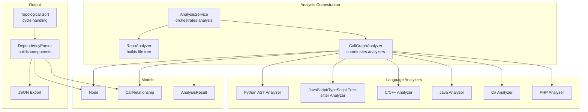
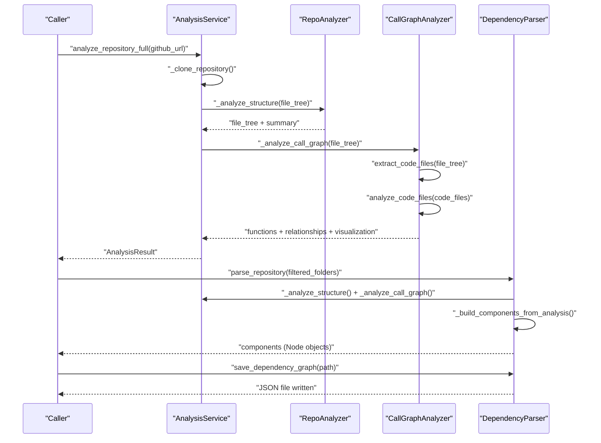
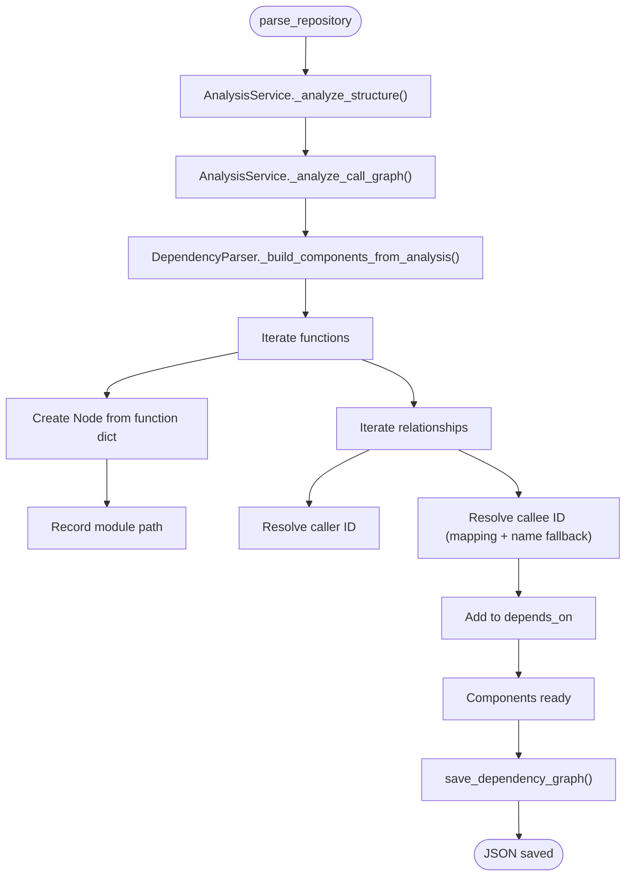
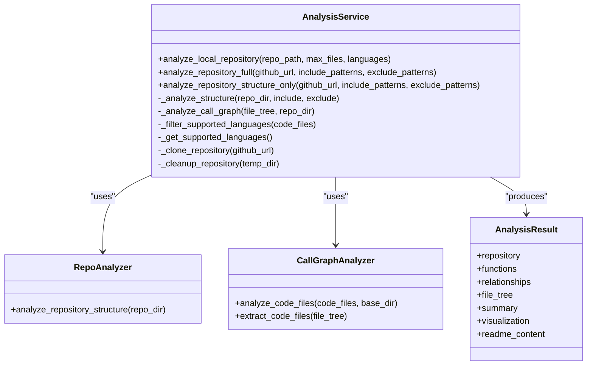
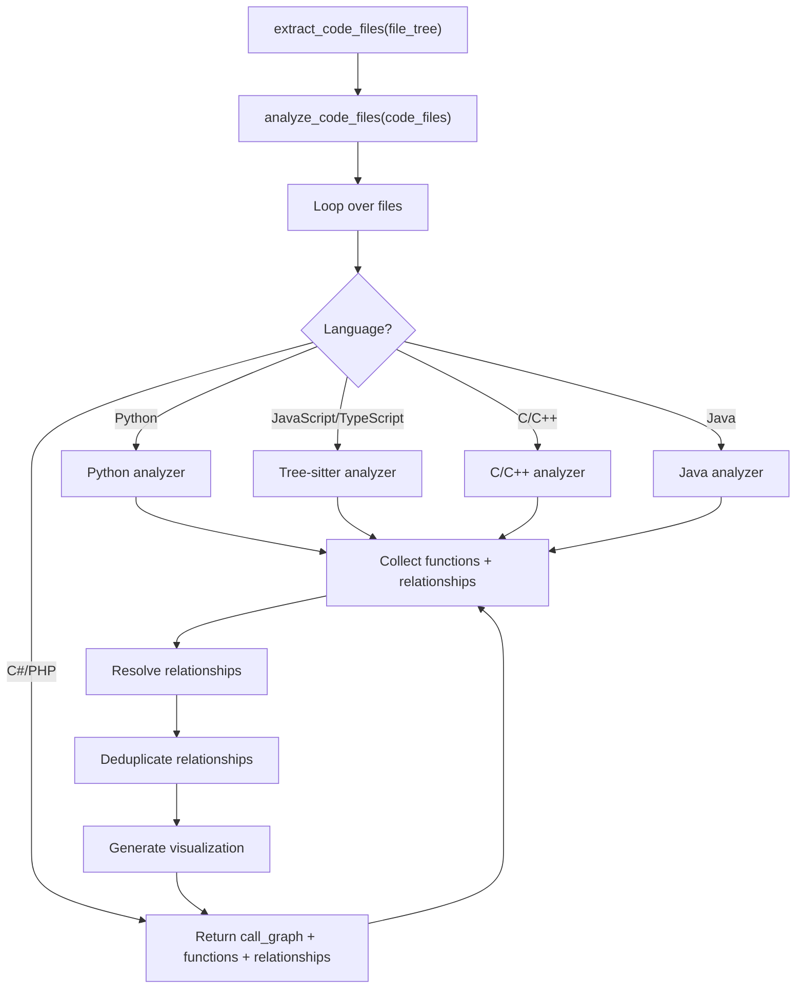
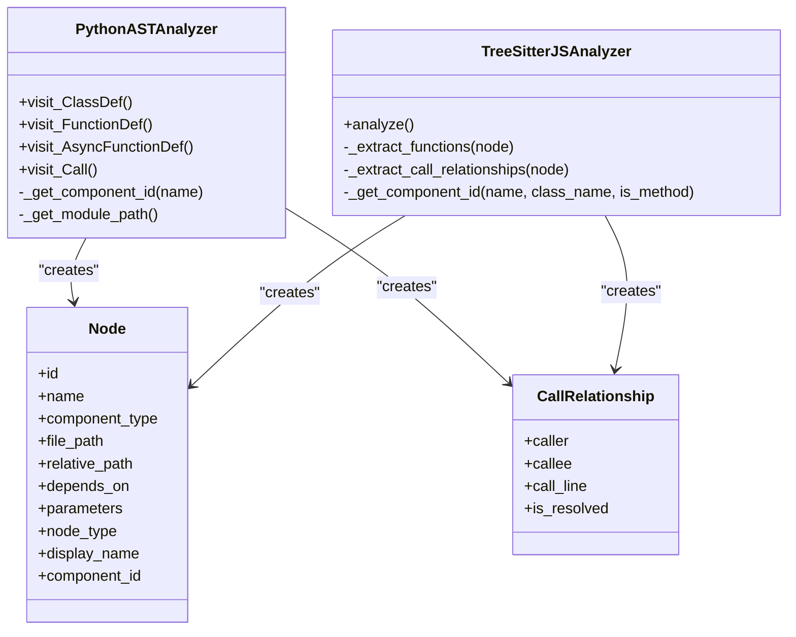
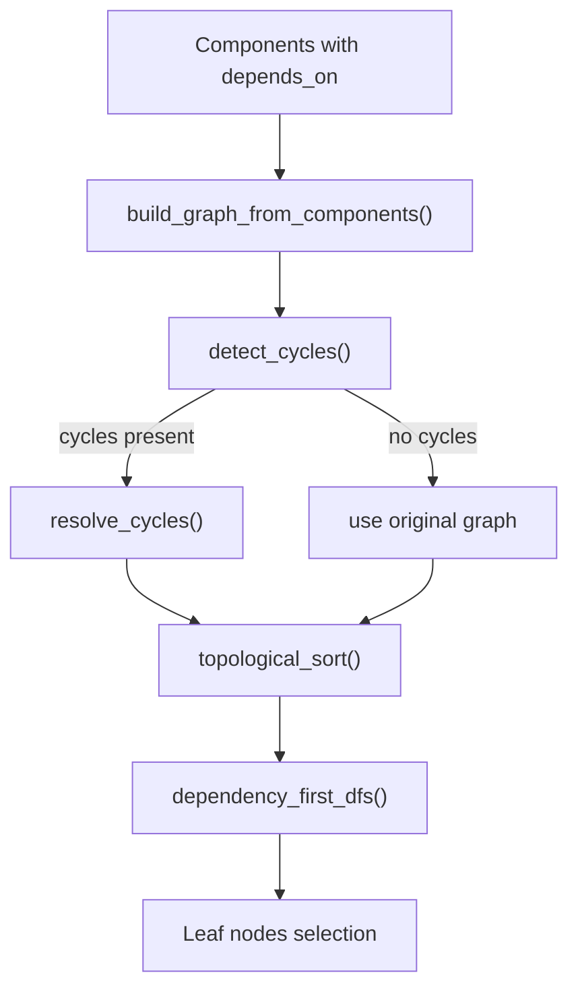

# AST Parser and Analysis Service

<cite>
**Referenced Files in This Document**
- [ast_parser.py](file://codewiki/src/be/dependency_analyzer/ast_parser.py)
- [analysis_service.py](file://codewiki/src/be/dependency_analyzer/analysis/analysis_service.py)
- [call_graph_analyzer.py](file://codewiki/src/be/dependency_analyzer/analysis/call_graph_analyzer.py)
- [core.py](file://codewiki/src/be/dependency_analyzer/models/core.py)
- [analysis.py](file://codewiki/src/be/dependency_analyzer/models/analysis.py)
- [patterns.py](file://codewiki/src/be/dependency_analyzer/utils/patterns.py)
- [repo_analyzer.py](file://codewiki/src/be/dependency_analyzer/analysis/repo_analyzer.py)
- [cloning.py](file://codewiki/src/be/dependency_analyzer/analysis/cloning.py)
- [dependency_graphs_builder.py](file://codewiki/src/be/dependency_analyzer/dependency_graphs_builder.py)
- [topo_sort.py](file://codewiki/src/be/dependency_analyzer/topo_sort.py)
- [python.py](file://codewiki/src/be/dependency_analyzer/analyzers/python.py)
- [javascript.py](file://codewiki/src/be/dependency_analyzer/analyzers/javascript.py)
- [main.py](file://codewiki/src/be/main.py)
</cite>

## Table of Contents
1. [Introduction](#introduction)
2. [Project Structure](#project-structure)
3. [Core Components](#core-components)
4. [Architecture Overview](#architecture-overview)
5. [Detailed Component Analysis](#detailed-component-analysis)
6. [Dependency Analysis](#dependency-analysis)
7. [Performance Considerations](#performance-considerations)
8. [Troubleshooting Guide](#troubleshooting-guide)
9. [Conclusion](#conclusion)

## Introduction
This document explains the AST parser and analysis service that powers CodeWiki’s multi-language dependency analysis. It focuses on how the DependencyParser class coordinates with the AnalysisService to analyze repository structure and call graphs across multiple languages, how raw analysis results are transformed into Node objects, how component IDs are generated and mapped, how relationships are resolved, and how the final dependency graph is exported to JSON. It also covers cross-language dependency handling and consistency across heterogeneous analysis results.

## Project Structure
The dependency analysis pipeline lives under the backend dependency analyzer package. Key modules include:
- Analysis orchestration and repository handling
- Call graph construction across multiple languages
- Language-specific analyzers
- Model definitions for nodes and relationships
- Utilities for patterns and repository cloning
- Graph building and topological sorting

**Diagram sources**
- [analysis_service.py](file://codewiki/src/be/dependency_analyzer/analysis/analysis_service.py#L24-L370)
- [repo_analyzer.py](file://codewiki/src/be/dependency_analyzer/analysis/repo_analyzer.py#L1-L127)
- [call_graph_analyzer.py](file://codewiki/src/be/dependency_analyzer/analysis/call_graph_analyzer.py#L1-L536)
- [python.py](file://codewiki/src/be/dependency_analyzer/analyzers/python.py#L1-L267)
- [javascript.py](file://codewiki/src/be/dependency_analyzer/analyzers/javascript.py#L1-L200)
- [core.py](file://codewiki/src/be/dependency_analyzer/models/core.py#L1-L64)
- [analysis.py](file://codewiki/src/be/dependency_analyzer/models/analysis.py#L1-L24)
- [ast_parser.py](file://codewiki/src/be/dependency_analyzer/ast_parser.py#L1-L146)
- [topo_sort.py](file://codewiki/src/be/dependency_analyzer/topo_sort.py#L1-L350)

**Section sources**
- [analysis_service.py](file://codewiki/src/be/dependency_analyzer/analysis/analysis_service.py#L24-L370)
- [repo_analyzer.py](file://codewiki/src/be/dependency_analyzer/analysis/repo_analyzer.py#L1-L127)
- [call_graph_analyzer.py](file://codewiki/src/be/dependency_analyzer/analysis/call_graph_analyzer.py#L1-L536)
- [core.py](file://codewiki/src/be/dependency_analyzer/models/core.py#L1-L64)
- [analysis.py](file://codewiki/src/be/dependency_analyzer/models/analysis.py#L1-L24)
- [ast_parser.py](file://codewiki/src/be/dependency_analyzer/ast_parser.py#L1-L146)
- [topo_sort.py](file://codewiki/src/be/dependency_analyzer/topo_sort.py#L1-L350)

## Core Components
- AnalysisService: Central coordinator that clones repositories, analyzes structure, and performs multi-language call graph analysis. It exposes methods for full analysis, structure-only analysis, and local repository analysis.
- CallGraphAnalyzer: Orchestrates language-specific analyzers, aggregates functions and relationships, resolves relationships, deduplicates edges, and generates visualization data.
- DependencyParser: Transforms raw analysis results into Node objects, generates and maps component IDs, resolves relationships across components, and exports the dependency graph to JSON.
- Language-specific analyzers: Python AST analyzer and Tree-sitter analyzers for JavaScript/TypeScript, plus analyzers for C, C++, Java, C#, and PHP.
- Models: Node and CallRelationship define the core data structures; AnalysisResult encapsulates the full analysis output.
- Utilities: Patterns define supported extensions and include/exclude filters; cloning utilities manage repository cloning and cleanup.

**Section sources**
- [analysis_service.py](file://codewiki/src/be/dependency_analyzer/analysis/analysis_service.py#L24-L370)
- [call_graph_analyzer.py](file://codewiki/src/be/dependency_analyzer/analysis/call_graph_analyzer.py#L1-L536)
- [ast_parser.py](file://codewiki/src/be/dependency_analyzer/ast_parser.py#L1-L146)
- [core.py](file://codewiki/src/be/dependency_analyzer/models/core.py#L1-L64)
- [analysis.py](file://codewiki/src/be/dependency_analyzer/models/analysis.py#L1-L24)
- [patterns.py](file://codewiki/src/be/dependency_analyzer/utils/patterns.py#L178-L202)
- [cloning.py](file://codewiki/src/be/dependency_analyzer/analysis/cloning.py#L60-L172)

## Architecture Overview
The system follows a layered architecture:
- Orchestration layer: AnalysisService manages lifecycle and delegates to RepoAnalyzer and CallGraphAnalyzer.
- Parsing layer: CallGraphAnalyzer routes files to language-specific analyzers and consolidates results.
- Transformation layer: DependencyParser converts raw results into Node objects and resolves relationships.
- Output layer: DependencyParser saves the dependency graph as JSON; Topological Sort utilities compute dependency orders and detect/resolve cycles.

**Diagram sources**
- [analysis_service.py](file://codewiki/src/be/dependency_analyzer/analysis/analysis_service.py#L96-L163)
- [repo_analyzer.py](file://codewiki/src/be/dependency_analyzer/analysis/repo_analyzer.py#L31-L97)
- [call_graph_analyzer.py](file://codewiki/src/be/dependency_analyzer/analysis/call_graph_analyzer.py#L27-L68)
- [ast_parser.py](file://codewiki/src/be/dependency_analyzer/ast_parser.py#L28-L46)
- [dependency_graphs_builder.py](file://codewiki/src/be/dependency_analyzer/dependency_graphs_builder.py#L18-L67)

## Detailed Component Analysis

### DependencyParser: Repository Analysis and Component Building
DependencyParser is responsible for:
- Orchestrating repository structure and call graph analysis via AnalysisService.
- Transforming raw analysis results into Node objects.
- Generating and mapping component IDs, including legacy ID fallbacks.
- Resolving relationships between components and collecting module names.
- Exporting the dependency graph to JSON.

Key behaviors:
- parse_repository: Calls AnalysisService to analyze structure and call graph, then invokes internal builder to produce Node objects and relationships.
- _build_components_from_analysis: Iterates over functions and relationships, constructs Node instances, records module paths, and resolves callee IDs using a mapping table. It also falls back to matching by name when an exact ID match is not found.
- save_dependency_graph: Serializes components to JSON, ensuring sets are converted to lists and directories are created before writing.

**Diagram sources**
- [ast_parser.py](file://codewiki/src/be/dependency_analyzer/ast_parser.py#L28-L146)

**Section sources**
- [ast_parser.py](file://codewiki/src/be/dependency_analyzer/ast_parser.py#L28-L146)

### AnalysisService: Orchestration Across Languages
AnalysisService coordinates:
- Repository cloning and cleanup.
- Structure analysis with include/exclude patterns.
- Call graph analysis with language filtering and supported language detection.
- Consolidation into AnalysisResult with visualization data.

Highlights:
- analyze_repository_full: Full pipeline from cloning to cleanup, returning AnalysisResult.
- analyze_local_repository: Lightweight analysis for local paths with optional language filtering and file caps.
- analyze_repository_structure_only: Structure-only mode for quick scans.
- _analyze_call_graph: Filters supported languages, delegates to CallGraphAnalyzer, and enriches results with supported language metadata.

**Diagram sources**
- [analysis_service.py](file://codewiki/src/be/dependency_analyzer/analysis/analysis_service.py#L24-L370)
- [repo_analyzer.py](file://codewiki/src/be/dependency_analyzer/analysis/repo_analyzer.py#L1-L127)
- [call_graph_analyzer.py](file://codewiki/src/be/dependency_analyzer/analysis/call_graph_analyzer.py#L1-L536)
- [analysis.py](file://codewiki/src/be/dependency_analyzer/models/analysis.py#L1-L24)

**Section sources**
- [analysis_service.py](file://codewiki/src/be/dependency_analyzer/analysis/analysis_service.py#L41-L163)
- [analysis.py](file://codewiki/src/be/dependency_analyzer/models/analysis.py#L1-L24)

### CallGraphAnalyzer: Multi-Language Coordination
CallGraphAnalyzer:
- Extracts code files from the file tree using supported extensions.
- Routes each file to the appropriate language analyzer.
- Aggregates all functions and relationships, resolves relationships by name and component ID, deduplicates edges, and generates visualization data.

Cross-language resolution:
- Maintains a lookup table keyed by function IDs, names, component IDs, and method suffixes.
- Attempts exact matches and suffix-based matches for dotted names to connect calls across languages.

**Diagram sources**
- [call_graph_analyzer.py](file://codewiki/src/be/dependency_analyzer/analysis/call_graph_analyzer.py#L27-L68)
- [patterns.py](file://codewiki/src/be/dependency_analyzer/utils/patterns.py#L178-L202)

**Section sources**
- [call_graph_analyzer.py](file://codewiki/src/be/dependency_analyzer/analysis/call_graph_analyzer.py#L27-L68)
- [patterns.py](file://codewiki/src/be/dependency_analyzer/utils/patterns.py#L178-L202)

### Language-Specific Analyzers: Python and JavaScript/TypeScript
- Python AST analyzer:
  - Generates component IDs using module path and class/function nesting.
  - Emits Node entries for classes and top-level functions.
  - Records relationships between top-level functions and methods.
- JavaScript/TypeScript Tree-sitter analyzer:
  - Uses Tree-sitter parsers to extract functions, methods, and relationships.
  - Produces Node and CallRelationship objects with module-scoped IDs.

**Diagram sources**
- [python.py](file://codewiki/src/be/dependency_analyzer/analyzers/python.py#L1-L267)
- [javascript.py](file://codewiki/src/be/dependency_analyzer/analyzers/javascript.py#L1-L200)
- [core.py](file://codewiki/src/be/dependency_analyzer/models/core.py#L1-L64)

**Section sources**
- [python.py](file://codewiki/src/be/dependency_analyzer/analyzers/python.py#L55-L196)
- [javascript.py](file://codewiki/src/be/dependency_analyzer/analyzers/javascript.py#L51-L120)
- [core.py](file://codewiki/src/be/dependency_analyzer/models/core.py#L1-L64)

### Component ID Generation and Relationship Resolution
- Component ID generation:
  - Python: module_path + "." + class_name + "." + method_name for methods; module_path + "." + name for top-level functions/classes.
  - JavaScript/TypeScript: module_path + "." + class_name + "." + method_name for methods; module_path + "." + name for functions.
- Mapping and resolution:
  - DependencyParser maintains a mapping from legacy IDs (file_path:name) to canonical component IDs.
  - During relationship resolution, it first tries exact ID matches, then falls back to name matching against existing Node names.
  - CallGraphAnalyzer augments this by indexing by component_id, method suffix, and function name to improve cross-language resolution.

**Section sources**
- [python.py](file://codewiki/src/be/dependency_analyzer/analyzers/python.py#L55-L105)
- [javascript.py](file://codewiki/src/be/dependency_analyzer/analyzers/javascript.py#L96-L105)
- [ast_parser.py](file://codewiki/src/be/dependency_analyzer/ast_parser.py#L47-L119)
- [call_graph_analyzer.py](file://codewiki/src/be/dependency_analyzer/analysis/call_graph_analyzer.py#L327-L363)

### Cross-Language Dependencies and Consistency
- Supported languages are filtered and analyzed; unsupported files are counted separately.
- Relationship resolution attempts to match dotted names and method suffixes across languages.
- Visualization data and summaries are produced to aid downstream consumers.
- DependencyParser ensures only repository-contained dependencies are retained when building the final graph.

**Section sources**
- [analysis_service.py](file://codewiki/src/be/dependency_analyzer/analysis/analysis_service.py#L289-L294)
- [call_graph_analyzer.py](file://codewiki/src/be/dependency_analyzer/analysis/call_graph_analyzer.py#L327-L363)
- [topo_sort.py](file://codewiki/src/be/dependency_analyzer/topo_sort.py#L239-L268)

### Dependency Graph Export to JSON
- DependencyParser.save_dependency_graph serializes components, converting sets to lists and ensuring output directories exist.
- The resulting JSON contains component IDs as keys with Node attributes and a depends_on list.

**Section sources**
- [ast_parser.py](file://codewiki/src/be/dependency_analyzer/ast_parser.py#L129-L146)

## Dependency Analysis
The dependency graph is built from Node.depends_on sets. The topo_sort utilities convert this into a directed graph and:
- Detect cycles using Tarjan’s algorithm.
- Resolve cycles by removing edges to break strongly connected components.
- Compute topological order and leaf nodes for downstream traversal.

**Diagram sources**
- [topo_sort.py](file://codewiki/src/be/dependency_analyzer/topo_sort.py#L18-L119)
- [topo_sort.py](file://codewiki/src/be/dependency_analyzer/topo_sort.py#L121-L169)
- [topo_sort.py](file://codewiki/src/be/dependency_analyzer/topo_sort.py#L171-L238)
- [topo_sort.py](file://codewiki/src/be/dependency_analyzer/topo_sort.py#L239-L350)

**Section sources**
- [topo_sort.py](file://codewiki/src/be/dependency_analyzer/topo_sort.py#L18-L119)
- [topo_sort.py](file://codewiki/src/be/dependency_analyzer/topo_sort.py#L239-L350)

## Performance Considerations
- File filtering: RepoAnalyzer applies include/exclude patterns early to reduce workload.
- Language filtering: AnalysisService restricts analysis to supported languages and optionally limits file counts.
- Relationship deduplication: CallGraphAnalyzer removes duplicate caller-callee pairs to reduce noise.
- Visualization generation: Cytoscape-compatible elements are produced for efficient rendering.
- Cleanup: Temporary directories are cleaned up after analysis to prevent disk bloat.

**Section sources**
- [repo_analyzer.py](file://codewiki/src/be/dependency_analyzer/analysis/repo_analyzer.py#L16-L30)
- [analysis_service.py](file://codewiki/src/be/dependency_analyzer/analysis/analysis_service.py#L68-L76)
- [call_graph_analyzer.py](file://codewiki/src/be/dependency_analyzer/analysis/call_graph_analyzer.py#L364-L381)
- [analysis_service.py](file://codewiki/src/be/dependency_analyzer/analysis/analysis_service.py#L325-L339)

## Troubleshooting Guide
Common issues and remedies:
- Repository cloning failures: Verify Git availability and network connectivity; sanitize URLs and ensure permissions.
- Unsupported language files: Unsupported files are counted separately; confirm file extensions are recognized.
- Unresolved relationships: Cross-language calls rely on dotted names and method suffixes; ensure consistent naming.
- Large graphs: Use topological sorting and leaf node selection to prune and traverse manageable subsets.
- JSON export errors: Ensure output directory exists and is writable; DependencyParser creates directories automatically.

**Section sources**
- [cloning.py](file://codewiki/src/be/dependency_analyzer/analysis/cloning.py#L60-L172)
- [analysis_service.py](file://codewiki/src/be/dependency_analyzer/analysis/analysis_service.py#L289-L294)
- [call_graph_analyzer.py](file://codewiki/src/be/dependency_analyzer/analysis/call_graph_analyzer.py#L327-L363)
- [topo_sort.py](file://codewiki/src/be/dependency_analyzer/topo_sort.py#L239-L350)
- [ast_parser.py](file://codewiki/src/be/dependency_analyzer/ast_parser.py#L129-L146)

## Conclusion
The AST parser and analysis service in CodeWiki provide a robust, multi-language dependency analysis pipeline. AnalysisService orchestrates repository cloning, structure analysis, and call graph generation. CallGraphAnalyzer coordinates language-specific analyzers and resolves relationships across languages. DependencyParser transforms raw results into a consistent Node-based dependency graph, resolves relationships, and exports the result to JSON. Topological sorting utilities ensure the graph is traversable and pruned for practical documentation generation.