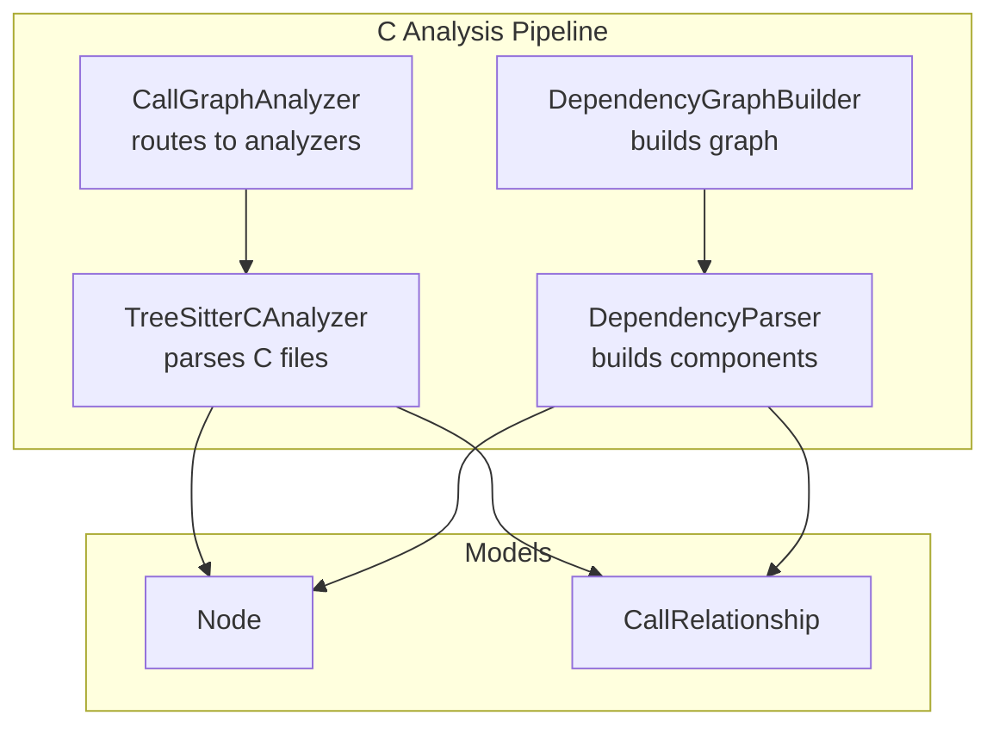
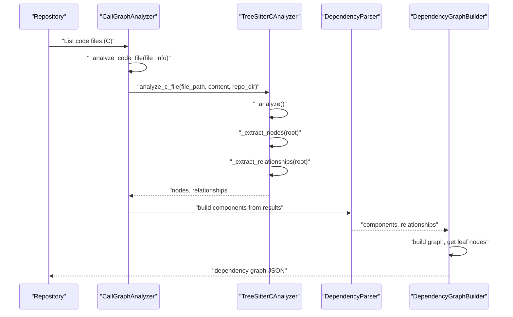
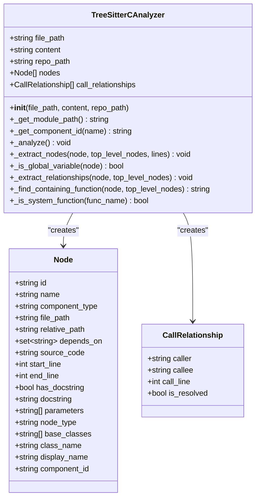
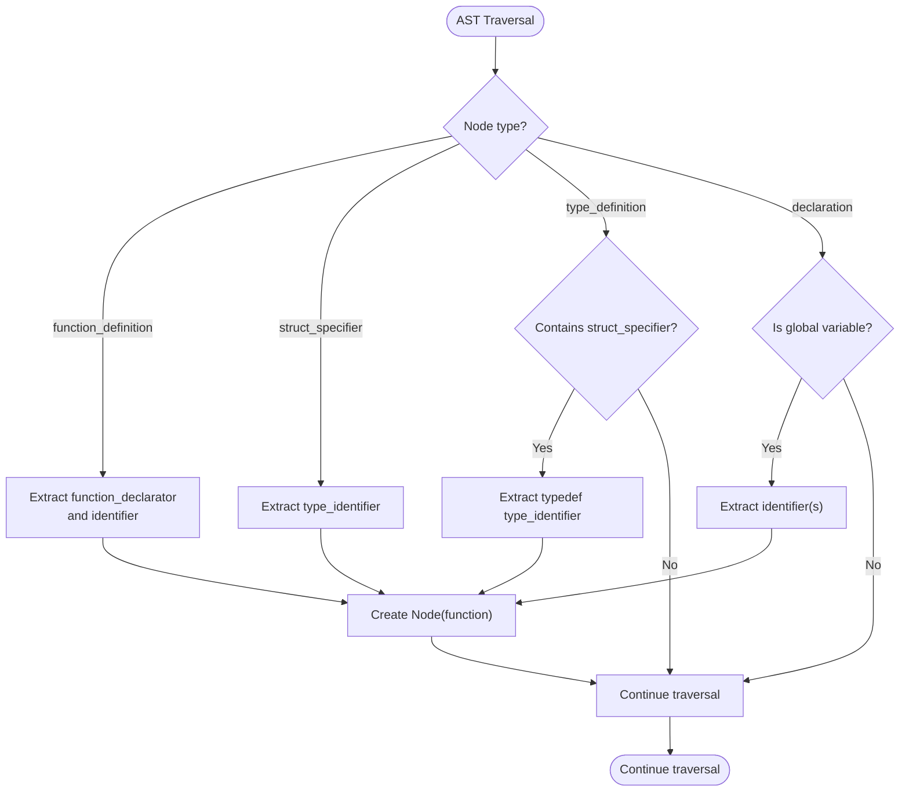
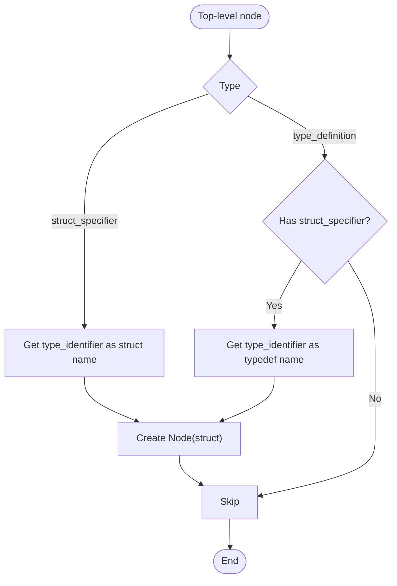
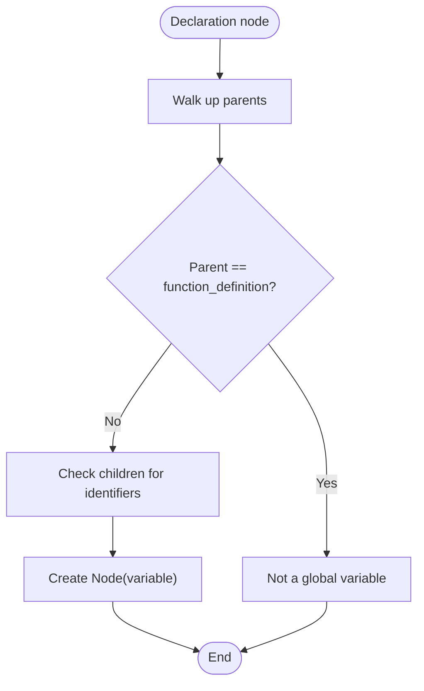
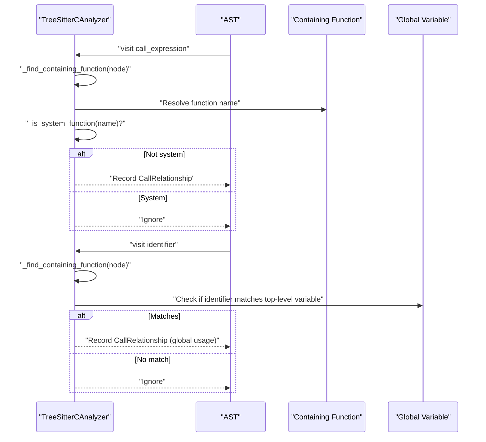
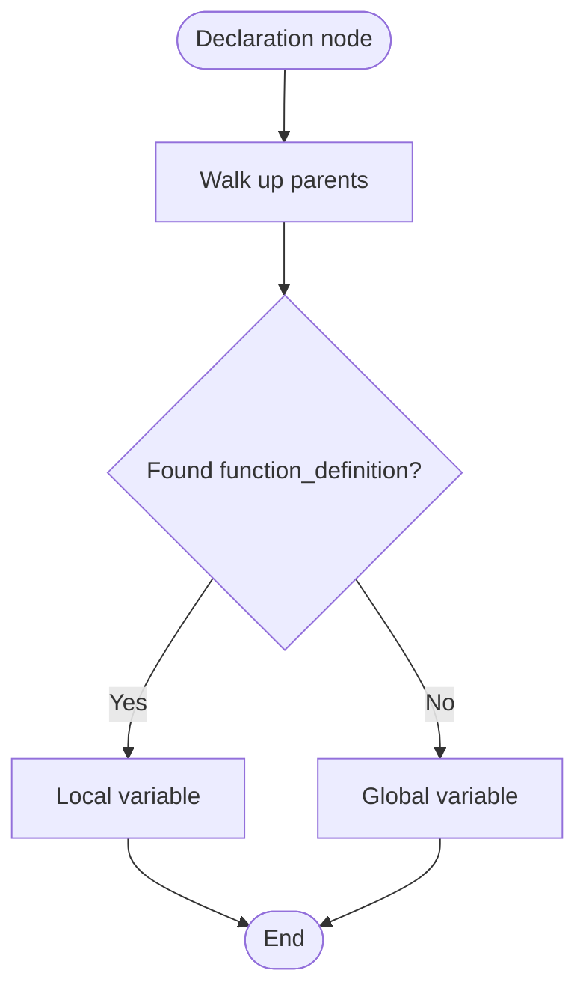
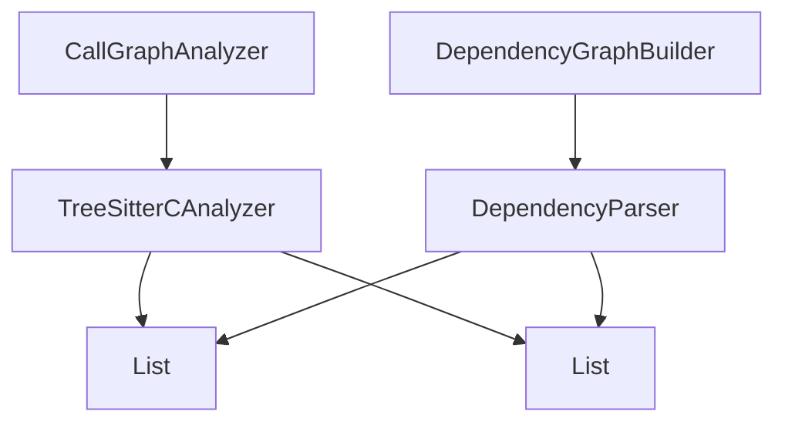

# C Code Analysis

<cite>
**Referenced Files in This Document**
- [c.py](file://codewiki/src/be/dependency_analyzer/analyzers/c.py)
- [ast_parser.py](file://codewiki/src/be/dependency_analyzer/ast_parser.py)
- [core.py](file://codewiki/src/be/dependency_analyzer/models/core.py)
- [dependency_graphs_builder.py](file://codewiki/src/be/dependency_analyzer/dependency_graphs_builder.py)
- [call_graph_analyzer.py](file://codewiki/src/be/dependency_analyzer/analysis/call_graph_analyzer.py)
- [patterns.py](file://codewiki/src/be/dependency_analyzer/utils/patterns.py)
</cite>

## Table of Contents
1. [Introduction](#introduction)
2. [Project Structure](#project-structure)
3. [Core Components](#core-components)
4. [Architecture Overview](#architecture-overview)
5. [Detailed Component Analysis](#detailed-component-analysis)
6. [Dependency Analysis](#dependency-analysis)
7. [Performance Considerations](#performance-considerations)
8. [Troubleshooting Guide](#troubleshooting-guide)
9. [Conclusion](#conclusion)

## Introduction
This document explains how CodeWiki analyzes C code using Tree-sitter with the tree_sitter_c binding. It focuses on the TreeSitterCAnalyzer class, how it parses C files to extract functions, structs, and global variables, and how it builds relationships for the dependency graph. It also covers how function calls and global variable usage are identified, how local versus global variables are distinguished, and the current limitations around macros and function pointers.

## Project Structure
The C analysis capability is implemented within the dependency analyzer subsystem. The key files are:
- Tree-sitter-based C analyzer: [c.py](file://codewiki/src/be/dependency_analyzer/analyzers/c.py)
- Call graph orchestration: [call_graph_analyzer.py](file://codewiki/src/be/dependency_analyzer/analysis/call_graph_analyzer.py)
- Dependency graph builder: [dependency_graphs_builder.py](file://codewiki/src/be/dependency_analyzer/dependency_graphs_builder.py)
- AST parsing and graph construction: [ast_parser.py](file://codewiki/src/be/dependency_analyzer/ast_parser.py)
- Shared data models: [core.py](file://codewiki/src/be/dependency_analyzer/models/core.py)
- Supported language patterns and extensions: [patterns.py](file://codewiki/src/be/dependency_analyzer/utils/patterns.py)

**Diagram sources**
- [call_graph_analyzer.py](file://codewiki/src/be/dependency_analyzer/analysis/call_graph_analyzer.py#L223-L241)
- [c.py](file://codewiki/src/be/dependency_analyzer/analyzers/c.py#L13-L223)
- [ast_parser.py](file://codewiki/src/be/dependency_analyzer/ast_parser.py#L47-L109)
- [dependency_graphs_builder.py](file://codewiki/src/be/dependency_analyzer/dependency_graphs_builder.py#L18-L66)
- [core.py](file://codewiki/src/be/dependency_analyzer/models/core.py#L7-L54)

**Section sources**
- [c.py](file://codewiki/src/be/dependency_analyzer/analyzers/c.py#L1-L223)
- [call_graph_analyzer.py](file://codewiki/src/be/dependency_analyzer/analysis/call_graph_analyzer.py#L223-L241)
- [ast_parser.py](file://codewiki/src/be/dependency_analyzer/ast_parser.py#L1-L146)
- [dependency_graphs_builder.py](file://codewiki/src/be/dependency_analyzer/dependency_graphs_builder.py#L1-L94)
- [core.py](file://codewiki/src/be/dependency_analyzer/models/core.py#L1-L64)
- [patterns.py](file://codewiki/src/be/dependency_analyzer/utils/patterns.py#L178-L202)

## Core Components
- TreeSitterCAnalyzer: Parses C files using Tree-sitter, extracts top-level nodes (functions, structs, global variables), and identifies relationships (function calls and global variable usage).
- CallGraphAnalyzer: Orchestrates multi-language analysis and routes C files to the C analyzer.
- DependencyParser: Converts analysis results into Node and CallRelationship objects and constructs the dependency graph.
- DependencyGraphBuilder: Coordinates building and saving the dependency graph and determines leaf nodes.
- Node and CallRelationship: Shared models representing components and relationships.

Key responsibilities:
- TreeSitterCAnalyzer: Uses tree_sitter_c to parse C, traverses the AST to find top-level constructs, and records relationships.
- CallGraphAnalyzer: Detects language, opens files, and delegates to language-specific analyzers.
- DependencyParser: Normalizes results into Node objects and resolves relationships.
- DependencyGraphBuilder: Saves JSON and computes leaf nodes for documentation generation.

**Section sources**
- [c.py](file://codewiki/src/be/dependency_analyzer/analyzers/c.py#L13-L223)
- [call_graph_analyzer.py](file://codewiki/src/be/dependency_analyzer/analysis/call_graph_analyzer.py#L223-L241)
- [ast_parser.py](file://codewiki/src/be/dependency_analyzer/ast_parser.py#L47-L109)
- [dependency_graphs_builder.py](file://codewiki/src/be/dependency_analyzer/dependency_graphs_builder.py#L18-L66)
- [core.py](file://codewiki/src/be/dependency_analyzer/models/core.py#L7-L54)

## Architecture Overview
The C analysis pipeline integrates Tree-sitter with the broader dependency analysis framework:

**Diagram sources**
- [call_graph_analyzer.py](file://codewiki/src/be/dependency_analyzer/analysis/call_graph_analyzer.py#L223-L241)
- [c.py](file://codewiki/src/be/dependency_analyzer/analyzers/c.py#L50-L64)
- [ast_parser.py](file://codewiki/src/be/dependency_analyzer/ast_parser.py#L47-L109)
- [dependency_graphs_builder.py](file://codewiki/src/be/dependency_analyzer/dependency_graphs_builder.py#L18-L66)

## Detailed Component Analysis

### TreeSitterCAnalyzer Implementation
TreeSitterCAnalyzer performs:
- Initialization and module path computation for component IDs
- Tree-sitter parsing with tree_sitter_c
- Top-level node extraction for functions, structs, and global variables
- Relationship extraction for function calls and global variable usage
- Containment and scoping checks to distinguish local vs global variables

Key methods and behaviors:
- _get_module_path: Computes module path from file path and repo path for unique component IDs
- _get_component_id: Builds a unique ID combining module path and entity name
- _analyze: Initializes Tree-sitter, parses content, and triggers node extraction and relationship extraction
- _extract_nodes: Recursively traverses the AST to identify top-level constructs:
  - Functions: function_definition with function_declarator and identifier
  - Structs: struct_specifier with type_identifier; typedef struct: type_definition containing struct_specifier and type_identifier
  - Global variables: declaration nodes that are not inside function definitions
- _is_global_variable: Walks up the AST to ensure the declaration is not inside a function_definition
- _extract_relationships: Identifies:
  - Function calls: call_expression with identifier; filters out common system functions
  - Global variable usage: identifiers that refer to top-level variables
- _find_containing_function: Walks up parents to find the enclosing function definition and return its name
- _is_system_function: Heuristically identifies common C library functions to avoid treating them as external dependencies

**Diagram sources**
- [c.py](file://codewiki/src/be/dependency_analyzer/analyzers/c.py#L13-L223)
- [core.py](file://codewiki/src/be/dependency_analyzer/models/core.py#L7-L54)

**Section sources**
- [c.py](file://codewiki/src/be/dependency_analyzer/analyzers/c.py#L13-L223)
- [core.py](file://codewiki/src/be/dependency_analyzer/models/core.py#L7-L54)

### Function Definition Extraction
- Function definitions are recognized by the AST node type function_definition.
- The function name is extracted from function_declarator and identifier.
- The analyzer records the function with its source code snippet, line numbers, and module path.

**Diagram sources**
- [c.py](file://codewiki/src/be/dependency_analyzer/analyzers/c.py#L66-L143)

**Section sources**
- [c.py](file://codewiki/src/be/dependency_analyzer/analyzers/c.py#L66-L143)

### Struct and Typedef Struct Extraction
- Structs are detected via struct_specifier with a type_identifier for the struct name.
- Typedef structs are detected via type_definition containing a struct_specifier; the typedef name is taken from the trailing type_identifier.

**Diagram sources**
- [c.py](file://codewiki/src/be/dependency_analyzer/analyzers/c.py#L79-L96)

**Section sources**
- [c.py](file://codewiki/src/be/dependency_analyzer/analyzers/c.py#L79-L96)

### Global Variable Declaration Extraction
- Declarations are considered global if they are not enclosed in a function_definition.
- The analyzer supports init_declarator and pointer_declarator to capture identifiers.

**Diagram sources**
- [c.py](file://codewiki/src/be/dependency_analyzer/analyzers/c.py#L97-L114)
- [c.py](file://codewiki/src/be/dependency_analyzer/analyzers/c.py#L145-L151)

**Section sources**
- [c.py](file://codewiki/src/be/dependency_analyzer/analyzers/c.py#L97-L114)
- [c.py](file://codewiki/src/be/dependency_analyzer/analyzers/c.py#L145-L151)

### Relationship Extraction: Function Calls and Global Variables
- Function calls: Identified by call_expression with an identifier; the containing function is determined by walking up the AST; system functions are filtered out.
- Global variable usage: Identified by identifiers that match top-level variables; recorded as relationships with is_resolved set appropriately.

**Diagram sources**
- [c.py](file://codewiki/src/be/dependency_analyzer/analyzers/c.py#L153-L192)
- [c.py](file://codewiki/src/be/dependency_analyzer/analyzers/c.py#L194-L208)
- [c.py](file://codewiki/src/be/dependency_analyzer/analyzers/c.py#L210-L218)

**Section sources**
- [c.py](file://codewiki/src/be/dependency_analyzer/analyzers/c.py#L153-L192)
- [c.py](file://codewiki/src/be/dependency_analyzer/analyzers/c.py#L194-L208)
- [c.py](file://codewiki/src/be/dependency_analyzer/analyzers/c.py#L210-L218)

### Local vs Global Variable Distinction
- The analyzer uses a containment check to determine if a declaration occurs inside a function_definition.
- If any ancestor of a declaration is a function_definition, it is not considered a global variable.

**Diagram sources**
- [c.py](file://codewiki/src/be/dependency_analyzer/analyzers/c.py#L145-L151)

**Section sources**
- [c.py](file://codewiki/src/be/dependency_analyzer/analyzers/c.py#L145-L151)

### Procedural Programming Features in Dependency Graph
- Functions: Identified as top-level functions and included as nodes.
- Structs: Identified as top-level structs and typedef structs and included as nodes.
- Global variables: Identified as top-level declarations and included as nodes.
- Relationships:
  - Function-to-function calls: captured as CallRelationship with is_resolved left unresolved for later resolution.
  - Function-to-global usage: captured as CallRelationship with is_resolved set to true for local file relationships.

These relationships form the basis of the dependency graph used for documentation generation and visualization.

**Section sources**
- [c.py](file://codewiki/src/be/dependency_analyzer/analyzers/c.py#L66-L143)
- [c.py](file://codewiki/src/be/dependency_analyzer/analyzers/c.py#L153-L192)

### Limitations and Known Constraints
- Macros: The analyzer does not parse macro expansions; macro-defined functions or variables are not extracted as nodes or relationships.
- Function pointers: The analyzer recognizes direct function calls but does not resolve function pointers or function-pointer arrays; calls through function pointers are not captured as relationships.
- System function filtering: System functions are filtered out heuristically; this may miss dynamically resolved calls or platform-specific functions.
- Scope and linkage: The analyzer assumes top-level declarations; internal linkage and advanced linkage rules are not modeled.

**Section sources**
- [c.py](file://codewiki/src/be/dependency_analyzer/analyzers/c.py#L210-L218)

## Dependency Analysis
The C analyzer integrates with the broader dependency analysis pipeline:

- Language routing: CallGraphAnalyzer detects C files and routes them to the C analyzer.
- Result normalization: DependencyParser converts analyzer outputs into Node and CallRelationship objects and resolves cross-file relationships.
- Graph building: DependencyGraphBuilder saves the dependency graph and selects leaf nodes for documentation generation.

**Diagram sources**
- [call_graph_analyzer.py](file://codewiki/src/be/dependency_analyzer/analysis/call_graph_analyzer.py#L223-L241)
- [ast_parser.py](file://codewiki/src/be/dependency_analyzer/ast_parser.py#L47-L109)
- [dependency_graphs_builder.py](file://codewiki/src/be/dependency_analyzer/dependency_graphs_builder.py#L18-L66)

**Section sources**
- [call_graph_analyzer.py](file://codewiki/src/be/dependency_analyzer/analysis/call_graph_analyzer.py#L223-L241)
- [ast_parser.py](file://codewiki/src/be/dependency_analyzer/ast_parser.py#L47-L109)
- [dependency_graphs_builder.py](file://codewiki/src/be/dependency_analyzer/dependency_graphs_builder.py#L18-L66)

## Performance Considerations
- Tree-sitter parsing: Parsing is efficient for large files; however, repeated traversal and relationship extraction can be O(n) in the number of nodes visited.
- Relationship deduplication: CallGraphAnalyzer deduplicates relationships to reduce noise.
- Language filtering: Only supported languages are analyzed, reducing overhead.

[No sources needed since this section provides general guidance]

## Troubleshooting Guide
Common issues and resolutions:
- Unsupported language: Ensure the file extension is in the supported set for C (e.g., .c, .h).
- Missing relationships: Verify that function calls occur in call_expression nodes and that identifiers are not inside function definitions.
- System function false positives: The analyzer filters known system functions; adjust the filter if needed.
- Incorrect module path: Ensure repo_path is correctly passed so module paths are computed consistently.

**Section sources**
- [patterns.py](file://codewiki/src/be/dependency_analyzer/utils/patterns.py#L178-L202)
- [c.py](file://codewiki/src/be/dependency_analyzer/analyzers/c.py#L210-L218)

## Conclusion
CodeWiki’s C code analysis leverages Tree-sitter with the tree_sitter_c binding to robustly extract functions, structs, and global variables from C files. The TreeSitterCAnalyzer class implements precise AST traversal and relationship extraction, distinguishing local and global variables and capturing function calls and global usage. While the current implementation focuses on direct function calls and basic global usage, it provides a solid foundation for extending support to macros and function pointers in future iterations.