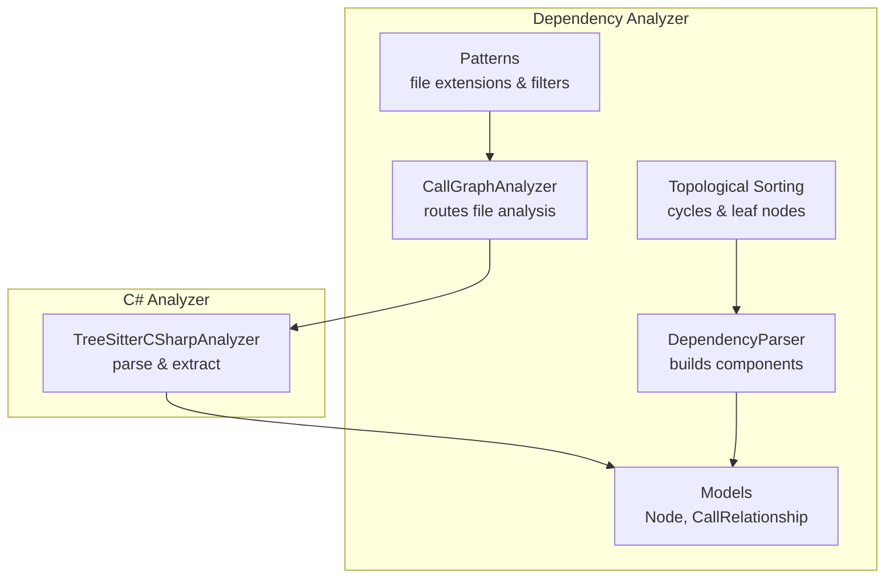
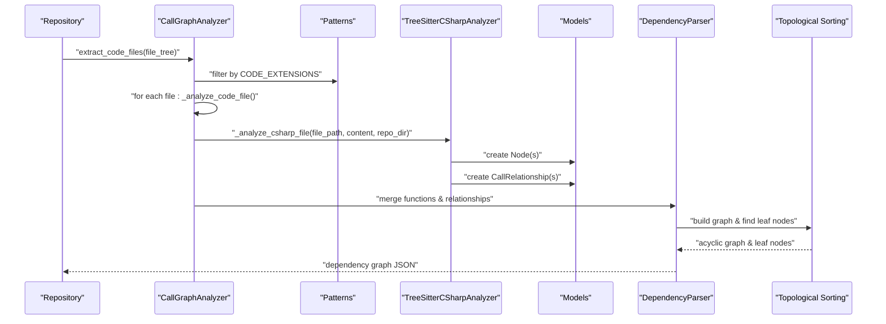
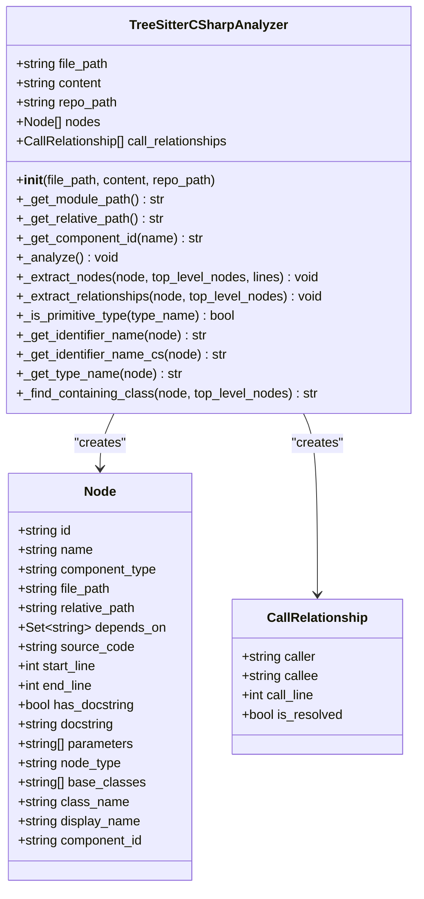
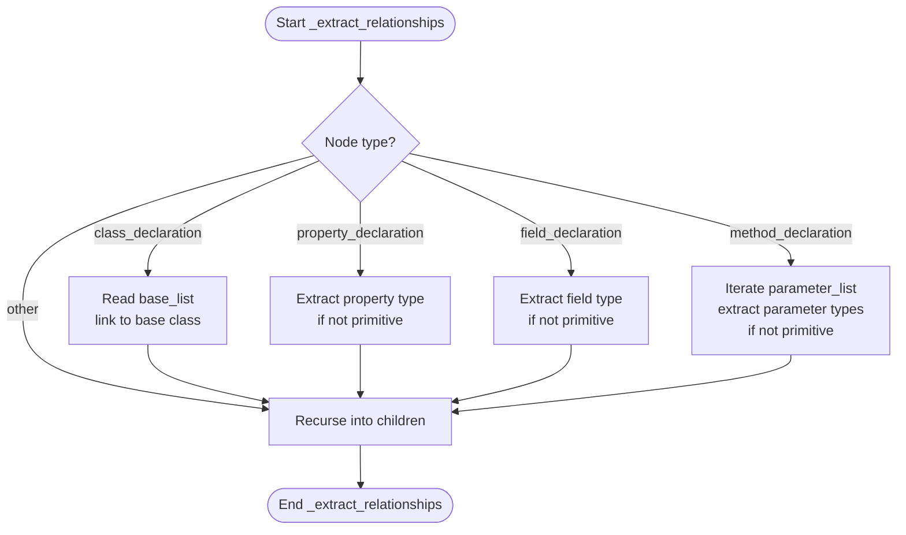
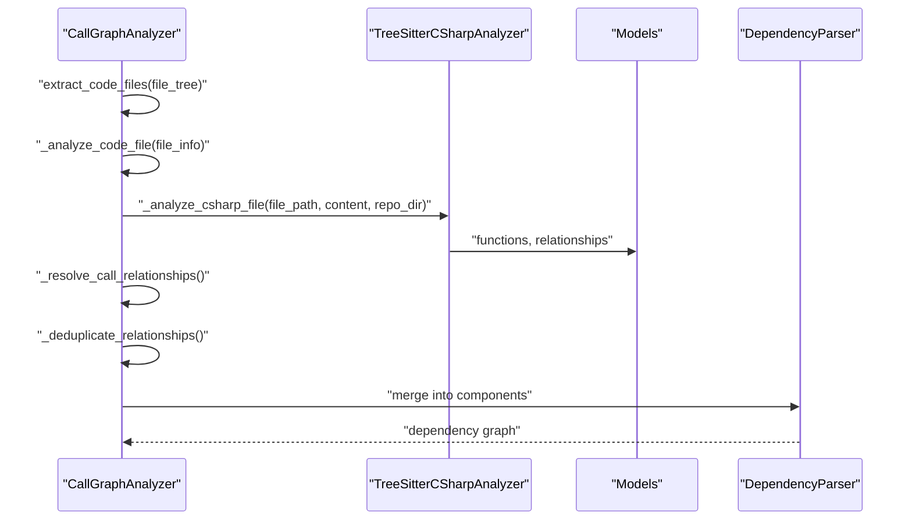
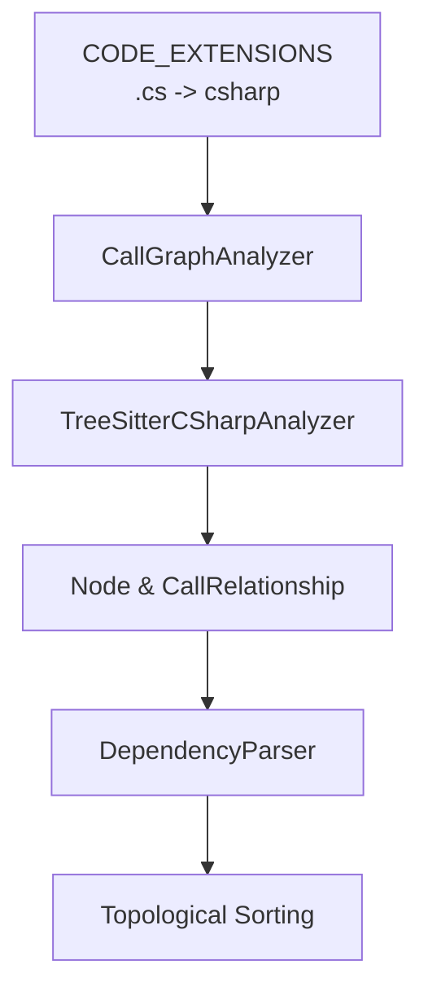

# C# Code Analysis

<cite>
**Referenced Files in This Document**
- [csharp.py](file://codewiki/src/be/dependency_analyzer/analyzers/csharp.py)
- [call_graph_analyzer.py](file://codewiki/src/be/dependency_analyzer/analysis/call_graph_analyzer.py)
- [patterns.py](file://codewiki/src/be/dependency_analyzer/utils/patterns.py)
- [core.py](file://codewiki/src/be/dependency_analyzer/models/core.py)
- [ast_parser.py](file://codewiki/src/be/dependency_analyzer/ast_parser.py)
- [topo_sort.py](file://codewiki/src/be/dependency_analyzer/topo_sort.py)
- [README.md](file://README.md)
</cite>

## Table of Contents
1. [Introduction](#introduction)
2. [Project Structure](#project-structure)
3. [Core Components](#core-components)
4. [Architecture Overview](#architecture-overview)
5. [Detailed Component Analysis](#detailed-component-analysis)
6. [Dependency Analysis](#dependency-analysis)
7. [Performance Considerations](#performance-considerations)
8. [Troubleshooting Guide](#troubleshooting-guide)
9. [Conclusion](#conclusion)

## Introduction
This document explains the C# code analysis capabilities of CodeWiki, focusing on how the system parses C# files using Tree-sitter with the tree_sitter_c_sharp binding. It details the TreeSitterCSharpAnalyzer implementation, including how it identifies different declaration types (classes, interfaces, structs, enums, records, delegates), handles C#-specific modifiers (abstract, static), extracts relationships (inheritance, property types, field types, method parameter types), and manages C#'s rich type system including generics and common built-in types. It also covers limitations such as complex LINQ expressions and dynamic typing, and demonstrates how the analyzer integrates into the broader dependency graph pipeline.

## Project Structure
CodeWiki’s backend is organized around a dependency analyzer that supports multiple languages, including C#. The C# analyzer lives alongside analyzers for other languages and is invoked during repository-wide call graph construction.

**Diagram sources**
- [call_graph_analyzer.py](file://codewiki/src/be/dependency_analyzer/analysis/call_graph_analyzer.py#L104-L304)
- [patterns.py](file://codewiki/src/be/dependency_analyzer/utils/patterns.py#L178-L202)
- [core.py](file://codewiki/src/be/dependency_analyzer/models/core.py#L7-L64)
- [ast_parser.py](file://codewiki/src/be/dependency_analyzer/ast_parser.py#L18-L146)
- [topo_sort.py](file://codewiki/src/be/dependency_analyzer/topo_sort.py#L239-L350)

**Section sources**
- [README.md](file://README.md#L89-L92)
- [patterns.py](file://codewiki/src/be/dependency_analyzer/utils/patterns.py#L178-L202)

## Core Components
- TreeSitterCSharpAnalyzer: Parses C# files with Tree-sitter, identifies declarations, resolves modifiers, and extracts relationships.
- CallGraphAnalyzer: Orchestrates analysis across languages and invokes the C# analyzer for .cs files.
- Patterns: Defines language mapping and file extension filtering for C#.
- Models: Core data structures (Node, CallRelationship) used to represent components and relationships.
- DependencyParser: Converts analysis results into component graphs and resolves relationships.
- Topological Sorting: Builds dependency graphs and identifies leaf nodes for visualization.

**Section sources**
- [csharp.py](file://codewiki/src/be/dependency_analyzer/analyzers/csharp.py#L13-L298)
- [call_graph_analyzer.py](file://codewiki/src/be/dependency_analyzer/analysis/call_graph_analyzer.py#L104-L304)
- [patterns.py](file://codewiki/src/be/dependency_analyzer/utils/patterns.py#L178-L202)
- [core.py](file://codewiki/src/be/dependency_analyzer/models/core.py#L7-L64)
- [ast_parser.py](file://codewiki/src/be/dependency_analyzer/ast_parser.py#L18-L146)
- [topo_sort.py](file://codewiki/src/be/dependency_analyzer/topo_sort.py#L239-L350)

## Architecture Overview
The C# analyzer participates in a multi-language call graph pipeline. Files are discovered by patterns, filtered by supported languages, and analyzed by language-specific analyzers. The C# analyzer produces nodes and relationships that are merged into a unified dependency graph.

**Diagram sources**
- [call_graph_analyzer.py](file://codewiki/src/be/dependency_analyzer/analysis/call_graph_analyzer.py#L69-L145)
- [patterns.py](file://codewiki/src/be/dependency_analyzer/utils/patterns.py#L178-L202)
- [csharp.py](file://codewiki/src/be/dependency_analyzer/analyzers/csharp.py#L13-L298)
- [core.py](file://codewiki/src/be/dependency_analyzer/models/core.py#L7-L64)
- [ast_parser.py](file://codewiki/src/be/dependency_analyzer/ast_parser.py#L47-L146)
- [topo_sort.py](file://codewiki/src/be/dependency_analyzer/topo_sort.py#L239-L350)

## Detailed Component Analysis

### TreeSitterCSharpAnalyzer
The TreeSitterCSharpAnalyzer performs two passes:
- Extract nodes: Identifies class_declaration, interface_declaration, struct_declaration, enum_declaration, record_declaration, and delegate_declaration. It resolves modifiers (abstract, static) and constructs Node objects with component_type, display_name, and identifiers.
- Extract relationships: Traverses the AST to find inheritance (base_list), property types, field types, and method parameter types. It creates CallRelationship entries linking containing classes to their type dependencies, marking whether the dependency is resolved.

Key behaviors:
- Declaration identification: Uses node types and child traversal to locate identifiers after keywords (e.g., after “class”, “interface”, “struct”, “enum”, “record”, “delegate”).
- Modifier handling: Detects abstract and static modifiers to classify classes appropriately.
- Relationship extraction:
  - Inheritance: Reads base_list identifiers and links to top-level nodes.
  - Property/Field/Parameter types: Extracts type identifiers and filters out primitive/common built-in types.
- Type system support:
  - Primitive and built-in type detection: _is_primitive_type includes common C# types and generic containers.
  - Generic types: _get_type_name recognizes generic_name and predefined_type nodes.

**Diagram sources**
- [csharp.py](file://codewiki/src/be/dependency_analyzer/analyzers/csharp.py#L13-L298)
- [core.py](file://codewiki/src/be/dependency_analyzer/models/core.py#L7-L64)

**Section sources**
- [csharp.py](file://codewiki/src/be/dependency_analyzer/analyzers/csharp.py#L50-L231)
- [core.py](file://codewiki/src/be/dependency_analyzer/models/core.py#L7-L64)

### Relationship Extraction Flow
The _extract_relationships method traverses the AST and builds relationships for inheritance, property types, field types, and method parameter types. It determines the containing class for each member and filters out primitive/common built-in types.

**Diagram sources**
- [csharp.py](file://codewiki/src/be/dependency_analyzer/analyzers/csharp.py#L160-L231)

**Section sources**
- [csharp.py](file://codewiki/src/be/dependency_analyzer/analyzers/csharp.py#L160-L231)

### Integration with Call Graph Pipeline
The CallGraphAnalyzer routes C# files to the C# analyzer and merges results into a unified call graph. It also resolves relationships and deduplicates edges.

**Diagram sources**
- [call_graph_analyzer.py](file://codewiki/src/be/dependency_analyzer/analysis/call_graph_analyzer.py#L104-L304)
- [csharp.py](file://codewiki/src/be/dependency_analyzer/analyzers/csharp.py#L294-L298)
- [core.py](file://codewiki/src/be/dependency_analyzer/models/core.py#L7-L64)
- [ast_parser.py](file://codewiki/src/be/dependency_analyzer/ast_parser.py#L47-L146)

**Section sources**
- [call_graph_analyzer.py](file://codewiki/src/be/dependency_analyzer/analysis/call_graph_analyzer.py#L104-L304)
- [patterns.py](file://codewiki/src/be/dependency_analyzer/utils/patterns.py#L178-L202)

## Dependency Analysis
- Language support: C# is recognized via CODE_EXTENSIONS mapping .cs to "csharp".
- File discovery: Patterns.py includes "*.cs" in DEFAULT_INCLUDE_PATTERNS and maps ".cs" to "csharp".
- Relationship resolution: DependencyParser maps relationships to Node.depends_on sets and saves the graph as JSON.

**Diagram sources**
- [patterns.py](file://codewiki/src/be/dependency_analyzer/utils/patterns.py#L178-L202)
- [call_graph_analyzer.py](file://codewiki/src/be/dependency_analyzer/analysis/call_graph_analyzer.py#L104-L304)
- [csharp.py](file://codewiki/src/be/dependency_analyzer/analyzers/csharp.py#L13-L298)
- [core.py](file://codewiki/src/be/dependency_analyzer/models/core.py#L7-L64)
- [ast_parser.py](file://codewiki/src/be/dependency_analyzer/ast_parser.py#L47-L146)
- [topo_sort.py](file://codewiki/src/be/dependency_analyzer/topo_sort.py#L239-L350)

**Section sources**
- [patterns.py](file://codewiki/src/be/dependency_analyzer/utils/patterns.py#L178-L202)
- [ast_parser.py](file://codewiki/src/be/dependency_analyzer/ast_parser.py#L47-L146)
- [topo_sort.py](file://codewiki/src/be/dependency_analyzer/topo_sort.py#L239-L350)

## Performance Considerations
- Tree-sitter parsing: Efficient AST traversal avoids full-code scans; however, large repositories may increase memory usage.
- Relationship deduplication: CallGraphAnalyzer removes duplicate relationships to reduce noise.
- Topological sorting: Detects and breaks cycles to produce an acyclic graph suitable for downstream tasks.
- Filtering: Patterns restrict analysis to supported languages and file types, reducing unnecessary work.

[No sources needed since this section provides general guidance]

## Troubleshooting Guide
Common issues and resolutions:
- Tree-sitter parser errors:
  - Ensure tree_sitter_c_sharp is installed and compatible with the Tree-sitter runtime.
  - Verify file encoding is UTF-8.
- Unsupported language or missing extensions:
  - Confirm .cs files are included in DEFAULT_INCLUDE_PATTERNS and mapped in CODE_EXTENSIONS.
- Relationship resolution failures:
  - Non-primitive types are treated as dependencies; ensure type names match existing nodes.
  - Dynamic or complex LINQ expressions may not resolve to concrete types and thus remain unresolved.
- Memory usage with large repositories:
  - Adjust analysis limits and leverage hierarchical decomposition to manage scale.

**Section sources**
- [call_graph_analyzer.py](file://codewiki/src/be/dependency_analyzer/analysis/call_graph_analyzer.py#L142-L145)
- [patterns.py](file://codewiki/src/be/dependency_analyzer/utils/patterns.py#L178-L202)
- [csharp.py](file://codewiki/src/be/dependency_analyzer/analyzers/csharp.py#L232-L242)

## Conclusion
CodeWiki’s C# analyzer leverages Tree-sitter to parse C# files and extract object-oriented constructs along with their relationships. It distinguishes between abstract/static classes, identifies inheritance, and captures property/field/method type dependencies while filtering primitive and common built-in types. Integrated into the broader call graph pipeline, it contributes to a unified dependency graph used for visualization and documentation generation. Limitations include reduced handling of complex LINQ expressions and dynamic typing, which are typical challenges for static analysis of C# code.