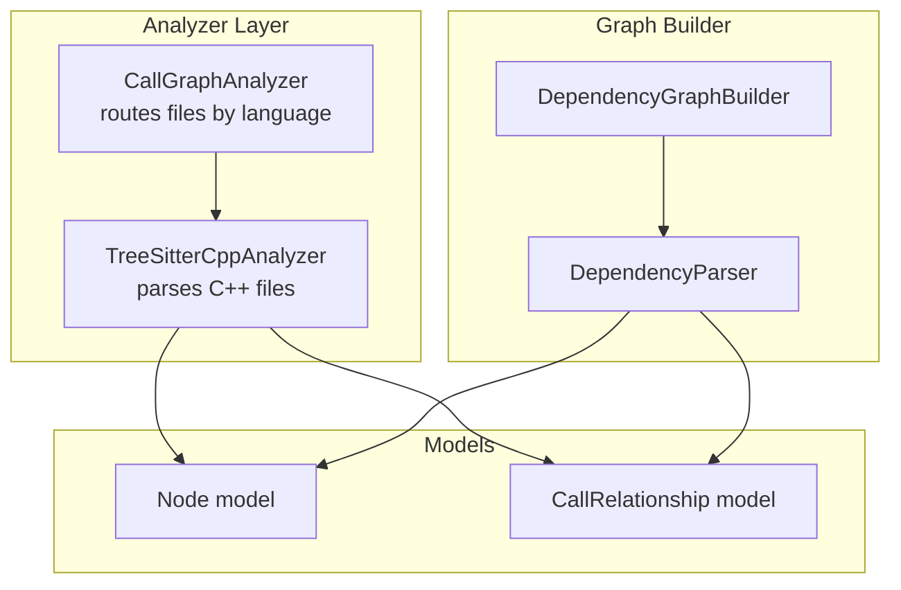
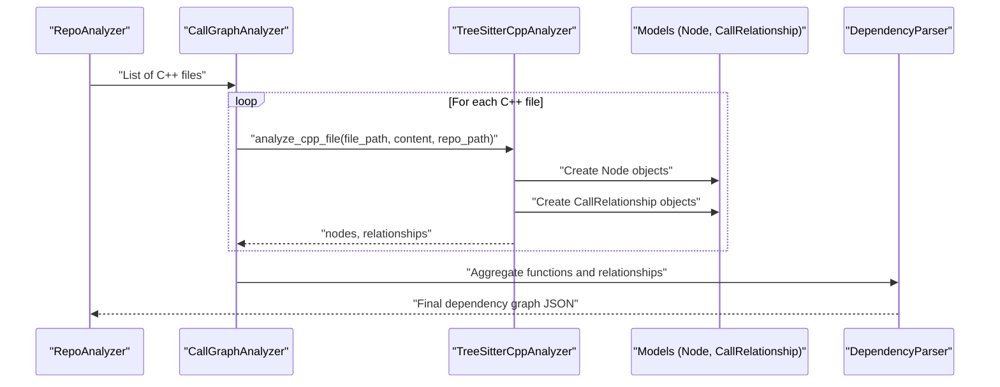
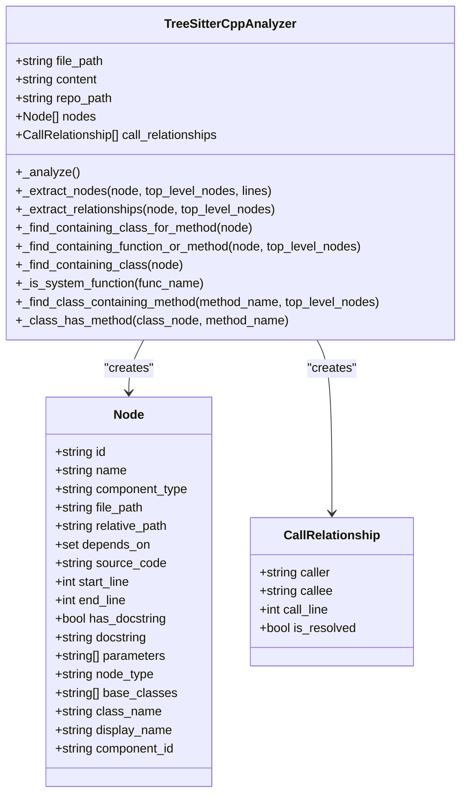
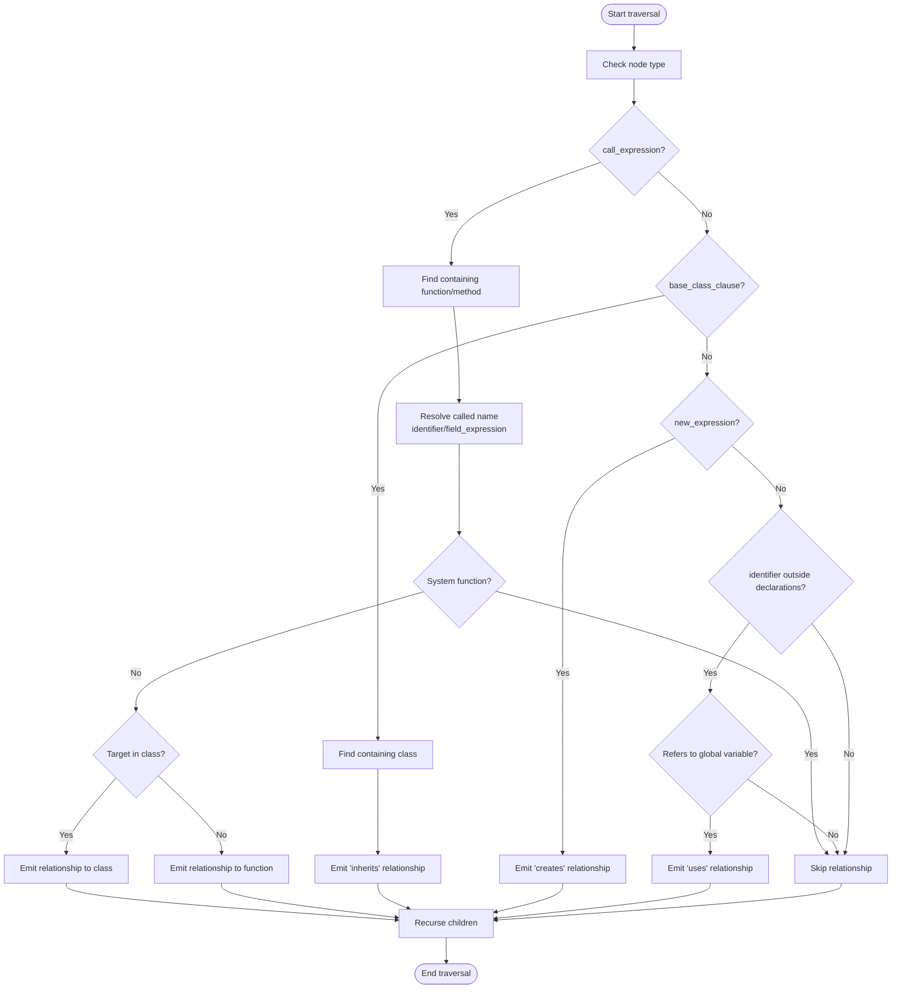
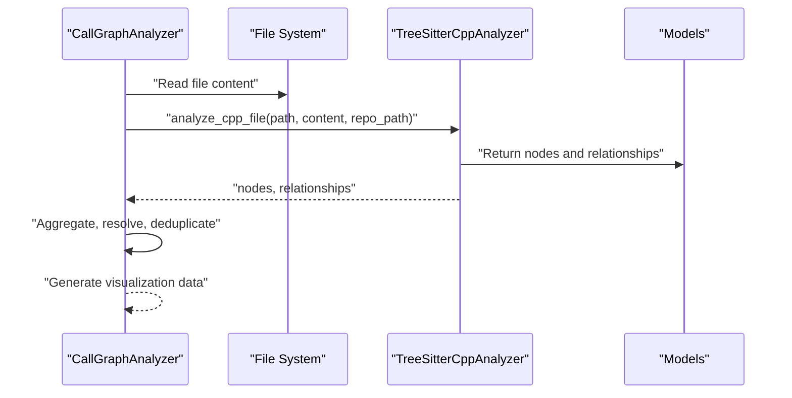
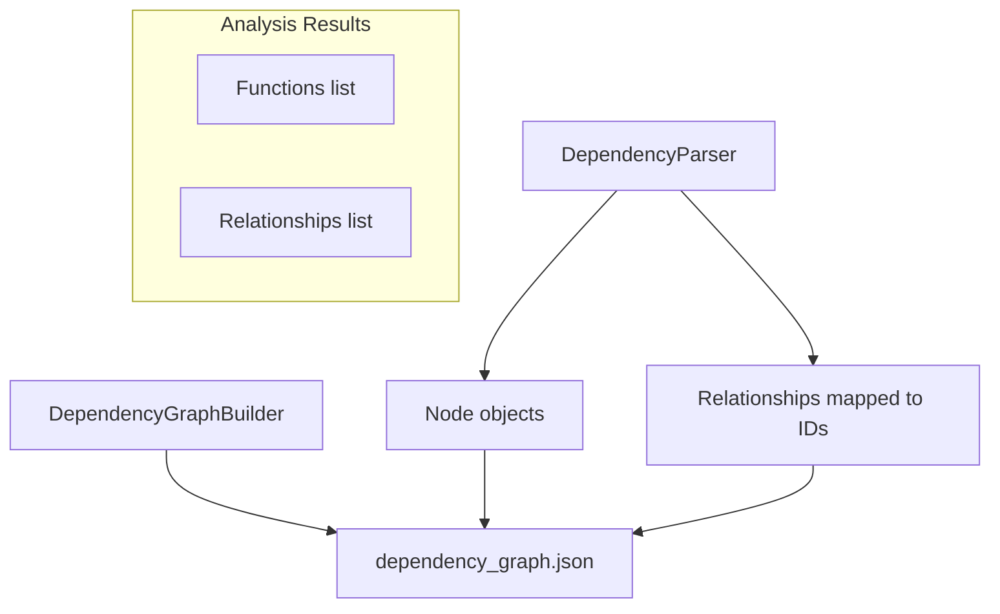
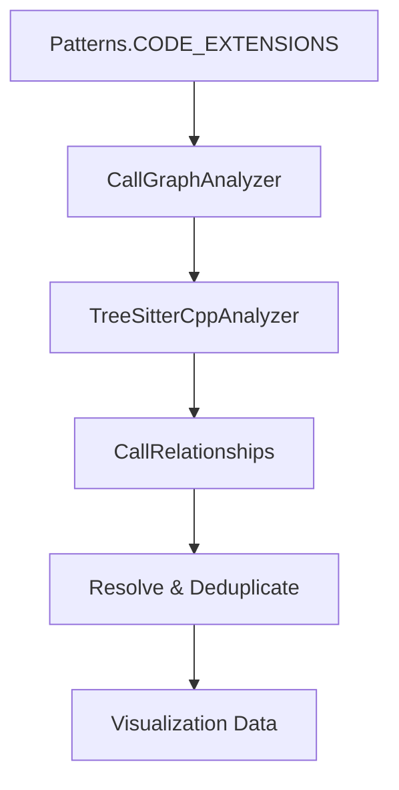

# C++ Code Analysis

<cite>
**Referenced Files in This Document**
- [cpp.py](file://codewiki/src/be/dependency_analyzer/analyzers/cpp.py)
- [call_graph_analyzer.py](file://codewiki/src/be/dependency_analyzer/analysis/call_graph_analyzer.py)
- [patterns.py](file://codewiki/src/be/dependency_analyzer/utils/patterns.py)
- [core.py](file://codewiki/src/be/dependency_analyzer/models/core.py)
- [ast_parser.py](file://codewiki/src/be/dependency_analyzer/ast_parser.py)
- [dependency_graphs_builder.py](file://codewiki/src/be/dependency_analyzer/dependency_graphs_builder.py)
- [analysis_service.py](file://codewiki/src/be/dependency_analyzer/analysis/analysis_service.py)
</cite>

## Table of Contents
1. [Introduction](#introduction)
2. [Project Structure](#project-structure)
3. [Core Components](#core-components)
4. [Architecture Overview](#architecture-overview)
5. [Detailed Component Analysis](#detailed-component-analysis)
6. [Dependency Analysis](#dependency-analysis)
7. [Performance Considerations](#performance-considerations)
8. [Troubleshooting Guide](#troubleshooting-guide)
9. [Conclusion](#conclusion)

## Introduction
This document explains the C++ code analysis capabilities of CodeWiki with a focus on how the system parses C++ files using Tree-sitter with the tree_sitter_cpp binding. It covers how the TreeSitterCppAnalyzer extracts top-level constructs (classes, structs, functions, methods, global variables, and namespaces), and how it identifies relationships among them (function/method calls, inheritance, object creation, and variable usage). It also describes how the analyzer integrates into the broader dependency graph pipeline and highlights known limitations such as handling of templates and operator overloading.

## Project Structure
The C++ analysis is implemented as a Tree-sitter-based analyzer that participates in the multi-language call graph construction. The key files involved are:
- The C++ analyzer implementation
- The call graph orchestrator that routes files by language
- Patterns and extension mappings for C++
- Core data models for nodes and relationships
- The dependency graph builder and parser that assemble the final dependency graph

**Diagram sources**
- [call_graph_analyzer.py](file://codewiki/src/be/dependency_analyzer/analysis/call_graph_analyzer.py#L104-L141)
- [cpp.py](file://codewiki/src/be/dependency_analyzer/analyzers/cpp.py#L52-L67)
- [core.py](file://codewiki/src/be/dependency_analyzer/models/core.py#L7-L64)
- [dependency_graphs_builder.py](file://codewiki/src/be/dependency_analyzer/dependency_graphs_builder.py#L18-L74)
- [ast_parser.py](file://codewiki/src/be/dependency_analyzer/ast_parser.py#L18-L46)

**Section sources**
- [call_graph_analyzer.py](file://codewiki/src/be/dependency_analyzer/analysis/call_graph_analyzer.py#L104-L141)
- [patterns.py](file://codewiki/src/be/dependency_analyzer/utils/patterns.py#L178-L202)
- [core.py](file://codewiki/src/be/dependency_analyzer/models/core.py#L7-L64)
- [dependency_graphs_builder.py](file://codewiki/src/be/dependency_analyzer/dependency_graphs_builder.py#L18-L74)
- [ast_parser.py](file://codewiki/src/be/dependency_analyzer/ast_parser.py#L18-L46)

## Core Components
- TreeSitterCppAnalyzer: Parses C++ source via Tree-sitter, extracts top-level nodes (classes, structs, functions, methods, global variables, namespaces), and builds relationships (calls, inherits, creates, uses).
- CallGraphAnalyzer: Orchestrates multi-language analysis and routes C++ files to the C++ analyzer.
- Patterns and Extensions: Defines supported C++ extensions and maps them to the "cpp" language label.
- Models: Node and CallRelationship define the dependency graph representation.
- DependencyGraphBuilder and DependencyParser: Assemble the final dependency graph from analysis results.

Key responsibilities:
- TreeSitterCppAnalyzer: AST traversal, node extraction, and relationship identification.
- CallGraphAnalyzer: File routing, relationship resolution, deduplication, and visualization data generation.
- DependencyGraphBuilder and DependencyParser: Aggregation of components and relationships into a consumable graph.

**Section sources**
- [cpp.py](file://codewiki/src/be/dependency_analyzer/analyzers/cpp.py#L13-L67)
- [call_graph_analyzer.py](file://codewiki/src/be/dependency_analyzer/analysis/call_graph_analyzer.py#L242-L261)
- [patterns.py](file://codewiki/src/be/dependency_analyzer/utils/patterns.py#L178-L202)
- [core.py](file://codewiki/src/be/dependency_analyzer/models/core.py#L7-L64)
- [ast_parser.py](file://codewiki/src/be/dependency_analyzer/ast_parser.py#L18-L46)
- [dependency_graphs_builder.py](file://codewiki/src/be/dependency_analyzer/dependency_graphs_builder.py#L18-L74)

## Architecture Overview
The C++ analysis pipeline:
1. The repository is scanned and C++ files are identified by extension.
2. CallGraphAnalyzer routes each C++ file to TreeSitterCppAnalyzer.
3. TreeSitterCppAnalyzer builds a list of nodes and relationships.
4. CallGraphAnalyzer aggregates nodes and relationships across files, resolves cross-file calls, and generates visualization data.
5. DependencyGraphBuilder and DependencyParser produce a final dependency graph JSON.

**Diagram sources**
- [call_graph_analyzer.py](file://codewiki/src/be/dependency_analyzer/analysis/call_graph_analyzer.py#L104-L141)
- [call_graph_analyzer.py](file://codewiki/src/be/dependency_analyzer/analysis/call_graph_analyzer.py#L242-L261)
- [cpp.py](file://codewiki/src/be/dependency_analyzer/analyzers/cpp.py#L366-L369)
- [core.py](file://codewiki/src/be/dependency_analyzer/models/core.py#L7-L64)
- [ast_parser.py](file://codewiki/src/be/dependency_analyzer/ast_parser.py#L47-L119)

## Detailed Component Analysis

### TreeSitterCppAnalyzer
The analyzer initializes a Tree-sitter parser bound to tree_sitter_cpp, parses the source file, and traverses the AST to:
- Extract top-level nodes: classes, structs, functions, methods, global variables, and namespaces.
- Build a list of nodes and relationships during a second traversal.

Implementation highlights:
- Module path and component ID generation: Uses repository-relative paths and file extensions to form stable IDs.
- Node extraction:
  - Classes and structs: Identified by class_specifier and struct_specifier; name taken from type_identifier.
  - Functions and methods: Identified by function_definition; methods distinguished by containment in class_specifier/struct_specifier.
  - Global variables: Declared at global scope and recognized by lack of parent class/function.
  - Namespaces: Identified by namespace_definition and name taken from identifier after keyword.
- Relationship extraction:
  - Calls: call_expression nodes mapped to either class-scoped methods or standalone functions; system functions filtered out.
  - Inheritance: base_class_clause nodes map to "inherits" relationships.
  - Object creation: new_expression nodes map to "creates" relationships.
  - Variable usage: identifier nodes outside declaration contexts map to "uses" relationships when referring to a global variable.

Method resolution and namespace scoping:
- Method resolution: The analyzer finds the containing class for a method and records class-scoped component IDs. Calls to methods are matched against classes and methods by name.
- Namespace scoping: Component IDs incorporate module paths derived from file paths, enabling disambiguation across namespaces.

Limitations:
- Templates: Template definitions and instantiations are not specifically parsed; template-heavy code may not yield precise relationships.
- Operator overloading: Overloaded operators are treated as regular identifiers; overload resolution is not performed.

**Diagram sources**
- [cpp.py](file://codewiki/src/be/dependency_analyzer/analyzers/cpp.py#L13-L67)
- [cpp.py](file://codewiki/src/be/dependency_analyzer/analyzers/cpp.py#L68-L170)
- [cpp.py](file://codewiki/src/be/dependency_analyzer/analyzers/cpp.py#L197-L291)
- [core.py](file://codewiki/src/be/dependency_analyzer/models/core.py#L7-L64)

**Section sources**
- [cpp.py](file://codewiki/src/be/dependency_analyzer/analyzers/cpp.py#L13-L67)
- [cpp.py](file://codewiki/src/be/dependency_analyzer/analyzers/cpp.py#L68-L170)
- [cpp.py](file://codewiki/src/be/dependency_analyzer/analyzers/cpp.py#L197-L291)
- [cpp.py](file://codewiki/src/be/dependency_analyzer/analyzers/cpp.py#L293-L365)
- [cpp.py](file://codewiki/src/be/dependency_analyzer/analyzers/cpp.py#L366-L369)

### Relationship Extraction Flow
The analyzer’s relationship extraction follows a recursive traversal of the AST. For each node type, it:
- Identifies the containing function or method.
- Resolves the called entity (function or method) by name.
- Applies filters (e.g., system functions).
- Emits relationships with appropriate types.

**Diagram sources**
- [cpp.py](file://codewiki/src/be/dependency_analyzer/analyzers/cpp.py#L197-L291)

**Section sources**
- [cpp.py](file://codewiki/src/be/dependency_analyzer/analyzers/cpp.py#L197-L291)

### Integration with Call Graph Construction
The CallGraphAnalyzer routes files by language and invokes the C++ analyzer for cpp files. It aggregates nodes and relationships, resolves cross-file calls, and produces visualization-ready data.

**Diagram sources**
- [call_graph_analyzer.py](file://codewiki/src/be/dependency_analyzer/analysis/call_graph_analyzer.py#L104-L141)
- [call_graph_analyzer.py](file://codewiki/src/be/dependency_analyzer/analysis/call_graph_analyzer.py#L242-L261)
- [cpp.py](file://codewiki/src/be/dependency_analyzer/analyzers/cpp.py#L366-L369)

**Section sources**
- [call_graph_analyzer.py](file://codewiki/src/be/dependency_analyzer/analysis/call_graph_analyzer.py#L104-L141)
- [call_graph_analyzer.py](file://codewiki/src/be/dependency_analyzer/analysis/call_graph_analyzer.py#L242-L261)
- [patterns.py](file://codewiki/src/be/dependency_analyzer/utils/patterns.py#L178-L202)

### Dependency Graph Assembly
After analysis, DependencyParser converts raw analysis results into Node objects and populates depends_on sets. DependencyGraphBuilder saves the final dependency graph JSON and computes leaf nodes.

**Diagram sources**
- [ast_parser.py](file://codewiki/src/be/dependency_analyzer/ast_parser.py#L47-L119)
- [dependency_graphs_builder.py](file://codewiki/src/be/dependency_analyzer/dependency_graphs_builder.py#L18-L74)

**Section sources**
- [ast_parser.py](file://codewiki/src/be/dependency_analyzer/ast_parser.py#L47-L119)
- [dependency_graphs_builder.py](file://codewiki/src/be/dependency_analyzer/dependency_graphs_builder.py#L18-L74)

## Dependency Analysis
- Language routing: C++ files are identified by extensions and routed to the C++ analyzer.
- Relationship resolution: CallGraphAnalyzer resolves relationships by matching names and component IDs across files.
- Deduplication: Duplicate caller-callee pairs are removed to reduce noise.
- Visualization: Generates Cytoscape-compatible elements and summary statistics.

**Diagram sources**
- [patterns.py](file://codewiki/src/be/dependency_analyzer/utils/patterns.py#L178-L202)
- [call_graph_analyzer.py](file://codewiki/src/be/dependency_analyzer/analysis/call_graph_analyzer.py#L242-L261)
- [cpp.py](file://codewiki/src/be/dependency_analyzer/analyzers/cpp.py#L197-L291)

**Section sources**
- [patterns.py](file://codewiki/src/be/dependency_analyzer/utils/patterns.py#L178-L202)
- [call_graph_analyzer.py](file://codewiki/src/be/dependency_analyzer/analysis/call_graph_analyzer.py#L327-L381)

## Performance Considerations
- Parsing cost: Tree-sitter parsing scales with file size; large translation units increase traversal time.
- Traversal strategy: Recursive AST traversal is straightforward but can be expensive for deeply nested constructs.
- Relationship resolution: Cross-file resolution involves lookups; keeping a compact lookup map improves performance.
- Deduplication: Removing duplicate relationships reduces downstream processing overhead.

## Troubleshooting Guide
Common issues and mitigations:
- Missing relationships:
  - Verify the node type matches expectations (e.g., call_expression for calls).
  - Ensure the called function exists in top-level nodes or is resolvable by name.
- Incorrect method resolution:
  - Confirm the method is declared within a class_specifier or struct_specifier.
  - Check that qualified identifiers are correctly extracted for field expressions.
- System function filtering:
  - Calls to system functions are intentionally ignored; adjust filtering if needed.
- Namespace collisions:
  - Component IDs include module paths; ensure repo_path is set to compute accurate relative paths.

**Section sources**
- [cpp.py](file://codewiki/src/be/dependency_analyzer/analyzers/cpp.py#L197-L291)
- [cpp.py](file://codewiki/src/be/dependency_analyzer/analyzers/cpp.py#L344-L351)

## Conclusion
CodeWiki’s C++ analysis leverages Tree-sitter with tree_sitter_cpp to extract classes, structs, functions, methods, global variables, and namespaces, and to identify relationships such as calls, inheritance, object creation, and variable usage. The analyzer integrates seamlessly into the multi-language call graph pipeline, producing a structured dependency graph suitable for documentation generation and visualization. Known limitations include reduced precision with templates and operator overloading, which can be addressed by extending AST matching heuristics in future iterations.