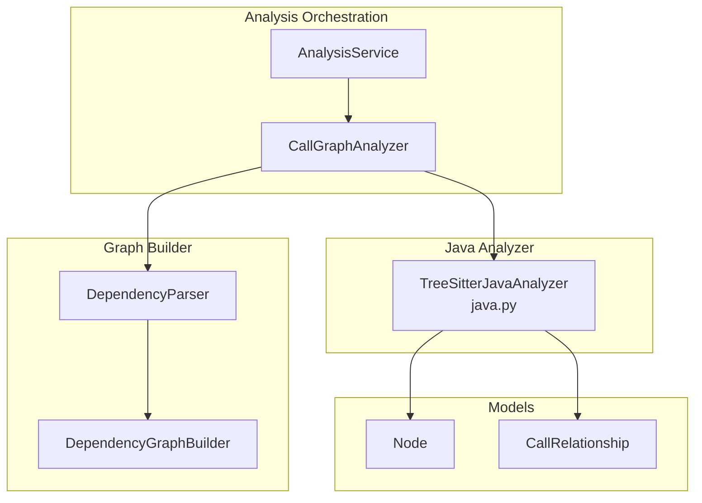
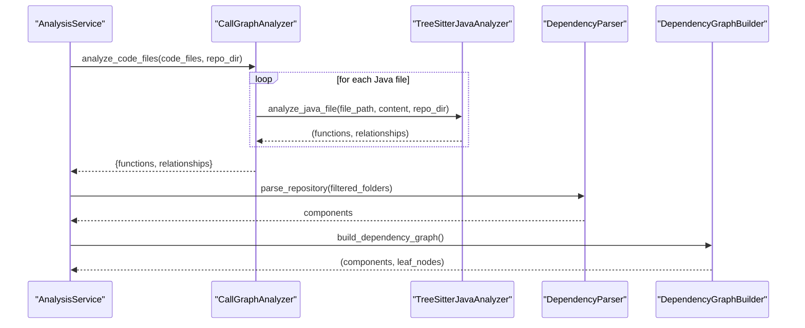
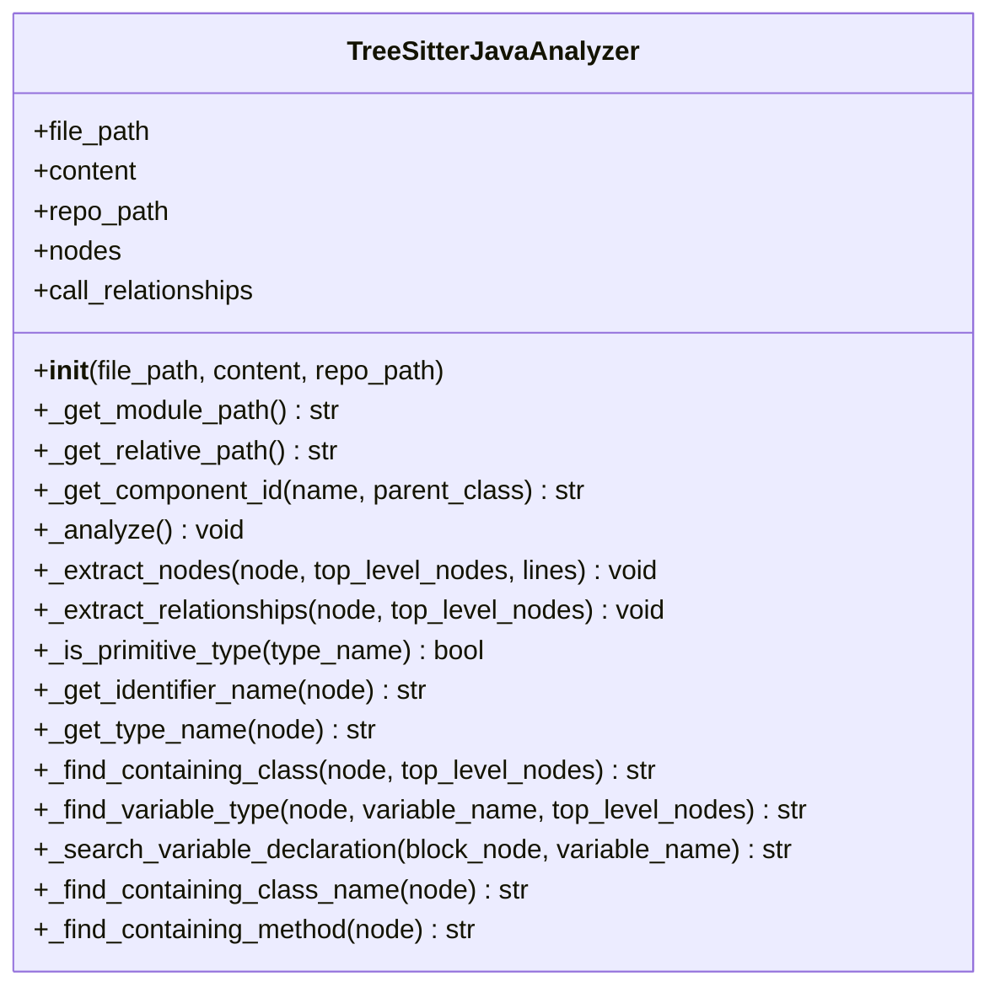
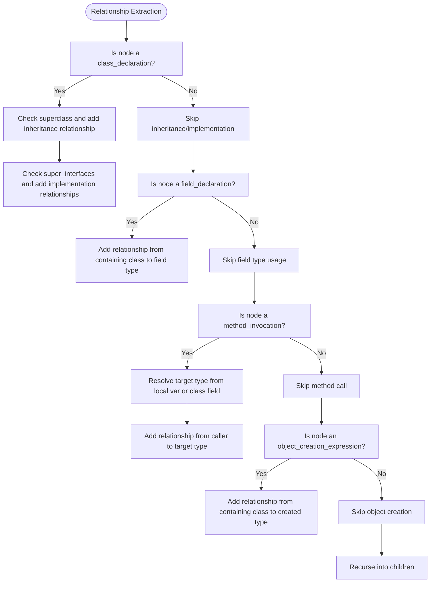
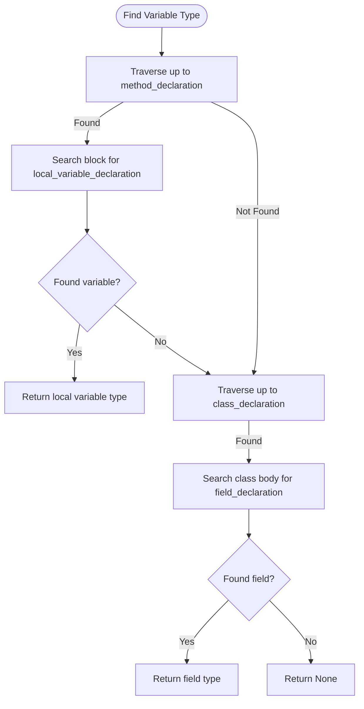
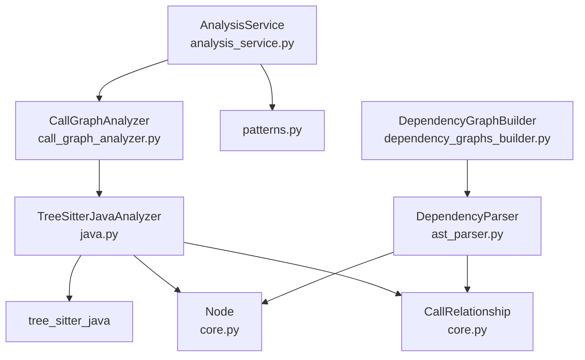

# Java Code Analysis

<cite>
**Referenced Files in This Document**
- [java.py](file://codewiki/src/be/dependency_analyzer/analyzers/java.py)
- [call_graph_analyzer.py](file://codewiki/src/be/dependency_analyzer/analysis/call_graph_analyzer.py)
- [analysis_service.py](file://codewiki/src/be/dependency_analyzer/analysis/analysis_service.py)
- [core.py](file://codewiki/src/be/dependency_analyzer/models/core.py)
- [ast_parser.py](file://codewiki/src/be/dependency_analyzer/ast_parser.py)
- [dependency_graphs_builder.py](file://codewiki/src/be/dependency_analyzer/dependency_graphs_builder.py)
- [patterns.py](file://codewiki/src/be/dependency_analyzer/utils/patterns.py)
</cite>

## Table of Contents
1. [Introduction](#introduction)
2. [Project Structure](#project-structure)
3. [Core Components](#core-components)
4. [Architecture Overview](#architecture-overview)
5. [Detailed Component Analysis](#detailed-component-analysis)
6. [Dependency Analysis](#dependency-analysis)
7. [Performance Considerations](#performance-considerations)
8. [Troubleshooting Guide](#troubleshooting-guide)
9. [Conclusion](#conclusion)
10. [Appendices](#appendices)

## Introduction
This document explains the Java code analysis capabilities of CodeWiki. It focuses on how the system uses Tree-sitter with the tree_sitter_java binding to parse Java files and extract declarations (classes, interfaces, enums, records, annotations), methods, and their relationships. It documents the TreeSitterJavaAnalyzer class, including how it identifies declaration types, extracts names and source code, and how the _extract_relationships method identifies multiple relationship types such as class inheritance, interface implementation, field type usage, method calls, and object creation. It also explains how the analyzer resolves variable types by searching through local declarations and class fields. Finally, it outlines limitations such as handling of complex generics and reflection-based code.

## Project Structure
The Java analysis is part of a multi-language dependency analysis pipeline:
- The CallGraphAnalyzer orchestrates analysis across languages and routes Java files to the Java analyzer.
- The AnalysisService coordinates repository structure analysis and call graph generation.
- The Java analyzer parses Java files using Tree-sitter and emits nodes and relationships.
- The DependencyParser and DependencyGraphBuilder integrate the results into a unified dependency graph.

**Diagram sources**
- [analysis_service.py](file://codewiki/src/be/dependency_analyzer/analysis/analysis_service.py#L273-L315)
- [call_graph_analyzer.py](file://codewiki/src/be/dependency_analyzer/analysis/call_graph_analyzer.py#L104-L141)
- [java.py](file://codewiki/src/be/dependency_analyzer/analyzers/java.py#L54-L67)
- [core.py](file://codewiki/src/be/dependency_analyzer/models/core.py#L7-L41)
- [ast_parser.py](file://codewiki/src/be/dependency_analyzer/ast_parser.py#L18-L46)
- [dependency_graphs_builder.py](file://codewiki/src/be/dependency_analyzer/dependency_graphs_builder.py#L12-L67)

**Section sources**
- [analysis_service.py](file://codewiki/src/be/dependency_analyzer/analysis/analysis_service.py#L273-L315)
- [call_graph_analyzer.py](file://codewiki/src/be/dependency_analyzer/analysis/call_graph_analyzer.py#L104-L141)
- [java.py](file://codewiki/src/be/dependency_analyzer/analyzers/java.py#L54-L67)
- [core.py](file://codewiki/src/be/dependency_analyzer/models/core.py#L7-L41)
- [ast_parser.py](file://codewiki/src/be/dependency_analyzer/ast_parser.py#L18-L46)
- [dependency_graphs_builder.py](file://codewiki/src/be/dependency_analyzer/dependency_graphs_builder.py#L12-L67)

## Core Components
- TreeSitterJavaAnalyzer: Parses Java files with Tree-sitter, extracts nodes for classes, interfaces, enums, records, annotations, and methods, and builds relationships among them.
- CallGraphAnalyzer: Coordinates multi-language analysis and routes Java files to the Java analyzer.
- AnalysisService: Orchestrates repository cloning, structure analysis, and call graph generation.
- DependencyParser and DependencyGraphBuilder: Convert analysis results into a dependency graph and save it.

Key responsibilities:
- TreeSitterJavaAnalyzer: Uses Tree-sitter with tree_sitter_java to parse Java, identify declaration types, compute component IDs, and extract relationships.
- CallGraphAnalyzer: Routes files by language and aggregates results.
- AnalysisService: Filters supported languages and triggers call graph analysis.
- DependencyParser: Converts function lists and relationships into Node objects and populates depends_on sets.
- DependencyGraphBuilder: Saves the dependency graph and computes leaf nodes.

**Section sources**
- [java.py](file://codewiki/src/be/dependency_analyzer/analyzers/java.py#L13-L21)
- [call_graph_analyzer.py](file://codewiki/src/be/dependency_analyzer/analysis/call_graph_analyzer.py#L104-L141)
- [analysis_service.py](file://codewiki/src/be/dependency_analyzer/analysis/analysis_service.py#L296-L323)
- [ast_parser.py](file://codewiki/src/be/dependency_analyzer/ast_parser.py#L47-L119)
- [dependency_graphs_builder.py](file://codewiki/src/be/dependency_analyzer/dependency_graphs_builder.py#L18-L67)

## Architecture Overview
The Java analysis pipeline:
1. AnalysisService filters supported languages and invokes CallGraphAnalyzer.
2. CallGraphAnalyzer opens each Java file and routes it to the Java analyzer.
3. TreeSitterJavaAnalyzer parses the file with Tree-sitter, creates Node objects, and collects CallRelationship entries.
4. CallGraphAnalyzer aggregates all functions and relationships, resolves relationships, and generates visualization data.
5. DependencyParser converts the aggregated results into a dependency graph and saves it.

**Diagram sources**
- [analysis_service.py](file://codewiki/src/be/dependency_analyzer/analysis/analysis_service.py#L273-L315)
- [call_graph_analyzer.py](file://codewiki/src/be/dependency_analyzer/analysis/call_graph_analyzer.py#L104-L141)
- [java.py](file://codewiki/src/be/dependency_analyzer/analyzers/java.py#L354-L356)
- [ast_parser.py](file://codewiki/src/be/dependency_analyzer/ast_parser.py#L28-L46)
- [dependency_graphs_builder.py](file://codewiki/src/be/dependency_analyzer/dependency_graphs_builder.py#L18-L67)

## Detailed Component Analysis

### TreeSitterJavaAnalyzer
The analyzer initializes a Tree-sitter parser bound to the Java language, parses the file, and traverses the AST to:
- Extract top-level declarations (class, interface, enum, record, annotation) and methods.
- Compute component IDs using module path derived from the file path.
- Capture source code snippets for each node.
- Identify relationships among components.

Key methods and behaviors:
- Initialization and parsing: constructs Tree-sitter Language and Parser, parses bytes of content, and stores root node and lines.
- Node extraction: recognizes declaration types by node.type and extracts names and source code snippets.
- Relationship extraction: identifies inheritance, interface implementation, field type usage, method calls, and object creation.
- Variable type resolution: searches local blocks and class fields to resolve variable types.

**Diagram sources**
- [java.py](file://codewiki/src/be/dependency_analyzer/analyzers/java.py#L13-L356)

**Section sources**
- [java.py](file://codewiki/src/be/dependency_analyzer/analyzers/java.py#L54-L67)
- [java.py](file://codewiki/src/be/dependency_analyzer/analyzers/java.py#L68-L127)
- [java.py](file://codewiki/src/be/dependency_analyzer/analyzers/java.py#L132-L239)
- [java.py](file://codewiki/src/be/dependency_analyzer/analyzers/java.py#L240-L353)

#### Declaration Extraction
- Recognizes class_declaration, interface_declaration, enum_declaration, record_declaration, and annotation_type_declaration.
- Determines abstract class vs class based on modifiers.
- Extracts identifier names and computes source code snippets for each declaration.
- Stores nodes with component_type, display_name, and component_id.

**Section sources**
- [java.py](file://codewiki/src/be/dependency_analyzer/analyzers/java.py#L68-L127)

#### Relationship Extraction
- Inheritance: Detects superclass and adds a relationship from subclass to base class.
- Interface implementation: Detects super_interfaces and adds relationships from implementer to interfaces.
- Field type usage: Detects field_declaration and adds relationships from declaring class to field type.
- Method calls: Detects method_invocation and resolves target type via local variable or class field lookup.
- Object creation: Detects object_creation_expression and adds relationships from declaring class to created type.

**Diagram sources**
- [java.py](file://codewiki/src/be/dependency_analyzer/analyzers/java.py#L132-L239)

**Section sources**
- [java.py](file://codewiki/src/be/dependency_analyzer/analyzers/java.py#L132-L239)

#### Variable Type Resolution
- Searches within the enclosing method’s block for local variable declarations.
- If not found, searches within the enclosing class’s body for field declarations.
- Returns the type name for the matched identifier.

**Diagram sources**
- [java.py](file://codewiki/src/be/dependency_analyzer/analyzers/java.py#L277-L331)

**Section sources**
- [java.py](file://codewiki/src/be/dependency_analyzer/analyzers/java.py#L277-L331)

### CallGraphAnalyzer Integration
- Routes Java files to the Java analyzer via analyze_code_files.
- Aggregates functions and relationships across all files.
- Resolves relationships by matching callee names to known function IDs.
- Generates visualization data and deduplicates relationships.

**Section sources**
- [call_graph_analyzer.py](file://codewiki/src/be/dependency_analyzer/analysis/call_graph_analyzer.py#L104-L141)
- [call_graph_analyzer.py](file://codewiki/src/be/dependency_analyzer/analysis/call_graph_analyzer.py#L262-L282)
- [call_graph_analyzer.py](file://codewiki/src/be/dependency_analyzer/analysis/call_graph_analyzer.py#L327-L381)

### AnalysisService and Language Filtering
- Filters supported languages and includes Java in the supported set.
- Invokes CallGraphAnalyzer to analyze Java files.

**Section sources**
- [analysis_service.py](file://codewiki/src/be/dependency_analyzer/analysis/analysis_service.py#L296-L323)
- [analysis_service.py](file://codewiki/src/be/dependency_analyzer/analysis/analysis_service.py#L273-L294)

### Dependency Graph Construction
- DependencyParser converts function lists and relationships into Node objects and populates depends_on sets.
- DependencyGraphBuilder saves the dependency graph and computes leaf nodes.

**Section sources**
- [ast_parser.py](file://codewiki/src/be/dependency_analyzer/ast_parser.py#L47-L119)
- [dependency_graphs_builder.py](file://codewiki/src/be/dependency_analyzer/dependency_graphs_builder.py#L18-L67)

## Dependency Analysis
- TreeSitterJavaAnalyzer depends on:
  - tree_sitter_java for parsing.
  - Node and CallRelationship models for outputs.
- CallGraphAnalyzer depends on:
  - Language-specific analyzers (including Java).
  - Security utilities for safe file reading.
- AnalysisService depends on:
  - CallGraphAnalyzer and RepoAnalyzer.
  - Patterns for language filtering.
- DependencyParser and DependencyGraphBuilder depend on:
  - Models and configuration.

**Diagram sources**
- [java.py](file://codewiki/src/be/dependency_analyzer/analyzers/java.py#L7-L12)
- [core.py](file://codewiki/src/be/dependency_analyzer/models/core.py#L7-L41)
- [call_graph_analyzer.py](file://codewiki/src/be/dependency_analyzer/analysis/call_graph_analyzer.py#L104-L141)
- [analysis_service.py](file://codewiki/src/be/dependency_analyzer/analysis/analysis_service.py#L296-L323)
- [patterns.py](file://codewiki/src/be/dependency_analyzer/utils/patterns.py#L178-L202)
- [ast_parser.py](file://codewiki/src/be/dependency_analyzer/ast_parser.py#L18-L46)
- [dependency_graphs_builder.py](file://codewiki/src/be/dependency_analyzer/dependency_graphs_builder.py#L12-L27)

**Section sources**
- [java.py](file://codewiki/src/be/dependency_analyzer/analyzers/java.py#L7-L12)
- [core.py](file://codewiki/src/be/dependency_analyzer/models/core.py#L7-L41)
- [call_graph_analyzer.py](file://codewiki/src/be/dependency_analyzer/analysis/call_graph_analyzer.py#L104-L141)
- [analysis_service.py](file://codewiki/src/be/dependency_analyzer/analysis/analysis_service.py#L296-L323)
- [patterns.py](file://codewiki/src/be/dependency_analyzer/utils/patterns.py#L178-L202)
- [ast_parser.py](file://codewiki/src/be/dependency_analyzer/ast_parser.py#L18-L46)
- [dependency_graphs_builder.py](file://codewiki/src/be/dependency_analyzer/dependency_graphs_builder.py#L12-L27)

## Performance Considerations
- Tree-sitter parsing is efficient for large files; however, repeated recursion and relationship resolution can be O(n^2) in worst-case scenarios when resolving many relationships.
- Deduplication reduces redundant edges.
- Limiting the number of analyzed files improves throughput.

[No sources needed since this section provides general guidance]

## Troubleshooting Guide
Common issues and mitigations:
- Unsupported or malformed Java files: CallGraphAnalyzer catches exceptions during analysis and logs errors.
- Unresolved relationships: CallGraphAnalyzer attempts to resolve callee names to function IDs; unresolved relationships remain with is_resolved=False.
- Primitive types: _is_primitive_type avoids adding relationships for primitives and common built-ins.

**Section sources**
- [call_graph_analyzer.py](file://codewiki/src/be/dependency_analyzer/analysis/call_graph_analyzer.py#L142-L145)
- [call_graph_analyzer.py](file://codewiki/src/be/dependency_analyzer/analysis/call_graph_analyzer.py#L327-L381)
- [java.py](file://codewiki/src/be/dependency_analyzer/analyzers/java.py#L240-L249)

## Conclusion
CodeWiki’s Java analysis leverages Tree-sitter with tree_sitter_java to parse Java files and extract object-oriented constructs and relationships. The TreeSitterJavaAnalyzer identifies classes, interfaces, enums, records, annotations, and methods, and captures inheritance, implementation, field usage, method calls, and object creation. Variable type resolution is performed by searching local blocks and class fields. The resulting nodes and relationships are integrated into a unified dependency graph via CallGraphAnalyzer, DependencyParser, and DependencyGraphBuilder. Limitations include handling of complex generics and reflection-based code, which are not explicitly parsed by Tree-sitter in this analyzer.

[No sources needed since this section summarizes without analyzing specific files]

## Appendices

### Java Object-Oriented Features in the Dependency Graph
- Classes and interfaces: Nodes with component_type "class", "abstract class", "interface", "enum", "record", "annotation".
- Methods: Nodes with component_type "method" and display_name combining class and method names.
- Relationships:
  - Inheritance: subclass -> base class.
  - Implementation: implementer -> interface.
  - Field usage: class -> field type.
  - Method calls: caller -> target type (resolved via variable type).
  - Object creation: class -> created type.

**Section sources**
- [java.py](file://codewiki/src/be/dependency_analyzer/analyzers/java.py#L68-L127)
- [java.py](file://codewiki/src/be/dependency_analyzer/analyzers/java.py#L132-L239)

### Limitations
- Generics: The analyzer extracts type names from type_identifier and generic_type nodes. Complex nested generics may not be fully resolved to precise type parameters.
- Reflection-based code: Dynamic invocations and reflection-based calls are not captured by static AST parsing; relationships for such calls are not generated.
- Primitive types: Relationships are intentionally avoided for primitives and common built-ins.

**Section sources**
- [java.py](file://codewiki/src/be/dependency_analyzer/analyzers/java.py#L240-L249)
- [java.py](file://codewiki/src/be/dependency_analyzer/analyzers/java.py#L255-L265)