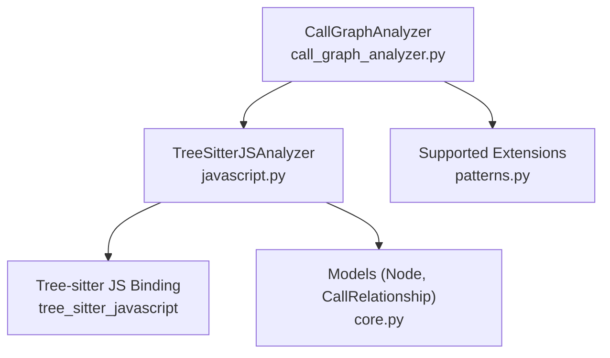
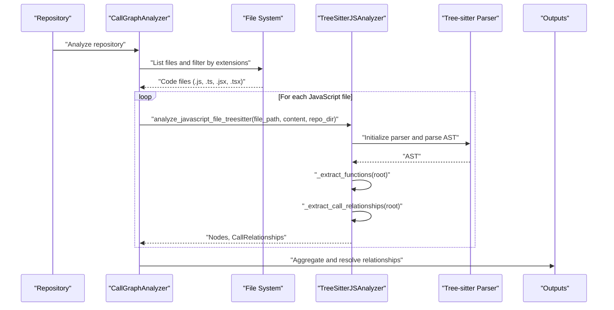
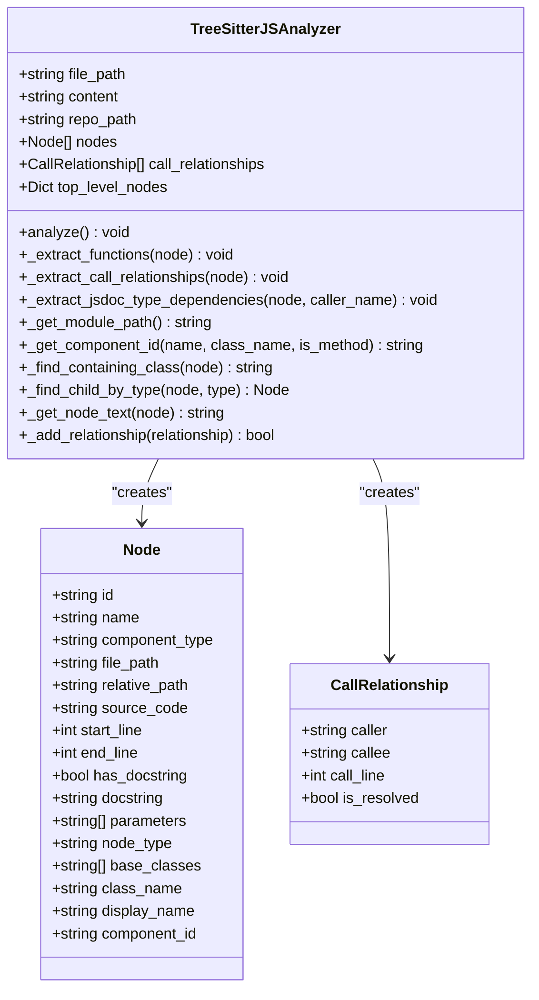
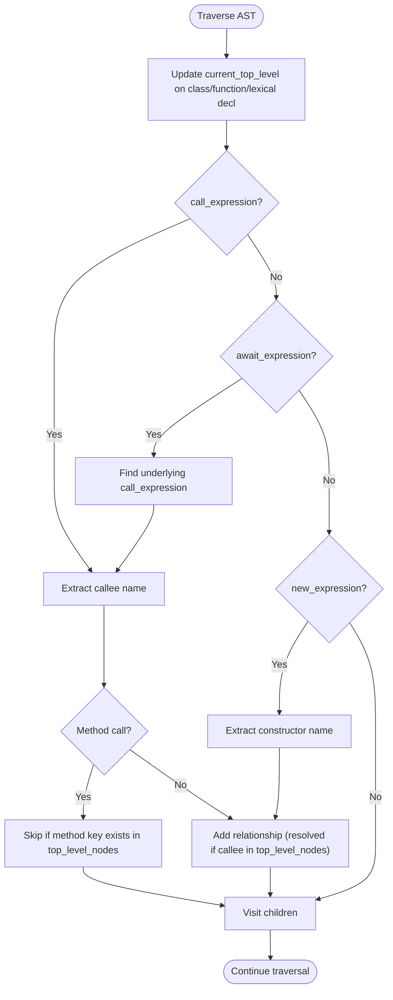
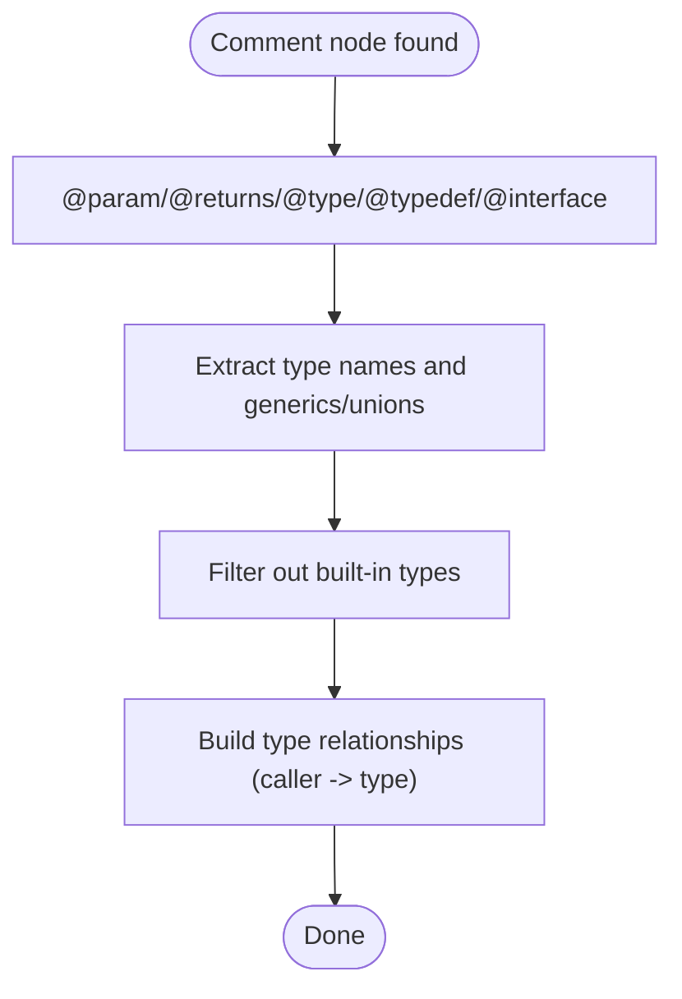
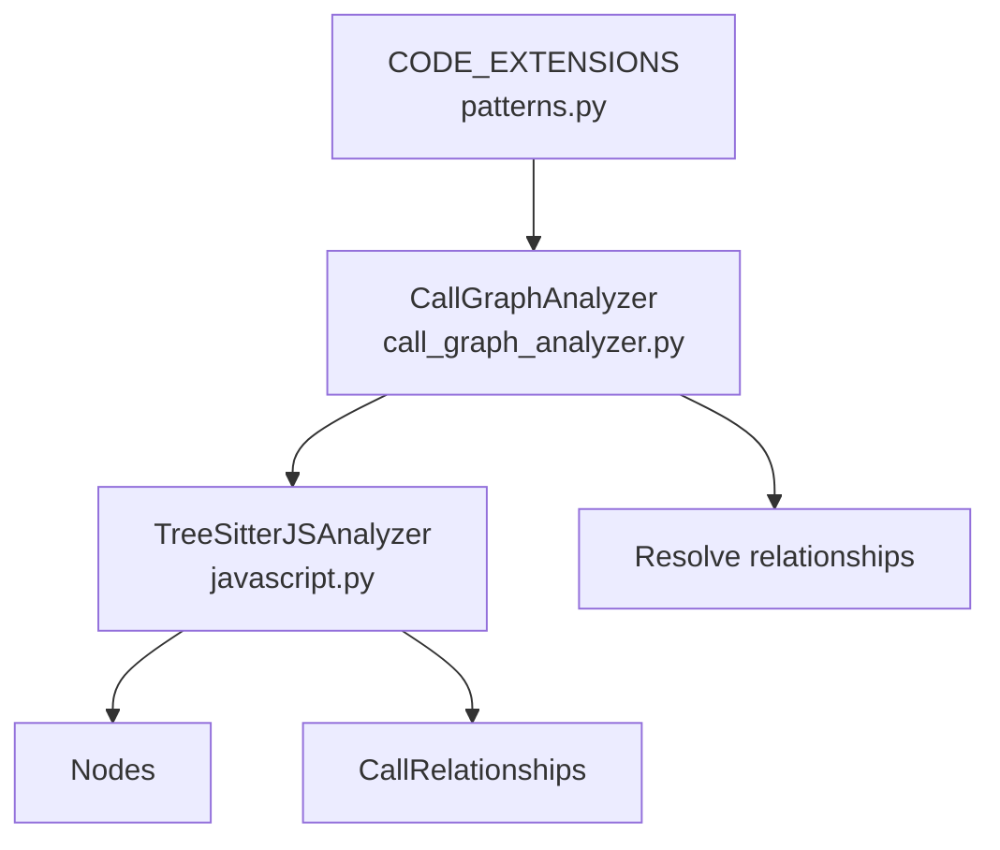

# JavaScript Code Analysis

<cite>
**Referenced Files in This Document**
- [javascript.py](file://codewiki/src/be/dependency_analyzer/analyzers/javascript.py)
- [core.py](file://codewiki/src/be/dependency_analyzer/models/core.py)
- [call_graph_analyzer.py](file://codewiki/src/be/dependency_analyzer/analysis/call_graph_analyzer.py)
- [patterns.py](file://codewiki/src/be/dependency_analyzer/utils/patterns.py)
</cite>

## Table of Contents
1. [Introduction](#introduction)
2. [Project Structure](#project-structure)
3. [Core Components](#core-components)
4. [Architecture Overview](#architecture-overview)
5. [Detailed Component Analysis](#detailed-component-analysis)
6. [Dependency Analysis](#dependency-analysis)
7. [Performance Considerations](#performance-considerations)
8. [Troubleshooting Guide](#troubleshooting-guide)
9. [Conclusion](#conclusion)

## Introduction
This document explains the JavaScript code analysis capabilities of CodeWiki, focusing on how the system uses Tree-sitter with the tree_sitter_javascript binding to parse JavaScript files and extract functions, classes, methods, and their relationships. It documents the TreeSitterJSAnalyzer class, including how it handles different function types (regular, generator, arrow), class declarations, and method definitions. It also explains the _extract_call_relationships method that identifies function calls and the _extract_jsdoc_type_dependencies method that parses JSDoc comments for type information. Finally, it describes how module paths and component IDs are derived for JavaScript’s flexible module system, and outlines known limitations such as handling of dynamic imports and complex module patterns.

## Project Structure
The JavaScript analysis is implemented in a dedicated analyzer module and integrated into the broader dependency analysis pipeline. The key files are:
- Analyzer implementation: javascript.py
- Data models: core.py
- Call graph integration: call_graph_analyzer.py
- Supported file extensions: patterns.py

**Diagram sources**
- [call_graph_analyzer.py](file://codewiki/src/be/dependency_analyzer/analysis/call_graph_analyzer.py#L104-L195)
- [javascript.py](file://codewiki/src/be/dependency_analyzer/analyzers/javascript.py#L18-L40)
- [core.py](file://codewiki/src/be/dependency_analyzer/models/core.py#L7-L64)
- [patterns.py](file://codewiki/src/be/dependency_analyzer/utils/patterns.py#L178-L202)

**Section sources**
- [call_graph_analyzer.py](file://codewiki/src/be/dependency_analyzer/analysis/call_graph_analyzer.py#L60-L120)
- [patterns.py](file://codewiki/src/be/dependency_analyzer/utils/patterns.py#L178-L202)

## Core Components
- TreeSitterJSAnalyzer: Parses JavaScript/TypeScript ASTs, extracts functions and classes, builds component IDs, and detects call relationships and JSDoc type dependencies.
- Node and CallRelationship: Pydantic models representing code components and call edges.
- CallGraphAnalyzer: Orchestrates multi-language analysis and routes JavaScript files to the Tree-sitter analyzer.

Key responsibilities:
- Initialize Tree-sitter parser with tree_sitter_javascript
- Traverse AST nodes to find function/class/method declarations
- Build hierarchical module paths and component IDs
- Detect function calls, await/new expressions, and inheritance relationships
- Parse JSDoc comments for type dependencies
- Produce normalized Node and CallRelationship outputs

**Section sources**
- [javascript.py](file://codewiki/src/be/dependency_analyzer/analyzers/javascript.py#L18-L706)
- [core.py](file://codewiki/src/be/dependency_analyzer/models/core.py#L7-L64)
- [call_graph_analyzer.py](file://codewiki/src/be/dependency_analyzer/analysis/call_graph_analyzer.py#L104-L195)

## Architecture Overview
The JavaScript analysis pipeline integrates with the call graph builder. The CallGraphAnalyzer discovers code files, filters by supported extensions, and routes JavaScript files to the Tree-sitter analyzer. The analyzer produces Nodes and CallRelationships, which the CallGraphAnalyzer aggregates and resolves.

**Diagram sources**
- [call_graph_analyzer.py](file://codewiki/src/be/dependency_analyzer/analysis/call_graph_analyzer.py#L60-L120)
- [call_graph_analyzer.py](file://codewiki/src/be/dependency_analyzer/analysis/call_graph_analyzer.py#L170-L195)
- [javascript.py](file://codewiki/src/be/dependency_analyzer/analyzers/javascript.py#L51-L71)
- [javascript.py](file://codewiki/src/be/dependency_analyzer/analyzers/javascript.py#L686-L706)

## Detailed Component Analysis

### TreeSitterJSAnalyzer
The analyzer initializes a Tree-sitter parser using the tree_sitter_javascript binding, parses the file content, and traverses the AST to extract functions, classes, methods, and relationships.

- Initialization and parsing
  - Initializes the Tree-sitter language and parser
  - Parses UTF-8 content into an AST
  - Logs root node type and analysis results

- Function extraction
  - Traverses AST to detect:
    - function_declaration and generator_function_declaration
    - lexical_declaration containing arrow_function or function_expression
    - export_statement wrapping function declarations
  - Builds Node entries with component_type, parameters, display_name, and source code snippets
  - Skips excluded names via a filter

- Class and method extraction
  - Detects class_declaration, abstract_class_declaration, interface_declaration
  - Extracts class heritage (base classes) and records inheritance relationships
  - Extracts methods from class_body, including arrow function fields treated as methods
  - Builds method component IDs with class prefix

- Call relationship extraction
  - Traverses AST to find:
    - call_expression under current top-level scope
    - await_expression wrapping call_expression
    - new_expression for constructor calls
  - Determines caller and callee IDs using module path and current top-level name
  - Marks relationships as resolved when callee exists among top-level nodes

- JSDoc type dependency extraction
  - Scans comments preceding nodes and child nodes
  - Parses JSDoc patterns (@param, @returns/@return, @type, @typedef, @interface)
  - Extracts base types and union/generic types
  - Adds type relationships for non-built-in types

- Module path and component ID
  - Computes module path by removing repository base and replacing separators with dots
  - Strips common extensions (.js, .ts, .jsx, .tsx, .mjs, .cjs)
  - Builds component_id as module_path.(class_name.)?name

- Helper utilities
  - _find_child_by_type: AST traversal helper
  - _get_node_text: Extracts source text for a node
  - _add_relationship: Deduplicates relationships by caller-callee-line tuple

**Diagram sources**
- [javascript.py](file://codewiki/src/be/dependency_analyzer/analyzers/javascript.py#L18-L706)
- [core.py](file://codewiki/src/be/dependency_analyzer/models/core.py#L7-L64)

**Section sources**
- [javascript.py](file://codewiki/src/be/dependency_analyzer/analyzers/javascript.py#L18-L706)
- [core.py](file://codewiki/src/be/dependency_analyzer/models/core.py#L7-L64)

### Function Types and Declarations
- Regular and generator functions
  - Handles function_declaration and generator_function_declaration
  - Determines async and generator flags from code snippet inspection
  - Produces Node with display_name reflecting function kind

- Arrow functions
  - Extracted from lexical_declaration variable_declarator containing arrow_function or function_expression
  - Captures parameters and source code snippet

- Exported functions
  - Supports export_statement wrapping function_declaration
  - Special-case for export default function (...) sets name to default

- Methods and classes
  - Detects class_declaration, abstract_class_declaration, interface_declaration
  - Extracts class_heritage identifiers as base_classes
  - Iterates class_body for method_definition and arrow function field_definitions

**Section sources**
- [javascript.py](file://codewiki/src/be/dependency_analyzer/analyzers/javascript.py#L118-L199)
- [javascript.py](file://codewiki/src/be/dependency_analyzer/analyzers/javascript.py#L240-L293)
- [javascript.py](file://codewiki/src/be/dependency_analyzer/analyzers/javascript.py#L294-L343)
- [javascript.py](file://codewiki/src/be/dependency_analyzer/analyzers/javascript.py#L344-L357)
- [javascript.py](file://codewiki/src/be/dependency_analyzer/analyzers/javascript.py#L358-L399)
- [javascript.py](file://codewiki/src/be/dependency_analyzer/analyzers/javascript.py#L161-L182)

### Call Relationship Extraction
The analyzer traverses the AST to identify function calls and related constructs:

- Top-level scope tracking
  - Maintains current_top_level during traversal to associate calls with enclosing class or function

- Call detection
  - call_expression: extracts callee name and determines if it is a method call (this./super.)
  - await_expression: unwraps underlying call_expression
  - new_expression: treats constructor calls similarly

- Callee resolution
  - Uses module_path and current_top-level name to build caller_id
  - Builds callee_id using module_path and callee name
  - If callee exists in top_level_nodes, marks relationship as resolved

**Diagram sources**
- [javascript.py](file://codewiki/src/be/dependency_analyzer/analyzers/javascript.py#L419-L488)
- [javascript.py](file://codewiki/src/be/dependency_analyzer/analyzers/javascript.py#L489-L534)

**Section sources**
- [javascript.py](file://codewiki/src/be/dependency_analyzer/analyzers/javascript.py#L419-L534)

### JSDoc Type Dependencies
The analyzer scans comments to extract type information:

- Comment scanning
  - Checks previous sibling comment and child comments
  - Parses JSDoc patterns for types

- Pattern matching
  - @param {Type}, @returns/{@return} {Type}, @type {Type}
  - @typedef {Object} TypeName and @interface InterfaceName

- Type extraction
  - Extracts base types, generics, and unions
  - Ignores built-in JavaScript/JSDoc types

- Relationship creation
  - Creates CallRelationship from caller to type name within the same module
  - Marks as unresolved by default

**Diagram sources**
- [javascript.py](file://codewiki/src/be/dependency_analyzer/analyzers/javascript.py#L535-L588)
- [javascript.py](file://codewiki/src/be/dependency_analyzer/analyzers/javascript.py#L589-L630)

**Section sources**
- [javascript.py](file://codewiki/src/be/dependency_analyzer/analyzers/javascript.py#L535-L630)

### Module Paths and Component IDs
Module path derivation and component ID construction:

- Module path
  - Computes relative path from repo_path
  - Strips extensions (.js, .ts, .jsx, .tsx, .mjs, .cjs)
  - Replaces path separators with dots

- Component ID
  - For methods: module_path.class_name.method_name
  - For classes/functions: module_path.name

- Top-level node registry
  - Stores top-level nodes keyed by component_id for quick lookup during call resolution

**Section sources**
- [javascript.py](file://codewiki/src/be/dependency_analyzer/analyzers/javascript.py#L72-L105)
- [javascript.py](file://codewiki/src/be/dependency_analyzer/analyzers/javascript.py#L106-L117)
- [javascript.py](file://codewiki/src/be/dependency_analyzer/analyzers/javascript.py#L161-L182)

## Dependency Analysis
- Language routing
  - CallGraphAnalyzer maps file extensions to languages and routes JavaScript files to the Tree-sitter analyzer
  - Supported extensions include .js, .jsx, .ts, .tsx

- Aggregation and deduplication
  - Aggregates Nodes and CallRelationships from all analyzed files
  - Deduplicates relationships and resolves call targets using component IDs

**Diagram sources**
- [patterns.py](file://codewiki/src/be/dependency_analyzer/utils/patterns.py#L178-L202)
- [call_graph_analyzer.py](file://codewiki/src/be/dependency_analyzer/analysis/call_graph_analyzer.py#L60-L120)
- [call_graph_analyzer.py](file://codewiki/src/be/dependency_analyzer/analysis/call_graph_analyzer.py#L170-L195)

**Section sources**
- [patterns.py](file://codewiki/src/be/dependency_analyzer/utils/patterns.py#L178-L202)
- [call_graph_analyzer.py](file://codewiki/src/be/dependency_analyzer/analysis/call_graph_analyzer.py#L60-L120)
- [call_graph_analyzer.py](file://codewiki/src/be/dependency_analyzer/analysis/call_graph_analyzer.py#L170-L195)

## Performance Considerations
- Tree-sitter parsing overhead
  - Parsing large files incurs CPU and memory costs; consider batching or limiting concurrency in high-volume scenarios
- AST traversal
  - Traversal visits all nodes; complexity is proportional to AST size
- Relationship deduplication
  - Deduplication uses a set keyed by caller-callee-line; ensure line numbers are stable across runs

[No sources needed since this section provides general guidance]

## Troubleshooting Guide
- Parser initialization failures
  - If the Tree-sitter language fails to load, the analyzer logs an error and skips analysis for that file
  - Verify tree_sitter_javascript installation and environment

- Missing relationships
  - Calls may be unresolved if callee is not a top-level function in the same module
  - Ensure functions/classes are declared at top-level scope for reliable resolution

- Dynamic imports and complex module patterns
  - Dynamic import() and advanced module systems (e.g., bundlers, virtual modules) are not handled
  - Only static call sites and explicit exports are captured

- JSDoc parsing
  - Only standard JSDoc patterns are recognized; complex generics or nested types may be partially parsed
  - Built-in types are ignored to reduce noise

**Section sources**
- [javascript.py](file://codewiki/src/be/dependency_analyzer/analyzers/javascript.py#L30-L40)
- [javascript.py](file://codewiki/src/be/dependency_analyzer/analyzers/javascript.py#L69-L71)
- [javascript.py](file://codewiki/src/be/dependency_analyzer/analyzers/javascript.py#L535-L588)
- [javascript.py](file://codewiki/src/be/dependency_analyzer/analyzers/javascript.py#L613-L630)

## Conclusion
CodeWiki’s JavaScript analysis leverages Tree-sitter with the tree_sitter_javascript binding to robustly extract functions, classes, and methods from JavaScript/TypeScript code. The TreeSitterJSAnalyzer class implements comprehensive AST traversal, module path computation, and relationship detection, including JSDoc-driven type dependencies. While it handles common patterns like regular, generator, and arrow functions, class methods, and static calls, it currently does not support dynamic imports or complex module ecosystems. Integrating with the CallGraphAnalyzer enables multi-language analysis and relationship resolution across a repository.