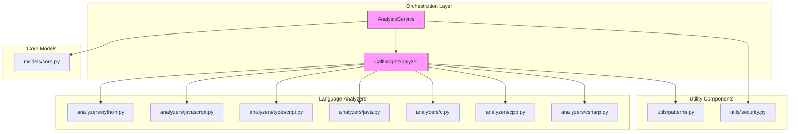
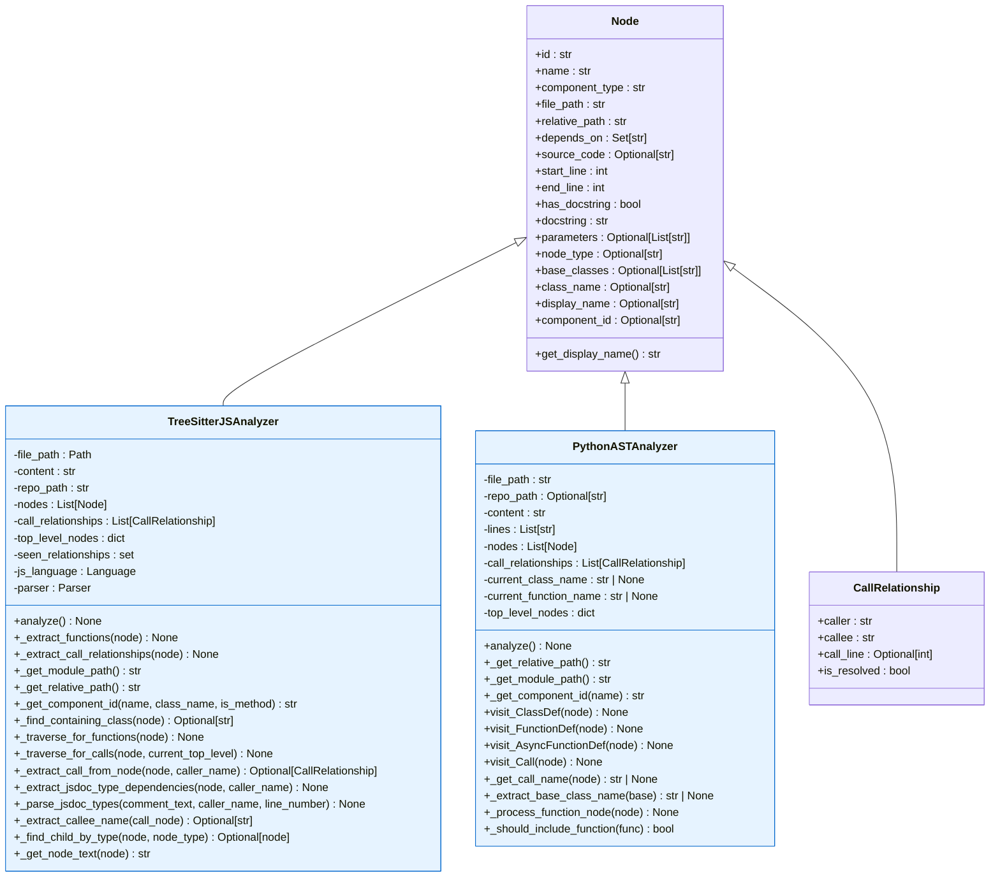
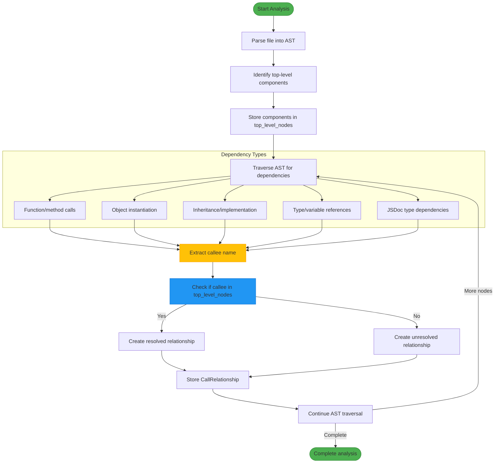
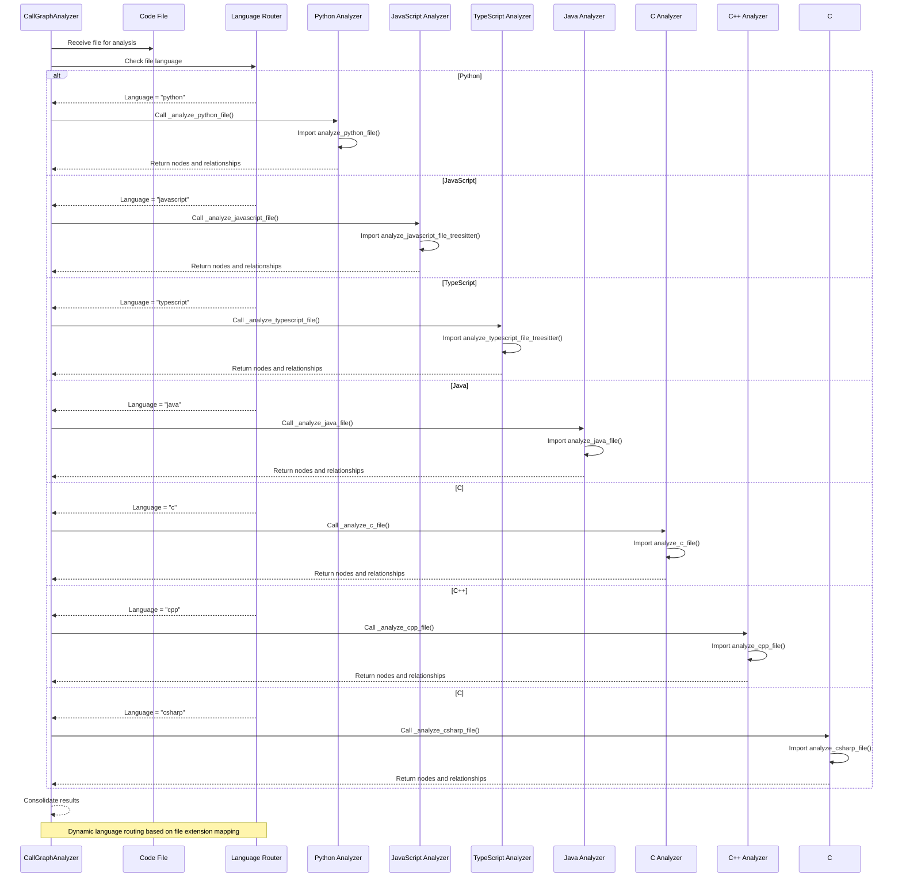
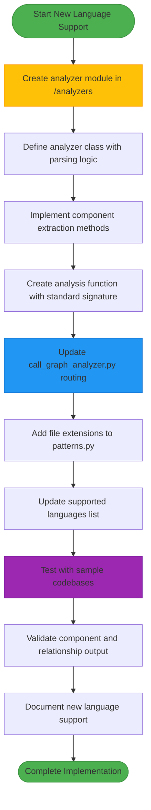

# Language Support and Code Analysis

<cite>
**Referenced Files in This Document**   
- [ast_parser.py](file://codewiki/src/be/dependency_analyzer/ast_parser.py)
- [dependency_graphs_builder.py](file://codewiki/src/be/dependency_analyzer/dependency_graphs_builder.py)
- [analysis_service.py](file://codewiki/src/be/dependency_analyzer/analysis/analysis_service.py)
- [call_graph_analyzer.py](file://codewiki/src/be/dependency_analyzer/analysis/call_graph_analyzer.py)
- [models/core.py](file://codewiki/src/be/dependency_analyzer/models/core.py)
- [analyzers/python.py](file://codewiki/src/be/dependency_analyzer/analyzers/python.py)
- [analyzers/javascript.py](file://codewiki/src/be/dependency_analyzer/analyzers/javascript.py)
- [analyzers/typescript.py](file://codewiki/src/be/dependency_analyzer/analyzers/typescript.py)
- [analyzers/java.py](file://codewiki/src/be/dependency_analyzer/analyzers/java.py)
- [analyzers/c.py](file://codewiki/src/be/dependency_analyzer/analyzers/c.py)
- [analyzers/cpp.py](file://codewiki/src/be/dependency_analyzer/analyzers/cpp.py)
- [analyzers/csharp.py](file://codewiki/src/be/dependency_analyzer/analyzers/csharp.py)
- [utils/patterns.py](file://codewiki/src/be/dependency_analyzer/utils/patterns.py)
</cite>

## Table of Contents
1. [Introduction](#introduction)
2. [Language Support Overview](#language-support-overview)
3. [Architecture of the Dependency Analyzer System](#architecture-of-the-dependency-analyzer-system)
4. [Base Analyzer Class and Language-Specific Implementations](#base-analyzer-class-and-language-specific-implementations)
5. [Dependency Extraction from AST Nodes](#dependency-extraction-from-ast-nodes)
6. [Component Identification in Each Language](#component-identification-in-each-language)
7. [Registration Mechanism for Language Analyzers](#registration-mechanism-for-language-analyzers)
8. [Adding Support for New Languages](#adding-support-for-new-languages)
9. [File Extension Mapping](#file-extension-mapping)
10. [Limitations and Known Issues](#limitations-and-known-issues)
11. [Conclusion](#conclusion)

## Introduction
CodeWiki provides comprehensive language support for code analysis through a sophisticated system built on Tree-sitter's Abstract Syntax Tree (AST) parsing capabilities. This document details how CodeWiki supports seven programming languages—Python, Java, JavaScript, TypeScript, C, C++, and C#—by leveraging language-specific analyzers to extract dependencies, identify components, and build accurate call graphs. The system is designed with a modular architecture that allows for easy extension to support additional languages. This documentation will explore the architecture of the dependency analyzer system, explain how dependencies are extracted from AST nodes, describe the component identification process for each language, detail the registration mechanism for language analyzers, provide guidance on adding support for new languages, outline file extension mappings, and address limitations and known issues with parsing complex code constructs.

## Language Support Overview
CodeWiki supports seven major programming languages: Python, Java, JavaScript, TypeScript, C, C++, and C#. This support is implemented through a modular architecture where each language has its own dedicated analyzer class that extends a common base functionality. The system uses Tree-sitter parsers for JavaScript, TypeScript, Java, C, C++, and C# to create accurate ASTs, while Python uses the built-in `ast` module for parsing. Each analyzer is responsible for extracting components (such as functions, classes, and methods) and their relationships from the codebase. The analyzers work by traversing the AST to identify top-level declarations and then extracting dependencies between these components. The system supports both file-level and cross-file dependency analysis, allowing it to build comprehensive call graphs across entire repositories. Language detection is performed based on file extensions, with a comprehensive mapping system that associates each extension with its corresponding language. The analysis service orchestrates the process by identifying code files, routing them to the appropriate language-specific analyzer, and consolidating the results into a unified dependency graph.

## Architecture of the Dependency Analyzer System
The dependency analyzer system in CodeWiki follows a modular, layered architecture designed for extensibility and maintainability. At the core of the system is the `AnalysisService` class, which serves as the central orchestrator for repository analysis. This service coordinates the complete analysis workflow, including repository cloning, structure analysis, and multi-language AST parsing for call graph generation. The `CallGraphAnalyzer` acts as the primary coordinator for language-specific analyzers, managing the analysis of code files across different programming languages. It routes each file to the appropriate language-specific analyzer based on the detected language and consolidates the results into a unified call graph. The system uses a plugin architecture where each supported language has its own analyzer implementation in the `analyzers` directory. These analyzers inherit common functionality from the base analysis framework while implementing language-specific parsing logic. The `DependencyParser` class in `ast_parser.py` serves as the entry point for dependency analysis, coordinating the extraction of components and relationships from the repository. The results are then processed by the `DependencyGraphBuilder` to create the final dependency graph structure. This layered architecture ensures separation of concerns, with each component having a well-defined responsibility, making the system both robust and extensible.



**Diagram sources**
- [analysis_service.py](file://codewiki/src/be/dependency_analyzer/analysis/analysis_service.py)
- [call_graph_analyzer.py](file://codewiki/src/be/dependency_analyzer/analysis/call_graph_analyzer.py)
- [models/core.py](file://codewiki/src/be/dependency_analyzer/models/core.py)
- [utils/patterns.py](file://codewiki/src/be/dependency_analyzer/utils/patterns.py)

## Base Analyzer Class and Language-Specific Implementations
The dependency analyzer system in CodeWiki does not use a traditional inheritance-based base class for language analyzers. Instead, it employs a functional approach where each language-specific analyzer implements a consistent interface through standalone functions. The common functionality across analyzers includes methods for initializing the analyzer with file path and content, extracting components from the AST, identifying relationships between components, and creating standardized `Node` objects. Each language-specific analyzer follows a similar structure: it defines a main analyzer class (e.g., `TreeSitterJSAnalyzer` for JavaScript) that handles the parsing and analysis logic, and a corresponding analysis function (e.g., `analyze_javascript_file_treesitter`) that serves as the entry point. These analyzer classes share common methods such as `_get_module_path`, `_get_relative_path`, and `_get_component_id` for consistent path handling and component identification. The `Node` class from `models/core.py` serves as the standardized data structure for representing code components across all languages, ensuring consistency in the output format. Language-specific analyzers extend this common foundation by implementing parsing logic tailored to the syntax and semantics of their respective languages, such as handling Python's indentation-based structure or C++'s complex template syntax.



**Diagram sources**
- [models/core.py](file://codewiki/src/be/dependency_analyzer/models/core.py)
- [analyzers/javascript.py](file://codewiki/src/be/dependency_analyzer/analyzers/javascript.py)
- [analyzers/python.py](file://codewiki/src/be/dependency_analyzer/analyzers/python.py)

## Dependency Extraction from AST Nodes
Dependency extraction in CodeWiki is performed by traversing the Abstract Syntax Tree (AST) of each source file to identify relationships between code components. The process begins with the analyzer identifying top-level declarations such as classes, functions, and methods, which are stored in a `top_level_nodes` dictionary for reference during dependency resolution. For each language, the analyzer implements specific methods to traverse the AST and extract different types of dependencies. In JavaScript and TypeScript, the `_extract_call_relationships` method traverses the AST to identify function calls, object creations, and member expressions, recording relationships between calling and called components. The analyzer also extracts type dependencies from JSDoc comments, identifying relationships specified in type annotations. In Java, the `_extract_relationships` method identifies inheritance relationships through `extends` clauses, interface implementation through `implements` clauses, field type usage, method calls, and object creation. For C and C++, dependencies are extracted from function calls, global variable usage, and object instantiation. The system uses a consistent approach across languages: when a node references another component (either by name or type), a `CallRelationship` is created linking the caller to the callee. These relationships are stored with metadata including the call line number and a resolution status that indicates whether the relationship has been resolved to a specific component.



**Diagram sources**
- [analyzers/javascript.py](file://codewiki/src/be/dependency_analyzer/analyzers/javascript.py)
- [analyzers/java.py](file://codewiki/src/be/dependency_analyzer/analyzers/java.py)
- [analyzers/c.py](file://codewiki/src/be/dependency_analyzer/analyzers/c.py)
- [analyzers/cpp.py](file://codewiki/src/be/dependency_analyzer/analyzers/cpp.py)

## Component Identification in Each Language
Component identification varies across languages based on their syntax and structural conventions, with each language-specific analyzer implementing tailored logic to accurately identify and categorize code components. In Python, the `PythonASTAnalyzer` uses the built-in `ast` module to traverse the AST and identify classes through `visit_ClassDef`, functions through `visit_FunctionDef` and `visit_AsyncFunctionDef`, and methods through the same function visitors when they are contained within a class. The analyzer creates `Node` objects with appropriate `component_type` values such as "class", "function", or "method". For JavaScript, the `TreeSitterJSAnalyzer` identifies components by traversing the AST and checking node types such as "class_declaration", "function_declaration", "generator_function_declaration", and "lexical_declaration" containing arrow functions. It distinguishes between top-level functions and methods by examining the containing context. TypeScript analysis is similar to JavaScript but includes additional entity types such as "interface", "type", and "enum" declarations. The Java analyzer identifies classes, interfaces, enums, records, and annotations through their respective declaration nodes, while also detecting methods within class bodies. For C, components include functions, structs, and global variables, identified through "function_definition", "struct_specifier", and "declaration" nodes. C++ extends this with support for classes, structs, namespaces, and methods, with special handling for qualified identifiers and member expressions. C# analysis covers classes, interfaces, structs, enums, records, and delegates, with detection based on specific declaration nodes in the AST.

```mermaid
graph TD
Language[Programming Language] --> Python
Language --> JavaScript
Language --> TypeScript
Language --> Java
Language --> C
Language --> C++
Language --> CSharp
Python --> Classes["Classes: class_definition"]
Python --> Functions["Functions: def statements"]
Python --> Methods["Methods: functions in classes"]
Python --> Async["Async functions"]
JavaScript --> Classes["Classes: class declarations"]
JavaScript --> Functions["Functions: function declarations"]
JavaScript --> Arrow["Arrow functions"]
JavaScript --> Methods["Methods: in class bodies"]
JavaScript --> Exports["Exported functions"]
TypeScript --> Classes["Classes: class declarations"]
TypeScript --> Interfaces["Interfaces"]
TypeScript --> Types["Type aliases"]
TypeScript --> Enums["Enums"]
TypeScript --> Functions["Functions & arrow functions"]
TypeScript --> Methods["Methods"]
Java --> Classes["Classes & abstract classes"]
Java --> Interfaces["Interfaces"]
Java --> Enums["Enums"]
Java --> Records["Records"]
Java --> Annotations["Annotations"]
Java --> Methods["Methods"]
C --> Functions["Functions"]
C --> Structs["Structs"]
C --> Variables["Global variables"]
C++ --> Classes["Classes"]
C++ --> Structs["Structs"]
C++ --> Functions["Functions"]
C++ --> Methods["Methods"]
C++ --> Namespaces["Namespaces"]
C++ --> Variables["Global variables"]
CSharp --> Classes["Classes & abstract classes"]
CSharp --> Interfaces["Interfaces"]
CSharp --> Structs["Structs"]
CSharp --> Enums["Enums"]
CSharp --> Records["Records"]
CSharp --> Delegates["Delegates"]
style Python fill:#e8f5e8,stroke:#2e7d32
style JavaScript fill:#fff3e0,stroke:#ef6c00
style TypeScript fill:#fff3e0,stroke:#ef6c00
style Java fill:#fce4ec,stroke:#c2185b
style C fill:#e8f5e8,stroke:#2e7d32
style C++ fill:#e8f5e8,stroke:#2e7d32
style CSharp fill:#e8f5e8,stroke:#2e7d32
```



**Diagram sources**
- [analyzers/python.py](file://codewiki/src/be/dependency_analyzer/analyzers/python.py)
- [analyzers/javascript.py](file://codewiki/src/be/dependency_analyzer/analyzers/javascript.py)
- [analyzers/typescript.py](file://codewiki/src/be/dependency_analyzer/analyzers/typescript.py)
- [analyzers/java.py](file://codewiki/src/be/dependency_analyzer/analyzers/java.py)
- [analyzers/c.py](file://codewiki/src/be/dependency_analyzer/analyzers/c.py)
- [analyzers/cpp.py](file://codewiki/src/be/dependency_analyzer/analyzers/cpp.py)
- [analyzers/csharp.py](file://codewiki/src/be/dependency_analyzer/analyzers/csharp.py)

## Registration Mechanism for Language Analyzers
The registration mechanism for language analyzers in CodeWiki is implemented through dynamic import and function routing within the `CallGraphAnalyzer` class, rather than a formal registration system. The `analyze_code_files` method in `call_graph_analyzer.py` serves as the central dispatcher that routes each code file to the appropriate language-specific analyzer based on the detected language. When analyzing a file, the method checks the language property of the file information and uses conditional logic to call the corresponding analysis function. For example, if the language is "python", it calls `_analyze_python_file`; if the language is "javascript", it calls `_analyze_javascript_file`. These methods in turn import and invoke the specific analysis functions from the language analyzer modules, such as `analyze_javascript_file_treesitter` from `analyzers/javascript.py`. The system relies on consistent naming conventions and function signatures across language analyzers to ensure seamless integration. Language detection is performed by the `RepoAnalyzer` and `patterns.py` module, which map file extensions to languages using the `CODE_EXTENSIONS` dictionary. The `AnalysisService` class coordinates this process by first identifying code files through the `extract_code_files` method, which uses the extension-to-language mapping, and then passing these files to the `CallGraphAnalyzer` for processing. This approach allows for easy addition of new language support by simply creating a new analyzer module with the required functions and adding the appropriate file extensions to the mapping.



**Diagram sources**
- [call_graph_analyzer.py](file://codewiki/src/be/dependency_analyzer/analysis/call_graph_analyzer.py)
- [analyzers/python.py](file://codewiki/src/be/dependency_analyzer/analyzers/python.py)
- [analyzers/javascript.py](file://codewiki/src/be/dependency_analyzer/analyzers/javascript.py)
- [analyzers/typescript.py](file://codewiki/src/be/dependency_analyzer/analyzers/typescript.py)
- [analyzers/java.py](file://codewiki/src/be/dependency_analyzer/analyzers/java.py)
- [analyzers/c.py](file://codewiki/src/be/dependency_analyzer/analyzers/c.py)
- [analyzers/cpp.py](file://codewiki/src/be/dependency_analyzer/analyzers/cpp.py)
- [analyzers/csharp.py](file://codewiki/src/be/dependency_analyzer/analyzers/csharp.py)

## Adding Support for New Languages
To add support for a new programming language in CodeWiki, developers need to create a new analyzer module in the `analyzers` directory and integrate it with the existing analysis framework. The process begins by creating a new Python file in `codewiki/src/be/dependency_analyzer/analyzers/` with a name corresponding to the target language (e.g., `rust.py` for Rust support). This module should define a main analyzer class that handles the parsing and analysis logic, similar to the existing language analyzers. The class should implement methods for initializing the analyzer, parsing the source code into an AST using an appropriate parser (such as a Tree-sitter binding), extracting components like functions and classes, and identifying relationships between components. The module must also define an analysis function with a consistent signature that returns a tuple of `Node` objects and `CallRelationship` objects. This function serves as the entry point for the analysis process. Next, the `call_graph_analyzer.py` file must be modified to include the new language in its routing logic by adding a conditional branch in the `_analyze_code_file` method. The `patterns.py` file should be updated to include the file extensions associated with the new language in the `CODE_EXTENSIONS` dictionary. Finally, the `analysis_service.py` file may need to be updated to include the new language in the list of supported languages if it's not already included. Testing should be performed to ensure that the new analyzer correctly identifies components and relationships in sample codebases.



**Section sources**
- [call_graph_analyzer.py](file://codewiki/src/be/dependency_analyzer/analysis/call_graph_analyzer.py)
- [patterns.py](file://codewiki/src/be/dependency_analyzer/utils/patterns.py)
- [analysis_service.py](file://codewiki/src/be/dependency_analyzer/analysis/analysis_service.py)

## File Extension Mapping
File extension mapping in CodeWiki is managed through the `CODE_EXTENSIONS` dictionary in the `utils/patterns.py` module, which associates file extensions with their corresponding programming languages. This mapping is used by the analysis system to determine which language-specific analyzer should process each file. The system supports a comprehensive set of extensions for the seven programming languages it currently supports. For Python, the extension `.py` is mapped to "python". JavaScript files with extensions `.js`, `.jsx`, and `.mjs` are mapped to "javascript". TypeScript files with extensions `.ts`, `.tsx`, and `.cts` are mapped to "typescript". Java files with the `.java` extension are mapped to "java". C files with extensions `.c` and `.h` are mapped to "c", while C++ files with extensions `.cpp`, `.cc`, `.cxx`, `.hpp`, `.hxx`, and `.h++` are mapped to "cpp". C# files with the `.cs` extension are mapped to "csharp". The mapping system is case-insensitive and supports both common and alternative extensions for each language. This extension-to-language mapping is used by the `RepoAnalyzer` to identify code files during repository analysis and by the `CallGraphAnalyzer` to route files to the appropriate language-specific analyzer. The system also includes a `DEFAULT_INCLUDE_PATTERNS` list that specifies which file patterns should be included in analysis, further refining the file selection process.

```mermaid
erDiagram
LANGUAGE ||--o{ EXTENSION : "has"
LANGUAGE {
string name PK
string description
}
EXTENSION {
string extension PK
string language FK
boolean is_primary
}
LANGUAGE ||--o{ "python" } EXTENSION
LANGUAGE ||--o{ "javascript" } EXTENSION
LANGUAGE ||--o{ "typescript" } EXTENSION
LANGUAGE ||--o{ "java" } EXTENSION
LANGUAGE ||--o{ "c" } EXTENSION
LANGUAGE ||--o{ "cpp" } EXTENSION
LANGUAGE ||--o{ "csharp" } EXTENSION
"python" }o--|| EXTENSION : ".py"
"javascript" }o--|| EXTENSION : ".js"
"javascript" }o--|| EXTENSION : ".jsx"
"javascript" }o--|| EXTENSION : ".mjs"
"typescript" }o--|| EXTENSION : ".ts"
"typescript" }o--|| EXTENSION : ".tsx"
"typescript" }o--|| EXTENSION : ".cts"
"java" }o--|| EXTENSION : ".java"
"c" }o--|| EXTENSION : ".c"
"c" }o--|| EXTENSION : ".h"
"cpp" }o--|| EXTENSION : ".cpp"
"cpp" }o--|| EXTENSION : ".cc"
"cpp" }o--|| EXTENSION : ".cxx"
"cpp" }o--|| EXTENSION : ".hpp"
"cpp" }o--|| EXTENSION : ".hxx"
"cpp" }o--|| EXTENSION : ".h++"
"csharp" }o--|| EXTENSION : ".cs"
```

**Diagram sources**
- [utils/patterns.py](file://codewiki/src/be/dependency_analyzer/utils/patterns.py)

## Limitations and Known Issues
The code analysis system in CodeWiki faces several limitations and known issues when parsing complex code constructs across the supported languages. For Python, the use of the built-in `ast` module rather than Tree-sitter means that certain syntax elements like type comments and some formatting aspects may not be fully preserved in the AST. The analyzer may also struggle with dynamically generated code or code that uses advanced metaprogramming techniques. In JavaScript and TypeScript, while Tree-sitter provides robust parsing, the system may have difficulty resolving dependencies in highly dynamic code that uses `eval`, `Function` constructors, or complex module loading patterns. The JSDoc type dependency extraction is limited to basic type annotations and may not handle complex generic types or conditional types correctly. For Java, the analyzer may have issues with code that uses reflection or dynamic class loading, as these dependencies cannot be determined statically from the AST. The system also has limited support for Java annotations that affect runtime behavior. In C and C++, the analyzer faces challenges with preprocessor directives, macros, and template metaprogramming, which can create complex code structures that are difficult to represent in a static AST. The system may also struggle with header file inclusion and the separation of declaration and definition across multiple files. For C#, similar issues exist with generics, attributes, and reflection. Across all languages, the system has limitations in resolving cross-file dependencies when components are not explicitly imported or when dynamic import patterns are used. Additionally, the system may generate false positives or miss relationships in code that uses advanced language features or unconventional coding patterns.

## Conclusion
CodeWiki's language support and code analysis capabilities are built on a robust, modular architecture that leverages Tree-sitter's AST parsing for accurate code understanding across seven programming languages. The system's design allows for consistent component identification and dependency extraction while maintaining the flexibility to accommodate language-specific syntax and semantics. Through its plugin-based analyzer system, CodeWiki can effectively parse and analyze Python, Java, JavaScript, TypeScript, C, C++, and C# codebases, extracting meaningful relationships between components to build comprehensive dependency graphs. The registration mechanism, based on file extension mapping and dynamic function routing, enables seamless integration of language-specific analyzers while providing a clear pathway for adding support for additional languages. Despite some limitations in handling highly dynamic code constructs and advanced language features, the system provides a solid foundation for static code analysis. The architecture's extensibility ensures that CodeWiki can continue to evolve to support new programming languages and adapt to changing development practices, making it a valuable tool for understanding and documenting complex codebases.