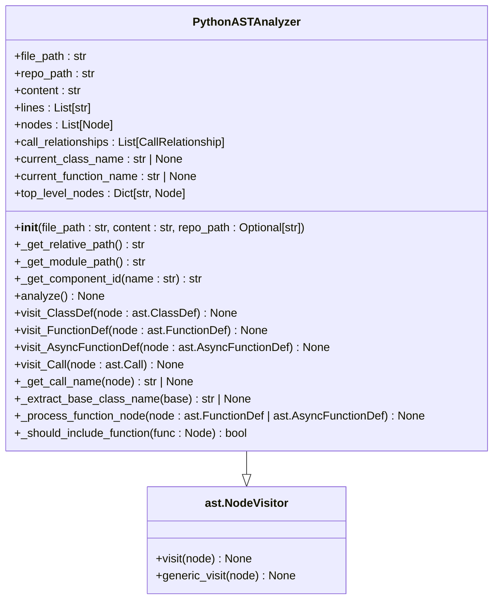
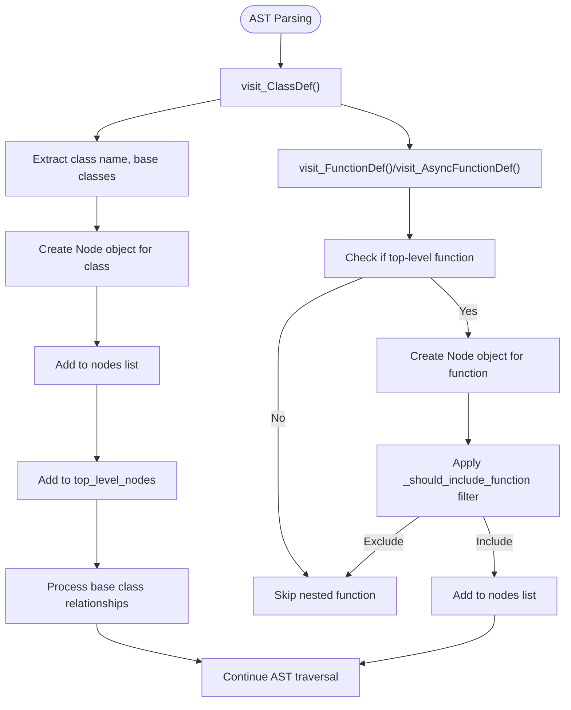
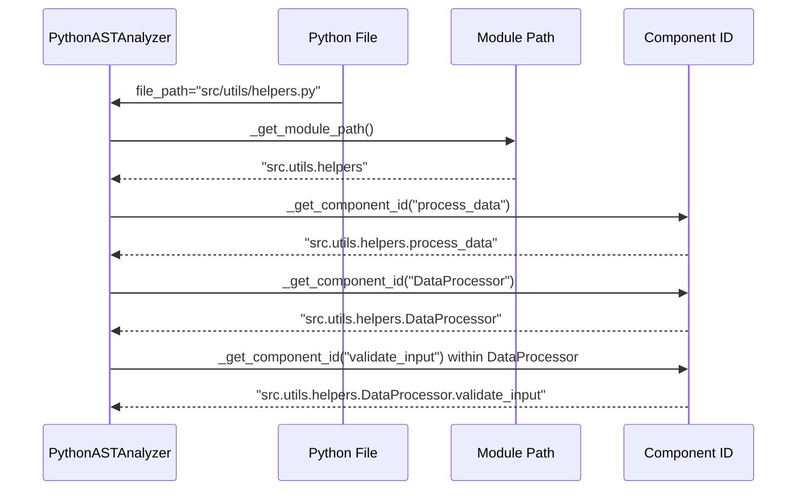
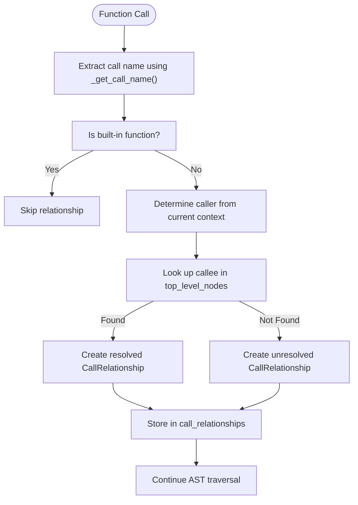
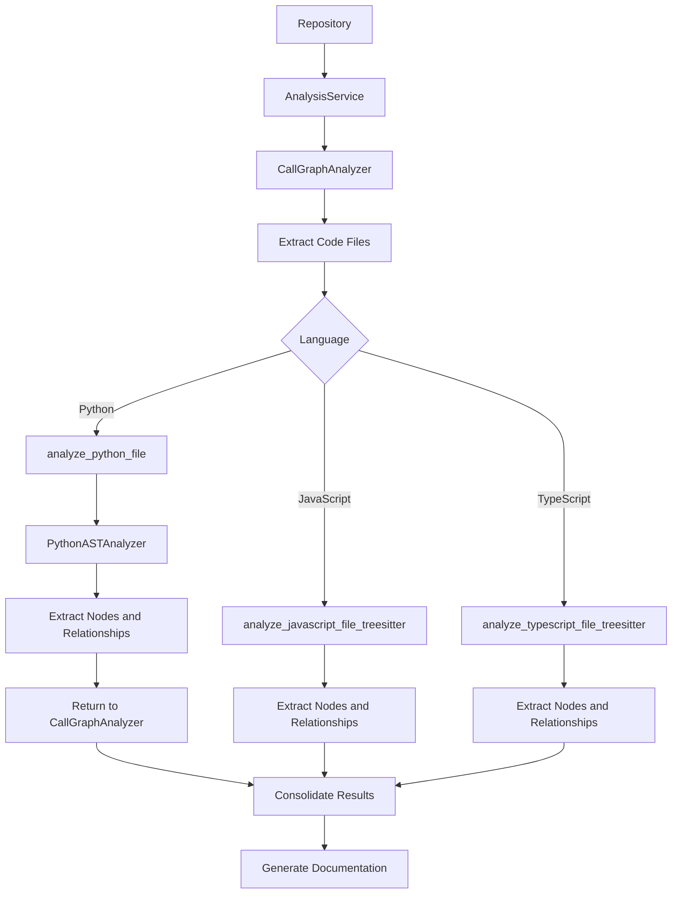

# Python Code Analysis

<cite>
**Referenced Files in This Document**   
- [python.py](file://codewiki/src/be/dependency_analyzer/analyzers/python.py)
- [core.py](file://codewiki/src/be/dependency_analyzer/models/core.py)
- [call_graph_analyzer.py](file://codewiki/src/be/dependency_analyzer/analysis/call_graph_analyzer.py)
- [analysis_service.py](file://codewiki/src/be/dependency_analyzer/analysis/analysis_service.py)
- [patterns.py](file://codewiki/src/be/dependency_analyzer/utils/patterns.py)
</cite>

## Table of Contents
1. [Introduction](#introduction)
2. [Python AST Analyzer Implementation](#python-ast-analyzer-implementation)
3. [Node and Relationship Extraction](#node-and-relationship-extraction)
4. [Component Identification and Filtering](#component-identification-and-filtering)
5. [Source Code and Documentation Extraction](#source-code-and-documentation-extraction)
6. [Call Relationship Analysis](#call-relationship-analysis)
7. [Integration with Analysis System](#integration-with-analysis-system)
8. [Limitations and Edge Cases](#limitations-and-edge-cases)

## Introduction

CodeWiki's Python code analysis capabilities are built around the Python Abstract Syntax Tree (AST) module, which enables deep structural analysis of Python code without requiring execution. The system leverages the `ast` module to parse Python files and extract comprehensive information about classes, functions, and their relationships. This analysis forms the foundation for generating holistic documentation that captures architectural context and cross-component interactions.

The Python AST analyzer is implemented as a specialized component within CodeWiki's multi-language analysis framework. It works in conjunction with other language analyzers to provide repository-wide insights, while maintaining Python-specific capabilities for accurate code understanding. The analyzer extracts not only syntactic information but also semantic relationships between code components, enabling the generation of meaningful documentation and visual artifacts.

**Section sources**
- [python.py](file://codewiki/src/be/dependency_analyzer/analyzers/python.py#L1-L267)
- [analysis_service.py](file://codewiki/src/be/dependency_analyzer/analysis/analysis_service.py#L1-L370)

## Python AST Analyzer Implementation

The core of CodeWiki's Python analysis is the `PythonASTAnalyzer` class, which extends Python's `ast.NodeVisitor` to traverse the AST of Python files. This implementation follows the visitor pattern, allowing the analyzer to systematically process different node types in the AST hierarchy. The analyzer is initialized with the file path, content, and repository path, which are used to maintain context during the analysis process.

The analyzer maintains several state variables to track the current analysis context, including `current_class_name` and `current_function_name`, which help identify the scope of code elements being processed. It also keeps a dictionary of `top_level_nodes` to store references to classes and functions at the module level, which is crucial for resolving relationships between components. The analyzer processes the entire file content by splitting it into lines, enabling precise source code extraction for documentation purposes.

The analysis process begins with the `analyze` method, which parses the Python content into an AST while suppressing syntax warnings that might arise from valid but unconventional code patterns (such as regex escape sequences). This robust parsing approach ensures that the analyzer can process a wide range of Python code, including code with complex string literals that might trigger warnings in standard parsing.

**Diagram sources**
- [python.py](file://codewiki/src/be/dependency_analyzer/analyzers/python.py#L15-L246)

**Section sources**
- [python.py](file://codewiki/src/be/dependency_analyzer/analyzers/python.py#L15-L246)

## Node and Relationship Extraction

The Python AST analyzer extracts code components by visiting specific node types in the AST. For class definitions, the `visit_ClassDef` method processes `ast.ClassDef` nodes, extracting the class name, base classes, and associated metadata. The analyzer uses the `_extract_base_class_name` helper method to resolve base class references, handling both simple names and dotted attribute references (e.g., `module.Class`). This enables accurate representation of inheritance relationships in the extracted model.

For function definitions, the analyzer uses the `_process_function_node` method, which is called by both `visit_FunctionDef` and `visit_AsyncFunctionDef` visitors. This unified approach ensures that both synchronous and asynchronous functions are processed consistently. The method checks if the function is at the top level (not nested within another function or class method) before adding it to the nodes collection. This design decision focuses the analysis on externally accessible components rather than implementation details.

The extracted nodes are represented using the `Node` data model from the core module, which includes comprehensive metadata such as component type, file path, source code snippet, line numbers, and documentation information. Each node is assigned a unique identifier through the `_get_component_id` method, which combines the module path with the component name to ensure global uniqueness across the repository.

**Diagram sources**
- [python.py](file://codewiki/src/be/dependency_analyzer/analyzers/python.py#L67-L157)

**Section sources**
- [python.py](file://codewiki/src/be/dependency_analyzer/analyzers/python.py#L67-L157)
- [core.py](file://codewiki/src/be/dependency_analyzer/models/core.py#L7-L44)

## Component Identification and Filtering

CodeWiki employs a sophisticated component identification system that generates unique identifiers for Python code components. The `_get_component_id` method creates dot-separated component IDs by combining the module path (derived from the file path) with the component name. For class members, the class name is also included in the identifier, creating a hierarchical structure that reflects the code organization. This approach ensures that components can be uniquely identified across the entire repository, even when multiple files contain components with the same name.

The analyzer implements a filtering mechanism through the `_should_include_function` method, which determines which functions should be included in the analysis results. Currently, the filter excludes functions whose names start with "_test_", effectively removing test functions from the documentation output. This selective inclusion helps focus the generated documentation on production code components rather than test infrastructure, improving the relevance and clarity of the output.

The component identification system also handles module paths by converting file system paths into Python module notation, replacing directory separators with dots and removing file extensions. This conversion enables the system to work with Python's import system conventions, making it easier to correlate extracted components with their importable counterparts in the codebase.

**Diagram sources**
- [python.py](file://codewiki/src/be/dependency_analyzer/analyzers/python.py#L55-L61)
- [python.py](file://codewiki/src/be/dependency_analyzer/analyzers/python.py#L158-L161)

**Section sources**
- [python.py](file://codewiki/src/be/dependency_analyzer/analyzers/python.py#L55-L61)
- [python.py](file://codewiki/src/be/dependency_analyzer/analyzers/python.py#L158-L161)

## Source Code and Documentation Extraction

The Python AST analyzer captures both source code snippets and documentation for each extracted component. Source code is extracted using the line information provided by the AST nodes, with the analyzer using the `lineno` and `end_lineno` attributes to determine the exact lines that constitute each component. The source code is then extracted from the pre-split lines array, preserving the original formatting and context.

For documentation, the analyzer leverages Python's built-in `ast.get_docstring` function to extract docstrings from classes and functions. This approach ensures that both the presence and content of docstrings are captured accurately. The extracted docstring is stored in the Node object along with a boolean flag indicating whether a docstring exists, enabling downstream processes to assess documentation coverage.

The analyzer also extracts function parameters by processing the `args` attribute of function definition nodes, capturing the names of all parameters (including positional, keyword, and variable arguments). This parameter information is valuable for understanding function interfaces and generating API documentation. The comprehensive extraction of source code, documentation, and metadata enables CodeWiki to generate rich, context-aware documentation that goes beyond simple code listing.

**Section sources**
- [python.py](file://codewiki/src/be/dependency_analyzer/analyzers/python.py#L82-L87)
- [python.py](file://codewiki/src/be/dependency_analyzer/analyzers/python.py#L138-L143)

## Call Relationship Analysis

The analyzer identifies call relationships by visiting `ast.Call` nodes in the AST, which represent function calls in the code. When a call node is encountered, the analyzer extracts the called function's name using the `_get_call_name` method, which handles various call patterns including simple function calls, method calls, and chained attribute access. The method also filters out calls to Python built-in functions, which are considered implementation details rather than meaningful relationships.

For each call, the analyzer creates a `CallRelationship` object that records the caller, callee, call line number, and resolution status. The caller is identified based on the current context (either the current class or function), while the callee is determined by looking up the called function name in the `top_level_nodes` dictionary. If the callee is found in this dictionary, the relationship is marked as resolved, indicating a direct reference to a known component.

The call relationship analysis is performed during the AST traversal, with the analyzer maintaining the current context through the `current_class_name` and `current_function_name` state variables. This context-aware approach ensures that method calls within classes are correctly attributed to the class, while function calls at the module level are attributed to the calling function.

**Diagram sources**
- [python.py](file://codewiki/src/be/dependency_analyzer/analyzers/python.py#L171-L194)
- [python.py](file://codewiki/src/be/dependency_analyzer/analyzers/python.py#L197-L225)

**Section sources**
- [python.py](file://codewiki/src/be/dependency_analyzer/analyzers/python.py#L171-L225)
- [core.py](file://codewiki/src/be/dependency_analyzer/models/core.py#L46-L54)

## Integration with Analysis System

The Python AST analyzer is integrated into CodeWiki's broader analysis framework through the `analyze_python_file` function, which serves as the entry point for Python file analysis. This function creates an instance of `PythonASTAnalyzer`, executes the analysis, and returns the extracted nodes and relationships. The results are then incorporated into the overall repository analysis by the `CallGraphAnalyzer`, which coordinates analysis across multiple languages.

The integration is facilitated by the `AnalysisService`, which orchestrates the complete analysis workflow, including repository structure analysis, multi-language AST parsing, and result consolidation. The service uses the `call_graph_analyzer` to extract code files and analyze them based on their language, routing Python files to the Python-specific analyzer. This modular design allows CodeWiki to support multiple programming languages while maintaining language-specific analysis capabilities.

The extracted components and relationships are used to build a comprehensive call graph that spans the entire repository, enabling cross-language analysis and holistic documentation generation. The integration ensures that Python components are analyzed with the appropriate level of detail while being contextualized within the broader codebase architecture.

**Diagram sources**
- [call_graph_analyzer.py](file://codewiki/src/be/dependency_analyzer/analysis/call_graph_analyzer.py#L146-L168)
- [analysis_service.py](file://codewiki/src/be/dependency_analyzer/analysis/analysis_service.py#L273-L290)

**Section sources**
- [call_graph_analyzer.py](file://codewiki/src/be/dependency_analyzer/analysis/call_graph_analyzer.py#L146-L168)
- [analysis_service.py](file://codewiki/src/be/dependency_analyzer/analysis/analysis_service.py#L273-L290)

## Limitations and Edge Cases

While the Python AST analyzer provides robust analysis capabilities, it has certain limitations when dealing with complex language features. The analyzer may struggle with dynamically generated code, such as functions created through `exec` or `eval`, since these constructs cannot be fully analyzed through static AST parsing. Similarly, metaprogramming patterns that modify classes or functions at runtime may not be accurately represented in the extracted model.

The call relationship analysis has limitations in resolving calls to functions that are imported with aliases or dynamically assigned to variables. While the analyzer can resolve direct calls to top-level functions, it may not be able to trace calls through complex import patterns or higher-order functions. The current implementation also does not handle decorators in detail, focusing instead on the underlying function or class structure.

Another limitation is the handling of nested functions and closures. While the analyzer correctly identifies top-level functions, it does not extract nested functions as separate components, which may result in incomplete documentation for code that relies heavily on closure patterns. Additionally, the analyzer's filtering of test functions based on name patterns may not catch all test-related code, particularly if non-standard naming conventions are used.

Despite these limitations, the analyzer provides a solid foundation for Python code analysis by focusing on the most common and structurally significant code patterns. The design prioritizes accuracy and reliability for standard Python code patterns over attempting to handle every possible edge case, which aligns with the goal of generating meaningful documentation for typical codebases.

**Section sources**
- [python.py](file://codewiki/src/be/dependency_analyzer/analyzers/python.py#L202-L209)
- [python.py](file://codewiki/src/be/dependency_analyzer/analyzers/python.py#L231-L235)
- [patterns.py](file://codewiki/src/be/dependency_analyzer/utils/patterns.py#L178-L202)