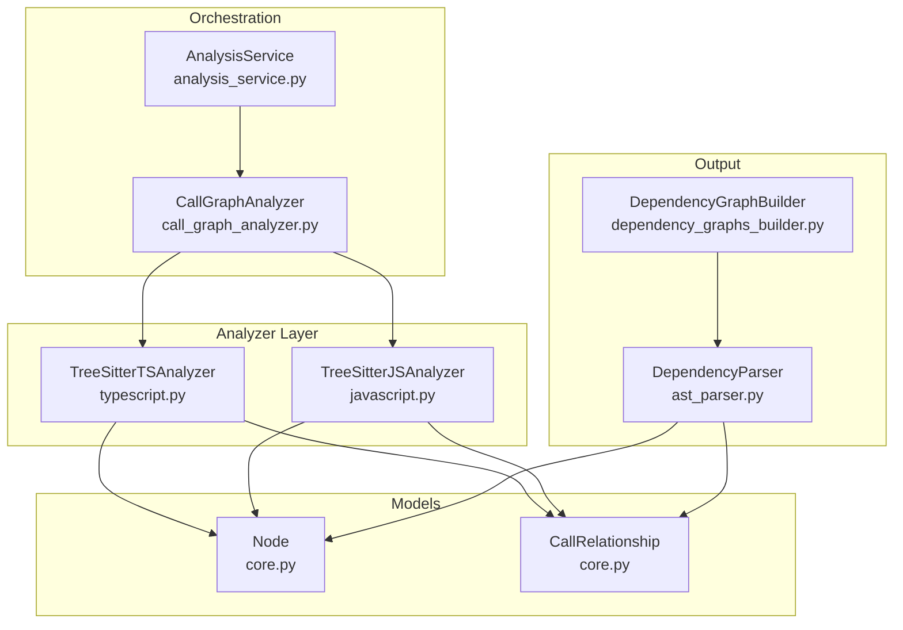
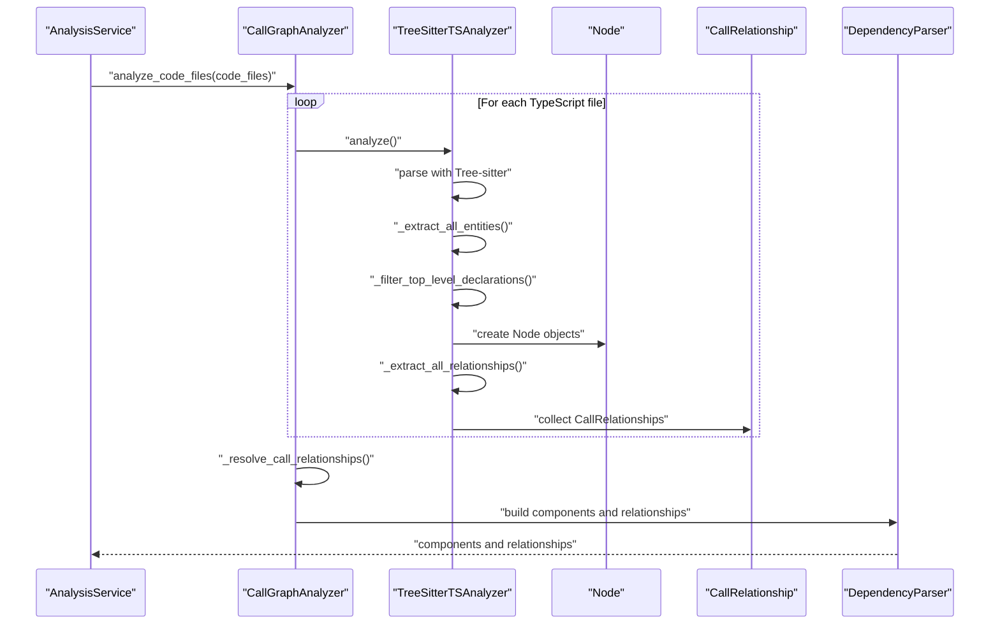
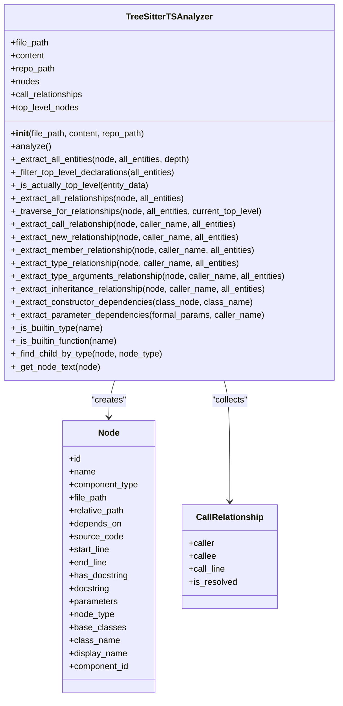
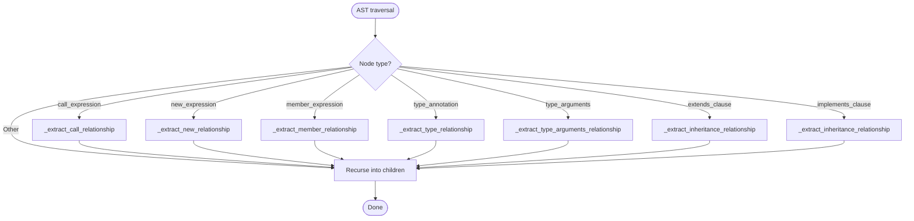
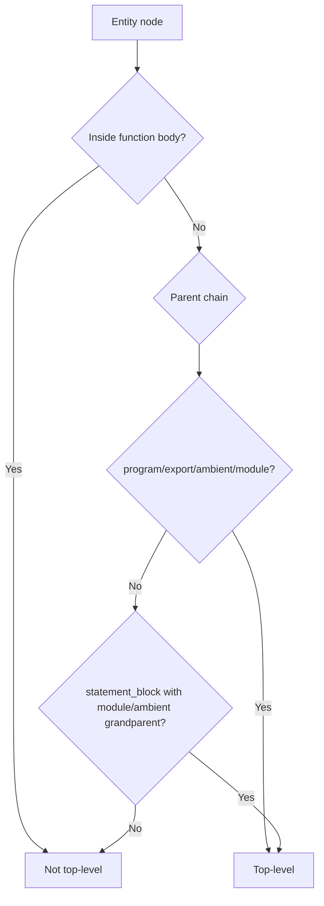
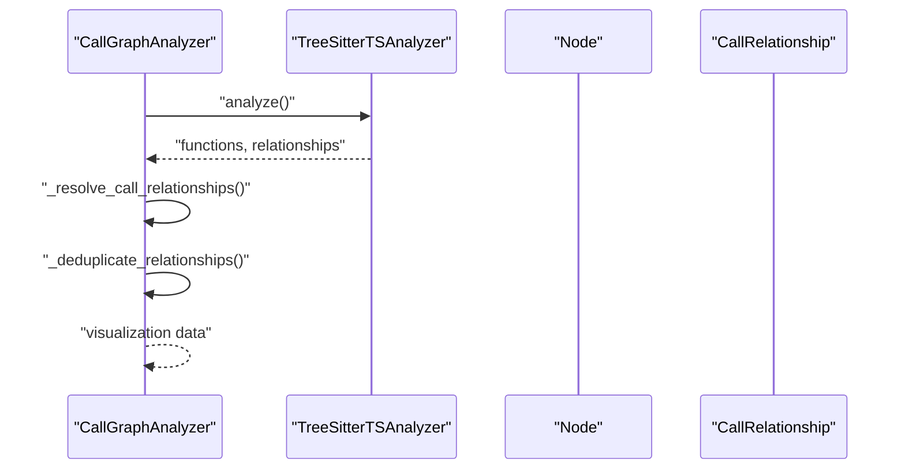
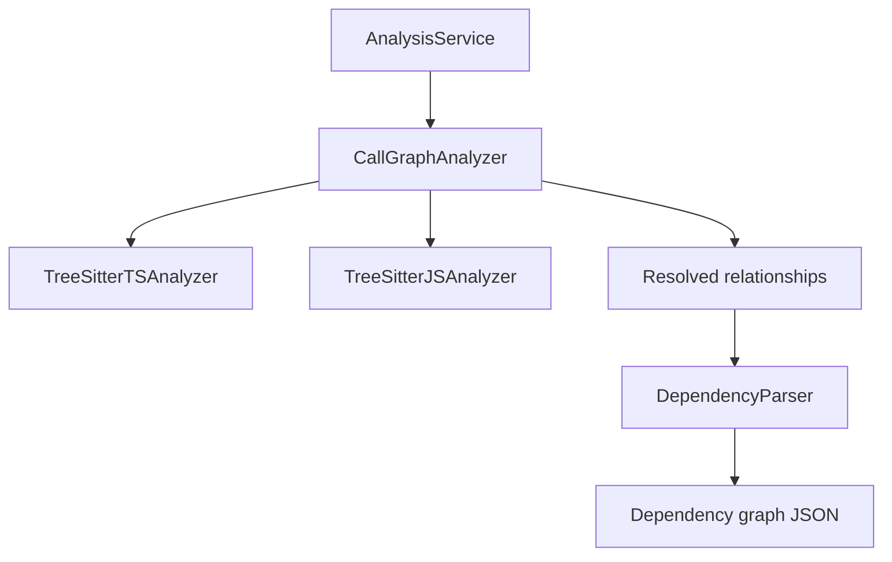

# TypeScript Code Analysis

<cite>
**Referenced Files in This Document**
- [typescript.py](file://codewiki/src/be/dependency_analyzer/analyzers/typescript.py)
- [javascript.py](file://codewiki/src/be/dependency_analyzer/analyzers/javascript.py)
- [call_graph_analyzer.py](file://codewiki/src/be/dependency_analyzer/analysis/call_graph_analyzer.py)
- [analysis_service.py](file://codewiki/src/be/dependency_analyzer/analysis/analysis_service.py)
- [ast_parser.py](file://codewiki/src/be/dependency_analyzer/ast_parser.py)
- [dependency_graphs_builder.py](file://codewiki/src/be/dependency_analyzer/dependency_graphs_builder.py)
- [core.py](file://codewiki/src/be/dependency_analyzer/models/core.py)
</cite>

## Table of Contents
1. [Introduction](#introduction)
2. [Project Structure](#project-structure)
3. [Core Components](#core-components)
4. [Architecture Overview](#architecture-overview)
5. [Detailed Component Analysis](#detailed-component-analysis)
6. [Dependency Analysis](#dependency-analysis)
7. [Performance Considerations](#performance-considerations)
8. [Troubleshooting Guide](#troubleshooting-guide)
9. [Conclusion](#conclusion)

## Introduction
This document explains CodeWiki’s TypeScript code analysis capabilities powered by Tree-sitter with the tree_sitter_typescript binding. It covers how the system parses TypeScript files, extracts top-level entities (classes, interfaces, functions, methods, type aliases, enums, variables, exports, ambient declarations), and builds a dependency graph capturing relationships such as inheritance, implementation, method calls, object construction, and type usage. It also documents the multi-phase analysis process, TypeScript-specific handling (type annotations, generics, ambient declarations, constructor parameter dependencies), and known limitations.

## Project Structure
The TypeScript analysis lives in the dependency analyzer subsystem and integrates with the broader call graph pipeline:
- Language-specific analyzers: TypeScript and JavaScript
- Call graph orchestration: extracting code files, invoking analyzers, resolving relationships
- Model definitions: Node and CallRelationship
- Graph builder and persistence: saving dependency graphs and computing leaf nodes

**Diagram sources**
- [typescript.py](file://codewiki/src/be/dependency_analyzer/analyzers/typescript.py#L1-L120)
- [javascript.py](file://codewiki/src/be/dependency_analyzer/analyzers/javascript.py#L1-L120)
- [call_graph_analyzer.py](file://codewiki/src/be/dependency_analyzer/analysis/call_graph_analyzer.py#L1-L120)
- [analysis_service.py](file://codewiki/src/be/dependency_analyzer/analysis/analysis_service.py#L1-L120)
- [core.py](file://codewiki/src/be/dependency_analyzer/models/core.py#L1-L64)
- [ast_parser.py](file://codewiki/src/be/dependency_analyzer/ast_parser.py#L1-L120)
- [dependency_graphs_builder.py](file://codewiki/src/be/dependency_analyzer/dependency_graphs_builder.py#L1-L94)

**Section sources**
- [typescript.py](file://codewiki/src/be/dependency_analyzer/analyzers/typescript.py#L1-L120)
- [call_graph_analyzer.py](file://codewiki/src/be/dependency_analyzer/analysis/call_graph_analyzer.py#L1-L120)
- [analysis_service.py](file://codewiki/src/be/dependency_analyzer/analysis/analysis_service.py#L1-L120)
- [core.py](file://codewiki/src/be/dependency_analyzer/models/core.py#L1-L64)

## Core Components
- TreeSitterTSAnalyzer: Parses TypeScript with Tree-sitter, extracts entities, filters top-level declarations, and identifies relationships.
- CallGraphAnalyzer: Orchestrates multi-language analysis, invokes language-specific analyzers, resolves relationships, and generates visualization data.
- AnalysisService: High-level orchestration for repository analysis, including structure analysis and call graph generation.
- DependencyParser: Converts analysis results into Node and CallRelationship objects and persists the dependency graph.
- DependencyGraphBuilder: Builds and saves the dependency graph JSON and computes leaf nodes.

Key responsibilities:
- Entity extraction: functions, methods, classes, interfaces, type aliases, enums, variables, exports, ambient declarations.
- Top-level filtering: distinguishes top-level declarations from nested scopes.
- Relationship extraction: calls, new expressions, member/subscript access, type annotations, type arguments, inheritance/implements.
- Constructor parameter dependencies: maps constructor parameter types to dependencies.
- Built-in type and function filtering: avoids treating primitives and built-ins as external dependencies.

**Section sources**
- [typescript.py](file://codewiki/src/be/dependency_analyzer/analyzers/typescript.py#L1-L120)
- [call_graph_analyzer.py](file://codewiki/src/be/dependency_analyzer/analysis/call_graph_analyzer.py#L1-L120)
- [analysis_service.py](file://codewiki/src/be/dependency_analyzer/analysis/analysis_service.py#L270-L324)
- [ast_parser.py](file://codewiki/src/be/dependency_analyzer/ast_parser.py#L1-L120)
- [dependency_graphs_builder.py](file://codewiki/src/be/dependency_analyzer/dependency_graphs_builder.py#L1-L94)

## Architecture Overview
The TypeScript analysis pipeline:
1. AnalysisService discovers code files and routes them to CallGraphAnalyzer.
2. CallGraphAnalyzer selects TypeScript analyzer for .ts/.tsx files.
3. TreeSitterTSAnalyzer performs a two-phase parse:
   - Phase 1: Traverse AST to collect all entities.
   - Phase 2: Filter top-level declarations and create Node objects.
   - Phase 3: Traverse AST again to extract relationships.
4. CallGraphAnalyzer resolves relationships and deduplicates.
5. DependencyParser constructs Node and CallRelationship objects and saves the graph.

**Diagram sources**
- [analysis_service.py](file://codewiki/src/be/dependency_analyzer/analysis/analysis_service.py#L273-L294)
- [call_graph_analyzer.py](file://codewiki/src/be/dependency_analyzer/analysis/call_graph_analyzer.py#L1-L120)
- [typescript.py](file://codewiki/src/be/dependency_analyzer/analyzers/typescript.py#L39-L80)
- [ast_parser.py](file://codewiki/src/be/dependency_analyzer/ast_parser.py#L47-L110)

## Detailed Component Analysis

### TreeSitterTSAnalyzer: Multi-Phase TypeScript Analysis
TreeSitterTSAnalyzer initializes a Tree-sitter parser using the tree_sitter_typescript binding, then executes a three-phase analysis:
- Phase 1: Extract all entities by traversing the AST and recognizing TypeScript grammar nodes for functions, methods, classes, interfaces, type aliases, enums, variables, exports, and ambient declarations.
- Phase 2: Filter top-level declarations to avoid nested or local scopes, create Node objects, and record constructor parameter dependencies.
- Phase 3: Traverse the AST again to extract relationships: function calls, constructor invocations, member access, subscript access, type annotations, type arguments, and inheritance/implements clauses.

Key implementation highlights:
- Parser initialization and error handling for missing bindings.
- AST traversal with recursion and depth tracking.
- Top-level detection logic considering program, export, ambient, module, and statement_block contexts.
- Relationship extraction methods for call, new, member, subscript, type annotation, type arguments, and inheritance clauses.
- Constructor parameter dependency extraction by walking class bodies and formal parameters.
- Built-in type and function filtering to avoid false positives.

**Diagram sources**
- [typescript.py](file://codewiki/src/be/dependency_analyzer/analyzers/typescript.py#L1-L120)
- [typescript.py](file://codewiki/src/be/dependency_analyzer/analyzers/typescript.py#L542-L573)
- [typescript.py](file://codewiki/src/be/dependency_analyzer/analyzers/typescript.py#L922-L933)
- [core.py](file://codewiki/src/be/dependency_analyzer/models/core.py#L1-L64)

**Section sources**
- [typescript.py](file://codewiki/src/be/dependency_analyzer/analyzers/typescript.py#L1-L120)
- [typescript.py](file://codewiki/src/be/dependency_analyzer/analyzers/typescript.py#L120-L220)
- [typescript.py](file://codewiki/src/be/dependency_analyzer/analyzers/typescript.py#L220-L380)
- [typescript.py](file://codewiki/src/be/dependency_analyzer/analyzers/typescript.py#L380-L580)
- [typescript.py](file://codewiki/src/be/dependency_analyzer/analyzers/typescript.py#L580-L720)
- [typescript.py](file://codewiki/src/be/dependency_analyzer/analyzers/typescript.py#L720-L982)

### Relationship Extraction: _extract_all_relationships and Traversal
The analyzer traverses the AST to identify relationships:
- Calls: call_expression nodes mapped to function/class names.
- Constructor invocations: new_expression nodes mapped to constructor targets.
- Member access: member_expression nodes mapped to property names.
- Subscript access: subscript_expression nodes (placeholder in current implementation).
- Type usage: type_annotation nodes and type_identifier children.
- Generic type arguments: type_arguments nodes with type_identifier children.
- Inheritance/implementation: extends_clause and implements_clause nodes.

**Diagram sources**
- [typescript.py](file://codewiki/src/be/dependency_analyzer/analyzers/typescript.py#L686-L780)
- [typescript.py](file://codewiki/src/be/dependency_analyzer/analyzers/typescript.py#L781-L982)

**Section sources**
- [typescript.py](file://codewiki/src/be/dependency_analyzer/analyzers/typescript.py#L686-L780)
- [typescript.py](file://codewiki/src/be/dependency_analyzer/analyzers/typescript.py#L781-L982)

### TypeScript-Specific Features
- Type annotations and generics:
  - Type annotations are extracted via type_annotation nodes and their type_identifier children.
  - Generic type arguments are captured under type_arguments nodes.
  - The analyzer collects all type_identifier nodes within a type annotation and maps them to relationships, resolving to top-level entities when possible.
- Ambient declarations:
  - Ambient declarations are recognized and recorded with ambient modifier and module/namespace context.
- Constructor parameter dependencies:
  - Constructor parameter types are extracted from formal_parameters and linked to their referenced types as dependencies.
- Export statements:
  - Exported functions, classes, interfaces, and arrow functions are identified and included as top-level nodes.

Concrete examples from the code:
- Type annotation traversal and relationship creation: [_extract_type_relationship](file://codewiki/src/be/dependency_analyzer/analyzers/typescript.py#L855-L877)
- Generic type argument extraction: [_extract_type_arguments_relationship](file://codewiki/src/be/dependency_analyzer/analyzers/typescript.py#L885-L897)
- Constructor parameter dependency extraction: [_extract_constructor_dependencies](file://codewiki/src/be/dependency_analyzer/analyzers/typescript.py#L582-L624), [_extract_parameter_dependencies](file://codewiki/src/be/dependency_analyzer/analyzers/typescript.py#L601-L624)
- Ambient declaration extraction: [_extract_ambient_declaration_entity](file://codewiki/src/be/dependency_analyzer/analyzers/typescript.py#L160-L182)

**Section sources**
- [typescript.py](file://codewiki/src/be/dependency_analyzer/analyzers/typescript.py#L582-L624)
- [typescript.py](file://codewiki/src/be/dependency_analyzer/analyzers/typescript.py#L601-L624)
- [typescript.py](file://codewiki/src/be/dependency_analyzer/analyzers/typescript.py#L855-L877)
- [typescript.py](file://codewiki/src/be/dependency_analyzer/analyzers/typescript.py#L885-L897)
- [typescript.py](file://codewiki/src/be/dependency_analyzer/analyzers/typescript.py#L160-L182)

### Top-Level Declaration Filtering
Top-level detection considers:
- Program root, export statements, ambient declarations, module blocks, and statement blocks.
- Excludes nested function bodies and local scopes.
- Records constructor dependencies for class declarations.

**Diagram sources**
- [typescript.py](file://codewiki/src/be/dependency_analyzer/analyzers/typescript.py#L114-L147)
- [typescript.py](file://codewiki/src/be/dependency_analyzer/analyzers/typescript.py#L148-L159)

**Section sources**
- [typescript.py](file://codewiki/src/be/dependency_analyzer/analyzers/typescript.py#L114-L159)

### Relationship Resolution and Deduplication
After collecting relationships, CallGraphAnalyzer:
- Resolves call targets by matching names to function IDs and component IDs.
- Deduplicates relationships by caller-callee pairs.
- Generates visualization data for graph rendering.

**Diagram sources**
- [call_graph_analyzer.py](file://codewiki/src/be/dependency_analyzer/analysis/call_graph_analyzer.py#L327-L381)
- [call_graph_analyzer.py](file://codewiki/src/be/dependency_analyzer/analysis/call_graph_analyzer.py#L452-L536)

**Section sources**
- [call_graph_analyzer.py](file://codewiki/src/be/dependency_analyzer/analysis/call_graph_analyzer.py#L327-L381)
- [call_graph_analyzer.py](file://codewiki/src/be/dependency_analyzer/analysis/call_graph_analyzer.py#L452-L536)

## Dependency Analysis
- Language routing: CallGraphAnalyzer routes TypeScript files to TreeSitterTSAnalyzer.
- Supported languages: AnalysisService lists supported languages including TypeScript.
- Relationship resolution: CallGraphAnalyzer resolves relationships across languages and deduplicates edges.
- Output: DependencyParser converts results to Node and CallRelationship objects and saves JSON.

**Diagram sources**
- [analysis_service.py](file://codewiki/src/be/dependency_analyzer/analysis/analysis_service.py#L273-L294)
- [call_graph_analyzer.py](file://codewiki/src/be/dependency_analyzer/analysis/call_graph_analyzer.py#L104-L141)
- [ast_parser.py](file://codewiki/src/be/dependency_analyzer/ast_parser.py#L47-L110)
- [dependency_graphs_builder.py](file://codewiki/src/be/dependency_analyzer/dependency_graphs_builder.py#L18-L67)

**Section sources**
- [analysis_service.py](file://codewiki/src/be/dependency_analyzer/analysis/analysis_service.py#L273-L294)
- [call_graph_analyzer.py](file://codewiki/src/be/dependency_analyzer/analysis/call_graph_analyzer.py#L104-L141)
- [ast_parser.py](file://codewiki/src/be/dependency_analyzer/ast_parser.py#L47-L110)
- [dependency_graphs_builder.py](file://codewiki/src/be/dependency_analyzer/dependency_graphs_builder.py#L18-L67)

## Performance Considerations
- Tree-sitter parsing is efficient for large files; however, deep recursion during AST traversal can increase overhead. The analyzer limits relationship extraction to top-level contexts and uses early exits for built-in types/functions.
- Relationship deduplication reduces noise and improves downstream visualization performance.
- Consider limiting the number of analyzed files in large repositories to control memory and runtime.

[No sources needed since this section provides general guidance]

## Troubleshooting Guide
Common issues and mitigations:
- Parser initialization failures: If the tree_sitter_typescript binding is unavailable, the analyzer logs an error and skips analysis for that file. Ensure the binding is installed and accessible.
- Missing relationships: Built-in types and functions are filtered out to reduce noise. If a dependency appears missing, verify it is not a built-in and that it is declared in the repository.
- Incorrect top-level detection: If a nested function appears as a top-level node, review the top-level detection logic and ensure the node is not inside a function body or local scope.
- Generic type limitations: Complex generic types with nested generics and union types may not resolve precisely. Simplify type annotations or rely on top-level entity resolution.

**Section sources**
- [typescript.py](file://codewiki/src/be/dependency_analyzer/analyzers/typescript.py#L28-L38)
- [typescript.py](file://codewiki/src/be/dependency_analyzer/analyzers/typescript.py#L944-L955)
- [typescript.py](file://codewiki/src/be/dependency_analyzer/analyzers/typescript.py#L114-L159)

## Conclusion
CodeWiki’s TypeScript analysis leverages Tree-sitter to robustly parse TypeScript files, extract top-level entities, and build a comprehensive dependency graph. The analyzer supports TypeScript-specific features like type annotations, generics, ambient declarations, and constructor parameter dependencies. While the current implementation focuses on top-level relationships and filters built-ins, it provides a solid foundation for richer type analysis and can be extended to handle complex generic types and declaration merging scenarios.