# HTML Viewer Generation

<cite>
**Referenced Files in This Document**
- [html_generator.py](file://codewiki/cli/html_generator.py)
- [viewer_template.html](file://codewiki/templates/github_pages/viewer_template.html)
- [doc_generator.py](file://codewiki/cli/adapters/doc_generator.py)
- [generate.py](file://codewiki/cli/commands/generate.py)
- [main.py](file://codewiki/cli/main.py)
- [documentation_generator.py](file://codewiki/src/be/documentation_generator.py)
- [config.py](file://codewiki/src/config.py)
</cite>

## Table of Contents
1. [Introduction](#introduction)
2. [Project Structure](#project-structure)
3. [Core Components](#core-components)
4. [Architecture Overview](#architecture-overview)
5. [Detailed Component Analysis](#detailed-component-analysis)
6. [Dependency Analysis](#dependency-analysis)
7. [Performance Considerations](#performance-considerations)
8. [Troubleshooting Guide](#troubleshooting-guide)
9. [Conclusion](#conclusion)
10. [Appendices](#appendices)

## Introduction
This document explains how CodeWiki generates a self-contained HTML viewer for GitHub Pages deployment. It focuses on the HTMLGenerator class, the template system using viewer_template.html, the auto-loading mechanism for module_tree.json and metadata.json, the client-side markdown rendering pipeline with marked.js, Mermaid diagram visualization, responsive design, dark mode support, loading states, error handling, internal link routing, and customization options.

## Project Structure
The HTML viewer generation spans CLI adapters, backend generation, and a static template. The key files are:
- CLI HTML generator: builds index.html from a template and embeds configuration
- Template: defines layout, styles, and client-side JavaScript
- Backend generation: produces module_tree.json, metadata.json, and markdown files
- CLI orchestration: wires everything together and triggers HTML generation

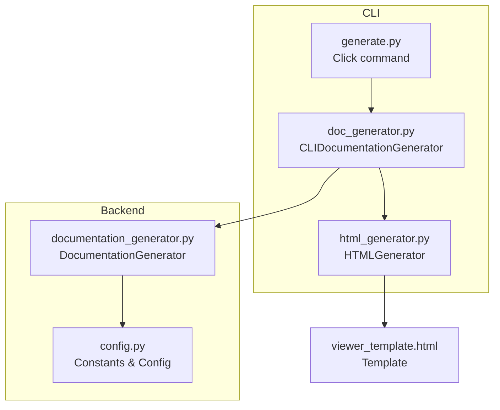

**Diagram sources**
- [generate.py](file://codewiki/cli/commands/generate.py#L1-L266)
- [doc_generator.py](file://codewiki/cli/adapters/doc_generator.py#L1-L289)
- [html_generator.py](file://codewiki/cli/html_generator.py#L1-L285)
- [documentation_generator.py](file://codewiki/src/be/documentation_generator.py#L1-L200)
- [config.py](file://codewiki/src/config.py#L1-L114)
- [viewer_template.html](file://codewiki/templates/github_pages/viewer_template.html#L1-L644)

**Section sources**
- [generate.py](file://codewiki/cli/commands/generate.py#L1-L266)
- [doc_generator.py](file://codewiki/cli/adapters/doc_generator.py#L1-L289)
- [html_generator.py](file://codewiki/cli/html_generator.py#L1-L285)
- [documentation_generator.py](file://codewiki/src/be/documentation_generator.py#L1-L200)
- [config.py](file://codewiki/src/config.py#L1-L114)
- [viewer_template.html](file://codewiki/templates/github_pages/viewer_template.html#L1-L644)

## Core Components
- HTMLGenerator: loads module_tree.json and metadata.json (auto-loading from docs directory), renders viewer_template.html, and writes index.html
- viewer_template.html: defines layout, styles, and client-side JavaScript for navigation, markdown rendering, Mermaid diagrams, and routing
- CLIDocumentationGenerator: orchestrates backend generation and triggers HTML generation with auto-loading of docs artifacts
- Backend generation: creates module_tree.json, metadata.json, and overview.md

Key responsibilities:
- Auto-loading: If module_tree.json or metadata.json are missing, HTMLGenerator falls back gracefully
- Embedding: The template receives CONFIG_JSON, MODULE_TREE_JSON, METADATA_JSON, and DOCS_BASE_PATH
- Client-side rendering: marked.js converts markdown to HTML; Mermaid renders diagrams; internal links are intercepted and routed

**Section sources**
- [html_generator.py](file://codewiki/cli/html_generator.py#L35-L172)
- [viewer_template.html](file://codewiki/templates/github_pages/viewer_template.html#L399-L640)
- [doc_generator.py](file://codewiki/cli/adapters/doc_generator.py#L249-L279)
- [documentation_generator.py](file://codewiki/src/be/documentation_generator.py#L38-L72)

## Architecture Overview
The HTML viewer generation pipeline:

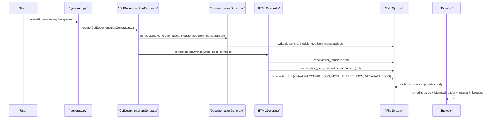

**Diagram sources**
- [generate.py](file://codewiki/cli/commands/generate.py#L186-L214)
- [doc_generator.py](file://codewiki/cli/adapters/doc_generator.py#L145-L179)
- [doc_generator.py](file://codewiki/cli/adapters/doc_generator.py#L249-L279)
- [html_generator.py](file://codewiki/cli/html_generator.py#L107-L171)
- [viewer_template.html](file://codewiki/templates/github_pages/viewer_template.html#L406-L640)

## Detailed Component Analysis

### HTMLGenerator: Template Rendering and Auto-Loading
- Auto-loading module_tree.json and metadata.json from docs directory when not explicitly provided
- Builds repository info section from metadata (generation info, statistics)
- Embeds configuration, module tree, and metadata into the template
- Computes DOCS_BASE_PATH to resolve relative paths for GitHub Pages deployments
- Writes a self-contained index.html with embedded styles and scripts

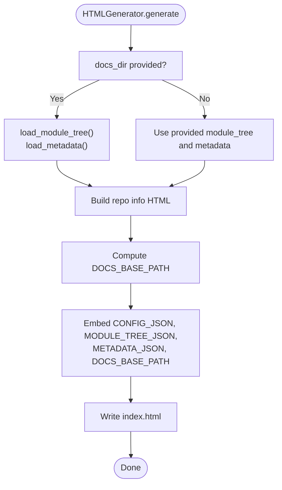

**Diagram sources**
- [html_generator.py](file://codewiki/cli/html_generator.py#L107-L171)
- [html_generator.py](file://codewiki/cli/html_generator.py#L173-L218)

**Section sources**
- [html_generator.py](file://codewiki/cli/html_generator.py#L35-L172)
- [html_generator.py](file://codewiki/cli/html_generator.py#L173-L218)

### Template System: Placeholder Replacement and Embedded Assets
- Placeholders replaced at runtime:
  - {{TITLE}}
  - {{REPO_LINK}}
  - {{SHOW_INFO}}
  - {{INFO_CONTENT}}
  - {{CONFIG_JSON}}
  - {{MODULE_TREE_JSON}}
  - {{METADATA_JSON}}
  - {{DOCS_BASE_PATH}}
- Embedded assets:
  - marked.min.js for markdown rendering
  - mermaid.min.js for diagram rendering
- Client-side initialization sets up navigation, markdown rendering, Mermaid rendering, and internal link routing

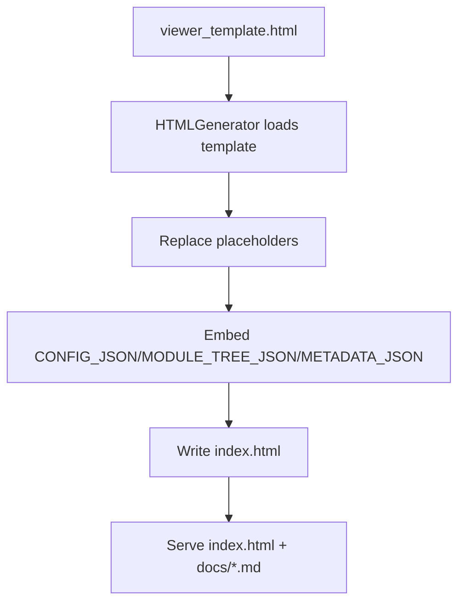

**Diagram sources**
- [viewer_template.html](file://codewiki/templates/github_pages/viewer_template.html#L1-L644)
- [html_generator.py](file://codewiki/cli/html_generator.py#L152-L171)

**Section sources**
- [viewer_template.html](file://codewiki/templates/github_pages/viewer_template.html#L1-L644)
- [html_generator.py](file://codewiki/cli/html_generator.py#L152-L171)

### Auto-Loading Mechanism
- If module_tree.json is missing, HTMLGenerator provides a minimal fallback structure with an "Overview" node
- If metadata.json is missing, HTMLGenerator proceeds without repo info
- Both are loaded safely with error handling and graceful degradation

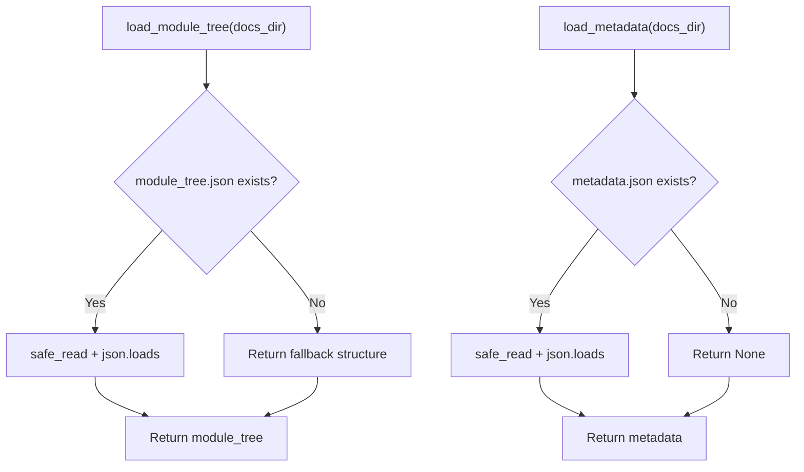

**Diagram sources**
- [html_generator.py](file://codewiki/cli/html_generator.py#L35-L82)

**Section sources**
- [html_generator.py](file://codewiki/cli/html_generator.py#L35-L82)

### Client-Side Markdown Rendering and Mermaid Visualization
- marked.js is configured with options for GitHub Flavored Markdown and breaks
- Markdown content is fetched from docs directory (respecting DOCS_BASE_PATH)
- Mermaid diagrams are extracted from code blocks and rendered asynchronously
- Internal markdown links are intercepted and routed to loadDocument(filename) without page reload

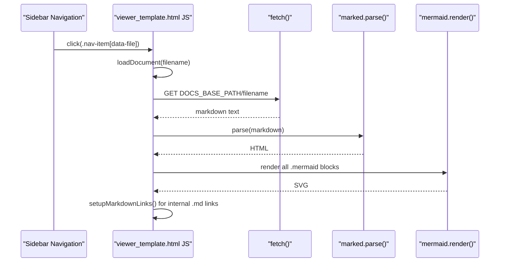

**Diagram sources**
- [viewer_template.html](file://codewiki/templates/github_pages/viewer_template.html#L406-L640)

**Section sources**
- [viewer_template.html](file://codewiki/templates/github_pages/viewer_template.html#L406-L640)

### Responsive Design, Dark Mode Support, and Mobile Compatibility
- Responsive layout:
  - Sidebar collapses to top bar on smaller screens
  - Content adjusts margins and widths accordingly
- Dark mode:
  - CSS variables define theme colors
  - Mermaid themeVariables align with CSS variables
- Mobile compatibility:
  - Media queries adjust sidebar and content layout
  - Touch-friendly navigation items

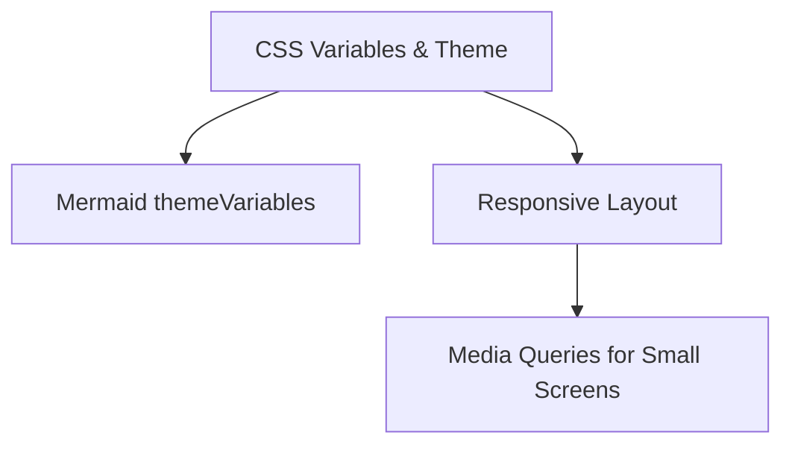

**Diagram sources**
- [viewer_template.html](file://codewiki/templates/github_pages/viewer_template.html#L1-L367)
- [viewer_template.html](file://codewiki/templates/github_pages/viewer_template.html#L414-L428)

**Section sources**
- [viewer_template.html](file://codewiki/templates/github_pages/viewer_template.html#L1-L367)
- [viewer_template.html](file://codewiki/templates/github_pages/viewer_template.html#L414-L428)

### Loading States, Error Handling, and Internal Link Routing
- Loading states:
  - Spinner and message while fetching and rendering
  - Content hidden until ready
- Error handling:
  - On fetch failure or parsing errors, an error message is shown
  - Mermaid rendering errors are caught and displayed as plain text
- Internal link routing:
  - Event delegation intercepts clicks on markdown links ending with .md
  - Extracts filename and loads via loadDocument, updating active state

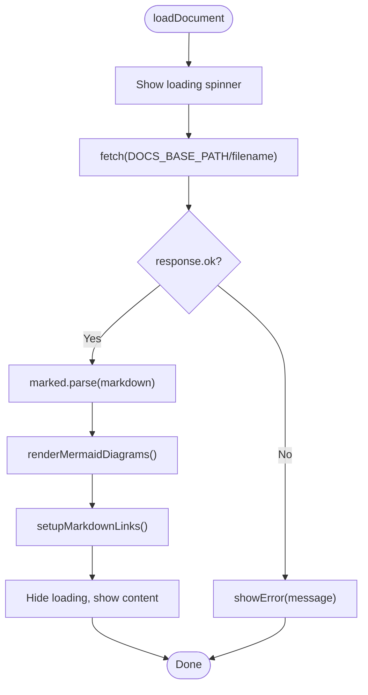

**Diagram sources**
- [viewer_template.html](file://codewiki/templates/github_pages/viewer_template.html#L502-L536)
- [viewer_template.html](file://codewiki/templates/github_pages/viewer_template.html#L538-L586)
- [viewer_template.html](file://codewiki/templates/github_pages/viewer_template.html#L588-L625)
- [viewer_template.html](file://codewiki/templates/github_pages/viewer_template.html#L627-L640)

**Section sources**
- [viewer_template.html](file://codewiki/templates/github_pages/viewer_template.html#L502-L640)

### Backend Artifacts and File Naming Conventions
- Backend generation creates:
  - module_tree.json (final module tree)
  - first_module_tree.json (intermediate clustering)
  - overview.md (repository overview)
  - metadata.json (generation info and statistics)
- Constants define filenames and docs directory

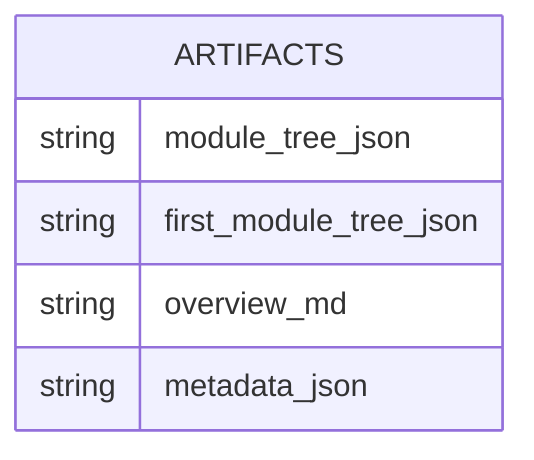

**Diagram sources**
- [documentation_generator.py](file://codewiki/src/be/documentation_generator.py#L38-L72)
- [config.py](file://codewiki/src/config.py#L8-L18)

**Section sources**
- [documentation_generator.py](file://codewiki/src/be/documentation_generator.py#L38-L72)
- [config.py](file://codewiki/src/config.py#L8-L18)

### GitHub Pages Deployment and Relative Paths
- DOCS_BASE_PATH is computed to ensure docs/*.md are fetched correctly from GitHub Pages
- HTMLGenerator detects repository URL and GitHub Pages URL to populate the viewer

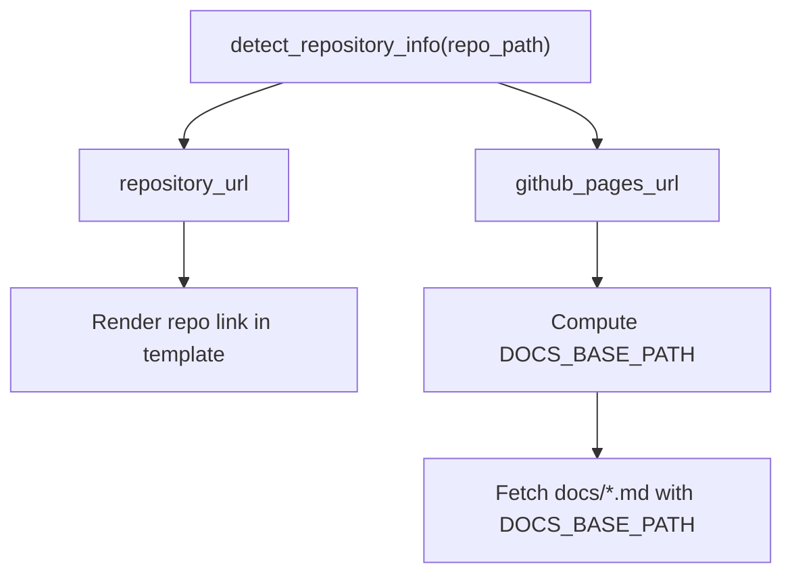

**Diagram sources**
- [html_generator.py](file://codewiki/cli/html_generator.py#L238-L284)
- [html_generator.py](file://codewiki/cli/html_generator.py#L136-L146)
- [viewer_template.html](file://codewiki/templates/github_pages/viewer_template.html#L509-L511)

**Section sources**
- [html_generator.py](file://codewiki/cli/html_generator.py#L136-L146)
- [html_generator.py](file://codewiki/cli/html_generator.py#L238-L284)
- [viewer_template.html](file://codewiki/templates/github_pages/viewer_template.html#L509-L511)

### Customization Examples
- Branding:
  - Modify CSS variables in the template to change primary colors and backgrounds
  - Adjust logo and title placement
- Additional functionality:
  - Extend CONFIG_JSON to pass extra client-side options
  - Add custom info rows in the repo info section by extending the info content builder
  - Customize Mermaid theme variables for different diagram styles

[No sources needed since this section provides general guidance]

## Dependency Analysis
- CLI command generate invokes CLIDocumentationGenerator
- CLIDocumentationGenerator runs backend generation and then HTML generation
- HTMLGenerator depends on:
  - Template file existence
  - Docs directory contents (module_tree.json, metadata.json)
  - Safe file I/O utilities
- Template depends on external CDN-hosted libraries (marked.js, mermaid.min.js)

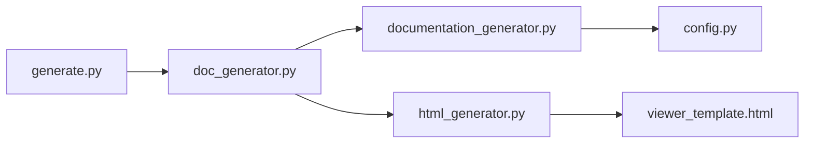

**Diagram sources**
- [generate.py](file://codewiki/cli/commands/generate.py#L186-L214)
- [doc_generator.py](file://codewiki/cli/adapters/doc_generator.py#L145-L179)
- [doc_generator.py](file://codewiki/cli/adapters/doc_generator.py#L249-L279)
- [html_generator.py](file://codewiki/cli/html_generator.py#L107-L171)
- [documentation_generator.py](file://codewiki/src/be/documentation_generator.py#L38-L72)
- [config.py](file://codewiki/src/config.py#L1-L114)

**Section sources**
- [generate.py](file://codewiki/cli/commands/generate.py#L186-L214)
- [doc_generator.py](file://codewiki/cli/adapters/doc_generator.py#L145-L179)
- [doc_generator.py](file://codewiki/cli/adapters/doc_generator.py#L249-L279)
- [html_generator.py](file://codewiki/cli/html_generator.py#L107-L171)
- [documentation_generator.py](file://codewiki/src/be/documentation_generator.py#L38-L72)
- [config.py](file://codewiki/src/config.py#L1-L114)

## Performance Considerations
- Minimizing DOM updates: Mermaid rendering is batched and ids are assigned before rendering
- Efficient navigation: buildNavigation constructs the sidebar once and reuses event listeners
- Lazy loading: markdown is fetched on demand, reducing initial payload
- CDN assets: marked.js and mermaid.min.js are cached by browsers

[No sources needed since this section provides general guidance]

## Troubleshooting Guide
Common issues and resolutions:
- Template not found:
  - Ensure the template directory path is correct and viewer_template.html exists
- Missing module_tree.json or metadata.json:
  - HTMLGenerator falls back gracefully; verify docs directory contents
- Fetch failures for .md files:
  - Check DOCS_BASE_PATH correctness for GitHub Pages deployments
  - Verify file names match module keys (e.g., Overview -> overview.md)
- Mermaid rendering errors:
  - Inspect the mermaid code block content; errors are displayed as plain text
- Internal link routing not working:
  - Ensure links end with .md and are within the docs directory

**Section sources**
- [html_generator.py](file://codewiki/cli/html_generator.py#L120-L126)
- [viewer_template.html](file://codewiki/templates/github_pages/viewer_template.html#L509-L536)
- [viewer_template.html](file://codewiki/templates/github_pages/viewer_template.html#L610-L625)

## Conclusion
The HTML viewer generation process in CodeWiki combines backend artifact production with a self-contained static HTML template. HTMLGenerator auto-loads module_tree.json and metadata.json, embeds configuration, and writes a responsive, client-side viewer powered by marked.js and Mermaid. The template’s design supports GitHub Pages deployment, with robust loading states, error handling, and internal link routing for seamless navigation.

## Appendices
- Example placeholder list:
  - {{TITLE}}, {{REPO_LINK}}, {{SHOW_INFO}}, {{INFO_CONTENT}}, {{CONFIG_JSON}}, {{MODULE_TREE_JSON}}, {{METADATA_JSON}}, {{DOCS_BASE_PATH}}

[No sources needed since this section provides general guidance]