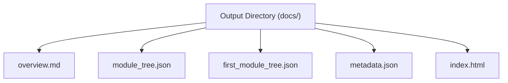
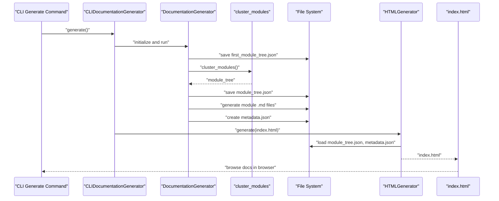
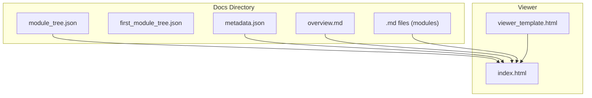

# Output Directory Structure

<cite>
**Referenced Files in This Document**
- [README.md](file://README.md)
- [codewiki/src/config.py](file://codewiki/src/config.py)
- [codewiki/src/be/documentation_generator.py](file://codewiki/src/be/documentation_generator.py)
- [codewiki/src/be/cluster_modules.py](file://codewiki/src/be/cluster_modules.py)
- [codewiki/cli/adapters/doc_generator.py](file://codewiki/cli/adapters/doc_generator.py)
- [codewiki/cli/commands/generate.py](file://codewiki/cli/commands/generate.py)
- [codewiki/cli/html_generator.py](file://codewiki/cli/html_generator.py)
- [codewiki/templates/github_pages/viewer_template.html](file://codewiki/templates/github_pages/viewer_template.html)
- [codewiki/src/fe/routes.py](file://codewiki/src/fe/routes.py)
- [codewiki/src/fe/templates.py](file://codewiki/src/fe/templates.py)
</cite>

## Table of Contents
1. [Introduction](#introduction)
2. [Project Structure](#project-structure)
3. [Core Components](#core-components)
4. [Architecture Overview](#architecture-overview)
5. [Detailed Component Analysis](#detailed-component-analysis)
6. [Dependency Analysis](#dependency-analysis)
7. [Performance Considerations](#performance-considerations)
8. [Troubleshooting Guide](#troubleshooting-guide)
9. [Conclusion](#conclusion)

## Introduction
This document explains the complete output directory structure generated by CodeWiki’s documentation pipeline. It focuses on the files produced during generation and how they work together to form a cohesive, navigable documentation suite. The structure includes:
- overview.md: repository-level summary
- module-specific markdown files (e.g., auth.md, database.md)
- module_tree.json: hierarchical navigation structure
- first_module_tree.json: initial clustering result
- metadata.json: generation statistics and LLM configuration
- index.html: interactive viewer (when generated)

These files enable both human-readable documentation and a browsable, GitHub Pages–ready viewer.

## Project Structure
The output directory is organized around a docs-like layout with a clear separation of content and presentation:
- overview.md: repository overview and architecture guide
- module-specific .md files: per-module documentation
- module_tree.json: hierarchical module tree used for navigation
- first_module_tree.json: initial clustering result for reuse
- metadata.json: generation metadata and statistics
- index.html: interactive viewer for browsing documentation

**Diagram sources**
- [README.md](file://README.md#L160-L171)
- [codewiki/src/config.py](file://codewiki/src/config.py#L8-L15)
- [codewiki/src/be/documentation_generator.py](file://codewiki/src/be/documentation_generator.py#L38-L72)
- [codewiki/cli/adapters/doc_generator.py](file://codewiki/cli/adapters/doc_generator.py#L262-L278)
- [codewiki/cli/html_generator.py](file://codewiki/cli/html_generator.py#L35-L82)

**Section sources**
- [README.md](file://README.md#L160-L171)
- [codewiki/src/config.py](file://codewiki/src/config.py#L8-L15)

## Core Components
Each file serves a distinct role in the documentation suite:

- overview.md
  - Purpose: Repository-level overview and architecture guide
  - Produced by: Backend documentation generator
  - Behavior: Created after processing modules; renamed from the repository root module’s temporary file
  - Reference: [codewiki/src/be/documentation_generator.py](file://codewiki/src/be/documentation_generator.py#L188-L196)

- module-specific markdown files (e.g., auth.md, database.md)
  - Purpose: AI-generated documentation for each module
  - Produced by: Agent orchestrator and LLM prompts during dynamic programming pass
  - Reference: [codewiki/src/be/documentation_generator.py](file://codewiki/src/be/documentation_generator.py#L124-L187)

- module_tree.json
  - Purpose: Final hierarchical module structure used for navigation
  - Produced by: Clustering and subsequent processing; saved after generation
  - Reference: [codewiki/src/be/documentation_generator.py](file://codewiki/src/be/documentation_generator.py#L188-L191)

- first_module_tree.json
  - Purpose: Initial clustering result for reuse and caching
  - Produced by: Clustering function; saved early in generation
  - Reference: [codewiki/src/be/cluster_modules.py](file://codewiki/src/be/cluster_modules.py#L44-L113), [codewiki/cli/adapters/doc_generator.py](file://codewiki/cli/adapters/doc_generator.py#L208-L214)

- metadata.json
  - Purpose: Generation metadata and statistics (LLM model, timestamps, counts)
  - Produced by: Backend documentation generator
  - Reference: [codewiki/src/be/documentation_generator.py](file://codewiki/src/be/documentation_generator.py#L38-L72)

- index.html
  - Purpose: Interactive viewer for browsing documentation
  - Produced by: HTML generator using a template; loads module_tree.json and metadata.json
  - Reference: [codewiki/cli/html_generator.py](file://codewiki/cli/html_generator.py#L35-L82), [codewiki/templates/github_pages/viewer_template.html](file://codewiki/templates/github_pages/viewer_template.html#L399-L440), [codewiki/cli/adapters/doc_generator.py](file://codewiki/cli/adapters/doc_generator.py#L262-L278)

**Section sources**
- [codewiki/src/be/documentation_generator.py](file://codewiki/src/be/documentation_generator.py#L38-L72)
- [codewiki/src/be/documentation_generator.py](file://codewiki/src/be/documentation_generator.py#L124-L196)
- [codewiki/src/be/cluster_modules.py](file://codewiki/src/be/cluster_modules.py#L44-L113)
- [codewiki/cli/adapters/doc_generator.py](file://codewiki/cli/adapters/doc_generator.py#L208-L214)
- [codewiki/cli/html_generator.py](file://codewiki/cli/html_generator.py#L35-L82)
- [codewiki/templates/github_pages/viewer_template.html](file://codewiki/templates/github_pages/viewer_template.html#L399-L440)

## Architecture Overview
The generation pipeline produces the output files and the viewer consumes them to provide an interactive experience.

**Diagram sources**
- [codewiki/cli/commands/generate.py](file://codewiki/cli/commands/generate.py#L34-L110)
- [codewiki/cli/adapters/doc_generator.py](file://codewiki/cli/adapters/doc_generator.py#L149-L278)
- [codewiki/src/be/documentation_generator.py](file://codewiki/src/be/documentation_generator.py#L250-L292)
- [codewiki/src/be/cluster_modules.py](file://codewiki/src/be/cluster_modules.py#L44-L113)
- [codewiki/cli/html_generator.py](file://codewiki/cli/html_generator.py#L83-L172)

## Detailed Component Analysis

### overview.md
- Creation lifecycle
  - Generated per module during dynamic programming pass
  - Final repository overview is created last and renamed to overview.md
- Navigation linkage
  - Serves as the landing page for the documentation suite
- References
  - [codewiki/src/be/documentation_generator.py](file://codewiki/src/be/documentation_generator.py#L177-L196)

**Section sources**
- [codewiki/src/be/documentation_generator.py](file://codewiki/src/be/documentation_generator.py#L177-L196)

### module-specific markdown files (e.g., auth.md, database.md)
- Generation order
  - Leaf modules are processed first, then parent modules, culminating in the repository overview
- Naming convention
  - One .md file per module; filenames correspond to module names
- References
  - [codewiki/src/be/documentation_generator.py](file://codewiki/src/be/documentation_generator.py#L124-L187)

**Section sources**
- [codewiki/src/be/documentation_generator.py](file://codewiki/src/be/documentation_generator.py#L124-L187)

### module_tree.json
- Purpose
  - Final hierarchical structure used by the viewer for navigation
- Origin
  - Saved after clustering and processing; may be updated after parent module documentation generation
- References
  - [codewiki/src/be/documentation_generator.py](file://codewiki/src/be/documentation_generator.py#L188-L191)

**Section sources**
- [codewiki/src/be/documentation_generator.py](file://codewiki/src/be/documentation_generator.py#L188-L191)

### first_module_tree.json
- Purpose
  - Initial clustering result for caching and reuse
- Origin
  - Generated during module clustering and saved early in the pipeline
- References
  - [codewiki/src/be/cluster_modules.py](file://codewiki/src/be/cluster_modules.py#L44-L113)
  - [codewiki/cli/adapters/doc_generator.py](file://codewiki/cli/adapters/doc_generator.py#L208-L214)

**Section sources**
- [codewiki/src/be/cluster_modules.py](file://codewiki/src/be/cluster_modules.py#L44-L113)
- [codewiki/cli/adapters/doc_generator.py](file://codewiki/cli/adapters/doc_generator.py#L208-L214)

### metadata.json
- Content
  - generation_info: timestamp, main_model, generator_version, repo_path, commit_id
  - statistics: total_components, leaf_nodes, max_depth
  - files_generated: list of generated files
- References
  - [codewiki/src/be/documentation_generator.py](file://codewiki/src/be/documentation_generator.py#L38-L72)

**Section sources**
- [codewiki/src/be/documentation_generator.py](file://codewiki/src/be/documentation_generator.py#L38-L72)

### index.html
- Viewer behavior
  - Loads module_tree.json and metadata.json from the docs directory
  - Renders overview.md by default and supports navigation to module-specific .md files
  - Uses Mermaid for diagrams and Marked for Markdown rendering
- References
  - [codewiki/cli/html_generator.py](file://codewiki/cli/html_generator.py#L35-L82)
  - [codewiki/templates/github_pages/viewer_template.html](file://codewiki/templates/github_pages/viewer_template.html#L399-L440)
  - [codewiki/cli/adapters/doc_generator.py](file://codewiki/cli/adapters/doc_generator.py#L262-L278)

**Section sources**
- [codewiki/cli/html_generator.py](file://codewiki/cli/html_generator.py#L35-L82)
- [codewiki/templates/github_pages/viewer_template.html](file://codewiki/templates/github_pages/viewer_template.html#L399-L440)
- [codewiki/cli/adapters/doc_generator.py](file://codewiki/cli/adapters/doc_generator.py#L262-L278)

## Dependency Analysis
The viewer depends on the presence of module_tree.json and metadata.json in the docs directory. The HTML generator embeds configuration and data into index.html, which the browser uses to render the documentation.

**Diagram sources**
- [codewiki/cli/html_generator.py](file://codewiki/cli/html_generator.py#L35-L82)
- [codewiki/templates/github_pages/viewer_template.html](file://codewiki/templates/github_pages/viewer_template.html#L399-L440)

**Section sources**
- [codewiki/cli/html_generator.py](file://codewiki/cli/html_generator.py#L35-L82)
- [codewiki/templates/github_pages/viewer_template.html](file://codewiki/templates/github_pages/viewer_template.html#L399-L440)

## Performance Considerations
- Token limits influence clustering decisions and module sizes, which affects the number of generated .md files and the depth of module_tree.json.
- The viewer’s client-side rendering relies on fetching .md files; keeping module sizes balanced reduces network overhead.
- Using first_module_tree.json avoids recomputing clustering on subsequent runs, speeding up generation.

[No sources needed since this section provides general guidance]

## Troubleshooting Guide
Common issues and resolutions:
- Missing index.html
  - Ensure the HTML generation stage was executed (e.g., using the GitHub Pages flag)
  - Reference: [codewiki/cli/adapters/doc_generator.py](file://codewiki/cli/adapters/doc_generator.py#L262-L278)
- Missing module_tree.json or metadata.json
  - Regenerate documentation; these files are created during backend generation
  - Reference: [codewiki/src/be/documentation_generator.py](file://codewiki/src/be/documentation_generator.py#L38-L72)
- Viewer cannot load .md files
  - Confirm index.html is placed alongside the docs directory and that DOCS_BASE_PATH resolves correctly
  - Reference: [codewiki/templates/github_pages/viewer_template.html](file://codewiki/templates/github_pages/viewer_template.html#L502-L536)
- Navigation not appearing
  - Verify module_tree.json exists and is valid JSON
  - Reference: [codewiki/cli/html_generator.py](file://codewiki/cli/html_generator.py#L35-L59)

**Section sources**
- [codewiki/cli/adapters/doc_generator.py](file://codewiki/cli/adapters/doc_generator.py#L262-L278)
- [codewiki/src/be/documentation_generator.py](file://codewiki/src/be/documentation_generator.py#L38-L72)
- [codewiki/templates/github_pages/viewer_template.html](file://codewiki/templates/github_pages/viewer_template.html#L502-L536)
- [codewiki/cli/html_generator.py](file://codewiki/cli/html_generator.py#L35-L59)

## Conclusion
The output directory structure produced by CodeWiki is intentionally minimal yet powerful. The combination of overview.md, module-specific markdown files, module_tree.json, first_module_tree.json, metadata.json, and index.html creates a complete documentation suite that is both human-readable and interactive. The viewer consumes module_tree.json and metadata.json to provide a seamless browsing experience, while the .md files encapsulate AI-generated insights for each module. This structure scales across languages and repository sizes, enabling efficient navigation and comprehension of complex codebases.