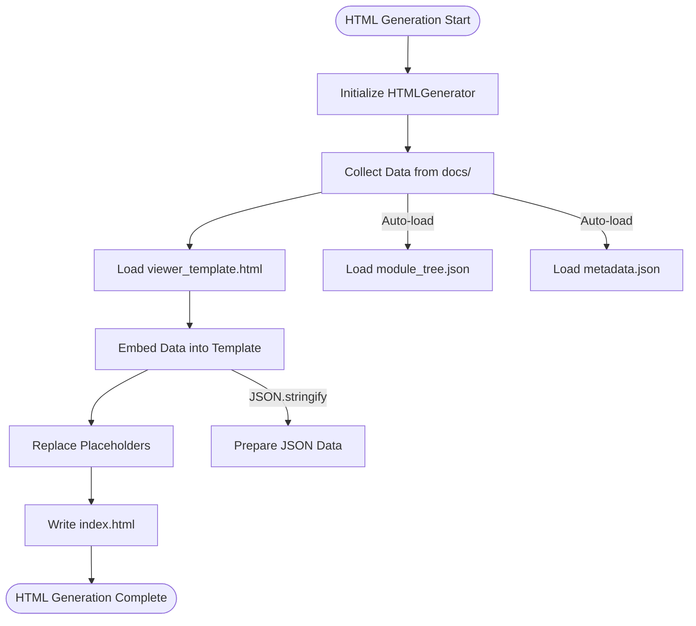
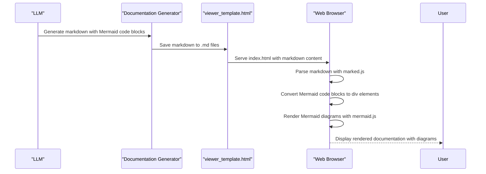

# Output Formats and Artifacts

<cite>
**Referenced Files in This Document**   
- [html_generator.py](file://codewiki/cli/html_generator.py)
- [viewer_template.html](file://codewiki/templates/github_pages/viewer_template.html)
- [documentation_generator.py](file://codewiki/src/be/documentation_generator.py)
- [config.py](file://codewiki/src/config.py)
- [visualise_docs.py](file://codewiki/src/fe/visualise_docs.py)
- [prompt_template.py](file://codewiki/src/be/prompt_template.py)
</cite>

## Table of Contents
1. [Introduction](#introduction)
2. [Output Directory Structure](#output-directory-structure)
3. [Core Output Files](#core-output-files)
4. [HTML Generation Process](#html-generation-process)
5. [Template System](#template-system)
6. [Visual Artifact Generation](#visual-artifact-generation)
7. [Auto-Loading Mechanism](#auto-loading-mechanism)
8. [Customization Options](#customization-options)
9. [Conclusion](#conclusion)

## Introduction

CodeWiki generates comprehensive documentation artifacts that provide both textual and visual representations of codebases. The system produces a structured output directory containing markdown files, JSON metadata, and an interactive HTML viewer for GitHub Pages deployment. This documentation explains the complete output format ecosystem, detailing how each component works together to create holistic, repository-level documentation across multiple programming languages.

The output system is designed to be both human-readable and machine-processable, enabling developers to understand complex codebases while providing structured data for tooling integration. The artifacts are generated through a multi-stage process that combines hierarchical decomposition, recursive agentic processing, and multi-modal synthesis.

**Section sources**
- [documentation_generator.py](file://codewiki/src/be/documentation_generator.py#L29-L292)
- [config.py](file://codewiki/src/config.py#L8-L18)

## Output Directory Structure

The CodeWiki output directory follows a standardized structure that organizes documentation artifacts in a logical hierarchy. When documentation is generated, it is saved to the `docs` directory by default, containing the following files and structure:

```text
./docs/
├── overview.md              # Repository overview (start here!)
├── module1.md               # Module documentation
├── module2.md               # Additional modules...
├── module_tree.json         # Hierarchical module structure
├── first_module_tree.json   # Initial clustering result
├── metadata.json            # Generation metadata
└── index.html               # Interactive viewer (with --github-pages)
```

The directory structure is designed to be self-contained and portable. The markdown files contain comprehensive textual documentation for each module, while the JSON files provide structured data that can be consumed by various tools. The `overview.md` file serves as the entry point, providing a high-level summary of the entire repository.

The output structure supports both flat organization (all files in one directory) and hierarchical organization (files organized in subdirectories based on module structure). This flexibility allows the system to adapt to different repository architectures while maintaining consistency in documentation format.

**Section sources**
- [config.py](file://codewiki/src/config.py#L9-L14)
- [README.md](file://README.md#L160-L171)

## Core Output Files

### overview.md

The `overview.md` file serves as the primary entry point for repository documentation. It contains a comprehensive overview of the entire codebase, including:

- Repository purpose and core functionality
- High-level architecture with Mermaid diagrams
- Key components and their relationships
- Navigation to detailed module documentation

This file is generated using the `REPO_OVERVIEW_PROMPT` template, which instructs the LLM to create a concise yet comprehensive summary of the repository's architecture and functionality. The overview is designed to help developers quickly understand the system at a glance before diving into specific modules.

### Module-Specific Markdown Files

Each module in the repository receives its own markdown documentation file (e.g., `module1.md`, `module2.md`). These files contain detailed information about individual modules, including:

- Module purpose and responsibilities
- Architecture and component relationships
- Data flow and interaction patterns
- Usage examples and integration points

The content is generated through a recursive process where leaf modules are documented first, followed by parent modules that synthesize information from their children. This approach ensures consistency and avoids duplication of information across related modules.

### module_tree.json

The `module_tree.json` file contains the hierarchical structure of modules in the repository. It represents the final, processed module tree after recursive documentation generation. The structure includes:

- Module names and paths
- Component lists for each module
- Child module relationships
- Metadata for documentation generation

This JSON structure serves as a navigation map for the documentation system, enabling both the HTML viewer and other tools to understand the organization of the codebase.

### first_module_tree.json

The `first_module_tree.json` file contains the initial clustering result from the hierarchical decomposition phase. Unlike the final `module_tree.json`, this file represents the raw module grouping before recursive processing. It includes:

- Initial module groupings based on code dependencies
- Component assignments to modules
- Path information for each module
- Clustering metadata

This file serves as an intermediate artifact that can be useful for debugging and understanding the initial decomposition of the codebase.

### metadata.json

The `metadata.json` file contains generation metadata that provides context about the documentation process. It includes:

- Timestamp of generation
- LLM model used for generation
- Repository commit ID
- Statistics about the documentation process
- List of generated files

This metadata enables reproducibility and provides valuable information for assessing the quality and context of the generated documentation.

### index.html

The `index.html` file is the interactive viewer for GitHub Pages deployment. When generated with the `--github-pages` flag, this file provides a web-based interface for navigating the documentation. It includes:

- Sidebar navigation based on the module tree
- Responsive design for different screen sizes
- Client-side markdown rendering
- Interactive Mermaid diagram support
- Repository information display

The HTML viewer transforms the static markdown files into an interactive documentation experience, making it easier for developers to explore the codebase.

**Section sources**
- [documentation_generator.py](file://codewiki/src/be/documentation_generator.py#L38-L72)
- [config.py](file://codewiki/src/config.py#L11-L14)
- [prompt_template.py](file://codewiki/src/be/prompt_template.py#L91-L127)

## HTML Generation Process

The HTML generation process in CodeWiki is handled by the `HTMLGenerator` class in `html_generator.py`. This process creates a self-contained, interactive documentation viewer that can be deployed to GitHub Pages or served statically.

The generation process follows these steps:

1. **Initialization**: The `HTMLGenerator` is initialized with a template directory path, defaulting to the package templates if not specified.

2. **Data Collection**: The generator collects all necessary data from the documentation directory, including:
   - Module tree structure from `module_tree.json`
   - Metadata from `metadata.json`
   - Configuration options
   - Repository information

3. **Template Loading**: The generator loads the `viewer_template.html` template from the templates directory. This template contains the base HTML structure, CSS styling, and JavaScript functionality.

4. **Data Embedding**: The collected data is embedded into the template by replacing placeholders with actual values:
   - `{{TITLE}}`: Documentation title
   - `{{REPO_LINK}}`: Link to the source repository
   - `{{SHOW_INFO}}`: CSS display property for info section
   - `{{INFO_CONTENT}}`: HTML content for generation metadata
   - `{{CONFIG_JSON}}`: Configuration data as JSON
   - `{{MODULE_TREE_JSON}}`: Module tree as JSON
   - `{{METADATA_JSON}}`: Metadata as JSON
   - `{{DOCS_BASE_PATH}}`: Base path for documentation files

5. **Output Generation**: The processed template is written to the output path (`index.html`), creating a complete, self-contained documentation viewer.

The HTML generation process is designed to be efficient and reliable, with error handling for missing files and fallback behaviors when certain data is unavailable. The resulting `index.html` file is completely self-contained, requiring no additional server-side processing.



**Diagram sources**
- [html_generator.py](file://codewiki/cli/html_generator.py#L83-L172)
- [viewer_template.html](file://codewiki/templates/github_pages/viewer_template.html#L1-L644)

## Template System

The template system in CodeWiki is centered around the `viewer_template.html` file located in `codewiki/templates/github_pages/`. This template provides the foundation for the interactive documentation viewer and includes several key components:

### HTML Structure

The template follows a responsive two-column layout:
- **Sidebar**: Fixed-width navigation panel with repository information and module navigation
- **Content Area**: Flexible main content area for displaying markdown documentation

The structure uses semantic HTML elements and ARIA attributes for accessibility, ensuring the documentation is usable by developers with various needs.

### CSS Styling

The template includes comprehensive CSS styling that provides:
- Consistent typography and spacing
- Responsive design for different screen sizes
- Visual hierarchy through color and contrast
- Interactive states for navigation elements
- Print-friendly styles

The CSS uses CSS variables for theming, allowing for easy customization of colors and other visual properties. The styling is designed to be clean and professional, focusing on readability and usability.

### JavaScript Functionality

The template incorporates several JavaScript components that enable interactive features:

1. **Client-Side Markdown Rendering**: Uses the `marked` library to render markdown content in the browser, allowing for dynamic content loading without server-side processing.

2. **Mermaid Diagram Support**: Integrates the `mermaid` library to render diagrams from markdown code blocks, providing visual representations of architecture, data flow, and sequence diagrams.

3. **Navigation System**: Implements a dynamic navigation menu that is built from the `MODULE_TREE_JSON` data, allowing users to browse between different module documentation files.

4. **Internal Link Handling**: Intercepts clicks on markdown links to other `.md` files, loading the content dynamically without page reloads.

5. **Error Handling**: Includes robust error handling for failed document loading and rendering issues.

The template system is designed to be self-contained, with all necessary libraries loaded from CDNs. This eliminates the need for build steps or complex deployment processes, making it ideal for GitHub Pages deployment.

```mermaid
classDiagram
class HTMLGenerator {
+template_dir : Path
+generate(output_path, title, module_tree, repository_url, github_pages_url, config, docs_dir, metadata)
+load_module_tree(docs_dir)
+load_metadata(docs_dir)
+_build_info_content(metadata)
+_escape_html(text)
+detect_repository_info(repo_path)
}
class Template {
+{{TITLE}}
+{{REPO_LINK}}
+{{SHOW_INFO}}
+{{INFO_CONTENT}}
+{{CONFIG_JSON}}
+{{MODULE_TREE_JSON}}
+{{METADATA_JSON}}
+{{DOCS_BASE_PATH}}
}
class JavaScriptComponents {
+marked : Markdown rendering
+mermaid : Diagram rendering
+Navigation : Dynamic menu
+LinkHandling : Internal link interception
+ErrorHandling : Error display
}
HTMLGenerator --> Template : "Generates"
Template --> JavaScriptComponents : "Includes"
HTMLGenerator --> JavaScriptComponents : "Utilizes"
```

**Diagram sources**
- [viewer_template.html](file://codewiki/templates/github_pages/viewer_template.html#L1-L644)
- [html_generator.py](file://codewiki/cli/html_generator.py#L13-L235)

## Visual Artifact Generation

CodeWiki generates visual artifacts through a multi-step process that combines LLM-powered content generation with client-side rendering. The system produces Mermaid diagrams for architecture, data flow, and sequence diagrams, which are embedded directly in the markdown documentation.

### Diagram Generation Process

The visual artifact generation follows this workflow:

1. **Prompt Engineering**: The system uses specialized prompts in `prompt_template.py` that explicitly request Mermaid diagrams. The `SYSTEM_PROMPT` and `LEAF_SYSTEM_PROMPT` templates include directives to generate diagrams for architecture, dependencies, data flow, component interaction, and process flows.

2. **LLM Content Generation**: When processing a module, the LLM generates markdown content that includes Mermaid code blocks in the following format:
   ```markdown
   ```mermaid
graph TD
A[Component A] --> B[Component B]
B --> C[Component C]
```
   ```

3. **Content Validation**: The system validates Mermaid diagram syntax using the `validate_mermaid_diagrams` function in `utils.py`. This ensures that all generated diagrams are syntactically correct before being included in the final documentation.

4. **Client-Side Rendering**: When the documentation is viewed in the HTML viewer, the browser renders the Mermaid diagrams using the Mermaid.js library. The template processes markdown content to convert Mermaid code blocks into renderable elements.

### Diagram Types

CodeWiki supports several types of Mermaid diagrams for different documentation purposes:

- **Architecture Diagrams**: Show component relationships and system structure
- **Data Flow Diagrams**: Illustrate how data moves through the system
- **Sequence Diagrams**: Depict interactions between components over time
- **Flowcharts**: Represent algorithmic logic and decision flows
- **Class Diagrams**: Show object-oriented relationships and inheritance

The choice of diagram type is determined by the LLM based on the context and content being documented. The system encourages the use of appropriate diagram types for different aspects of the codebase.

### Rendering Pipeline

The rendering pipeline for visual artifacts is implemented in the `viewer_template.html` file:

1. **Markdown to HTML Conversion**: The `marked` library converts markdown content to HTML, preserving Mermaid code blocks.

2. **Mermaid Block Processing**: The template's JavaScript processes Mermaid code blocks, converting them from:
   ```html
   <pre><code class="language-mermaid">graph TD...</code></pre>
   ```
   to:
   ```html
   <div class="mermaid">graph TD...</div>
   ```

3. **Diagram Rendering**: The Mermaid.js library renders the diagrams as SVG elements, which are inserted into the DOM.

4. **Error Handling**: If a diagram fails to render, the system displays the raw Mermaid code with an error message.

This client-side rendering approach ensures that the documentation remains lightweight and portable, while still providing rich visualizations.



**Diagram sources**
- [prompt_template.py](file://codewiki/src/be/prompt_template.py#L1-L33)
- [utils.py](file://codewiki/src/be/utils.py#L45-L157)
- [viewer_template.html](file://codewiki/templates/github_pages/viewer_template.html#L594-L627)

## Auto-Loading Mechanism

The auto-loading mechanism in CodeWiki's HTML generator enables seamless integration of documentation data without requiring manual configuration. This mechanism is implemented in the `HTMLGenerator.generate()` method and works as follows:

### Data Auto-Loading Process

When the `generate()` method is called with a `docs_dir` parameter but without explicit `module_tree` or `metadata` parameters, the system automatically loads these from the documentation directory:

1. **Module Tree Loading**: The `load_module_tree()` method attempts to read `module_tree.json` from the specified documentation directory. If the file doesn't exist, it returns a fallback structure with an "Overview" module.

2. **Metadata Loading**: The `load_metadata()` method attempts to read `metadata.json` from the documentation directory. If the file doesn't exist, it returns `None`, which is handled gracefully by the template.

3. **Repository Information Detection**: The `detect_repository_info()` method uses the `git` Python library to extract repository information from the local git repository, including the repository name, URL, and GitHub Pages URL.

This auto-loading mechanism ensures that the HTML generator can create a complete documentation viewer using only the path to the documentation directory, making the deployment process simple and reliable.

### Client-Side Data Integration

The auto-loaded data is integrated into the HTML viewer through the template system:

1. **JSON Embedding**: The module tree and metadata are converted to JSON strings and embedded directly in the HTML template, making them available to the client-side JavaScript.

2. **Navigation Generation**: The client-side JavaScript uses the `MODULE_TREE_JSON` data to dynamically generate the navigation menu in the sidebar.

3. **Information Display**: The `METADATA_JSON` data is used to populate the repository information section, showing details like the generation date, LLM model, and commit ID.

4. **Configuration**: The `CONFIG_JSON` data provides additional configuration options for the viewer's behavior.

The auto-loading mechanism is designed to be robust, with fallback behaviors for missing files and graceful degradation when certain data is unavailable. This ensures that the documentation viewer can be generated even if some components are missing or incomplete.

```mermaid
flowchart TD
A[HTMLGenerator.generate()] --> B{docs_dir provided?}
B --> |Yes| C{module_tree provided?}
C --> |No| D[load_module_tree(docs_dir)]
C --> |Yes| E[Use provided module_tree]
B --> |Yes| F{metadata provided?}
F --> |No| G[load_metadata(docs_dir)]
F --> |Yes| H[Use provided metadata]
B --> |No| I[Use provided or default values]
D --> J[Load module_tree.json]
J --> K{File exists?}
K --> |Yes| L[Parse JSON content]
K --> |No| M[Return fallback structure]
G --> N[Load metadata.json]
N --> O{File exists?}
O --> |Yes| P[Parse JSON content]
O --> |No| Q[Return None]
L --> R[Embed in template]
M --> R
P --> R
Q --> R
E --> R
H --> R
I --> R
R --> S[Generate index.html]
```

**Diagram sources**
- [html_generator.py](file://codewiki/cli/html_generator.py#L35-L82)
- [html_generator.py](file://codewiki/cli/html_generator.py#L107-L113)

## Customization Options

CodeWiki provides several customization options that allow users to adapt the output format to their specific needs. These options can be configured through command-line arguments, configuration files, or direct modification of template files.

### Command-Line Customization

The `generate` command supports several flags that customize the output:

- `--output`: Specifies a custom output directory instead of the default `docs/`
- `--github-pages`: Generates the `index.html` viewer for GitHub Pages deployment
- `--create-branch`: Creates a new git branch for documentation changes
- `--no-cache`: Forces full regeneration, ignoring any cached results
- `--verbose`: Shows detailed progress and debug information

These options provide flexibility in how and where the documentation is generated and deployed.

### Configuration-Based Customization

Users can customize the documentation generation process through configuration settings:

- **LLM Models**: Users can specify different LLM models for main processing and clustering through the `main_model` and `cluster_model` configuration options.
- **API Endpoints**: The `base_url` configuration allows users to point to different LLM API endpoints.
- **Output Structure**: The `DOCS_DIR` constant in `config.py` can be modified to change the default output directory.

### Template Customization

The HTML viewer template can be customized by modifying the `viewer_template.html` file:

- **Styling**: Users can modify the CSS variables in the `:root` section to change colors, spacing, and other visual properties.
- **Layout**: The HTML structure can be adjusted to change the layout of the documentation viewer.
- **Functionality**: JavaScript components can be extended or modified to add new features or change existing behavior.

### Programmatic Customization

Advanced users can extend the system by creating custom generators or modifying the existing ones:

- **Custom HTMLGenerator**: Users can subclass `HTMLGenerator` to implement custom generation logic.
- **Modified Templates**: Users can create alternative templates for different deployment scenarios.
- **Extended Metadata**: Users can enhance the metadata structure to include additional information.

These customization options make CodeWiki adaptable to different workflows, deployment environments, and organizational requirements, while maintaining the core functionality of comprehensive repository-level documentation.

**Section sources**
- [generate.py](file://codewiki/cli/commands/generate.py#L34-L266)
- [config.py](file://codewiki/src/config.py#L34-L38)
- [html_generator.py](file://codewiki/cli/html_generator.py#L21-L32)

## Conclusion

CodeWiki's output format and artifacts system provides a comprehensive solution for repository-level documentation generation. By combining structured data files, markdown documentation, and an interactive HTML viewer, the system creates a rich, multi-modal documentation experience that helps developers understand complex codebases.

The output structure is designed to be both human-readable and machine-processable, with JSON files providing structured data for tooling integration and markdown files offering accessible, well-formatted documentation. The HTML generation process transforms these static files into an interactive viewer that can be easily deployed to GitHub Pages or other static hosting services.

The template system and auto-loading mechanism ensure that the documentation viewer is self-contained and easy to deploy, while the visual artifact generation provides rich diagrams that enhance understanding of architecture, data flow, and component interactions. With extensive customization options, users can adapt the output format to their specific needs and workflows.

Together, these components create a powerful documentation ecosystem that addresses the challenges of understanding large-scale codebases, reducing the time developers spend on code comprehension and improving overall software maintainability.