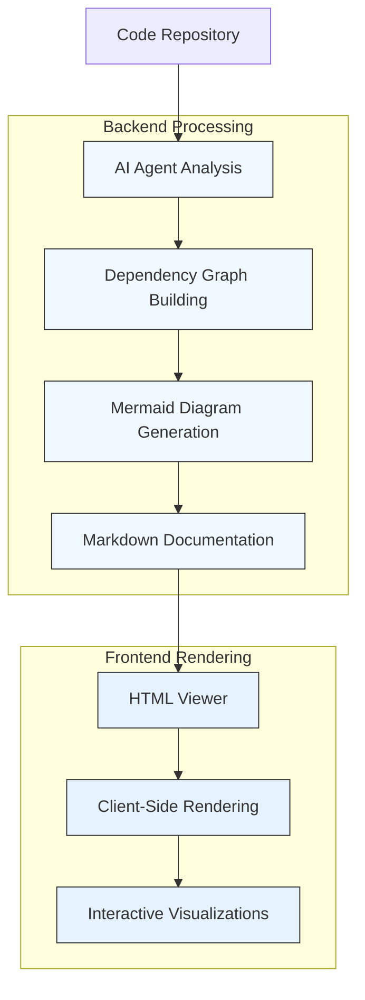
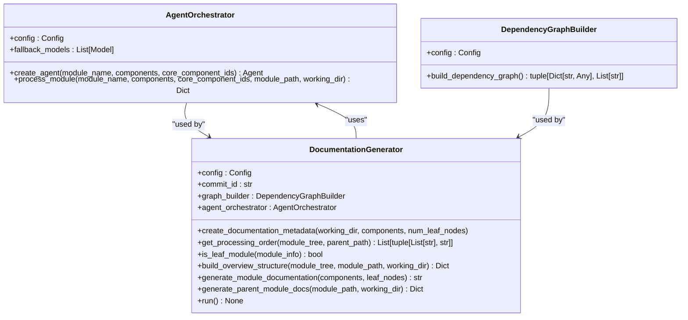
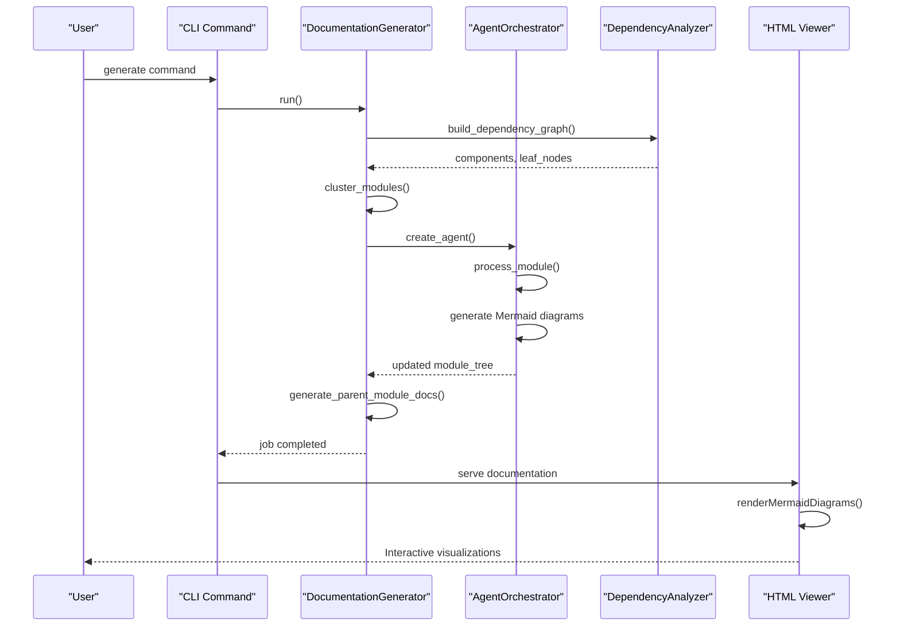
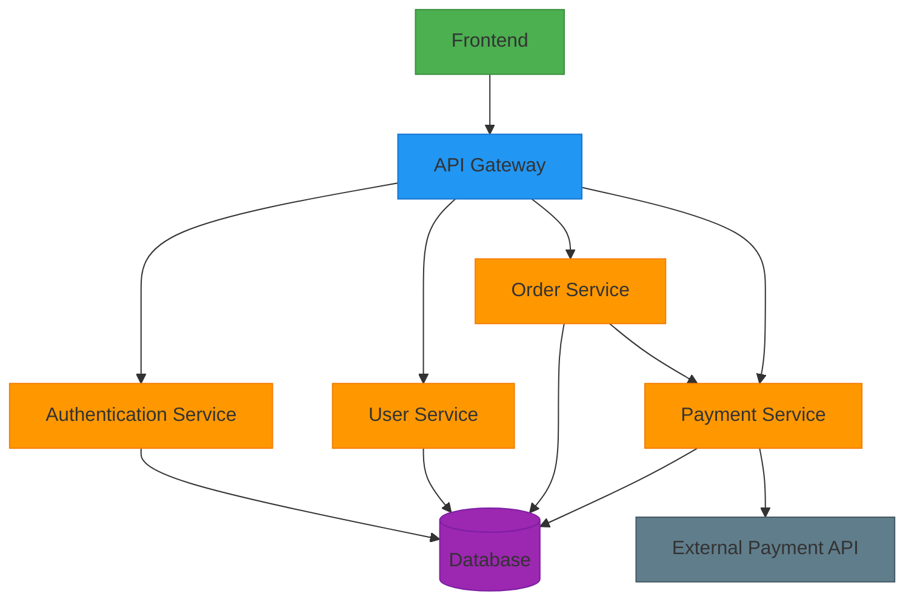
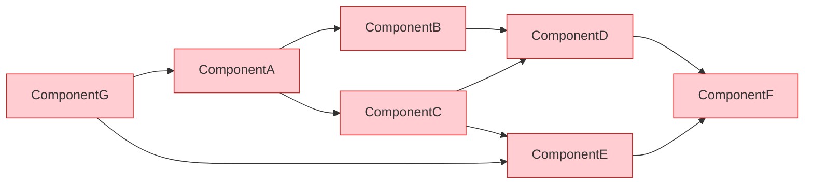
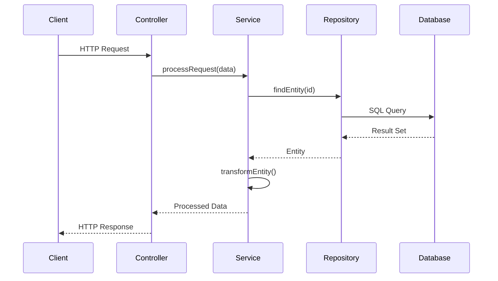
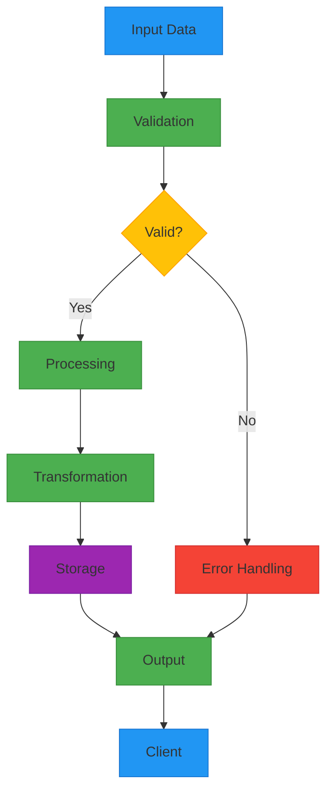
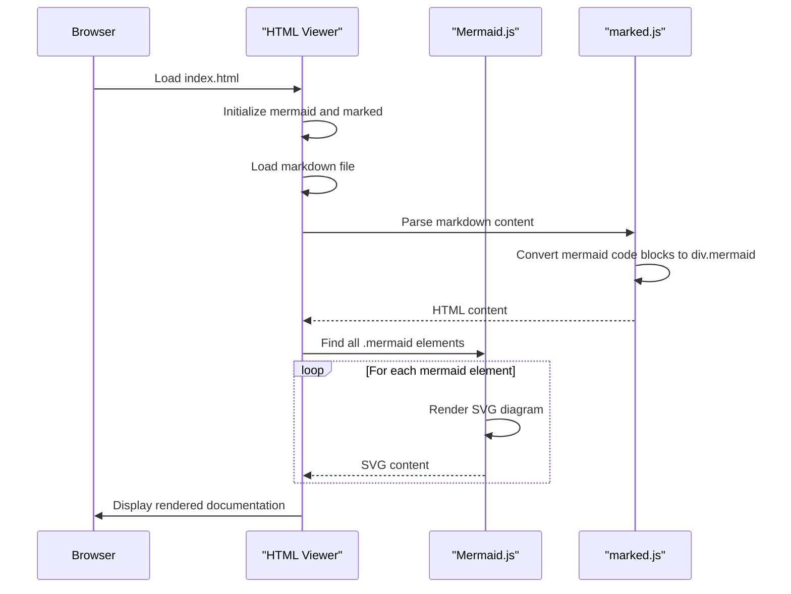
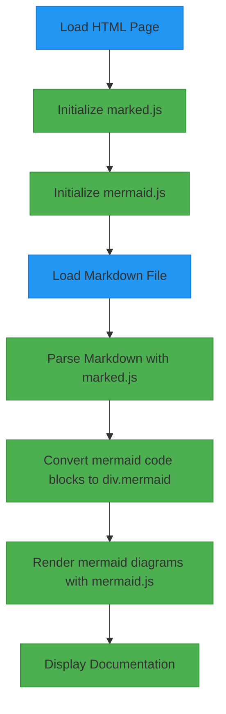
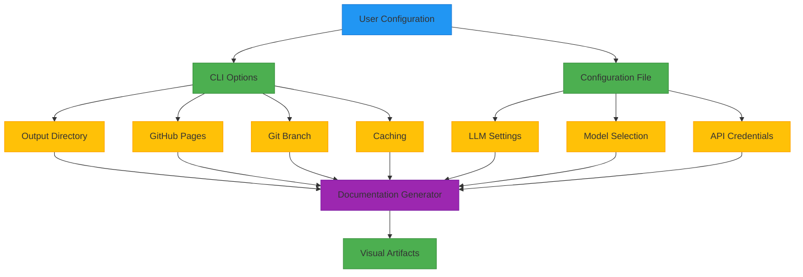

# Visual Artifacts Generation

<cite>
**Referenced Files in This Document**   
- [viewer_template.html](file://codewiki/templates/github_pages/viewer_template.html)
- [html_generator.py](file://codewiki/cli/html_generator.py)
- [visualise_docs.py](file://codewiki/src/fe/visualise_docs.py)
- [dependency_graphs_builder.py](file://codewiki/src/be/dependency_analyzer/dependency_graphs_builder.py)
- [agent_orchestrator.py](file://codewiki/src/be/agent_orchestrator.py)
- [documentation_generator.py](file://codewiki/src/be/documentation_generator.py)
- [read_code_components.py](file://codewiki/src/be/agent_tools/read_code_components.py)
- [call_graph_analyzer.py](file://codewiki/src/be/dependency_analyzer/analysis/call_graph_analyzer.py)
- [repo_analyzer.py](file://codewiki/src/be/dependency_analyzer/analysis/repo_analyzer.py)
- [generate.py](file://codewiki/cli/commands/generate.py)
- [config.py](file://codewiki/cli/models/config.py)
- [prompt_template.py](file://codewiki/src/be/prompt_template.py)
</cite>

## Table of Contents
1. [Introduction](#introduction)
2. [Architecture Overview](#architecture-overview)
3. [AI Agent Analysis and Code Understanding](#ai-agent-analysis-and-code-understanding)
4. [Mermaid Diagram Generation Process](#mermaid-diagram-generation-process)
5. [Supported Diagram Types and Use Cases](#supported-diagram-types-and-use-cases)
6. [HTML Rendering and Client-Side Processing](#html-rendering-and-client-side-processing)
7. [Configuration and Customization](#configuration-and-customization)
8. [Best Practices and Limitations](#best-practices-and-limitations)
9. [Conclusion](#conclusion)

## Introduction

CodeWiki's visual artifacts generation system automatically creates comprehensive Mermaid.js diagrams that help users understand complex codebases through visual representations. The system leverages AI agents to analyze code components and their relationships, then generates appropriate Mermaid diagrams embedded within markdown documentation files. These diagrams are rendered client-side in the HTML viewer, providing an interactive way to explore architecture, data flow, dependencies, and component interactions.

The visual artifacts generation process begins with code analysis, where AI agents parse and understand the codebase structure, identify components, and determine their relationships. Based on this analysis, the system generates Mermaid code blocks that are embedded within markdown files. When users view the documentation, the client-side HTML viewer processes these Mermaid code blocks and renders them as interactive SVG diagrams.

This documentation explains the complete workflow of visual artifact generation in CodeWiki, from AI-powered code analysis to client-side rendering, covering the different diagram types supported, configuration options, and best practices for interpreting these visualizations.

**Section sources**
- [viewer_template.html](file://codewiki/templates/github_pages/viewer_template.html#L1-L644)
- [html_generator.py](file://codewiki/cli/html_generator.py#L1-L285)
- [prompt_template.py](file://codewiki/src/be/prompt_template.py#L1-L337)

## Architecture Overview

The visual artifacts generation system in CodeWiki follows a multi-layered architecture that integrates AI analysis, documentation generation, and client-side rendering. The process begins with the backend AI agents analyzing the codebase to understand its structure and relationships, then generates markdown documentation with embedded Mermaid code blocks. The frontend HTML viewer processes these markdown files and renders the Mermaid diagrams client-side.

**Diagram sources**
- [documentation_generator.py](file://codewiki/src/be/documentation_generator.py#L1-L292)
- [agent_orchestrator.py](file://codewiki/src/be/agent_orchestrator.py#L1-L149)
- [visualise_docs.py](file://codewiki/src/fe/visualise_docs.py#L1-L268)

## AI Agent Analysis and Code Understanding

CodeWiki employs AI agents to deeply analyze code components and their relationships, forming the foundation for meaningful visual artifact generation. The agent orchestrator system coordinates multiple specialized agents that work together to understand different aspects of the codebase, from high-level architecture to detailed component interactions.

The analysis process begins with the dependency analyzer, which parses the codebase to identify components such as classes, functions, and modules across multiple programming languages. For each supported language (Python, JavaScript, TypeScript, Java, C#, C, C++, PHP), specialized analyzers use AST (Abstract Syntax Tree) parsing to extract detailed information about code components, including their properties, methods, parameters, and relationships.

**Diagram sources**
- [agent_orchestrator.py](file://codewiki/src/be/agent_orchestrator.py#L1-L149)
- [documentation_generator.py](file://codewiki/src/be/documentation_generator.py#L1-L292)
- [dependency_graphs_builder.py](file://codewiki/src/be/dependency_analyzer/dependency_graphs_builder.py#L1-L94)

The AI agents use a hierarchical processing approach, starting with leaf modules (modules without children) and working upward to parent modules and the overall repository overview. This ensures that detailed component documentation is generated first, which can then be referenced and summarized in higher-level documentation. The system uses different agent configurations based on module complexity, with more sophisticated agents handling complex modules that require sub-module documentation.

**Section sources**
- [agent_orchestrator.py](file://codewiki/src/be/agent_orchestrator.py#L1-L149)
- [documentation_generator.py](file://codewiki/src/be/documentation_generator.py#L1-L292)
- [prompt_template.py](file://codewiki/src/be/prompt_template.py#L1-L337)

## Mermaid Diagram Generation Process

The Mermaid diagram generation process in CodeWiki is tightly integrated with the AI agent analysis system, ensuring that visual artifacts accurately represent the codebase structure and relationships. When AI agents generate documentation for a module, they follow a structured workflow that includes creating appropriate Mermaid diagrams based on the module's characteristics and relationships.

The process begins with the agent analyzing the provided code components and module structure, then creating the main documentation file with architecture overviews and other relevant diagrams. For complex modules, the system generates sub-module documentation with detailed diagrams. The AI agents have access to tools that allow them to explore additional code dependencies and generate comprehensive documentation.

**Diagram sources**
- [generate.py](file://codewiki/cli/commands/generate.py#L1-L266)
- [documentation_generator.py](file://codewiki/src/be/documentation_generator.py#L1-L292)
- [agent_orchestrator.py](file://codewiki/src/be/agent_orchestrator.py#L1-L149)
- [visualise_docs.py](file://codewiki/src/fe/visualise_docs.py#L1-L268)

The system generates Mermaid diagrams by analyzing various aspects of the codebase, including:
- Architecture diagrams showing module relationships
- Dependency graphs illustrating component dependencies
- Data flow visualizations mapping information movement
- Sequence diagrams for function call flows
- Class diagrams for object-oriented relationships

These diagrams are generated based on the analysis of actual code components and their relationships, ensuring accuracy and relevance to the codebase.

**Section sources**
- [prompt_template.py](file://codewiki/src/be/prompt_template.py#L1-L337)
- [documentation_generator.py](file://codewiki/src/be/documentation_generator.py#L1-L292)
- [call_graph_analyzer.py](file://codewiki/src/be/dependency_analyzer/analysis/call_graph_analyzer.py#L1-L536)

## Supported Diagram Types and Use Cases

CodeWiki supports multiple Mermaid diagram types, each serving specific use cases for understanding different aspects of a codebase. The AI agents automatically select the most appropriate diagram types based on the code analysis and documentation requirements.

### Architecture Diagrams
Architecture diagrams provide a high-level overview of the system's structure, showing how different modules and components relate to each other. These diagrams are particularly useful for understanding the overall organization of a codebase and how different parts interact.

**Diagram sources**
- [prompt_template.py](file://codewiki/src/be/prompt_template.py#L91-L108)
- [documentation_generator.py](file://codewiki/src/be/documentation_generator.py#L199-L247)

### Dependency Graphs
Dependency graphs visualize the relationships between code components, showing which components depend on others. These diagrams help identify tightly coupled components, potential circular dependencies, and the overall dependency structure of the codebase.

**Diagram sources**
- [dependency_graphs_builder.py](file://codewiki/src/be/dependency_analyzer/dependency_graphs_builder.py#L1-L94)
- [topo_sort.py](file://codewiki/src/be/dependency_analyzer/topo_sort.py#L247-L317)

### Sequence Diagrams
Sequence diagrams illustrate the flow of function calls and interactions between components over time. These diagrams are particularly useful for understanding complex workflows, API interactions, and the sequence of operations in critical code paths.

**Diagram sources**
- [call_graph_analyzer.py](file://codewiki/src/be/dependency_analyzer/analysis/call_graph_analyzer.py#L1-L536)
- [read_code_components.py](file://codewiki/src/be/agent_tools/read_code_components.py#L1-L22)

### Data Flow Diagrams
Data flow diagrams visualize how data moves through the system, showing the transformation and storage of information across different components. These diagrams help understand data processing pipelines, state changes, and information flow.

**Diagram sources**
- [call_graph_analyzer.py](file://codewiki/src/be/dependency_analyzer/analysis/call_graph_analyzer.py#L1-L536)
- [documentation_generator.py](file://codewiki/src/be/documentation_generator.py#L1-L292)

**Section sources**
- [prompt_template.py](file://codewiki/src/be/prompt_template.py#L1-L337)
- [call_graph_analyzer.py](file://codewiki/src/be/dependency_analyzer/analysis/call_graph_analyzer.py#L1-L536)

## HTML Rendering and Client-Side Processing

The HTML viewer in CodeWiki handles the client-side rendering of Mermaid diagrams, transforming the embedded Mermaid code blocks into interactive visualizations. The viewer is implemented as a static HTML page with embedded JavaScript that processes the markdown content and renders the diagrams using the Mermaid.js library.

The rendering process begins when the viewer loads the documentation, fetching the markdown files and processing them with the marked.js library. During this processing, the system identifies Mermaid code blocks and converts them into HTML div elements with the "mermaid" class. The Mermaid.js library then renders these elements as SVG diagrams.

**Diagram sources**
- [viewer_template.html](file://codewiki/templates/github_pages/viewer_template.html#L1-L644)
- [visualise_docs.py](file://codewiki/src/fe/visualise_docs.py#L1-L268)

The viewer template includes configuration for the Mermaid.js library, setting options such as theme, colors, and diagram-specific settings. This ensures consistent styling across all diagrams and optimal rendering for different diagram types.

**Diagram sources**
- [viewer_template.html](file://codewiki/templates/github_pages/viewer_template.html#L1-L644)
- [html_generator.py](file://codewiki/cli/html_generator.py#L1-L285)

The client-side rendering approach offers several advantages, including reduced server load, offline functionality, and the ability to customize diagram rendering without regenerating the entire documentation. Users can interact with the diagrams, zoom in and out, and explore complex visualizations directly in their browser.

**Section sources**
- [viewer_template.html](file://codewiki/templates/github_pages/viewer_template.html#L1-L644)
- [html_generator.py](file://codewiki/cli/html_generator.py#L1-L285)
- [visualise_docs.py](file://codewiki/src/fe/visualise_docs.py#L1-L268)

## Configuration and Customization

CodeWiki provides configuration options that allow users to customize the visual artifacts generation process. The system supports both CLI parameters and configuration files to control various aspects of diagram generation and documentation output.

The CLI generate command includes several options for customizing the output, such as specifying the output directory, creating a git branch for documentation changes, generating GitHub Pages compatible HTML, and controlling caching behavior. These options allow users to integrate the documentation generation process into their existing workflows.

**Diagram sources**
- [generate.py](file://codewiki/cli/commands/generate.py#L1-L266)
- [config.py](file://codewiki/cli/models/config.py#L1-L109)

The configuration system separates CLI-specific settings from backend processing configuration, allowing for flexible deployment scenarios. Users can set default values in the configuration file while overriding them with CLI options for specific runs.

**Section sources**
- [generate.py](file://codewiki/cli/commands/generate.py#L1-L266)
- [config.py](file://codewiki/cli/models/config.py#L1-L109)

## Best Practices and Limitations

When working with CodeWiki's visual artifacts generation system, following best practices can help maximize the value of the generated diagrams while understanding their limitations.

### Best Practices
1. **Review and Validate**: Always review the generated diagrams to ensure they accurately represent the codebase. While the AI analysis is sophisticated, human validation is crucial for complex systems.
2. **Use Hierarchical Documentation**: Leverage the hierarchical documentation structure, starting with high-level architecture diagrams and drilling down into detailed component diagrams as needed.
3. **Update Regularly**: Regenerate documentation periodically, especially after major code changes, to keep the visual artifacts current.
4. **Combine with Code Reading**: Use the diagrams as a starting point for understanding, but always refer back to the actual code for detailed implementation understanding.
5. **Customize Configuration**: Adjust the configuration settings to match your specific use case, such as selecting appropriate models for your codebase complexity.

### Limitations
1. **Complexity Threshold**: Extremely complex codebases may exceed the context window of the AI models, potentially leading to incomplete analysis.
2. **Language Support**: While multiple languages are supported, the analysis depth may vary between languages based on the maturity of the respective analyzers.
3. **Dynamic Behavior**: The diagrams represent static code structure and may not capture runtime behavior, dynamic loading, or reflection-based patterns.
4. **Third-party Dependencies**: External libraries and frameworks may not be fully analyzed, potentially creating gaps in dependency graphs.
5. **Performance**: Generating comprehensive documentation with detailed diagrams can be resource-intensive and time-consuming for large codebases.

Understanding these limitations helps set appropriate expectations for what the visual artifacts can and cannot represent, ensuring they are used effectively as part of a broader code understanding strategy.

**Section sources**
- [prompt_template.py](file://codewiki/src/be/prompt_template.py#L1-L337)
- [documentation_generator.py](file://codewiki/src/be/documentation_generator.py#L1-L292)
- [call_graph_analyzer.py](file://codewiki/src/be/dependency_analyzer/analysis/call_graph_analyzer.py#L1-L536)

## Conclusion

CodeWiki's visual artifacts generation system provides a powerful way to understand complex codebases through automatically generated Mermaid.js diagrams. By leveraging AI agents to analyze code components and their relationships, the system creates meaningful visual representations that help developers quickly grasp architecture, dependencies, data flow, and component interactions.

The end-to-end process, from code analysis to client-side rendering, is designed to be seamless and efficient. AI agents analyze the codebase, generate appropriate Mermaid diagrams embedded in markdown files, and the HTML viewer renders these diagrams client-side for interactive exploration. This approach combines the power of AI analysis with the flexibility of client-side rendering, providing users with comprehensive visual documentation that stays current with the codebase.

By understanding the different diagram types, configuration options, and best practices for interpretation, users can effectively leverage these visual artifacts to accelerate code comprehension, improve documentation quality, and facilitate knowledge sharing within development teams.

**Section sources**
- [viewer_template.html](file://codewiki/templates/github_pages/viewer_template.html#L1-L644)
- [documentation_generator.py](file://codewiki/src/be/documentation_generator.py#L1-L292)
- [agent_orchestrator.py](file://codewiki/src/be/agent_orchestrator.py#L1-L149)