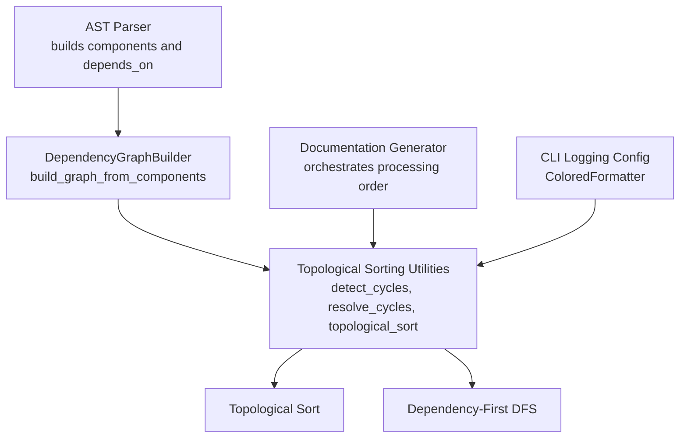
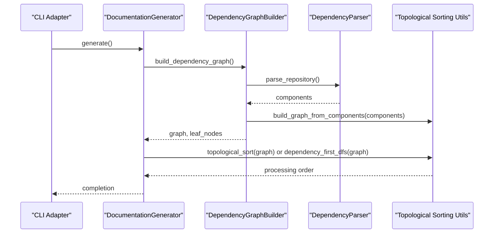
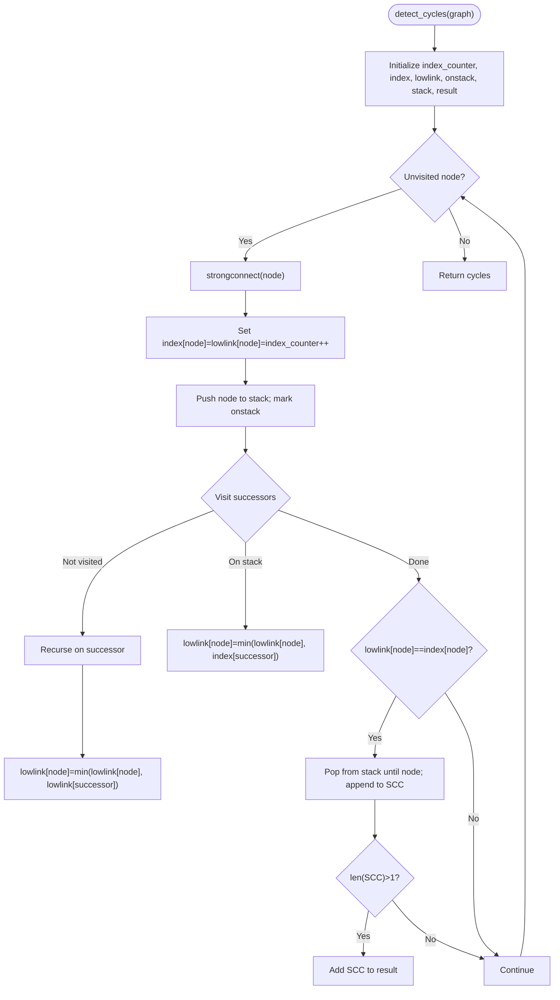
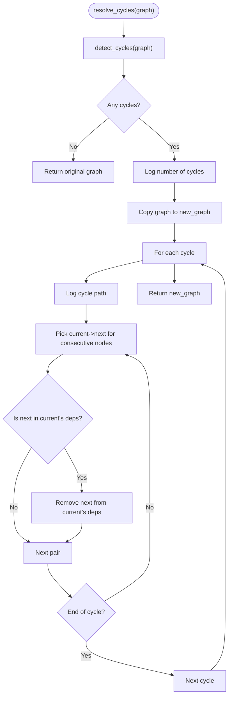
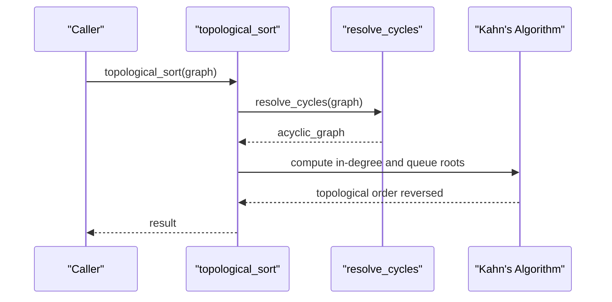
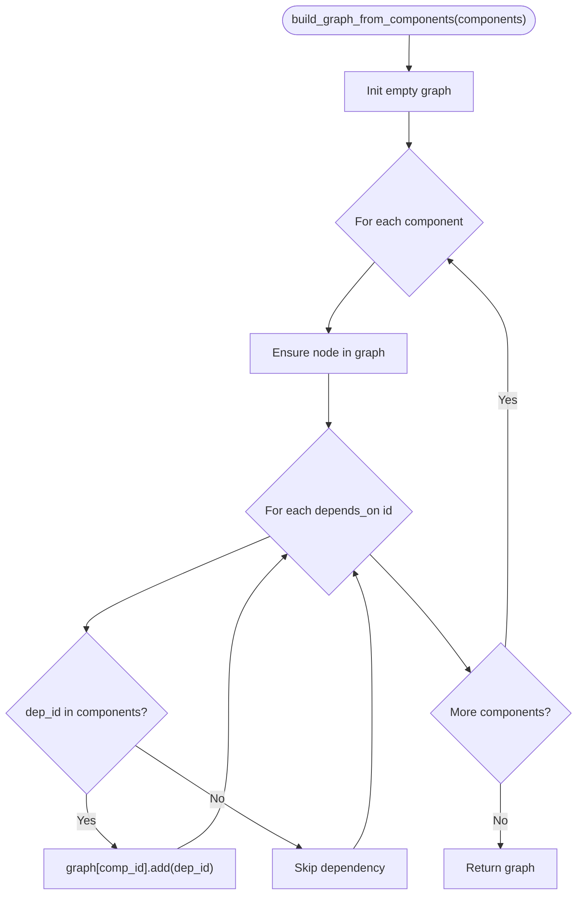
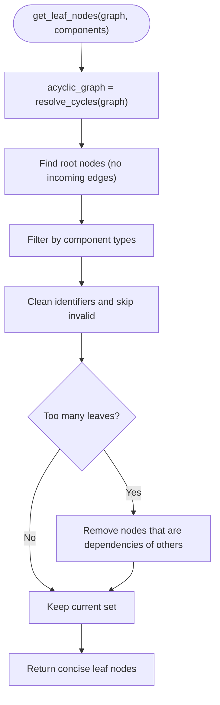
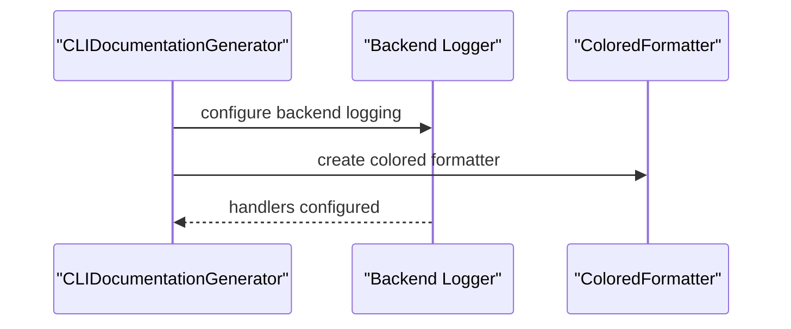
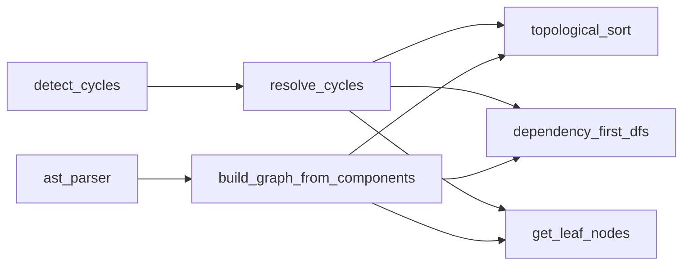

# Cycle Detection and Resolution

<cite>
**Referenced Files in This Document**
- [topo_sort.py](file://codewiki/src/be/dependency_analyzer/topo_sort.py)
- [dependency_graphs_builder.py](file://codewiki/src/be/dependency_analyzer/dependency_graphs_builder.py)
- [ast_parser.py](file://codewiki/src/be/dependency_analyzer/ast_parser.py)
- [core.py](file://codewiki/src/be/dependency_analyzer/models/core.py)
- [doc_generator.py](file://codewiki/cli/adapters/doc_generator.py)
- [documentation_generator.py](file://codewiki/src/be/documentation_generator.py)
</cite>

## Table of Contents
1. [Introduction](#introduction)
2. [Project Structure](#project-structure)
3. [Core Components](#core-components)
4. [Architecture Overview](#architecture-overview)
5. [Detailed Component Analysis](#detailed-component-analysis)
6. [Dependency Analysis](#dependency-analysis)
7. [Performance Considerations](#performance-considerations)
8. [Troubleshooting Guide](#troubleshooting-guide)
9. [Conclusion](#conclusion)
10. [Appendices](#appendices)

## Introduction
This document explains the cycle detection and resolution system used by CodeWiki to maintain a valid dependency graph for documentation generation. It focuses on:
- Tarjan’s algorithm implementation for detecting strongly connected components (cycles) in the dependency graph
- The cycle-breaking strategy that removes edges to produce an acyclic graph
- How topological sorting relies on cycle resolution to produce a valid processing order
- Practical guidance for interpreting logs and improving the cycle-breaking heuristic using module boundaries

## Project Structure
The cycle detection and resolution pipeline spans several modules:
- Dependency graph construction from parsed components
- Strongly connected component detection via Tarjan’s algorithm
- Cycle resolution by removing edges
- Topological sorting and dependency-first traversal on the resulting acyclic graph
- CLI integration and logging configuration

**Diagram sources**
- [ast_parser.py](file://codewiki/src/be/dependency_analyzer/ast_parser.py#L1-L146)
- [dependency_graphs_builder.py](file://codewiki/src/be/dependency_analyzer/dependency_graphs_builder.py#L1-L94)
- [topo_sort.py](file://codewiki/src/be/dependency_analyzer/topo_sort.py#L1-L350)
- [documentation_generator.py](file://codewiki/src/be/documentation_generator.py#L1-L292)
- [doc_generator.py](file://codewiki/cli/adapters/doc_generator.py#L1-L289)

**Section sources**
- [ast_parser.py](file://codewiki/src/be/dependency_analyzer/ast_parser.py#L1-L146)
- [dependency_graphs_builder.py](file://codewiki/src/be/dependency_analyzer/dependency_graphs_builder.py#L1-L94)
- [topo_sort.py](file://codewiki/src/be/dependency_analyzer/topo_sort.py#L1-L350)
- [documentation_generator.py](file://codewiki/src/be/documentation_generator.py#L1-L292)
- [doc_generator.py](file://codewiki/cli/adapters/doc_generator.py#L1-L289)

## Core Components
- detect_cycles(graph): Implements Tarjan’s algorithm to find strongly connected components and returns cycles as ordered node lists.
- resolve_cycles(graph): Detects cycles and produces an acyclic graph by removing edges, logging each cycle and the removed dependency.
- topological_sort(graph): Ensures the graph is acyclic and computes a dependency-first ordering.
- dependency_first_dfs(graph): Performs a dependency-first traversal on the acyclic graph.
- build_graph_from_components(components): Converts parsed components into a dependency graph with natural direction (A→B if A depends on B).
- get_leaf_nodes(graph, components): Computes leaf nodes in the acyclic graph and applies filtering heuristics.

These functions collectively enable robust documentation generation by ensuring a valid processing order even when cycles are present in raw dependencies.

**Section sources**
- [topo_sort.py](file://codewiki/src/be/dependency_analyzer/topo_sort.py#L18-L350)
- [dependency_graphs_builder.py](file://codewiki/src/be/dependency_analyzer/dependency_graphs_builder.py#L1-L94)
- [ast_parser.py](file://codewiki/src/be/dependency_analyzer/ast_parser.py#L1-L146)
- [core.py](file://codewiki/src/be/dependency_analyzer/models/core.py#L1-L64)

## Architecture Overview
The system integrates parsing, graph building, cycle detection/resolution, and topological processing. The CLI configures logging to surface cycle detection and resolution actions during generation.

**Diagram sources**
- [doc_generator.py](file://codewiki/cli/adapters/doc_generator.py#L165-L248)
- [documentation_generator.py](file://codewiki/src/be/documentation_generator.py#L249-L292)
- [dependency_graphs_builder.py](file://codewiki/src/be/dependency_analyzer/dependency_graphs_builder.py#L18-L78)
- [ast_parser.py](file://codewiki/src/be/dependency_analyzer/ast_parser.py#L28-L146)
- [topo_sort.py](file://codewiki/src/be/dependency_analyzer/topo_sort.py#L239-L268)

## Detailed Component Analysis

### Tarjan’s Algorithm for Cycle Detection
Tarjan’s algorithm identifies strongly connected components (SCCs) in O(V+E). In this implementation:
- Index and lowlink arrays track discovery order and lowest indices reachable from each node
- A stack maintains nodes currently being explored
- When lowlink equals index, a component is popped from the stack; only components with more than one node are considered cycles

Key behaviors:
- Returns cycles as lists of nodes in the order encountered during traversal
- Skips trivial SCCs of size one (no cycle)
- Operates on adjacency-list graphs where keys are nodes and values are sets of dependencies

**Diagram sources**
- [topo_sort.py](file://codewiki/src/be/dependency_analyzer/topo_sort.py#L18-L76)

**Section sources**
- [topo_sort.py](file://codewiki/src/be/dependency_analyzer/topo_sort.py#L18-L76)

### Cycle Resolution Strategy
After detecting cycles, the system creates a copy of the graph and iteratively breaks cycles by removing a single dependency edge per cycle. The chosen strategy:
- Logs the number of cycles detected
- For each cycle, logs the cycle path
- Arbitrarily removes the “last” edge in the cycle order to break it
- Returns the modified acyclic graph

This approach ensures topological sorting can proceed reliably, though it does not consider module boundaries or semantic importance of edges.

**Diagram sources**
- [topo_sort.py](file://codewiki/src/be/dependency_analyzer/topo_sort.py#L78-L119)

**Section sources**
- [topo_sort.py](file://codewiki/src/be/dependency_analyzer/topo_sort.py#L78-L119)

### Topological Sorting and Dependency-First Traversal
Two complementary orderings are provided:
- topological_sort(graph): Resolves cycles, computes in-degree counts, and performs Kahn’s algorithm to produce a dependency-first order
- dependency_first_dfs(graph): Resolves cycles, finds root nodes (no incoming edges), and traverses dependencies before dependents

Both rely on resolve_cycles to ensure acyclicity before traversal.

**Diagram sources**
- [topo_sort.py](file://codewiki/src/be/dependency_analyzer/topo_sort.py#L121-L169)

**Section sources**
- [topo_sort.py](file://codewiki/src/be/dependency_analyzer/topo_sort.py#L121-L238)

### Dependency Graph Construction from Components
Components are parsed from source code and transformed into a dependency graph:
- Each component holds a set of dependency IDs
- build_graph_from_components maps each component ID to its depends_on set, filtering out dependencies not present in the repository

**Diagram sources**
- [topo_sort.py](file://codewiki/src/be/dependency_analyzer/topo_sort.py#L239-L268)
- [ast_parser.py](file://codewiki/src/be/dependency_analyzer/ast_parser.py#L47-L109)
- [core.py](file://codewiki/src/be/dependency_analyzer/models/core.py#L1-L45)

**Section sources**
- [topo_sort.py](file://codewiki/src/be/dependency_analyzer/topo_sort.py#L239-L268)
- [ast_parser.py](file://codewiki/src/be/dependency_analyzer/ast_parser.py#L47-L109)
- [core.py](file://codewiki/src/be/dependency_analyzer/models/core.py#L1-L45)

### Leaf Node Computation and Filtering
Leaf nodes are computed from the acyclic graph and filtered based on component types and identifiers. The process:
- Builds an acyclic graph via resolve_cycles
- Identifies nodes with no incoming edges as roots
- Filters leaf candidates by component type and cleans noisy identifiers
- Optionally prunes dependencies among leaf nodes when the set is large

**Diagram sources**
- [topo_sort.py](file://codewiki/src/be/dependency_analyzer/topo_sort.py#L271-L350)

**Section sources**
- [topo_sort.py](file://codewiki/src/be/dependency_analyzer/topo_sort.py#L271-L350)

### Integration with CLI and Logging
The CLI adapter configures backend logging with a colored formatter and controls verbosity. This allows operators to observe cycle detection and resolution logs during generation.

**Diagram sources**
- [doc_generator.py](file://codewiki/cli/adapters/doc_generator.py#L73-L113)

**Section sources**
- [doc_generator.py](file://codewiki/cli/adapters/doc_generator.py#L73-L113)

## Dependency Analysis
- detect_cycles depends on the graph representation and Tarjan’s internal state management
- resolve_cycles depends on detect_cycles and modifies a copied graph
- topological_sort and dependency_first_dfs depend on resolve_cycles to guarantee acyclicity
- build_graph_from_components depends on Node models and their depends_on sets
- get_leaf_nodes depends on resolve_cycles and component metadata

**Diagram sources**
- [topo_sort.py](file://codewiki/src/be/dependency_analyzer/topo_sort.py#L18-L350)
- [dependency_graphs_builder.py](file://codewiki/src/be/dependency_analyzer/dependency_graphs_builder.py#L1-L94)
- [ast_parser.py](file://codewiki/src/be/dependency_analyzer/ast_parser.py#L1-L146)
- [core.py](file://codewiki/src/be/dependency_analyzer/models/core.py#L1-L64)

**Section sources**
- [topo_sort.py](file://codewiki/src/be/dependency_analyzer/topo_sort.py#L18-L350)
- [dependency_graphs_builder.py](file://codewiki/src/be/dependency_analyzer/dependency_graphs_builder.py#L1-L94)
- [ast_parser.py](file://codewiki/src/be/dependency_analyzer/ast_parser.py#L1-L146)
- [core.py](file://codewiki/src/be/dependency_analyzer/models/core.py#L1-L64)

## Performance Considerations
- Tarjan’s algorithm runs in O(V+E), suitable for large dependency graphs
- resolve_cycles performs a linear scan per cycle and edge removal; in practice, cycles are often small
- Kahn’s algorithm (topological_sort) runs in O(V+E) with queue operations
- dependency_first_dfs visits each node and edge once
- Filtering leaf nodes introduces additional passes but is bounded by component count

Recommendations:
- Prefer module-aware heuristics for cycle-breaking to minimize cross-module dependencies
- Cache intermediate results (e.g., leaf nodes) to avoid recomputation
- Limit the number of cycles processed if extremely large graphs cause overhead

[No sources needed since this section provides general guidance]

## Troubleshooting Guide
Common issues and resolutions:
- No cycles detected but topological sort still fails: indicates unresolved cycles not captured by the current heuristic; consider refining resolve_cycles to remove edges with higher priority (e.g., cross-module edges)
- Excessive logging noise: adjust CLI verbosity to suppress INFO/DEBUG logs from backend
- Empty leaf nodes: verify component types and identifiers; ensure filtering conditions match the codebase language and structure
- Complex inter-module dependencies: leverage module boundaries in a future heuristic to prioritize breaking intra-module cycles before inter-module edges

Interpreting cycle detection logs:
- Number of cycles: indicates how many strongly connected components require resolution
- Cycle path: shows the sequence of nodes forming a cycle; useful for manual inspection
- Removed dependency: indicates which edge was removed to break the cycle

Potential improvements to cycle-breaking:
- Heuristic 1: Prefer removing edges between different modules over edges within the same module
- Heuristic 2: Remove edges that connect leaf modules to parent modules last
- Heuristic 3: Weight edges by frequency or semantic importance and remove least important edges first

**Section sources**
- [topo_sort.py](file://codewiki/src/be/dependency_analyzer/topo_sort.py#L90-L119)
- [doc_generator.py](file://codewiki/cli/adapters/doc_generator.py#L73-L113)
- [dependency_graphs_builder.py](file://codewiki/src/be/dependency_analyzer/dependency_graphs_builder.py#L60-L94)

## Conclusion
CodeWiki’s cycle detection and resolution system ensures documentation generation proceeds on valid dependency graphs. Tarjan’s algorithm reliably detects cycles, and resolve_cycles provides a pragmatic, loggable strategy to break them. While the current edge-removal heuristic is simple, incorporating module-aware heuristics can improve correctness and reduce unnecessary churn in complex inter-module dependencies.

[No sources needed since this section summarizes without analyzing specific files]

## Appendices

### Example Workflows
- Acyclic graph: detect_cycles returns no cycles; resolve_cycles returns the original graph; topological_sort succeeds immediately
- Cyclic graph: detect_cycles finds multiple cycles; resolve_cycles removes one edge per cycle; topological_sort proceeds on the acyclic graph

**Section sources**
- [topo_sort.py](file://codewiki/src/be/dependency_analyzer/topo_sort.py#L78-L169)