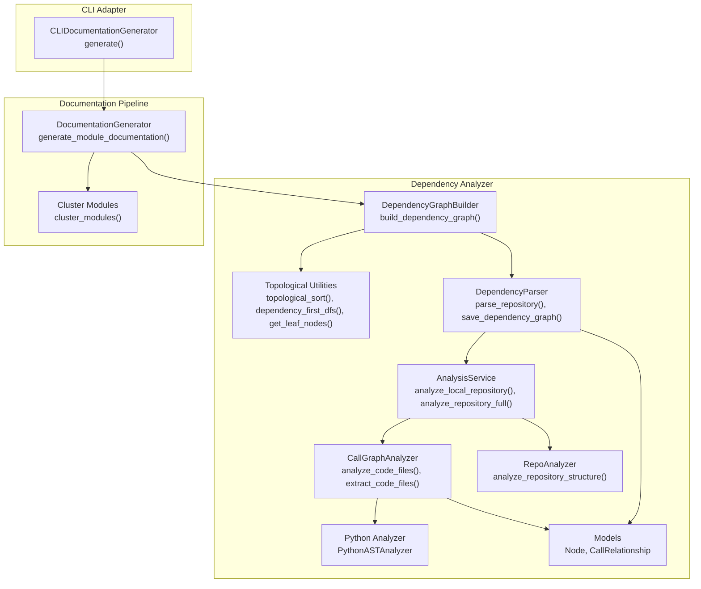
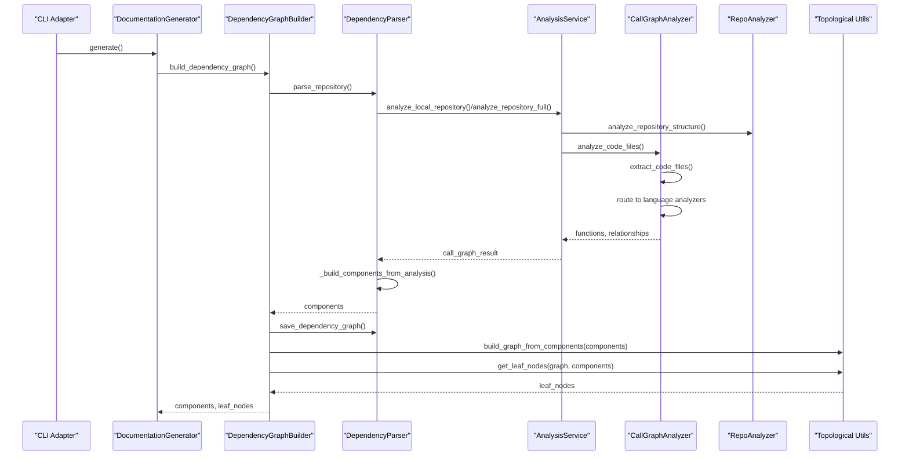
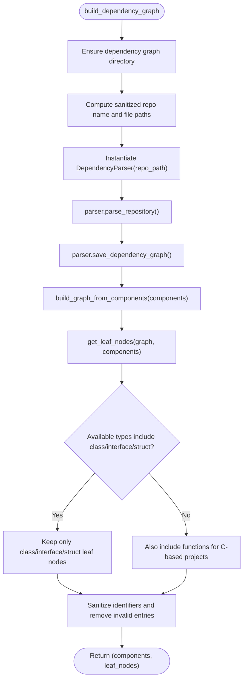
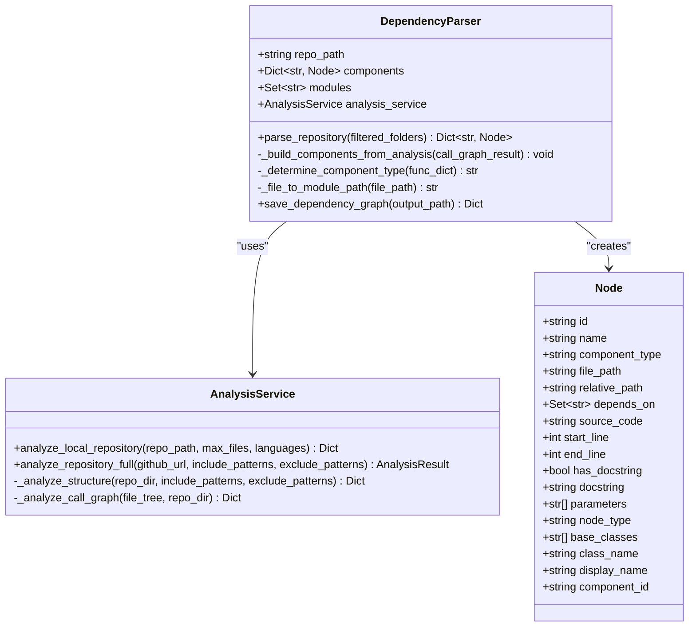
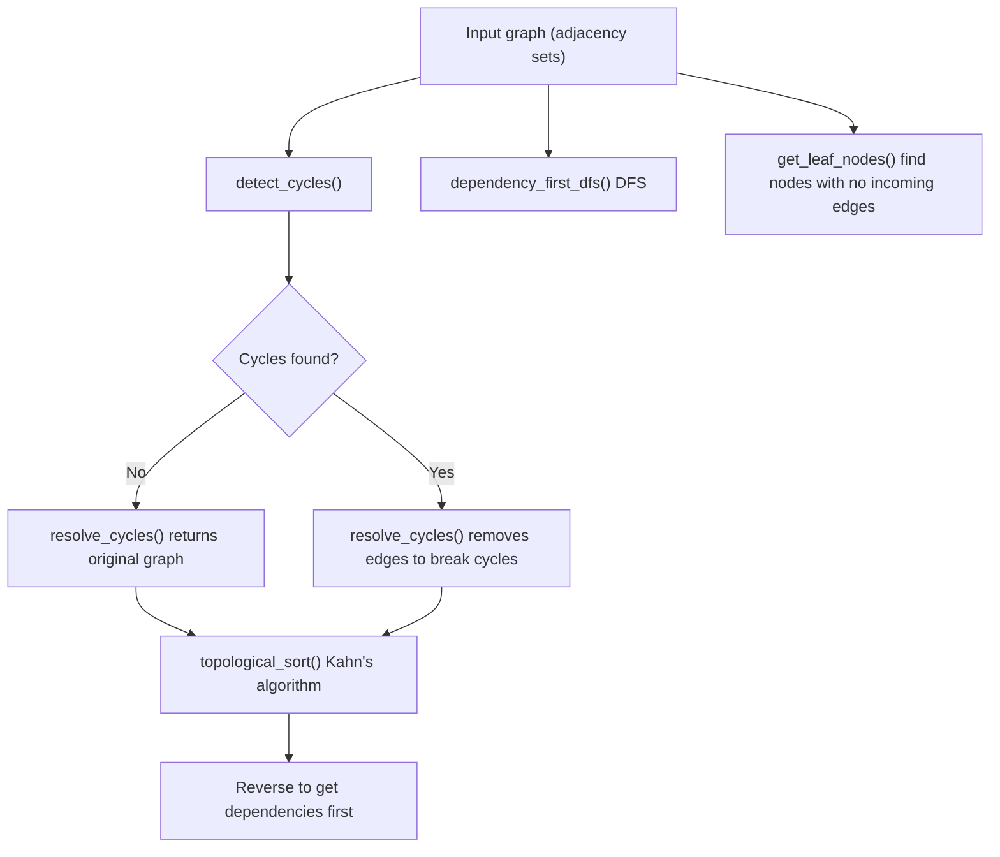
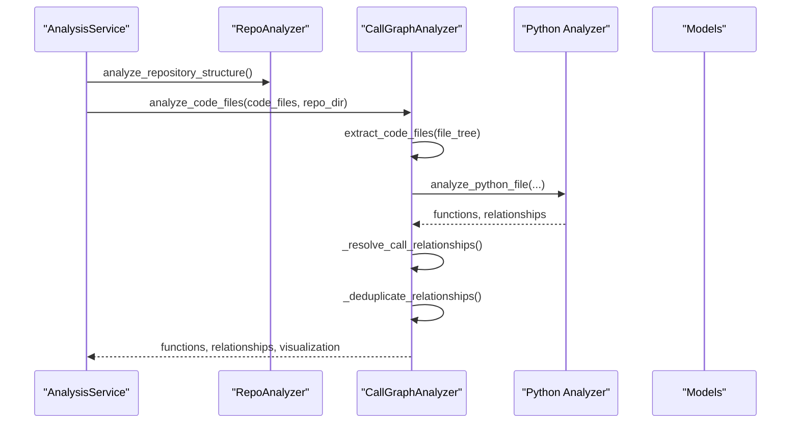
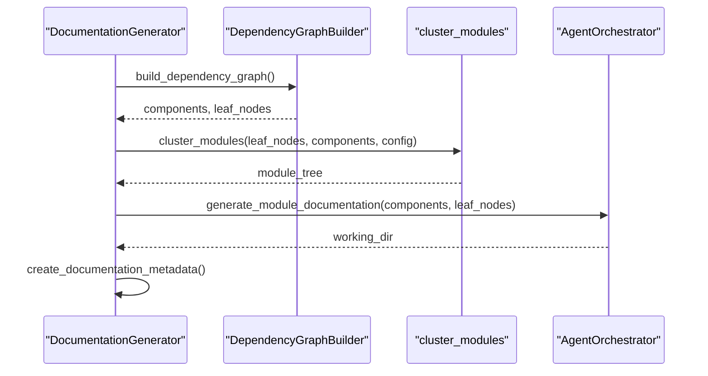
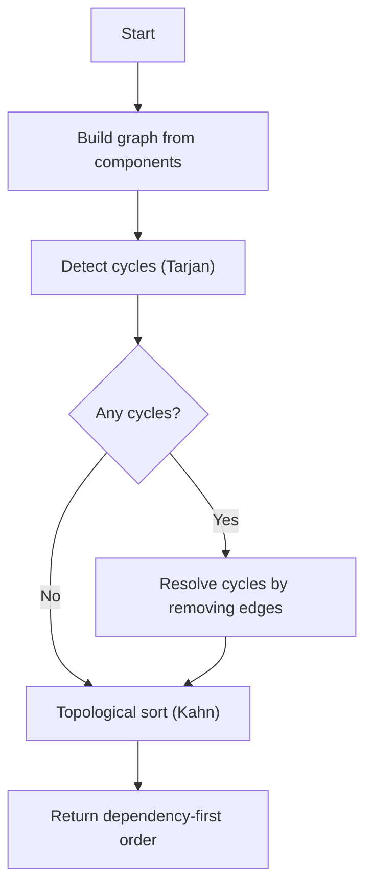
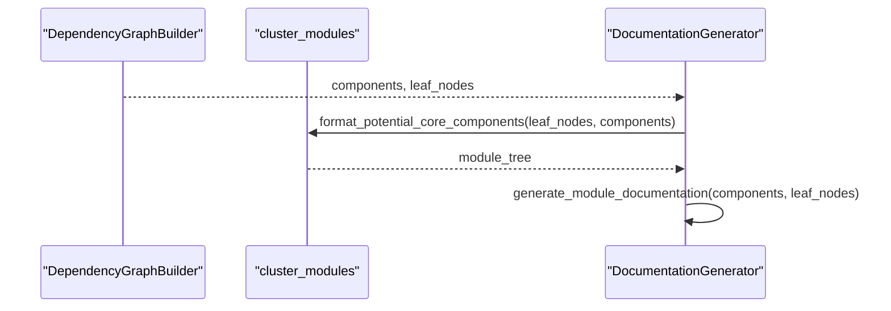

# Dependency Graph Analysis and Topological Sorting

<cite>
**Referenced Files in This Document**
- [dependency_graphs_builder.py](file://codewiki/src/be/dependency_analyzer/dependency_graphs_builder.py)
- [topo_sort.py](file://codewiki/src/be/dependency_analyzer/topo_sort.py)
- [ast_parser.py](file://codewiki/src/be/dependency_analyzer/ast_parser.py)
- [analysis_service.py](file://codewiki/src/be/dependency_analyzer/analysis/analysis_service.py)
- [call_graph_analyzer.py](file://codewiki/src/be/dependency_analyzer/analysis/call_graph_analyzer.py)
- [repo_analyzer.py](file://codewiki/src/be/dependency_analyzer/analysis/repo_analyzer.py)
- [core.py](file://codewiki/src/be/dependency_analyzer/models/core.py)
- [python.py](file://codewiki/src/be/dependency_analyzer/analyzers/python.py)
- [documentation_generator.py](file://codewiki/src/be/documentation_generator.py)
- [cluster_modules.py](file://codewiki/src/be/cluster_modules.py)
- [doc_generator.py](file://codewiki/cli/adapters/doc_generator.py)
</cite>

## Table of Contents
1. [Introduction](#introduction)
2. [Project Structure](#project-structure)
3. [Core Components](#core-components)
4. [Architecture Overview](#architecture-overview)
5. [Detailed Component Analysis](#detailed-component-analysis)
6. [Dependency Analysis](#dependency-analysis)
7. [Topological Sorting and Cycle Handling](#topological-sorting-and-cycle-handling)
8. [Module Clustering and Documentation Pipeline](#module-clustering-and-documentation-pipeline)
9. [Performance Considerations](#performance-considerations)
10. [Troubleshooting Guide](#troubleshooting-guide)
11. [Conclusion](#conclusion)

## Introduction
This document explains the dependency analysis and topological sorting system in CodeWiki. It focuses on how the system parses repositories, extracts code components, builds a dependency graph, detects and resolves cycles, and produces leaf nodes that drive module clustering and documentation generation. It also covers the orchestration of these steps in the broader documentation generation pipeline.

## Project Structure
The dependency analysis lives under the backend dependency analyzer package and integrates with the documentation generator and CLI adapter.

**Diagram sources**
- [dependency_graphs_builder.py](file://codewiki/src/be/dependency_analyzer/dependency_graphs_builder.py#L1-L94)
- [topo_sort.py](file://codewiki/src/be/dependency_analyzer/topo_sort.py#L1-L350)
- [ast_parser.py](file://codewiki/src/be/dependency_analyzer/ast_parser.py#L1-L146)
- [analysis_service.py](file://codewiki/src/be/dependency_analyzer/analysis/analysis_service.py#L1-L370)
- [call_graph_analyzer.py](file://codewiki/src/be/dependency_analyzer/analysis/call_graph_analyzer.py#L1-L536)
- [repo_analyzer.py](file://codewiki/src/be/dependency_analyzer/analysis/repo_analyzer.py#L1-L127)
- [python.py](file://codewiki/src/be/dependency_analyzer/analyzers/python.py#L1-L267)
- [core.py](file://codewiki/src/be/dependency_analyzer/models/core.py#L1-L64)
- [documentation_generator.py](file://codewiki/src/be/documentation_generator.py#L1-L292)
- [cluster_modules.py](file://codewiki/src/be/cluster_modules.py#L1-L113)
- [doc_generator.py](file://codewiki/cli/adapters/doc_generator.py#L1-L289)

**Section sources**
- [dependency_graphs_builder.py](file://codewiki/src/be/dependency_analyzer/dependency_graphs_builder.py#L1-L94)
- [topo_sort.py](file://codewiki/src/be/dependency_analyzer/topo_sort.py#L1-L350)
- [ast_parser.py](file://codewiki/src/be/dependency_analyzer/ast_parser.py#L1-L146)
- [analysis_service.py](file://codewiki/src/be/dependency_analyzer/analysis/analysis_service.py#L1-L370)
- [call_graph_analyzer.py](file://codewiki/src/be/dependency_analyzer/analysis/call_graph_analyzer.py#L1-L536)
- [repo_analyzer.py](file://codewiki/src/be/dependency_analyzer/analysis/repo_analyzer.py#L1-L127)
- [core.py](file://codewiki/src/be/dependency_analyzer/models/core.py#L1-L64)
- [python.py](file://codewiki/src/be/dependency_analyzer/analyzers/python.py#L1-L267)
- [documentation_generator.py](file://codewiki/src/be/documentation_generator.py#L1-L292)
- [cluster_modules.py](file://codewiki/src/be/cluster_modules.py#L1-L113)
- [doc_generator.py](file://codewiki/cli/adapters/doc_generator.py#L1-L289)

## Core Components
- DependencyGraphBuilder: Orchestrates repository parsing, saves dependency graphs, constructs a dependency graph from components, and identifies leaf nodes.
- Topological Utilities: Provides cycle detection (Tarjan’s algorithm), cycle resolution, topological sort, dependency-first DFS, and leaf node extraction.
- DependencyParser: Parses repositories, builds components from analysis results, and persists dependency graphs.
- AnalysisService: Coordinates repository structure analysis and call graph generation across multiple languages.
- CallGraphAnalyzer: Extracts code files, routes to language-specific analyzers, resolves relationships, deduplicates, and generates visualization data.
- RepoAnalyzer: Builds a file tree with include/exclude filtering and safety checks.
- Python Analyzer: AST-based Python analysis to extract classes/functions and relationships.
- Models: Node and CallRelationship define the component and relationship structures.
- DocumentationGenerator: Drives the end-to-end pipeline, using dependency graph outputs to cluster modules and generate documentation.
- Cluster Modules: Formats and clusters leaf nodes into module trees for documentation.
- CLI Adapter: Wraps the backend generation with progress tracking and CLI integration.

**Section sources**
- [dependency_graphs_builder.py](file://codewiki/src/be/dependency_analyzer/dependency_graphs_builder.py#L1-L94)
- [topo_sort.py](file://codewiki/src/be/dependency_analyzer/topo_sort.py#L1-L350)
- [ast_parser.py](file://codewiki/src/be/dependency_analyzer/ast_parser.py#L1-L146)
- [analysis_service.py](file://codewiki/src/be/dependency_analyzer/analysis/analysis_service.py#L1-L370)
- [call_graph_analyzer.py](file://codewiki/src/be/dependency_analyzer/analysis/call_graph_analyzer.py#L1-L536)
- [repo_analyzer.py](file://codewiki/src/be/dependency_analyzer/analysis/repo_analyzer.py#L1-L127)
- [python.py](file://codewiki/src/be/dependency_analyzer/analyzers/python.py#L1-L267)
- [core.py](file://codewiki/src/be/dependency_analyzer/models/core.py#L1-L64)
- [documentation_generator.py](file://codewiki/src/be/documentation_generator.py#L1-L292)
- [cluster_modules.py](file://codewiki/src/be/cluster_modules.py#L1-L113)
- [doc_generator.py](file://codewiki/cli/adapters/doc_generator.py#L1-L289)

## Architecture Overview
The system follows a layered approach:
- Input: Repository path or GitHub URL.
- Analysis: Repo structure analysis and call graph construction across languages.
- Graph Construction: Build component graph from relationships and filter to repository-contained dependencies.
- Topology: Detect and resolve cycles, compute leaf nodes, and produce traversal orders.
- Clustering: Group leaf nodes into modules using LLM-based clustering.
- Documentation: Generate module docs and repository overview in dependency order.

**Diagram sources**
- [doc_generator.py](file://codewiki/cli/adapters/doc_generator.py#L165-L248)
- [documentation_generator.py](file://codewiki/src/be/documentation_generator.py#L249-L292)
- [dependency_graphs_builder.py](file://codewiki/src/be/dependency_analyzer/dependency_graphs_builder.py#L18-L94)
- [ast_parser.py](file://codewiki/src/be/dependency_analyzer/ast_parser.py#L28-L146)
- [analysis_service.py](file://codewiki/src/be/dependency_analyzer/analysis/analysis_service.py#L41-L168)
- [call_graph_analyzer.py](file://codewiki/src/be/dependency_analyzer/analysis/call_graph_analyzer.py#L27-L103)
- [repo_analyzer.py](file://codewiki/src/be/dependency_analyzer/analysis/repo_analyzer.py#L31-L127)
- [topo_sort.py](file://codewiki/src/be/dependency_analyzer/topo_sort.py#L239-L350)

## Detailed Component Analysis

### DependencyGraphBuilder
Responsibilities:
- Ensures output directories exist.
- Prepares dependency graph file paths.
- Uses DependencyParser to parse repository and build components.
- Saves the dependency graph JSON.
- Builds a dependency graph from components using build_graph_from_components.
- Extracts leaf nodes using get_leaf_nodes with type filtering and sanitization.

Key behaviors:
- Type-aware leaf node selection: prioritizes classes/interfaces/structs; falls back to functions for C-based projects.
- Sanitizes identifiers and filters out invalid entries.
- Returns both components and leaf nodes for downstream use.

**Diagram sources**
- [dependency_graphs_builder.py](file://codewiki/src/be/dependency_analyzer/dependency_graphs_builder.py#L18-L94)
- [topo_sort.py](file://codewiki/src/be/dependency_analyzer/topo_sort.py#L239-L350)

**Section sources**
- [dependency_graphs_builder.py](file://codewiki/src/be/dependency_analyzer/dependency_graphs_builder.py#L18-L94)

### DependencyParser
Responsibilities:
- Initializes AnalysisService.
- Parses repository structure and call graph.
- Builds Node objects and populates component dependencies.
- Persists dependency graph to JSON.

Key behaviors:
- Maps legacy IDs to canonical component IDs.
- Infers module paths from component IDs.
- Resolves relationships by matching caller/callee to known components.

**Diagram sources**
- [ast_parser.py](file://codewiki/src/be/dependency_analyzer/ast_parser.py#L18-L146)
- [analysis_service.py](file://codewiki/src/be/dependency_analyzer/analysis/analysis_service.py#L24-L168)
- [core.py](file://codewiki/src/be/dependency_analyzer/models/core.py#L7-L64)

**Section sources**
- [ast_parser.py](file://codewiki/src/be/dependency_analyzer/ast_parser.py#L28-L146)
- [analysis_service.py](file://codewiki/src/be/dependency_analyzer/analysis/analysis_service.py#L41-L168)
- [core.py](file://codewiki/src/be/dependency_analyzer/models/core.py#L7-L64)

### Topological Utilities
Functions:
- detect_cycles(graph): Implements Tarjan’s algorithm to find strongly connected components (cycles).
- resolve_cycles(graph): Removes a representative edge from each detected cycle to produce an acyclic graph.
- topological_sort(graph): Performs Kahn’s algorithm on the acyclic graph to produce a dependency-first ordering.
- dependency_first_dfs(graph): DFS traversal that processes dependencies before dependents.
- build_graph_from_components(components): Converts component sets of depends_on into adjacency sets.
- get_leaf_nodes(graph, components): Identifies leaf nodes (nodes with no incoming edges) and applies type filtering and sanitization.

**Diagram sources**
- [topo_sort.py](file://codewiki/src/be/dependency_analyzer/topo_sort.py#L18-L350)

**Section sources**
- [topo_sort.py](file://codewiki/src/be/dependency_analyzer/topo_sort.py#L18-L350)

### AnalysisService and CallGraphAnalyzer
AnalysisService orchestrates:
- RepoAnalyzer to build a file tree with include/exclude patterns.
- CallGraphAnalyzer to extract and analyze code files across supported languages.
- Result consolidation into functions and relationships.

CallGraphAnalyzer:
- Extracts code files from the file tree.
- Routes to language-specific analyzers (Python, JavaScript/TypeScript, Java, C#, C, C++, PHP).
- Resolves relationships by name and component_id lookups.
- Deduplicates relationships and generates visualization data.

**Diagram sources**
- [analysis_service.py](file://codewiki/src/be/dependency_analyzer/analysis/analysis_service.py#L41-L168)
- [call_graph_analyzer.py](file://codewiki/src/be/dependency_analyzer/analysis/call_graph_analyzer.py#L27-L103)
- [python.py](file://codewiki/src/be/dependency_analyzer/analyzers/python.py#L148-L267)
- [core.py](file://codewiki/src/be/dependency_analyzer/models/core.py#L7-L64)

**Section sources**
- [analysis_service.py](file://codewiki/src/be/dependency_analyzer/analysis/analysis_service.py#L41-L168)
- [call_graph_analyzer.py](file://codewiki/src/be/dependency_analyzer/analysis/call_graph_analyzer.py#L27-L103)
- [python.py](file://codewiki/src/be/dependency_analyzer/analyzers/python.py#L148-L267)
- [core.py](file://codewiki/src/be/dependency_analyzer/models/core.py#L7-L64)

### Documentation Pipeline Integration
DocumentationGenerator:
- Calls DependencyGraphBuilder to obtain components and leaf nodes.
- Clusters leaf nodes into modules via cluster_modules.
- Generates module documentation in dependency order and creates repository overview.
- Creates metadata and manages file outputs.

**Diagram sources**
- [documentation_generator.py](file://codewiki/src/be/documentation_generator.py#L249-L292)
- [dependency_graphs_builder.py](file://codewiki/src/be/dependency_analyzer/dependency_graphs_builder.py#L18-L94)
- [cluster_modules.py](file://codewiki/src/be/cluster_modules.py#L44-L113)

**Section sources**
- [documentation_generator.py](file://codewiki/src/be/documentation_generator.py#L249-L292)
- [cluster_modules.py](file://codewiki/src/be/cluster_modules.py#L44-L113)

## Dependency Analysis
- Repository parsing: RepoAnalyzer builds a safe file tree with include/exclude patterns. AnalysisService coordinates structure and call graph analysis.
- Call graph construction: CallGraphAnalyzer extracts code files and routes to language analyzers. Python analyzer uses AST to extract classes/functions and relationships.
- Component assembly: DependencyParser converts analysis results into Node objects and populates depends_on sets. It also maps legacy identifiers and infers module paths.
- Graph persistence: DependencyParser saves the dependency graph JSON for later use.

Common issues and mitigations:
- Unsupported files: CallGraphAnalyzer filters unsupported languages; ensure include patterns match desired languages.
- Unresolved relationships: _resolve_call_relationships attempts to match by component_id and method name; unresolved calls are preserved for visualization.
- Safety checks: RepoAnalyzer rejects symlinks and escapes; safe_open_text is used to prevent unsafe reads.

**Section sources**
- [repo_analyzer.py](file://codewiki/src/be/dependency_analyzer/analysis/repo_analyzer.py#L31-L127)
- [analysis_service.py](file://codewiki/src/be/dependency_analyzer/analysis/analysis_service.py#L231-L340)
- [call_graph_analyzer.py](file://codewiki/src/be/dependency_analyzer/analysis/call_graph_analyzer.py#L27-L103)
- [python.py](file://codewiki/src/be/dependency_analyzer/analyzers/python.py#L148-L267)
- [ast_parser.py](file://codewiki/src/be/dependency_analyzer/ast_parser.py#L47-L146)

## Topological Sorting and Cycle Handling
Workflow:
- Graph construction: build_graph_from_components transforms component depends_on sets into adjacency sets.
- Cycle detection: detect_cycles uses Tarjan’s algorithm to find strongly connected components.
- Cycle resolution: resolve_cycles removes edges from detected cycles to produce an acyclic graph.
- Traversals:
  - topological_sort: Kahn’s algorithm with in-degree counting; returns dependency-first order.
  - dependency_first_dfs: DFS that recurses into dependencies before adding the current node.
- Leaf nodes: get_leaf_nodes identifies nodes with no incoming edges and applies type filtering and sanitization.

**Diagram sources**
- [topo_sort.py](file://codewiki/src/be/dependency_analyzer/topo_sort.py#L18-L169)

**Section sources**
- [topo_sort.py](file://codewiki/src/be/dependency_analyzer/topo_sort.py#L18-L169)

## Module Clustering and Documentation Pipeline
- Leaf nodes feeding clustering: DependencyGraphBuilder filters leaf nodes by type and sanitizes identifiers; cluster_modules groups them by file and invokes LLM clustering.
- Dynamic programming generation: DocumentationGenerator processes leaf modules first, then parent modules, and finally the repository overview, using the module tree produced by clustering.

**Diagram sources**
- [dependency_graphs_builder.py](file://codewiki/src/be/dependency_analyzer/dependency_graphs_builder.py#L18-L94)
- [cluster_modules.py](file://codewiki/src/be/cluster_modules.py#L14-L113)
- [documentation_generator.py](file://codewiki/src/be/documentation_generator.py#L124-L198)

**Section sources**
- [cluster_modules.py](file://codewiki/src/be/cluster_modules.py#L14-L113)
- [documentation_generator.py](file://codewiki/src/be/documentation_generator.py#L124-L198)

## Performance Considerations
- Large graphs:
  - Limit analysis scope: Use include/exclude patterns and max_files to constrain analysis volume.
  - Targeted sampling: CallGraphAnalyzer’s _select_most_connected_nodes can reduce graph size for LLM-friendly contexts.
  - Efficient graph representation: Adjacency sets minimize memory overhead for sparse graphs.
- Traversal efficiency:
  - Kahn’s algorithm (topological_sort) runs in O(V+E); ensure in-degree counts are computed once.
  - DFS (dependency_first_dfs) is linear in V+E; precompute reverse graph only when needed.
- I/O:
  - Persist dependency graphs to avoid repeated parsing.
  - Use streaming or chunked processing for large JSON outputs.

[No sources needed since this section provides general guidance]

## Troubleshooting Guide
Common issues:
- Cyclic dependencies:
  - Symptoms: topological_sort warning about unresolved cycles.
  - Resolution: resolve_cycles automatically removes edges; review cycle reports and adjust project structure if necessary.
- Missing components:
  - Causes: unresolved relationships or external library calls.
  - Mitigation: ensure all relevant files are included; verify include patterns and language filters.
- Invalid leaf nodes:
  - Causes: malformed identifiers or non-code entries.
  - Mitigation: DependencyGraphBuilder filters invalid identifiers and type mismatches; verify component types and IDs.
- LLM clustering failures:
  - Causes: invalid response format or token limits.
  - Mitigation: cluster_modules validates response tags and module tree shape; reduce token count by grouping fewer components per prompt.

Operational tips:
- Enable verbose logging in CLI adapter to inspect backend stages.
- Verify output directories exist and are writable before generation.
- Confirm LLM credentials and model configurations are set.

**Section sources**
- [topo_sort.py](file://codewiki/src/be/dependency_analyzer/topo_sort.py#L121-L169)
- [dependency_graphs_builder.py](file://codewiki/src/be/dependency_analyzer/dependency_graphs_builder.py#L64-L94)
- [cluster_modules.py](file://codewiki/src/be/cluster_modules.py#L61-L113)
- [doc_generator.py](file://codewiki/cli/adapters/doc_generator.py#L165-L248)

## Conclusion
The dependency analysis and topological sorting system in CodeWiki provides a robust foundation for understanding code structure, resolving cycles, and driving module clustering and documentation generation. By combining AST-based parsing, multi-language call graph analysis, and graph-theoretic utilities, the system supports scalable documentation workflows across diverse repositories.