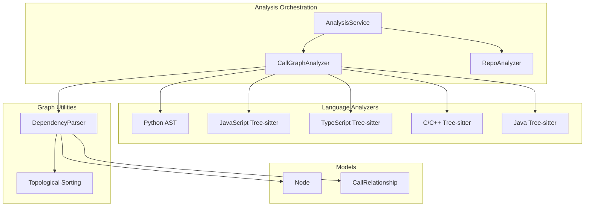
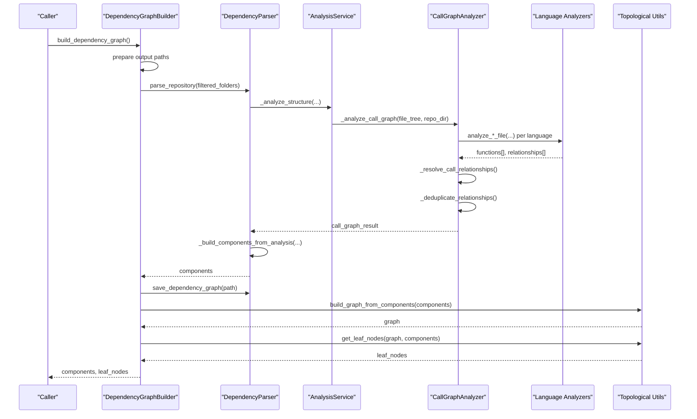
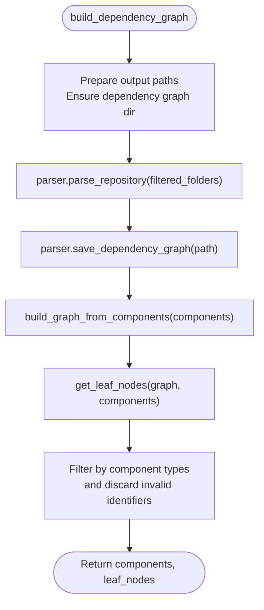
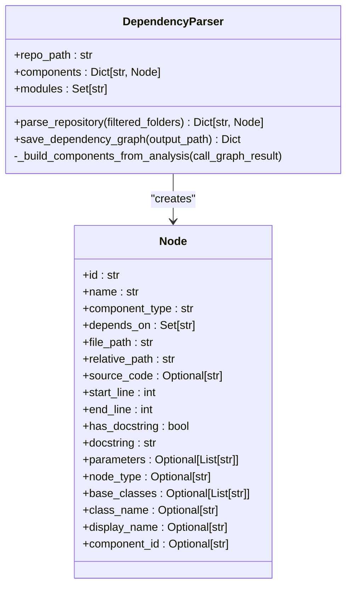
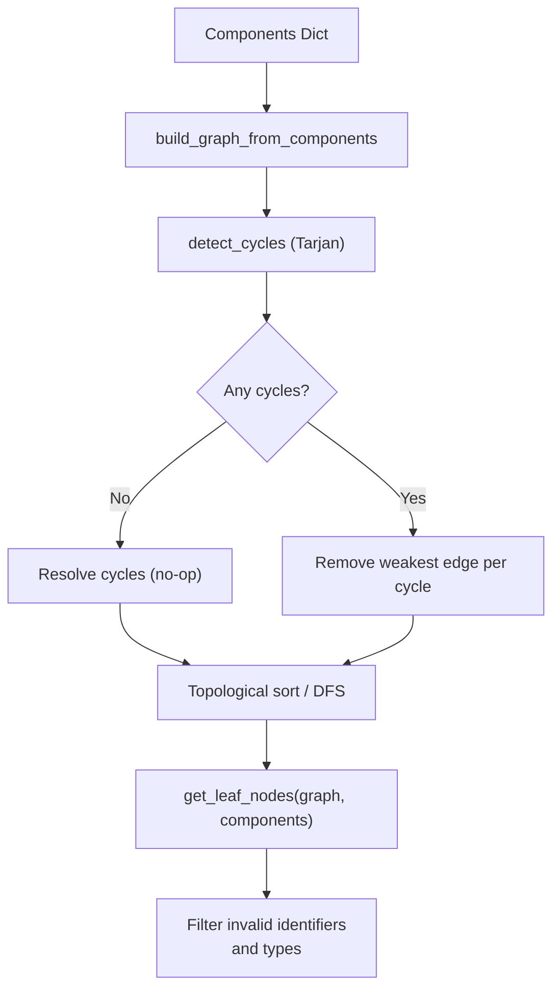
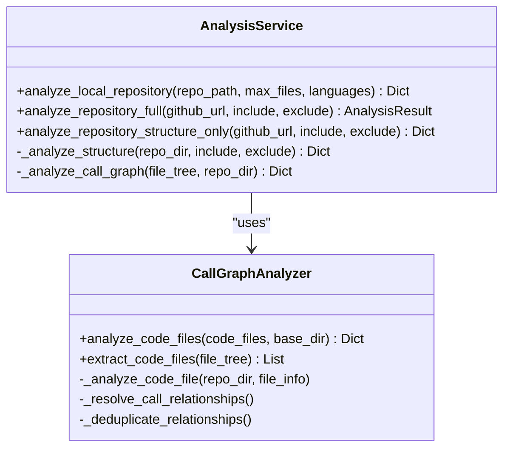
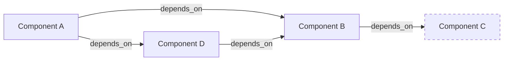

# Dependency Graph Construction

<cite>
**Referenced Files in This Document**
- [dependency_graphs_builder.py](file://codewiki/src/be/dependency_analyzer/dependency_graphs_builder.py)
- [ast_parser.py](file://codewiki/src/be/dependency_analyzer/ast_parser.py)
- [topo_sort.py](file://codewiki/src/be/dependency_analyzer/topo_sort.py)
- [core.py](file://codewiki/src/be/dependency_analyzer/models/core.py)
- [analysis_service.py](file://codewiki/src/be/dependency_analyzer/analysis/analysis_service.py)
- [call_graph_analyzer.py](file://codewiki/src/be/dependency_analyzer/analysis/call_graph_analyzer.py)
- [repo_analyzer.py](file://codewiki/src/be/dependency_analyzer/analysis/repo_analyzer.py)
- [patterns.py](file://codewiki/src/be/dependency_analyzer/utils/patterns.py)
- [python.py](file://codewiki/src/be/dependency_analyzer/analyzers/python.py)
- [javascript.py](file://codewiki/src/be/dependency_analyzer/analyzers/javascript.py)
- [typescript.py](file://codewiki/src/be/dependency_analyzer/analyzers/typescript.py)
- [cpp.py](file://codewiki/src/be/dependency_analyzer/analyzers/cpp.py)
- [java.py](file://codewiki/src/be/dependency_analyzer/analyzers/java.py)
</cite>

## Table of Contents
1. [Introduction](#introduction)
2. [Project Structure](#project-structure)
3. [Core Components](#core-components)
4. [Architecture Overview](#architecture-overview)
5. [Detailed Component Analysis](#detailed-component-analysis)
6. [Dependency Analysis](#dependency-analysis)
7. [Performance Considerations](#performance-considerations)
8. [Troubleshooting Guide](#troubleshooting-guide)
9. [Conclusion](#conclusion)

## Introduction
This document explains the dependency graph construction process in CodeWiki. It focuses on how the system discovers code components across multiple programming languages, builds a dependency graph, and transforms it into a traversable structure suitable for downstream tasks such as documentation generation and visualization. It also covers the integration with AST parsers, filtering and validation of components, and strategies for handling large repositories efficiently.

## Project Structure
The dependency graph pipeline spans several modules:
- Analysis orchestration: repository structure analysis, call graph extraction, and result consolidation
- Language-specific analyzers: AST-based parsers for Python, JavaScript/TypeScript, and Tree-sitter-based analyzers for C/C++, Java, and others
- Graph utilities: building adjacency graphs, detecting cycles, and computing leaf nodes
- Data models: shared Node and CallRelationship structures

**Diagram sources**
- [analysis_service.py](file://codewiki/src/be/dependency_analyzer/analysis/analysis_service.py#L24-L340)
- [call_graph_analyzer.py](file://codewiki/src/be/dependency_analyzer/analysis/call_graph_analyzer.py#L20-L536)
- [repo_analyzer.py](file://codewiki/src/be/dependency_analyzer/analysis/repo_analyzer.py#L16-L127)
- [python.py](file://codewiki/src/be/dependency_analyzer/analyzers/python.py#L15-L267)
- [javascript.py](file://codewiki/src/be/dependency_analyzer/analyzers/javascript.py#L18-L706)
- [typescript.py](file://codewiki/src/be/dependency_analyzer/analyzers/typescript.py#L17-L982)
- [cpp.py](file://codewiki/src/be/dependency_analyzer/analyzers/cpp.py#L13-L369)
- [java.py](file://codewiki/src/be/dependency_analyzer/analyzers/java.py#L13-L356)
- [ast_parser.py](file://codewiki/src/be/dependency_analyzer/ast_parser.py#L18-L146)
- [topo_sort.py](file://codewiki/src/be/dependency_analyzer/topo_sort.py#L239-L350)
- [core.py](file://codewiki/src/be/dependency_analyzer/models/core.py#L7-L64)

**Section sources**
- [analysis_service.py](file://codewiki/src/be/dependency_analyzer/analysis/analysis_service.py#L24-L340)
- [call_graph_analyzer.py](file://codewiki/src/be/dependency_analyzer/analysis/call_graph_analyzer.py#L20-L536)
- [repo_analyzer.py](file://codewiki/src/be/dependency_analyzer/analysis/repo_analyzer.py#L16-L127)
- [patterns.py](file://codewiki/src/be/dependency_analyzer/utils/patterns.py#L178-L202)

## Core Components
- DependencyGraphBuilder: orchestrates the end-to-end process, prepares output paths, invokes parsing, saves the graph, and computes leaf nodes
- DependencyParser: extracts components and relationships from analysis results and converts them into Node objects with dependency sets
- Topological utilities: build adjacency graphs, detect and resolve cycles, compute leaf nodes, and produce traversal orders
- AnalysisService: coordinates repository structure analysis and multi-language call graph generation
- CallGraphAnalyzer: routes files to language-specific analyzers, resolves relationships, deduplicates edges, and generates visualization data
- Language analyzers: AST/tree-sitter-based parsers that identify functions/classes/methods and their relationships
- Models: Node and CallRelationship define the graph structure and metadata

**Section sources**
- [dependency_graphs_builder.py](file://codewiki/src/be/dependency_analyzer/dependency_graphs_builder.py#L12-L94)
- [ast_parser.py](file://codewiki/src/be/dependency_analyzer/ast_parser.py#L18-L146)
- [topo_sort.py](file://codewiki/src/be/dependency_analyzer/topo_sort.py#L239-L350)
- [analysis_service.py](file://codewiki/src/be/dependency_analyzer/analysis/analysis_service.py#L24-L340)
- [call_graph_analyzer.py](file://codewiki/src/be/dependency_analyzer/analysis/call_graph_analyzer.py#L20-L536)
- [core.py](file://codewiki/src/be/dependency_analyzer/models/core.py#L7-L64)

## Architecture Overview
The dependency graph construction follows a layered pipeline:
1. Repository structure discovery and filtering
2. Multi-language code file extraction
3. Language-specific AST/tree-sitter analysis to extract functions and relationships
4. Relationship resolution and deduplication
5. Graph construction from components
6. Traversal preparation (cycles resolved, leaf nodes computed)

**Diagram sources**
- [dependency_graphs_builder.py](file://codewiki/src/be/dependency_analyzer/dependency_graphs_builder.py#L18-L94)
- [ast_parser.py](file://codewiki/src/be/dependency_analyzer/ast_parser.py#L28-L45)
- [analysis_service.py](file://codewiki/src/be/dependency_analyzer/analysis/analysis_service.py#L273-L294)
- [call_graph_analyzer.py](file://codewiki/src/be/dependency_analyzer/analysis/call_graph_analyzer.py#L27-L67)
- [topo_sort.py](file://codewiki/src/be/dependency_analyzer/topo_sort.py#L239-L350)

## Detailed Component Analysis

### DependencyGraphBuilder
Responsibilities:
- Initialize with a configuration object
- Prepare output directories and filenames
- Invoke the parser to analyze the repository
- Persist the dependency graph to JSON
- Convert components into a traversable adjacency graph
- Compute leaf nodes with filtering by component type and validity checks

Key behaviors:
- Output path composition from repository basename and sanitization
- Saving components to JSON with explicit conversion of sets to lists
- Building a graph where edges represent “depends on” relationships
- Determining valid leaf node types based on available component types
- Filtering invalid identifiers and error strings from leaf nodes

**Diagram sources**
- [dependency_graphs_builder.py](file://codewiki/src/be/dependency_analyzer/dependency_graphs_builder.py#L18-L94)
- [topo_sort.py](file://codewiki/src/be/dependency_analyzer/topo_sort.py#L239-L350)

**Section sources**
- [dependency_graphs_builder.py](file://codewiki/src/be/dependency_analyzer/dependency_graphs_builder.py#L12-L94)

### DependencyParser
Responsibilities:
- Parse repository structure and call graph results
- Construct Node objects from analysis outputs
- Map relationships to component IDs and populate depends_on sets
- Save the dependency graph to JSON

Key behaviors:
- Build components from function dictionaries and relationships
- Normalize legacy IDs and module paths
- Populate depends_on sets for each component
- Serialize graph with set-to-list conversion for JSON compatibility

**Diagram sources**
- [ast_parser.py](file://codewiki/src/be/dependency_analyzer/ast_parser.py#L18-L146)
- [core.py](file://codewiki/src/be/dependency_analyzer/models/core.py#L7-L64)

**Section sources**
- [ast_parser.py](file://codewiki/src/be/dependency_analyzer/ast_parser.py#L18-L146)
- [core.py](file://codewiki/src/be/dependency_analyzer/models/core.py#L7-L64)

### Topological Utilities and Graph Transformation
Responsibilities:
- Build adjacency graph from components’ depends_on sets
- Detect and resolve cycles using Tarjan’s algorithm
- Compute leaf nodes (nodes with no incoming edges)
- Provide traversal orders for dependency-first processing

Key behaviors:
- Natural dependency direction: A → B means A depends on B
- Cycle detection via strongly connected components
- Automatic cycle breaking by removing edges
- Leaf node filtering by component type and identifier sanity checks
- Large graph pruning to reduce leaf node count when necessary

**Diagram sources**
- [topo_sort.py](file://codewiki/src/be/dependency_analyzer/topo_sort.py#L18-L350)

**Section sources**
- [topo_sort.py](file://codewiki/src/be/dependency_analyzer/topo_sort.py#L18-L350)

### AnalysisService and CallGraphAnalyzer
Responsibilities:
- Analyze repository structure and extract code files
- Route files to language-specific analyzers
- Consolidate functions and relationships
- Resolve relationships across languages and deduplicate edges
- Generate visualization data

Key behaviors:
- Supported languages include Python, JavaScript, TypeScript, Java, C#, C, C++, PHP
- Extraction of code files based on extension mapping and inclusion/exclusion patterns
- Relationship resolution using lookup tables and module-qualified names
- Deduplication of relationships by caller-callee pairs

**Diagram sources**
- [analysis_service.py](file://codewiki/src/be/dependency_analyzer/analysis/analysis_service.py#L24-L340)
- [call_graph_analyzer.py](file://codewiki/src/be/dependency_analyzer/analysis/call_graph_analyzer.py#L20-L536)

**Section sources**
- [analysis_service.py](file://codewiki/src/be/dependency_analyzer/analysis/analysis_service.py#L24-L340)
- [call_graph_analyzer.py](file://codewiki/src/be/dependency_analyzer/analysis/call_graph_analyzer.py#L20-L536)
- [patterns.py](file://codewiki/src/be/dependency_analyzer/utils/patterns.py#L178-L202)

### Language-Specific Analyzers
- Python AST analyzer: visits AST nodes to extract classes, functions, and method relationships; filters built-ins and private test functions
- JavaScript/TypeScript analyzers: use Tree-sitter to parse ASTs, extract classes, functions, methods, and relationships; handle JSDoc type dependencies
- C/C++ analyzer: Tree-sitter-based extraction of classes, structs, functions, methods, inheritance, and object creation
- Java analyzer: Tree-sitter-based extraction of classes, interfaces, enums, records, annotations, and relationships including inheritance and field usage

Common patterns:
- Generate module-path-based component IDs
- Track top-level nodes for intra-file relationship mapping
- Filter built-in/system functions and invalid identifiers
- Populate depends_on sets and CallRelationship entries

**Section sources**
- [python.py](file://codewiki/src/be/dependency_analyzer/analyzers/python.py#L15-L267)
- [javascript.py](file://codewiki/src/be/dependency_analyzer/analyzers/javascript.py#L18-L706)
- [typescript.py](file://codewiki/src/be/dependency_analyzer/analyzers/typescript.py#L17-L982)
- [cpp.py](file://codewiki/src/be/dependency_analyzer/analyzers/cpp.py#L13-L369)
- [java.py](file://codewiki/src/be/dependency_analyzer/analyzers/java.py#L13-L356)

## Dependency Analysis
The dependency graph is constructed from Node objects with depends_on sets. The adjacency graph uses natural direction: an edge from A to B indicates A depends on B. Topological utilities:
- Detect cycles using Tarjan’s algorithm
- Resolve cycles by removing edges
- Compute leaf nodes as nodes with no incoming edges
- Provide traversal orders for dependency-first processing

**Diagram sources**
- [topo_sort.py](file://codewiki/src/be/dependency_analyzer/topo_sort.py#L239-L350)
- [core.py](file://codewiki/src/be/dependency_analyzer/models/core.py#L18-L18)

**Section sources**
- [topo_sort.py](file://codewiki/src/be/dependency_analyzer/topo_sort.py#L18-L350)
- [core.py](file://codewiki/src/be/dependency_analyzer/models/core.py#L18-L18)

## Performance Considerations
- File filtering: Repository structure analysis applies inclusion/exclusion patterns to limit the number of files processed. See [patterns.py](file://codewiki/src/be/dependency_analyzer/utils/patterns.py#L10-L177).
- Language routing: Only supported languages are analyzed; unsupported files are ignored. See [analysis_service.py](file://codewiki/src/be/dependency_analyzer/analysis/analysis_service.py#L296-L323).
- Relationship resolution and deduplication: Reduces noise and improves graph quality. See [call_graph_analyzer.py](file://codewiki/src/be/dependency_analyzer/analysis/call_graph_analyzer.py#L327-L380).
- Large repository strategies:
  - Limit files analyzed via max_files or targeted selection
  - Use most-connected node selection to reduce graph size
  - Prune leaf nodes when counts exceed thresholds
- Logging and safety:
  - Safe file opening and path validation to prevent unsafe reads
  - Extensive logging for parsing failures and edge cases

[No sources needed since this section provides general guidance]

## Troubleshooting Guide
Common issues and handling:
- Missing components or invalid identifiers:
  - DependencyGraphBuilder filters out leaf nodes that are empty, contain error keywords, or are not present in components. See [dependency_graphs_builder.py](file://codewiki/src/be/dependency_analyzer/dependency_graphs_builder.py#L78-L93).
  - Topological utilities similarly filter invalid identifiers and prune leaf nodes when counts are excessive. See [topo_sort.py](file://codewiki/src/be/dependency_analyzer/topo_sort.py#L318-L350).
- Parsing failures:
  - Python analyzer suppresses SyntaxWarnings and logs errors for malformed files. See [python.py](file://codewiki/src/be/dependency_analyzer/analyzers/python.py#L230-L246).
  - JavaScript/TypeScript analyzers log initialization failures and skip problematic files. See [javascript.py](file://codewiki/src/be/dependency_analyzer/analyzers/javascript.py#L30-L40) and [typescript.py](file://codewiki/src/be/dependency_analyzer/analyzers/typescript.py#L28-L38).
- Unsupported languages:
  - Unsupported files are ignored during call graph analysis. See [call_graph_analyzer.py](file://codewiki/src/be/dependency_analyzer/analysis/call_graph_analyzer.py#L137-L141).
- Relationship resolution:
  - Unresolved relationships remain unresolved; deduplication ensures uniqueness. See [call_graph_analyzer.py](file://codewiki/src/be/dependency_analyzer/analysis/call_graph_analyzer.py#L327-L380).

**Section sources**
- [dependency_graphs_builder.py](file://codewiki/src/be/dependency_analyzer/dependency_graphs_builder.py#L78-L93)
- [topo_sort.py](file://codewiki/src/be/dependency_analyzer/topo_sort.py#L318-L350)
- [python.py](file://codewiki/src/be/dependency_analyzer/analyzers/python.py#L230-L246)
- [javascript.py](file://codewiki/src/be/dependency_analyzer/analyzers/javascript.py#L30-L40)
- [typescript.py](file://codewiki/src/be/dependency_analyzer/analyzers/typescript.py#L28-L38)
- [call_graph_analyzer.py](file://codewiki/src/be/dependency_analyzer/analysis/call_graph_analyzer.py#L137-L141)
- [call_graph_analyzer.py](file://codewiki/src/be/dependency_analyzer/analysis/call_graph_analyzer.py#L327-L380)

## Conclusion
CodeWiki’s dependency graph construction integrates repository structure analysis, multi-language AST/tree-sitter parsing, and robust graph utilities. The pipeline:
- Identifies components and relationships across languages
- Resolves and deduplicates relationships
- Produces a traversable dependency graph with cycle detection and leaf node computation
- Provides filtering and pruning strategies for large repositories

This foundation enables downstream documentation generation and visualization workflows.