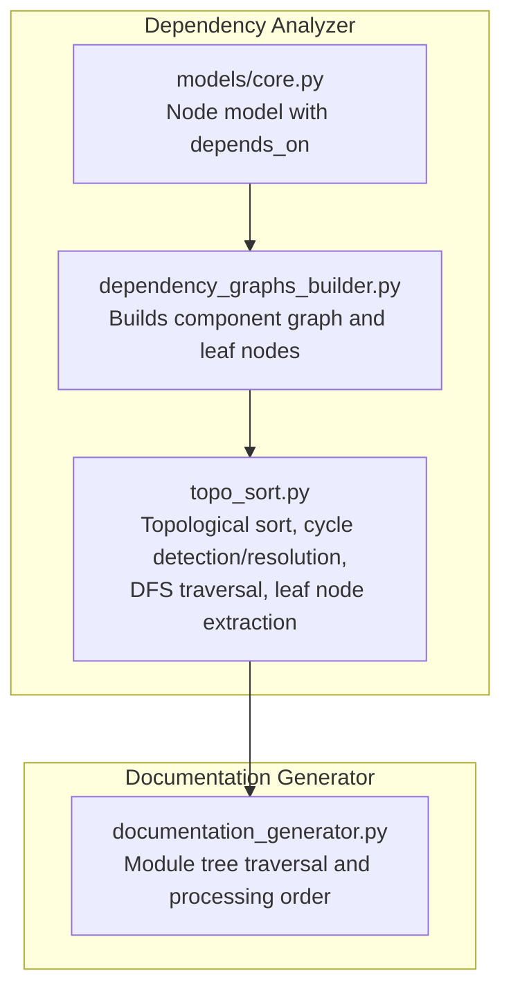
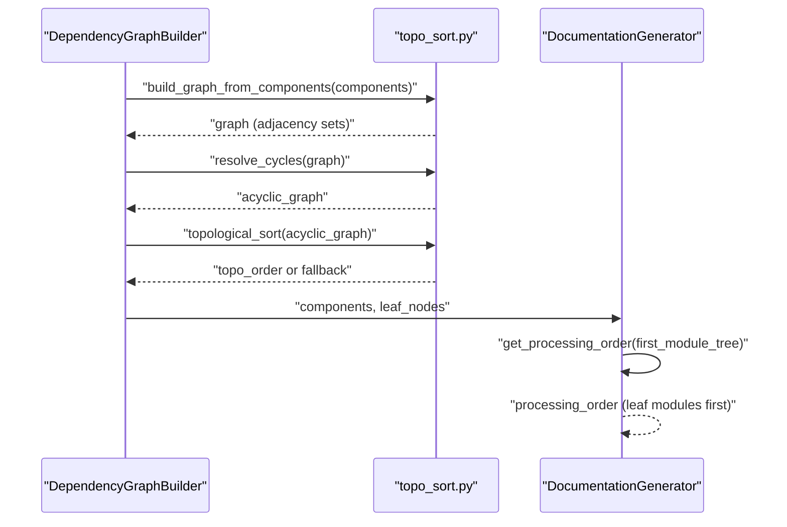
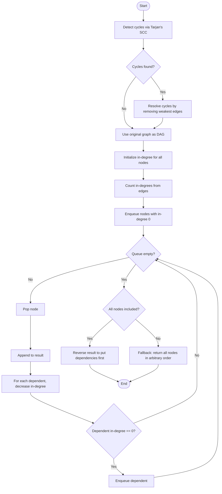
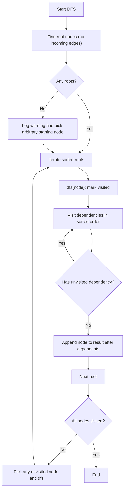
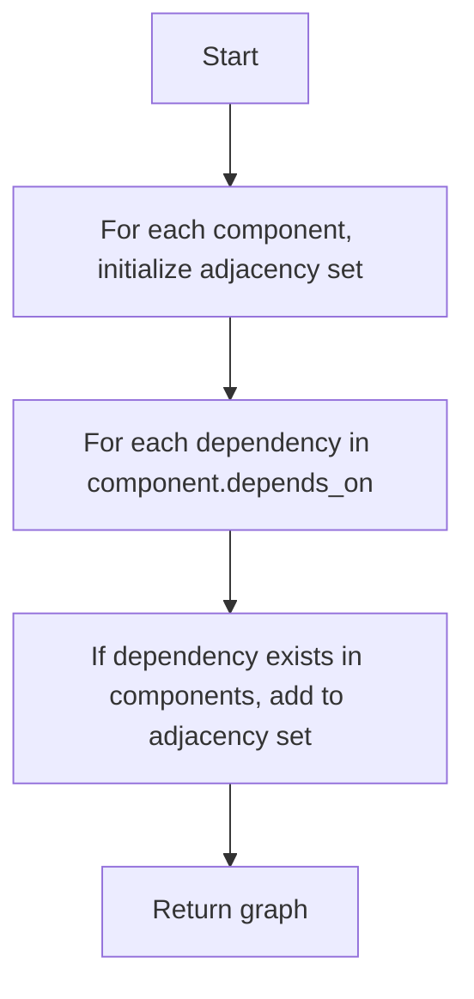
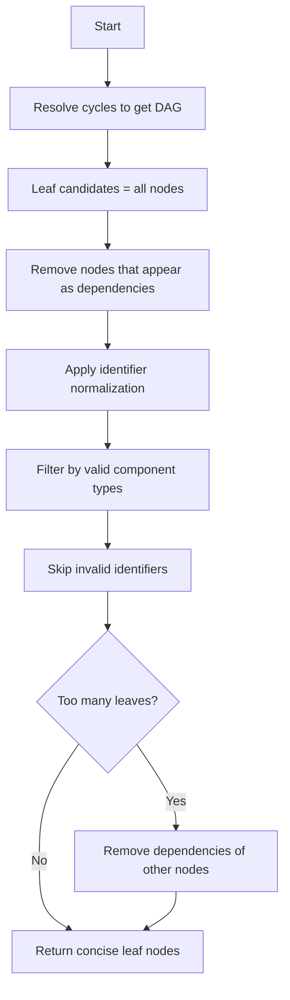
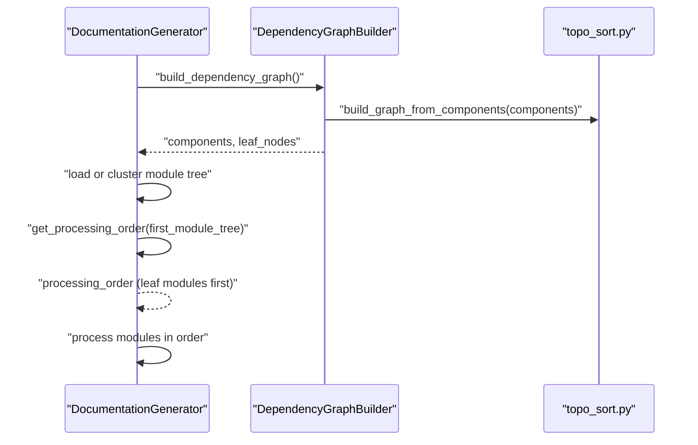
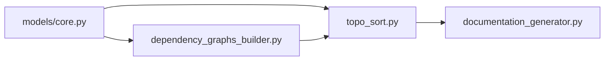

# Topological Sorting and Graph Traversal

<cite>
**Referenced Files in This Document**
- [topo_sort.py](file://codewiki/src/be/dependency_analyzer/topo_sort.py)
- [dependency_graphs_builder.py](file://codewiki/src/be/dependency_analyzer/dependency_graphs_builder.py)
- [documentation_generator.py](file://codewiki/src/be/documentation_generator.py)
- [core.py](file://codewiki/src/be/dependency_analyzer/models/core.py)
</cite>

## Table of Contents
1. [Introduction](#introduction)
2. [Project Structure](#project-structure)
3. [Core Components](#core-components)
4. [Architecture Overview](#architecture-overview)
5. [Detailed Component Analysis](#detailed-component-analysis)
6. [Dependency Analysis](#dependency-analysis)
7. [Performance Considerations](#performance-considerations)
8. [Troubleshooting Guide](#troubleshooting-guide)
9. [Conclusion](#conclusion)

## Introduction
This document explains the topological sorting and graph traversal system used in CodeWiki’s dependency analysis pipeline. It focuses on two core algorithms:
- Kahn’s algorithm-based topological sort with in-degree counting and queue-based processing, including cycle detection and resolution to ensure a Directed Acyclic Graph (DAG) before sorting.
- A depth-first traversal approach that prioritizes dependencies before dependents, with deterministic ordering via sorted iteration.

We also describe how these utilities integrate into the broader documentation generation workflow, including concrete examples of node ordering for documentation generation and guidance on handling cycles and fallback behaviors.

## Project Structure
The topological sorting and traversal logic resides in the backend dependency analyzer module. The key files are:
- Topological sorting utilities and graph builders
- Documentation generation orchestrator that consumes the resulting order
- Core data model for components used to construct the dependency graph

**Diagram sources**
- [topo_sort.py](file://codewiki/src/be/dependency_analyzer/topo_sort.py#L1-L350)
- [dependency_graphs_builder.py](file://codewiki/src/be/dependency_analyzer/dependency_graphs_builder.py#L1-L94)
- [documentation_generator.py](file://codewiki/src/be/documentation_generator.py#L1-L292)
- [core.py](file://codewiki/src/be/dependency_analyzer/models/core.py#L1-L64)

**Section sources**
- [topo_sort.py](file://codewiki/src/be/dependency_analyzer/topo_sort.py#L1-L350)
- [dependency_graphs_builder.py](file://codewiki/src/be/dependency_analyzer/dependency_graphs_builder.py#L1-L94)
- [documentation_generator.py](file://codewiki/src/be/documentation_generator.py#L1-L292)
- [core.py](file://codewiki/src/be/dependency_analyzer/models/core.py#L1-L64)

## Core Components
- Topological sorting utilities:
  - Cycle detection using Tarjan’s algorithm to find strongly connected components.
  - Cycle resolution by removing “weakest” edges to produce a DAG.
  - Kahn’s algorithm implementation with in-degree counting and a deque-based queue.
  - Fallback behavior that returns all nodes in arbitrary order when a complete topological sort is not possible.
- Depth-first traversal:
  - Builds a reverse reachability map to identify root nodes (no incoming edges).
  - Performs DFS to process dependencies before dependents, with deterministic ordering via sorted iteration.
- Graph construction:
  - Builds a dependency graph from components using the natural direction where an edge A → B indicates “A depends on B.”
- Leaf node extraction:
  - Identifies leaf nodes (nodes with no dependents) and applies filtering rules based on component types and identifiers.

**Section sources**
- [topo_sort.py](file://codewiki/src/be/dependency_analyzer/topo_sort.py#L1-L350)
- [dependency_graphs_builder.py](file://codewiki/src/be/dependency_analyzer/dependency_graphs_builder.py#L1-L94)
- [core.py](file://codewiki/src/be/dependency_analyzer/models/core.py#L1-L64)

## Architecture Overview
The system integrates dependency analysis with documentation generation as follows:
- Components are parsed and stored as Node objects with a depends_on set.
- A dependency graph is constructed from components.
- Cycle detection and resolution ensure a DAG.
- Kahn’s algorithm produces a topological order; DFS traversal provides an alternative deterministic order.
- Documentation generation uses the module tree and leaf nodes to process modules in dependency order.

**Diagram sources**
- [dependency_graphs_builder.py](file://codewiki/src/be/dependency_analyzer/dependency_graphs_builder.py#L1-L94)
- [topo_sort.py](file://codewiki/src/be/dependency_analyzer/topo_sort.py#L1-L350)
- [documentation_generator.py](file://codewiki/src/be/documentation_generator.py#L1-L292)

## Detailed Component Analysis

### Kahn’s Algorithm Topological Sort
Kahn’s algorithm computes a topological order by:
- Detecting and resolving cycles to form a DAG.
- Computing in-degrees for all nodes.
- Initializing a queue with nodes of zero in-degree.
- Repeatedly removing nodes from the queue, appending to the result, and decrementing in-degrees of dependents.
- Returning the reversed result so dependencies appear before dependents.
- Falling back to returning all nodes in arbitrary order if not all nodes were included (indicating unresolved cycles).

**Diagram sources**
- [topo_sort.py](file://codewiki/src/be/dependency_analyzer/topo_sort.py#L121-L169)

Key implementation references:
- Cycle detection and resolution: [detect_cycles](file://codewiki/src/be/dependency_analyzer/topo_sort.py#L18-L76), [resolve_cycles](file://codewiki/src/be/dependency_analyzer/topo_sort.py#L78-L119)
- Kahn’s algorithm: [topological_sort](file://codewiki/src/be/dependency_analyzer/topo_sort.py#L121-L169)
- Fallback behavior: [topological_sort](file://codewiki/src/be/dependency_analyzer/topo_sort.py#L163-L169)

**Section sources**
- [topo_sort.py](file://codewiki/src/be/dependency_analyzer/topo_sort.py#L18-L169)

### Depth-First Traversal (Dependencies First)
The DFS-based traversal:
- Resolves cycles to ensure a DAG.
- Identifies root nodes (nodes with no incoming edges) using a reverse reachability map.
- Performs DFS to process dependencies before dependents, with deterministic ordering via sorted iteration over neighbors and roots.

**Diagram sources**
- [topo_sort.py](file://codewiki/src/be/dependency_analyzer/topo_sort.py#L171-L237)

Key implementation references:
- DFS traversal: [dependency_first_dfs](file://codewiki/src/be/dependency_analyzer/topo_sort.py#L171-L237)

**Section sources**
- [topo_sort.py](file://codewiki/src/be/dependency_analyzer/topo_sort.py#L171-L237)

### Graph Construction from Components
The dependency graph is built from components using the natural direction where an edge A → B means “A depends on B.” Only dependencies present among parsed components are included.

**Diagram sources**
- [topo_sort.py](file://codewiki/src/be/dependency_analyzer/topo_sort.py#L239-L268)

Key implementation references:
- Graph construction: [build_graph_from_components](file://codewiki/src/be/dependency_analyzer/topo_sort.py#L239-L268)
- Component model: [Node](file://codewiki/src/be/dependency_analyzer/models/core.py#L7-L41)

**Section sources**
- [topo_sort.py](file://codewiki/src/be/dependency_analyzer/topo_sort.py#L239-L268)
- [core.py](file://codewiki/src/be/dependency_analyzer/models/core.py#L1-L64)

### Leaf Node Extraction
Leaf nodes are computed from the DAG and filtered based on component types and identifier validity. Special handling is applied for certain identifiers (e.g., removing trailing markers) and limiting counts for very large graphs.

**Diagram sources**
- [topo_sort.py](file://codewiki/src/be/dependency_analyzer/topo_sort.py#L271-L350)

Key implementation references:
- Leaf extraction: [get_leaf_nodes](file://codewiki/src/be/dependency_analyzer/topo_sort.py#L271-L350)

**Section sources**
- [topo_sort.py](file://codewiki/src/be/dependency_analyzer/topo_sort.py#L271-L350)

### Integration with Documentation Generation
The documentation generator orchestrates processing order using:
- A module tree derived from clustered leaf nodes.
- A post-order traversal that processes children before parents, ensuring dependencies are documented before their dependents.
- When no module tree exists, it falls back to processing leaf nodes directly.

**Diagram sources**
- [documentation_generator.py](file://codewiki/src/be/documentation_generator.py#L1-L292)
- [dependency_graphs_builder.py](file://codewiki/src/be/dependency_analyzer/dependency_graphs_builder.py#L1-L94)
- [topo_sort.py](file://codewiki/src/be/dependency_analyzer/topo_sort.py#L239-L268)

Concrete examples of node ordering for documentation generation:
- Module tree traversal collects modules in a depth-first manner, appending parent modules after their children to ensure dependencies are processed first. See [get_processing_order](file://codewiki/src/be/documentation_generator.py#L74-L92).
- The documentation generator iterates over the computed processing order to process leaf modules first, then parent modules, and finally the repository overview. See [generate_module_documentation](file://codewiki/src/be/documentation_generator.py#L124-L197).

**Section sources**
- [documentation_generator.py](file://codewiki/src/be/documentation_generator.py#L74-L197)
- [dependency_graphs_builder.py](file://codewiki/src/be/dependency_analyzer/dependency_graphs_builder.py#L1-L94)

## Dependency Analysis
- Internal dependencies:
  - The dependency graph builder constructs the graph from components and extracts leaf nodes.
  - The topological sorting utilities depend on the Node model and provide cycle detection, resolution, Kahn’s algorithm, and DFS traversal.
  - The documentation generator depends on the module tree and leaf nodes produced by the builder and sorting utilities.
- External dependencies:
  - Collections deque is used for efficient queue operations in Kahn’s algorithm.
  - Logging is used for warnings and diagnostics during cycle detection and fallback scenarios.

**Diagram sources**
- [core.py](file://codewiki/src/be/dependency_analyzer/models/core.py#L1-L64)
- [dependency_graphs_builder.py](file://codewiki/src/be/dependency_analyzer/dependency_graphs_builder.py#L1-L94)
- [topo_sort.py](file://codewiki/src/be/dependency_analyzer/topo_sort.py#L1-L350)
- [documentation_generator.py](file://codewiki/src/be/documentation_generator.py#L1-L292)

**Section sources**
- [core.py](file://codewiki/src/be/dependency_analyzer/models/core.py#L1-L64)
- [dependency_graphs_builder.py](file://codewiki/src/be/dependency_analyzer/dependency_graphs_builder.py#L1-L94)
- [topo_sort.py](file://codewiki/src/be/dependency_analyzer/topo_sort.py#L1-L350)
- [documentation_generator.py](file://codewiki/src/be/documentation_generator.py#L1-L292)

## Performance Considerations
- Queue operations:
  - Use collections.deque for O(1) popleft and append operations in Kahn’s algorithm to achieve linear-time performance.
- Deterministic ordering:
  - Sort neighbor lists and root lists before traversal to ensure deterministic output across runs.
- Complexity:
  - Kahn’s algorithm: O(V + E) for in-degree computation and queue processing.
  - Tarjan’s SCC detection: O(V + E) for cycle detection.
  - DFS traversal: O(V + E) for visiting all nodes and edges.
- Large graphs:
  - Prefer Kahn’s algorithm for scalability and predictable performance.
  - Apply early filtering (e.g., leaf node selection and identifier normalization) to reduce graph size.
- Memory:
  - Avoid storing unnecessary copies of the graph; resolve cycles in place or on a shallow copy as implemented.

[No sources needed since this section provides general guidance]

## Troubleshooting Guide
Common issues and resolutions:
- Incomplete sort due to unresolved cycles:
  - Symptom: The result length is less than the number of nodes.
  - Behavior: The algorithm logs a warning and returns all nodes in arbitrary order as a fallback.
  - References: [topological_sort](file://codewiki/src/be/dependency_analyzer/topo_sort.py#L163-L169)
- No root nodes found:
  - Symptom: DFS logs a warning and selects an arbitrary starting node.
  - Behavior: DFS continues to traverse reachable nodes and appends them after their dependencies.
  - References: [dependency_first_dfs](file://codewiki/src/be/dependency_analyzer/topo_sort.py#L191-L208)
- Empty leaf nodes:
  - Symptom: Leaf extraction returns an empty list.
  - Behavior: The system logs a warning and proceeds with minimal filtering.
  - References: [get_leaf_nodes](file://codewiki/src/be/dependency_analyzer/topo_sort.py#L336-L349)
- Invalid identifiers or unsupported types:
  - Symptom: Certain leaf nodes are skipped based on validation rules.
  - Behavior: Logging warns about skipping invalid identifiers or types.
  - References: [get_leaf_nodes](file://codewiki/src/be/dependency_analyzer/topo_sort.py#L318-L333)

**Section sources**
- [topo_sort.py](file://codewiki/src/be/dependency_analyzer/topo_sort.py#L163-L169)
- [topo_sort.py](file://codewiki/src/be/dependency_analyzer/topo_sort.py#L191-L208)
- [topo_sort.py](file://codewiki/src/be/dependency_analyzer/topo_sort.py#L318-L349)

## Conclusion
CodeWiki’s topological sorting and graph traversal system ensures robust dependency-aware processing:
- Cycle detection and resolution guarantee a DAG before sorting.
- Kahn’s algorithm provides an efficient, queue-based topological order with deterministic fallback behavior.
- DFS traversal offers an alternative deterministic approach prioritizing dependencies first.
- These utilities integrate tightly with the documentation generation pipeline to process modules in dependency order, starting with leaf modules and progressing to parent modules and the repository overview.

[No sources needed since this section summarizes without analyzing specific files]