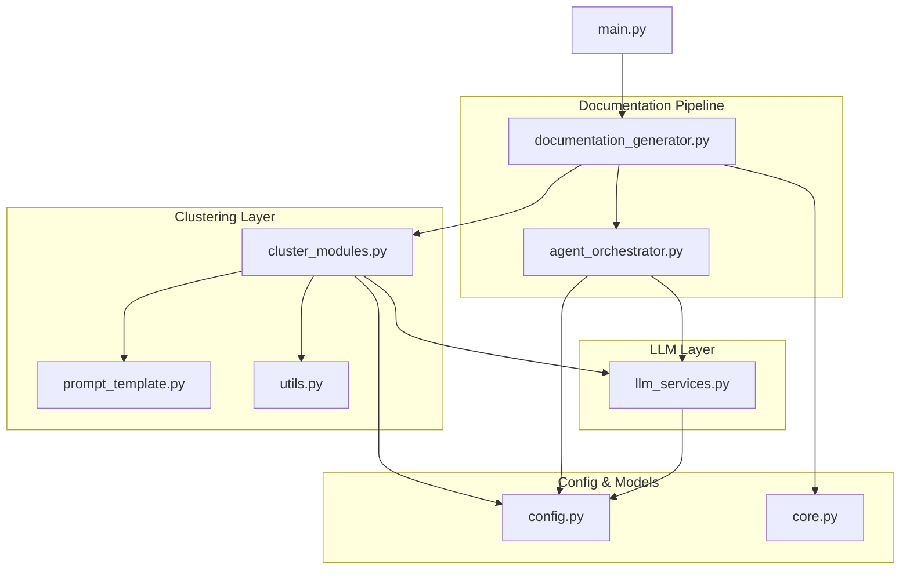
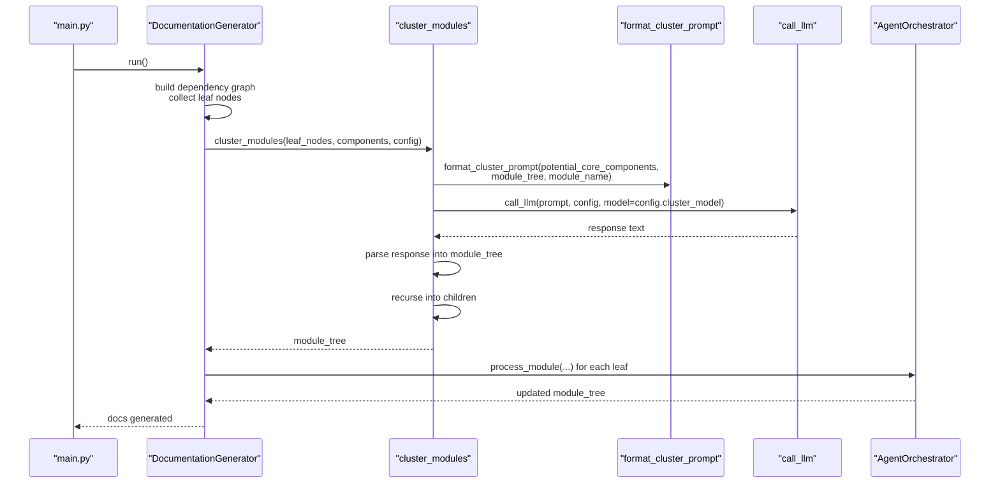
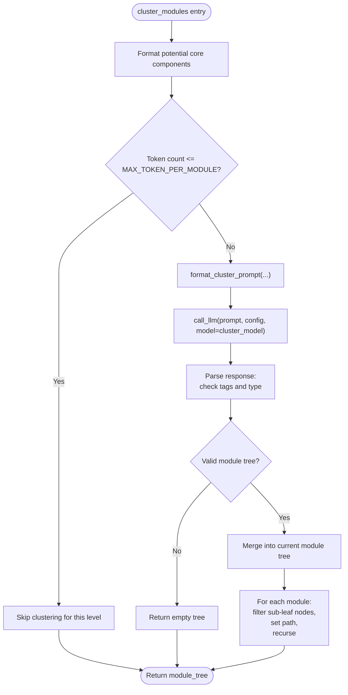
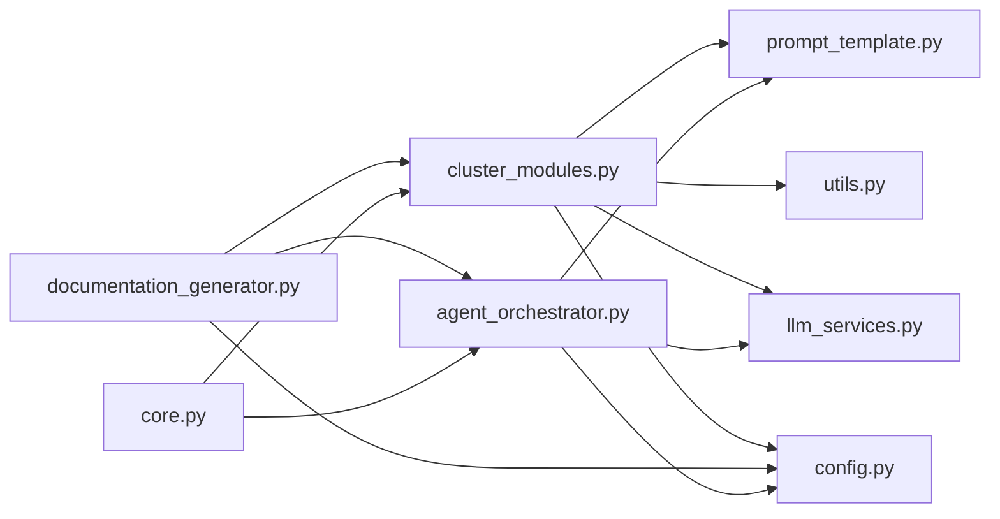

# Hierarchical Decomposition and Module Clustering

<cite>
**Referenced Files in This Document**
- [cluster_modules.py](file://codewiki/src/be/cluster_modules.py)
- [prompt_template.py](file://codewiki/src/be/prompt_template.py)
- [llm_services.py](file://codewiki/src/be/llm_services.py)
- [documentation_generator.py](file://codewiki/src/be/documentation_generator.py)
- [agent_orchestrator.py](file://codewiki/src/be/agent_orchestrator.py)
- [config.py](file://codewiki/src/config.py)
- [utils.py](file://codewiki/src/be/utils.py)
- [core.py](file://codewiki/src/be/dependency_analyzer/models/core.py)
- [main.py](file://codewiki/src/be/main.py)
</cite>

## Table of Contents
1. [Introduction](#introduction)
2. [Project Structure](#project-structure)
3. [Core Components](#core-components)
4. [Architecture Overview](#architecture-overview)
5. [Detailed Component Analysis](#detailed-component-analysis)
6. [Dependency Analysis](#dependency-analysis)
7. [Performance Considerations](#performance-considerations)
8. [Troubleshooting Guide](#troubleshooting-guide)
9. [Conclusion](#conclusion)

## Introduction
This document explains the hierarchical decomposition and module clustering system in CodeWiki. It focuses on how the recursive clustering algorithm groups code components into logical modules using LLM prompts, token counting, and a tree-building strategy that preserves architectural context. It documents the workflow of the cluster_modules function, including token counting, prompt formatting via format_cluster_prompt, response parsing with robust error handling, and the recursive descent that builds a hierarchical module tree. It also covers configuration parameters controlling clustering behavior, the relationship between clustering and the agent orchestrator, common issues and solutions, and performance considerations for large codebases.

## Project Structure
The clustering system is centered in the backend (be) layer and integrates with the documentation pipeline and agent orchestrator. The key files are:
- Clusterer: cluster_modules.py
- Prompting: prompt_template.py
- LLM services: llm_services.py
- Orchestrator: documentation_generator.py
- Agent orchestration: agent_orchestrator.py
- Configuration: config.py
- Utilities: utils.py
- Dependency model: core.py
- Entry point: main.py

**Diagram sources**
- [cluster_modules.py](file://codewiki/src/be/cluster_modules.py#L44-L113)
- [prompt_template.py](file://codewiki/src/be/prompt_template.py#L308-L337)
- [llm_services.py](file://codewiki/src/be/llm_services.py#L58-L86)
- [documentation_generator.py](file://codewiki/src/be/documentation_generator.py#L249-L292)
- [agent_orchestrator.py](file://codewiki/src/be/agent_orchestrator.py#L66-L149)
- [config.py](file://codewiki/src/config.py#L1-L114)
- [utils.py](file://codewiki/src/be/utils.py#L26-L40)
- [core.py](file://codewiki/src/be/dependency_analyzer/models/core.py#L7-L45)
- [main.py](file://codewiki/src/be/main.py#L46-L66)

**Section sources**
- [main.py](file://codewiki/src/be/main.py#L46-L66)
- [documentation_generator.py](file://codewiki/src/be/documentation_generator.py#L249-L292)
- [cluster_modules.py](file://codewiki/src/be/cluster_modules.py#L44-L113)
- [prompt_template.py](file://codewiki/src/be/prompt_template.py#L308-L337)
- [llm_services.py](file://codewiki/src/be/llm_services.py#L58-L86)
- [agent_orchestrator.py](file://codewiki/src/be/agent_orchestrator.py#L66-L149)
- [config.py](file://codewiki/src/config.py#L1-L114)
- [utils.py](file://codewiki/src/be/utils.py#L26-L40)
- [core.py](file://codewiki/src/be/dependency_analyzer/models/core.py#L7-L45)

## Core Components
- cluster_modules: Recursively clusters leaf components into modules, enforces token limits, formats prompts, calls LLM, parses structured output, and builds a hierarchical module tree.
- format_cluster_prompt: Formats either a repository-level or module-level clustering prompt using the current module tree and potential core components.
- call_llm: Thin wrapper around the configured LLM client to send prompts and receive text responses.
- DocumentationGenerator: Drives the end-to-end pipeline, including dependency graph building, initial clustering, and documentation generation via agents.
- AgentOrchestrator: Creates agents per module, manages tooling, and executes agent runs with the module tree and core components.
- Config: Provides configuration for token limits, LLM models, and output directories.
- count_tokens: Token counter using tiktoken encoding.
- Node model: Defines the shape of code components (id, relative_path, source_code, etc.).

**Section sources**
- [cluster_modules.py](file://codewiki/src/be/cluster_modules.py#L44-L113)
- [prompt_template.py](file://codewiki/src/be/prompt_template.py#L308-L337)
- [llm_services.py](file://codewiki/src/be/llm_services.py#L58-L86)
- [documentation_generator.py](file://codewiki/src/be/documentation_generator.py#L249-L292)
- [agent_orchestrator.py](file://codewiki/src/be/agent_orchestrator.py#L66-L149)
- [config.py](file://codewiki/src/config.py#L1-L114)
- [utils.py](file://codewiki/src/be/utils.py#L26-L40)
- [core.py](file://codewiki/src/be/dependency_analyzer/models/core.py#L7-L45)

## Architecture Overview
The clustering system is invoked early in the pipeline to produce a hierarchical module tree. The DocumentationGenerator coordinates:
- Building a dependency graph and collecting leaf nodes
- Clustering leaf nodes into modules via cluster_modules
- Persisting the first module tree and then the final module tree
- Iterating through modules in dependency order (leaf-first) to generate documentation via agents

**Diagram sources**
- [main.py](file://codewiki/src/be/main.py#L46-L66)
- [documentation_generator.py](file://codewiki/src/be/documentation_generator.py#L249-L292)
- [cluster_modules.py](file://codewiki/src/be/cluster_modules.py#L44-L113)
- [prompt_template.py](file://codewiki/src/be/prompt_template.py#L308-L337)
- [llm_services.py](file://codewiki/src/be/llm_services.py#L58-L86)
- [agent_orchestrator.py](file://codewiki/src/be/agent_orchestrator.py#L90-L149)

## Detailed Component Analysis

### cluster_modules: Recursive Hierarchical Clustering
The cluster_modules function performs:
- Formatting potential core components grouped by file
- Token counting to decide whether clustering is needed
- Prompt formatting with format_cluster_prompt
- LLM invocation via call_llm
- Structured response parsing with strict checks
- Tree construction and recursion into children

Key behaviors:
- Token gating: If the formatted code plus component list is small enough, clustering is skipped to avoid unnecessary LLM calls.
- Prompt selection: Uses repository-level or module-level prompt depending on whether module_tree is empty.
- Response parsing: Requires a specific tag-delimited structure and validates types.
- Tree merging: When not at the root, merges the returned subtree into the current path.
- Recursion: For each module, filters invalid sub-leaf nodes, sets up path, and recurses.

**Diagram sources**
- [cluster_modules.py](file://codewiki/src/be/cluster_modules.py#L44-L113)
- [prompt_template.py](file://codewiki/src/be/prompt_template.py#L308-L337)
- [llm_services.py](file://codewiki/src/be/llm_services.py#L58-L86)
- [config.py](file://codewiki/src/config.py#L1-L114)
- [utils.py](file://codewiki/src/be/utils.py#L26-L40)

**Section sources**
- [cluster_modules.py](file://codewiki/src/be/cluster_modules.py#L44-L113)
- [prompt_template.py](file://codewiki/src/be/prompt_template.py#L308-L337)
- [llm_services.py](file://codewiki/src/be/llm_services.py#L58-L86)
- [config.py](file://codewiki/src/config.py#L1-L114)
- [utils.py](file://codewiki/src/be/utils.py#L26-L40)

### format_cluster_prompt: Hierarchical Prompt Construction
The function formats either a repository-level or module-level clustering prompt:
- Builds a human-readable module tree representation including children and core components
- Selects CLUSTER_REPO_PROMPT when module_tree is empty
- Selects CLUSTER_MODULE_PROMPT when module_tree is provided, including the current module context

This preserves architectural context so the LLM can group components into smaller modules while respecting existing hierarchy.

**Section sources**
- [prompt_template.py](file://codewiki/src/be/prompt_template.py#L308-L337)

### LLM Services: call_llm and Model Chain
The call_llm function:
- Creates an OpenAI client from configuration
- Sends a chat completion request with the provided prompt
- Returns the model’s text response

Fallback models are created via create_fallback_models to improve reliability.

**Section sources**
- [llm_services.py](file://codewiki/src/be/llm_services.py#L58-L86)
- [config.py](file://codewiki/src/config.py#L1-L114)

### DocumentationGenerator: Orchestrating Clustering and Documentation
DocumentationGenerator:
- Builds the dependency graph and collects leaf nodes
- Checks for persisted first_module_tree.json; if absent, invokes cluster_modules
- Persists the resulting module tree
- Iterates modules in dependency order (leaf-first) to generate documentation
- Generates repository overview after leaf modules are processed

This ensures clustering happens once and documentation proceeds in a structured, top-down manner.

**Section sources**
- [documentation_generator.py](file://codewiki/src/be/documentation_generator.py#L249-L292)
- [cluster_modules.py](file://codewiki/src/be/cluster_modules.py#L44-L113)

### AgentOrchestrator: Processing Modules with Agents
AgentOrchestrator:
- Creates agents with different toolsets depending on module complexity
- Loads or creates the module tree and passes it to agents
- Runs agent.run with a user prompt that includes the module tree and core components
- Saves the updated module tree after successful runs

This bridges clustering output to agent-driven documentation generation.

**Section sources**
- [agent_orchestrator.py](file://codewiki/src/be/agent_orchestrator.py#L66-L149)
- [prompt_template.py](file://codewiki/src/be/prompt_template.py#L242-L305)

### Data Models: Node and Clustering Inputs
The Node model defines the shape of code components used throughout clustering and documentation:
- Fields include id, name, component_type, file_path, relative_path, depends_on, source_code, and more
- Used by cluster_modules to format potential core components and by agents to read code

**Section sources**
- [core.py](file://codewiki/src/be/dependency_analyzer/models/core.py#L7-L45)

## Dependency Analysis
The clustering system exhibits layered dependencies:
- cluster_modules depends on:
  - format_cluster_prompt for prompt construction
  - count_tokens for token gating
  - call_llm for inference
  - Config for MAX_TOKEN_PER_MODULE and cluster_model
- DocumentationGenerator depends on:
  - cluster_modules for module tree creation
  - AgentOrchestrator for module documentation
  - Config for output paths and LLM settings
- AgentOrchestrator depends on:
  - LLM services for model access
  - Prompt templates for user prompts
  - Config for model selection and depth limits

**Diagram sources**
- [cluster_modules.py](file://codewiki/src/be/cluster_modules.py#L44-L113)
- [prompt_template.py](file://codewiki/src/be/prompt_template.py#L308-L337)
- [llm_services.py](file://codewiki/src/be/llm_services.py#L58-L86)
- [documentation_generator.py](file://codewiki/src/be/documentation_generator.py#L249-L292)
- [agent_orchestrator.py](file://codewiki/src/be/agent_orchestrator.py#L66-L149)
- [config.py](file://codewiki/src/config.py#L1-L114)
- [core.py](file://codewiki/src/be/dependency_analyzer/models/core.py#L7-L45)

**Section sources**
- [cluster_modules.py](file://codewiki/src/be/cluster_modules.py#L44-L113)
- [documentation_generator.py](file://codewiki/src/be/documentation_generator.py#L249-L292)
- [agent_orchestrator.py](file://codewiki/src/be/agent_orchestrator.py#L66-L149)
- [config.py](file://codewiki/src/config.py#L1-L114)
- [core.py](file://codewiki/src/be/dependency_analyzer/models/core.py#L7-L45)

## Performance Considerations
- Token gating: cluster_modules skips clustering when token counts are below MAX_TOKEN_PER_MODULE to reduce LLM calls.
- Early pruning: format_potential_core_components filters invalid leaf nodes and groups by file to keep prompts compact.
- Recursive descent: The algorithm recurses only when the returned module tree has more than one module, avoiding deep recursion on trivial splits.
- Persistence: The first module tree is persisted to disk to avoid recomputation across runs.
- Model selection: Using cluster_model for clustering allows separating clustering costs from documentation generation costs.

Optimization tips:
- Increase MAX_TOKEN_PER_MODULE cautiously to reduce recursion depth for large repositories.
- Pre-filter leaf nodes to remove low-signal components before clustering.
- Use a smaller cluster_model for clustering to reduce cost, while keeping the main model for documentation generation.
- Batch or cache repeated reads of source code to minimize redundant I/O.

[No sources needed since this section provides general guidance]

## Troubleshooting Guide
Common issues and resolutions:
- Invalid LLM response format:
  - Symptom: Missing GROUPED_COMPONENTS tags or non-dictionary response.
  - Resolution: Ensure the LLM prompt returns the exact tag-delimited structure. Consider adjusting temperature and model to improve deterministic output.
  - Related code: response parsing and error logging in cluster_modules.
- Token limit exceeded:
  - Symptom: Excessive source code in potential components.
  - Resolution: Reduce MAX_TOKEN_PER_MODULE or pre-filter leaf nodes to fewer, higher-signal components.
  - Related code: token counting and gating in cluster_modules.
- Invalid sub-leaf nodes:
  - Symptom: Sub-module components not present in components dictionary.
  - Resolution: Verify dependency analyzer output and ensure component IDs are consistent.
  - Related code: filtering and warnings in cluster_modules.
- Missing persisted module tree:
  - Symptom: Repeated clustering on every run.
  - Resolution: Ensure first_module_tree.json is created and persisted by DocumentationGenerator.
  - Related code: persistence logic in DocumentationGenerator.
- Agent failures:
  - Symptom: Exceptions during agent runs.
  - Resolution: Inspect agent_orchestrator logs and verify tool availability and module tree correctness.
  - Related code: agent_orchestrator error handling and saving updated module tree.

**Section sources**
- [cluster_modules.py](file://codewiki/src/be/cluster_modules.py#L61-L113)
- [documentation_generator.py](file://codewiki/src/be/documentation_generator.py#L249-L292)
- [agent_orchestrator.py](file://codewiki/src/be/agent_orchestrator.py#L90-L149)

## Conclusion
The hierarchical decomposition and module clustering system in CodeWiki uses a recursive, LLM-driven approach to organize code components into logical modules while preserving architectural context. The cluster_modules function enforces token limits, constructs precise prompts, parses structured responses, and recursively builds a module tree. DocumentationGenerator orchestrates clustering and subsequent agent-driven documentation generation, ensuring efficient processing of leaf modules first and top-level overviews last. Configuration parameters like MAX_TOKEN_PER_MODULE and cluster_model enable tuning for performance and cost. Robust error handling and persistence mitigate common pitfalls, while the modular design supports scalability for large codebases.