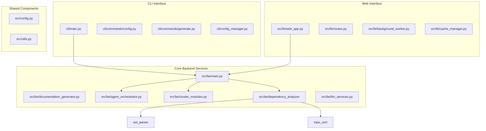
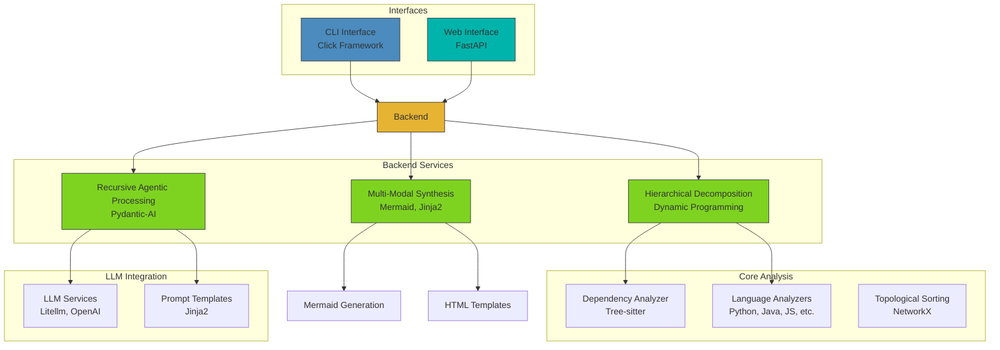
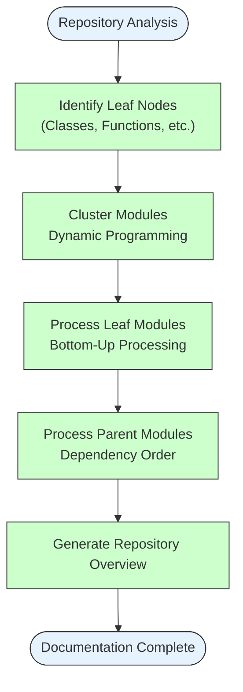
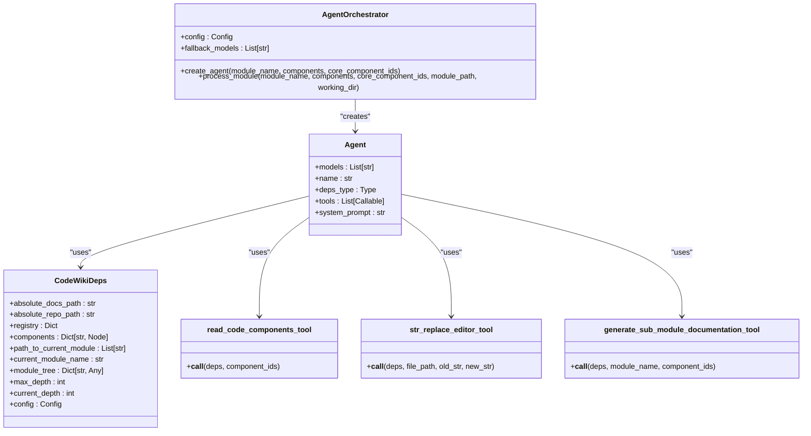
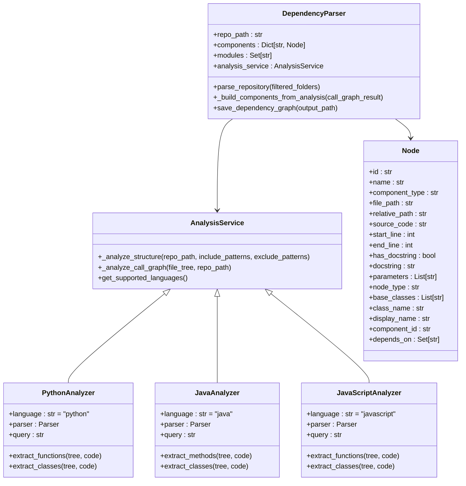
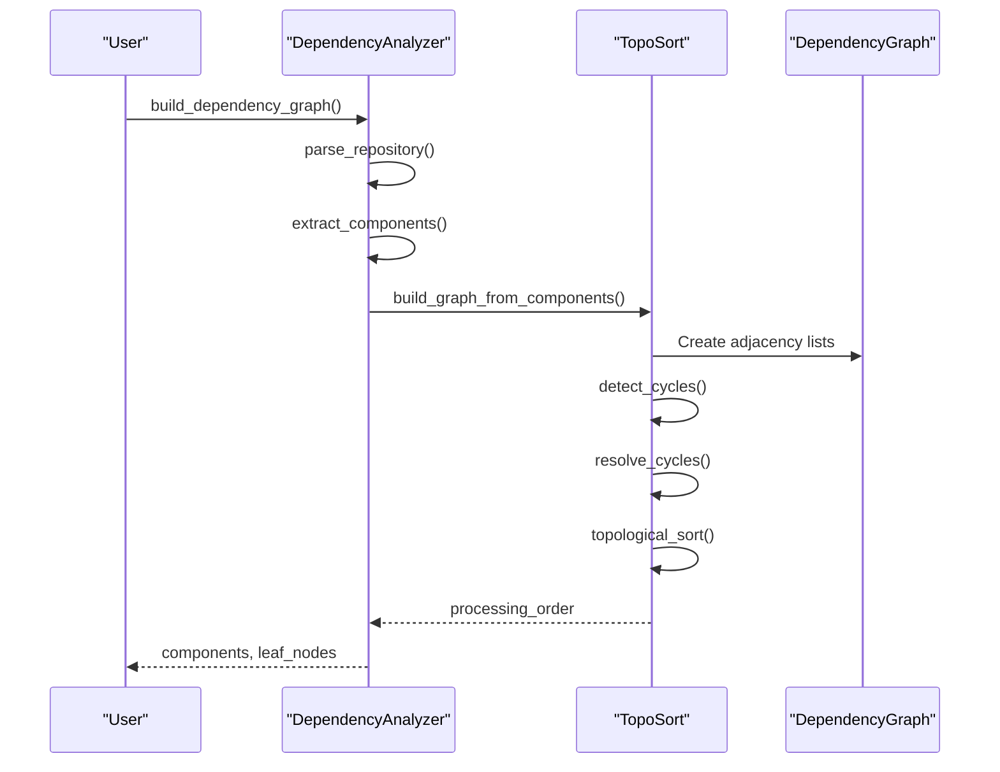
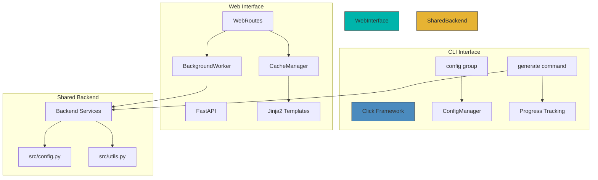
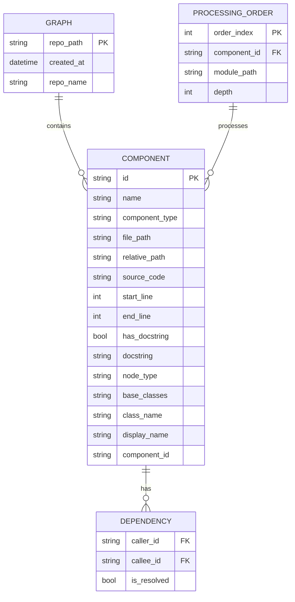

# System Architecture and Design Patterns

<cite>
**Referenced Files in This Document**   
- [main.py](file://codewiki/src/be/main.py)
- [documentation_generator.py](file://codewiki/src/be/documentation_generator.py)
- [agent_orchestrator.py](file://codewiki/src/be/agent_orchestrator.py)
- [cluster_modules.py](file://codewiki/src/be/cluster_modules.py)
- [topo_sort.py](file://codewiki/src/be/dependency_analyzer/topo_sort.py)
- [dependency_graphs_builder.py](file://codewiki/src/be/dependency_analyzer/dependency_graphs_builder.py)
- [ast_parser.py](file://codewiki/src/be/dependency_analyzer/ast_parser.py)
- [config.py](file://codewiki/src/config.py)
- [web_app.py](file://codewiki/src/fe/web_app.py)
- [generate.py](file://codewiki/cli/commands/generate.py)
- [cli/main.py](file://codewiki/cli/main.py)
</cite>

## Table of Contents
1. [Introduction](#introduction)
2. [Project Structure](#project-structure)
3. [Core Components](#core-components)
4. [Architecture Overview](#architecture-overview)
5. [Detailed Component Analysis](#detailed-component-analysis)
6. [Dependency Analysis](#dependency-analysis)
7. [Performance Considerations](#performance-considerations)
8. [Troubleshooting Guide](#troubleshooting-guide)
9. [Conclusion](#conclusion)

## Introduction

CodeWiki is an AI-powered framework designed to generate comprehensive, architecture-aware documentation for large-scale codebases across multiple programming languages. The system employs advanced architectural patterns including hierarchical decomposition, recursive agentic processing, and plugin-based language analysis to transform complex repositories into structured, navigable documentation. This document provides a detailed analysis of the system's architecture, focusing on the separation between CLI and web interfaces, shared backend services, and the key design patterns that enable scalable documentation generation.

## Project Structure

The CodeWiki project follows a modular structure with clear separation between frontend (web interface) and backend (core processing) components. The architecture is organized into three main directories: `cli` for command-line interface functionality, `src` containing the core backend services and frontend web application, and configuration files at the root level. The backend is further divided into business logic (`be`) and frontend (`fe`) components, with shared utilities and configuration.

**Diagram sources**
- [codewiki/cli/main.py](file://codewiki/cli/main.py)
- [codewiki/src/be/main.py](file://codewiki/src/be/main.py)
- [codewiki/src/fe/web_app.py](file://codewiki/src/fe/web_app.py)
- [codewiki/src/config.py](file://codewiki/src/config.py)

**Section sources**
- [codewiki/cli/main.py](file://codewiki/cli/main.py)
- [codewiki/src/be/main.py](file://codewiki/src/be/main.py)
- [codewiki/src/fe/web_app.py](file://codewiki/src/fe/web_app.py)

## Core Components

The CodeWiki system is built around several core components that work together to analyze codebases and generate comprehensive documentation. The architecture follows a clear separation between interface layers (CLI and web) and shared backend services. The backend services implement key architectural patterns including hierarchical decomposition for handling large codebases, recursive agentic processing for intelligent documentation generation, and plugin-based language analyzers for multi-language support. The system processes user input through a pipeline that includes configuration, code analysis, module clustering, agent processing, and output generation, with cross-cutting concerns like logging, error handling, and progress tracking integrated throughout.

**Section sources**
- [codewiki/src/be/main.py](file://codewiki/src/be/main.py)
- [codewiki/src/be/documentation_generator.py](file://codewiki/src/be/documentation_generator.py)
- [codewiki/src/be/agent_orchestrator.py](file://codewiki/src/be/agent_orchestrator.py)

## Architecture Overview

CodeWiki's architecture is designed with a clear separation between interface layers and shared backend services. The system provides two primary interfaces: a CLI interface built with Click and a web interface built with FastAPI. Both interfaces leverage the same backend services for code analysis and documentation generation, ensuring consistent behavior across different usage scenarios. The backend architecture follows a three-stage process: hierarchical decomposition to partition repositories into coherent modules, recursive multi-agent processing for adaptive documentation generation, and multi-modal synthesis to integrate textual descriptions with visual artifacts.

**Diagram sources**
- [codewiki/cli/main.py](file://codewiki/cli/main.py)
- [codewiki/src/fe/web_app.py](file://codewiki/src/fe/web_app.py)
- [codewiki/src/be/main.py](file://codewiki/src/be/main.py)
- [codewiki/src/be/documentation_generator.py](file://codewiki/src/be/documentation_generator.py)

## Detailed Component Analysis

### Hierarchical Decomposition and Dynamic Programming

The hierarchical decomposition algorithm is a core architectural pattern in CodeWiki that enables the system to handle codebases of arbitrary size. This approach uses dynamic programming principles to recursively partition repositories into coherent modules while preserving architectural context across multiple granularity levels. The algorithm works by first identifying leaf nodes (individual code components) and then clustering them into parent modules based on dependency relationships and semantic similarity. This hierarchical approach ensures that documentation is generated in a context-aware manner, with leaf modules processed first, followed by their parent modules, and finally the repository overview.

**Diagram sources**
- [codewiki/src/be/documentation_generator.py](file://codewiki/src/be/documentation_generator.py#L249-L292)
- [codewiki/src/be/cluster_modules.py](file://codewiki/src/be/cluster_modules.py#L44-L113)

**Section sources**
- [codewiki/src/be/documentation_generator.py](file://codewiki/src/be/documentation_generator.py#L249-L292)
- [codewiki/src/be/cluster_modules.py](file://codewiki/src/be/cluster_modules.py#L44-L113)

### Recursive Agentic Processing

CodeWiki employs a recursive multi-agent processing system that adapts to the complexity of different code modules. The agent orchestrator creates specialized AI agents based on module complexity, with more complex modules receiving agents equipped with additional tools for code analysis and documentation generation. The system uses Pydantic-AI to implement the agent framework, allowing for structured interactions between agents and their environment. This recursive approach enables dynamic task delegation, where complex modules can spawn sub-agents to handle specific documentation tasks, maintaining quality while scaling to repository-level scope.

**Diagram sources**
- [codewiki/src/be/agent_orchestrator.py](file://codewiki/src/be/agent_orchestrator.py#L59-L149)
- [codewiki/src/be/agent_tools/read_code_components.py](file://codewiki/src/be/agent_tools/read_code_components.py)
- [codewiki/src/be/agent_tools/str_replace_editor.py](file://codewiki/src/be/agent_tools/str_replace_editor.py)
- [codewiki/src/be/agent_tools/generate_sub_module_documentations.py](file://codewiki/src/be/agent_tools/generate_sub_module_documentations.py)

**Section sources**
- [codewiki/src/be/agent_orchestrator.py](file://codewiki/src/be/agent_orchestrator.py#L59-L149)

### Plugin-Based Language Analyzers

CodeWiki supports multiple programming languages through a plugin-based analyzer architecture. The system uses Tree-sitter parsers to extract syntax trees from code files, enabling accurate analysis of code structure across different languages. Language-specific analyzers are implemented as plugins that extend the core analysis service, providing specialized handling for Python, Java, JavaScript, TypeScript, C, C++, and C#. This modular design allows for easy extension to support additional languages by implementing new analyzer plugins that conform to the defined interface.

**Diagram sources**
- [codewiki/src/be/dependency_analyzer/analysis/analysis_service.py](file://codewiki/src/be/dependency_analyzer/analysis/analysis_service.py)
- [codewiki/src/be/dependency_analyzer/ast_parser.py](file://codewiki/src/be/dependency_analyzer/ast_parser.py#L18-L146)
- [codewiki/src/be/dependency_analyzer/models/core.py](file://codewiki/src/be/dependency_analyzer/models/core.py)

**Section sources**
- [codewiki/src/be/dependency_analyzer/analysis/analysis_service.py](file://codewiki/src/be/dependency_analyzer/analysis/analysis_service.py)
- [codewiki/src/be/dependency_analyzer/ast_parser.py](file://codewiki/src/be/dependency_analyzer/ast_parser.py#L18-L146)

### Topological Sorting and Dependency Ordering

The dependency analysis component implements a robust topological sorting algorithm to determine the processing order of code modules. This implementation handles dependency cycles using Tarjan's algorithm to identify strongly connected components and resolve cycles by breaking the weakest dependencies. The sorting algorithm ensures that modules are processed in dependency order, with leaf modules (those with no dependencies) processed first, followed by their dependents. This approach is critical for maintaining context during documentation generation, as each module can reference the documentation of its dependencies.

**Diagram sources**
- [codewiki/src/be/dependency_analyzer/dependency_graphs_builder.py](file://codewiki/src/be/dependency_analyzer/dependency_graphs_builder.py#L12-L94)
- [codewiki/src/be/dependency_analyzer/topo_sort.py](file://codewiki/src/be/dependency_analyzer/topo_sort.py#L18-L350)
- [codewiki/src/be/dependency_analyzer/ast_parser.py](file://codewiki/src/be/dependency_analyzer/ast_parser.py#L18-L146)

**Section sources**
- [codewiki/src/be/dependency_analyzer/dependency_graphs_builder.py](file://codewiki/src/be/dependency_analyzer/dependency_graphs_builder.py#L12-L94)
- [codewiki/src/be/dependency_analyzer/topo_sort.py](file://codewiki/src/be/dependency_analyzer/topo_sort.py#L18-L350)

### CLI and Web Interface Architecture

CodeWiki provides two distinct interfaces for user interaction: a command-line interface built with Click and a web interface built with FastAPI. The CLI interface offers a rich set of commands for configuration management and documentation generation, with support for verbose logging and progress tracking. The web interface provides a user-friendly form for submitting GitHub repositories, with background processing and caching to improve user experience. Both interfaces share the same backend services, ensuring consistent behavior and enabling users to choose the interface that best fits their workflow.

**Diagram sources**
- [codewiki/cli/main.py](file://codewiki/cli/main.py#L1-L57)
- [codewiki/cli/commands/generate.py](file://codewiki/cli/commands/generate.py#L34-L266)
- [codewiki/src/fe/web_app.py](file://codewiki/src/fe/web_app.py#L1-L133)
- [codewiki/src/fe/routes.py](file://codewiki/src/fe/routes.py#L25-L299)

**Section sources**
- [codewiki/cli/main.py](file://codewiki/cli/main.py#L1-L57)
- [codewiki/src/fe/web_app.py](file://codewiki/src/fe/web_app.py#L1-L133)

## Dependency Analysis

The dependency analysis system in CodeWiki constructs comprehensive call graphs across the codebase using Tree-sitter parsers for accurate syntax analysis. The dependency graph builder first parses the repository structure, then analyzes each file to extract code components and their relationships. These relationships are used to build a directed graph where nodes represent code components and edges represent dependencies between them. The system handles cross-language dependencies and complex inheritance hierarchies, providing a complete view of the codebase architecture that informs the documentation generation process.

**Diagram sources**
- [codewiki/src/be/dependency_analyzer/models/core.py](file://codewiki/src/be/dependency_analyzer/models/core.py)
- [codewiki/src/be/dependency_analyzer/dependency_graphs_builder.py](file://codewiki/src/be/dependency_analyzer/dependency_graphs_builder.py#L12-L94)
- [codewiki/src/be/dependency_analyzer/topo_sort.py](file://codewiki/src/be/dependency_analyzer/topo_sort.py#L239-L268)

**Section sources**
- [codewiki/src/be/dependency_analyzer/dependency_graphs_builder.py](file://codewiki/src/be/dependency_analyzer/dependency_graphs_builder.py#L12-L94)
- [codewiki/src/be/dependency_analyzer/topo_sort.py](file://codewiki/src/be/dependency_analyzer/topo_sort.py#L239-L268)

## Performance Considerations

CodeWiki incorporates several performance optimizations to handle large-scale codebases efficiently. The hierarchical decomposition algorithm reduces the problem size by partitioning repositories into manageable modules, while the caching system in the web interface prevents redundant processing of previously analyzed repositories. The system uses asynchronous processing to maximize throughput during documentation generation, and the dependency analysis is optimized to minimize redundant parsing operations. For very large codebases, the system can leverage multiple LLM models with different capabilities, using more powerful models for complex clustering tasks and fallback models for simpler documentation generation.

## Troubleshooting Guide

The system includes comprehensive error handling and logging to assist with troubleshooting. Configuration errors are validated at startup, with clear error messages guiding users through the setup process. The CLI interface provides verbose logging options to diagnose issues during documentation generation, while the web interface includes job status tracking to monitor processing progress. Common issues such as API connectivity problems, repository validation errors, and LLM rate limiting are handled gracefully with informative error messages and recovery suggestions.

**Section sources**
- [codewiki/cli/commands/config.py](file://codewiki/cli/commands/config.py#L26-L399)
- [codewiki/cli/commands/generate.py](file://codewiki/cli/commands/generate.py#L34-L266)
- [codewiki/src/fe/routes.py](file://codewiki/src/fe/routes.py#L25-L299)

## Conclusion

CodeWiki's architecture demonstrates a sophisticated approach to automated documentation generation, combining hierarchical decomposition, recursive agentic processing, and multi-modal synthesis to create comprehensive, architecture-aware documentation for large-scale codebases. The clear separation between CLI and web interfaces, both leveraging shared backend services, provides flexibility for different usage scenarios while maintaining consistency in documentation quality. The system's use of dynamic programming principles in hierarchical decomposition, robust topological sorting for dependency ordering, and plugin-based language analyzers enables it to handle complex, multi-language repositories with high accuracy. By integrating modern technologies like Click, FastAPI, Tree-sitter, Pydantic, and Litellm, CodeWiki delivers a powerful, extensible framework for transforming codebases into navigable, insightful documentation.