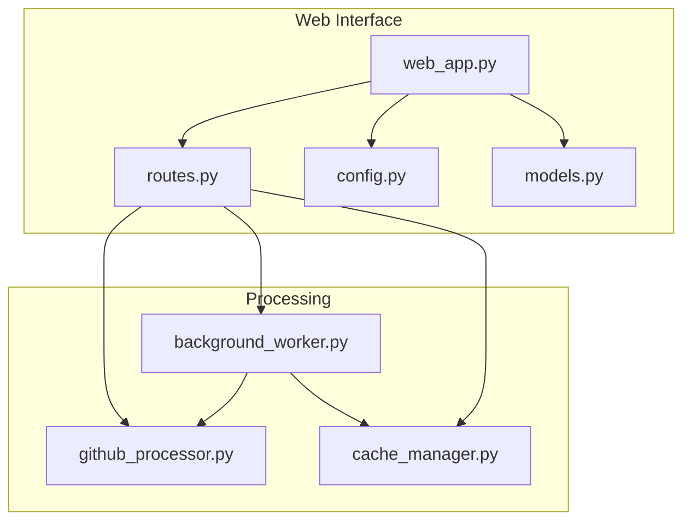
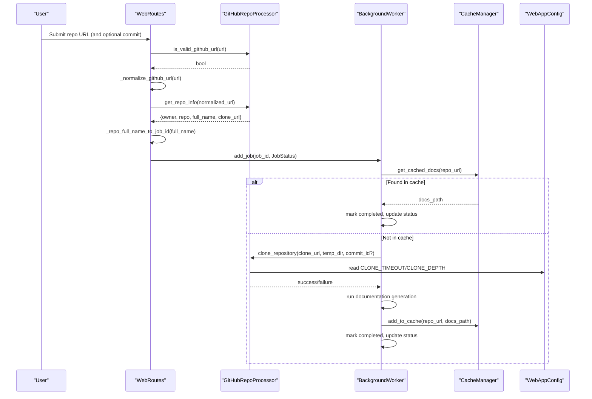
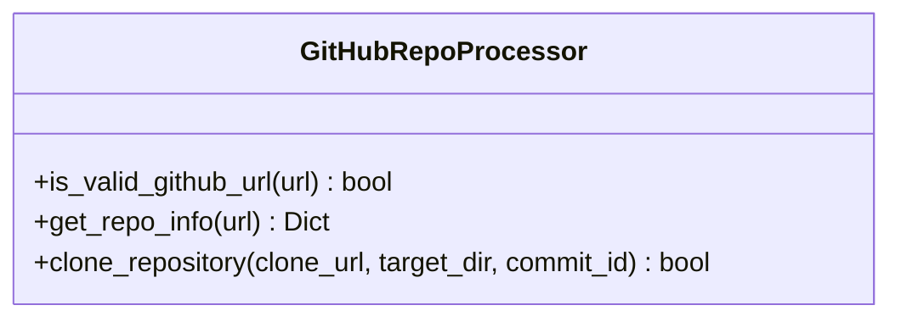
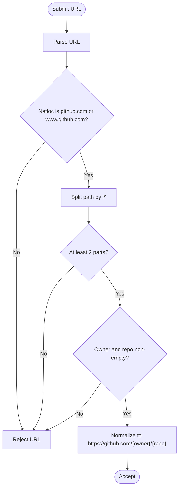
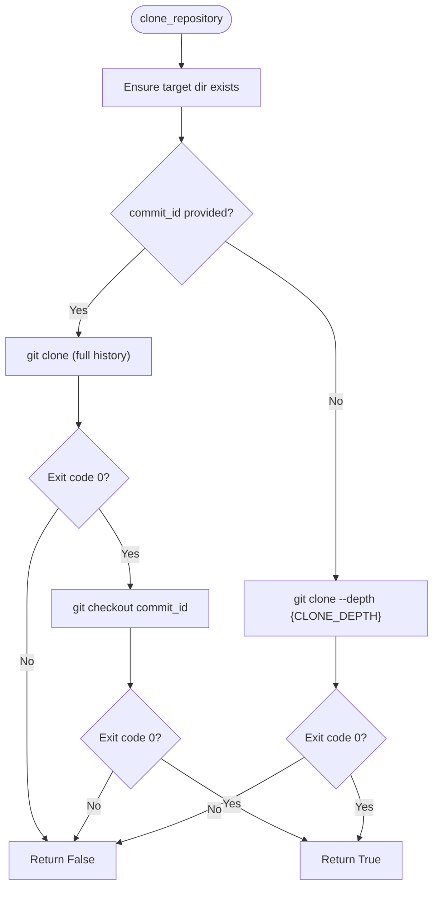
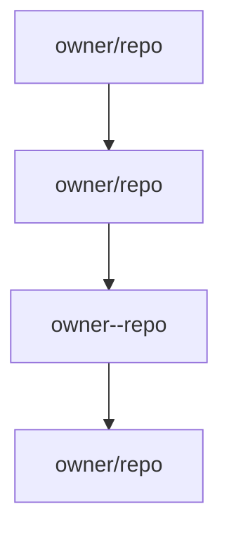
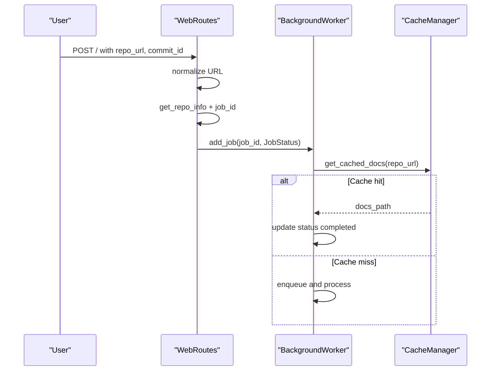
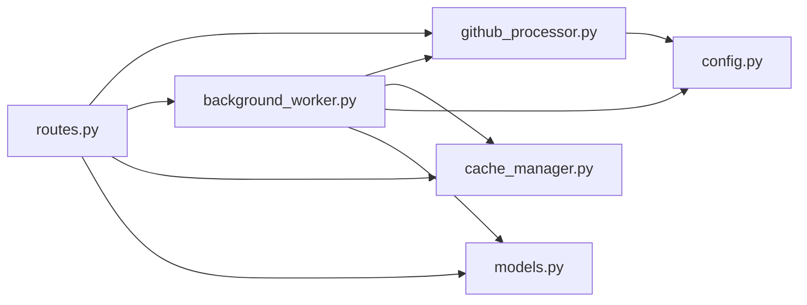

# GitHub Repository Processing

<cite>
**Referenced Files in This Document**
- [github_processor.py](file://codewiki/src/fe/github_processor.py)
- [routes.py](file://codewiki/src/fe/routes.py)
- [background_worker.py](file://codewiki/src/fe/background_worker.py)
- [cache_manager.py](file://codewiki/src/fe/cache_manager.py)
- [config.py](file://codewiki/src/fe/config.py)
- [models.py](file://codewiki/src/fe/models.py)
- [web_app.py](file://codewiki/src/fe/web_app.py)
</cite>

## Table of Contents
1. [Introduction](#introduction)
2. [Project Structure](#project-structure)
3. [Core Components](#core-components)
4. [Architecture Overview](#architecture-overview)
5. [Detailed Component Analysis](#detailed-component-analysis)
6. [Dependency Analysis](#dependency-analysis)
7. [Performance Considerations](#performance-considerations)
8. [Troubleshooting Guide](#troubleshooting-guide)
9. [Conclusion](#conclusion)

## Introduction
This document explains how the CodeWiki web interface processes GitHub repositories. It focuses on the GitHubRepoProcessor class for URL validation, repository information extraction, and cloning. It also documents URL normalization, shallow vs full cloning, timeout handling, validation logic, job ID generation, and troubleshooting for common GitHub integration issues.

## Project Structure
The web interface is organized around a FastAPI application that orchestrates routing, background job processing, caching, and GitHub repository handling.

**Diagram sources**
- [web_app.py](file://codewiki/src/fe/web_app.py#L1-L133)
- [routes.py](file://codewiki/src/fe/routes.py#L1-L299)
- [github_processor.py](file://codewiki/src/fe/github_processor.py#L1-L93)
- [background_worker.py](file://codewiki/src/fe/background_worker.py#L1-L256)
- [cache_manager.py](file://codewiki/src/fe/cache_manager.py#L1-L119)
- [config.py](file://codewiki/src/fe/config.py#L1-L51)
- [models.py](file://codewiki/src/fe/models.py#L1-L55)

**Section sources**
- [web_app.py](file://codewiki/src/fe/web_app.py#L1-L133)
- [routes.py](file://codewiki/src/fe/routes.py#L1-L299)
- [github_processor.py](file://codewiki/src/fe/github_processor.py#L1-L93)
- [background_worker.py](file://codewiki/src/fe/background_worker.py#L1-L256)
- [cache_manager.py](file://codewiki/src/fe/cache_manager.py#L1-L119)
- [config.py](file://codewiki/src/fe/config.py#L1-L51)
- [models.py](file://codewiki/src/fe/models.py#L1-L55)

## Core Components
- GitHubRepoProcessor: Validates GitHub URLs, extracts owner/repo, and clones repositories with shallow or full depth, honoring commit IDs and timeouts.
- WebRoutes: Handles form submission, validates URLs, normalizes URLs, generates job IDs, enforces retry cooldown, checks cache, and queues jobs.
- BackgroundWorker: Runs queued jobs, clones repositories, runs documentation generation, caches results, updates job statuses, and cleans up.
- CacheManager: Stores and retrieves generated documentation paths keyed by repository URL hashes.
- WebAppConfig: Provides constants for timeouts, clone depth, directories, and queue sizes.
- JobStatus/JobStatusResponse: Data models for tracking job lifecycle and API responses.

**Section sources**
- [github_processor.py](file://codewiki/src/fe/github_processor.py#L14-L93)
- [routes.py](file://codewiki/src/fe/routes.py#L55-L154)
- [background_worker.py](file://codewiki/src/fe/background_worker.py#L163-L256)
- [cache_manager.py](file://codewiki/src/fe/cache_manager.py#L1-L119)
- [config.py](file://codewiki/src/fe/config.py#L10-L51)
- [models.py](file://codewiki/src/fe/models.py#L12-L55)

## Architecture Overview
The web application accepts a GitHub URL, validates and normalizes it, converts it to a job ID, checks cache, and enqueues a background job. The background worker clones the repository (shallow by default, full when a commit ID is specified), runs documentation generation, caches results, and updates job status.

**Diagram sources**
- [routes.py](file://codewiki/src/fe/routes.py#L55-L154)
- [github_processor.py](file://codewiki/src/fe/github_processor.py#L14-L93)
- [background_worker.py](file://codewiki/src/fe/background_worker.py#L163-L256)
- [cache_manager.py](file://codewiki/src/fe/cache_manager.py#L61-L119)
- [config.py](file://codewiki/src/fe/config.py#L32-L35)

## Detailed Component Analysis

### GitHubRepoProcessor
Responsibilities:
- URL validation: Ensures the URL points to GitHub.com or www.github.com and contains at least two path parts representing owner and repository.
- Repository info extraction: Parses owner, repo, full_name, and HTTPS clone URL; strips .git suffix from repo name.
- Cloning: Supports shallow clones by default and full clones when a commit ID is provided; applies timeouts and error handling.

Key behaviors:
- Validation rejects malformed or non-GitHub URLs and URLs with missing owner/repo segments.
- Normalization uses get_repo_info to standardize owner/repo and produce a canonical clone URL.
- Shallow clone uses configured depth and timeout; full clone bypasses shallow depth and checks out a specific commit ID if provided.

**Diagram sources**
- [github_processor.py](file://codewiki/src/fe/github_processor.py#L14-L93)

**Section sources**
- [github_processor.py](file://codewiki/src/fe/github_processor.py#L18-L33)
- [github_processor.py](file://codewiki/src/fe/github_processor.py#L35-L52)
- [github_processor.py](file://codewiki/src/fe/github_processor.py#L55-L93)

### URL Validation and Normalization
Validation logic:
- Checks netloc equals github.com or www.github.com.
- Requires at least two path segments after splitting by "/".
- Ensures both owner and repo parts are non-empty.

Normalization:
- Converts submitted URLs to a canonical HTTPS format using owner/repo extracted by get_repo_info.
- Falls back to lowercase and trailing slash removal if parsing fails.

**Diagram sources**
- [github_processor.py](file://codewiki/src/fe/github_processor.py#L18-L33)
- [routes.py](file://codewiki/src/fe/routes.py#L270-L279)

**Section sources**
- [github_processor.py](file://codewiki/src/fe/github_processor.py#L18-L33)
- [routes.py](file://codewiki/src/fe/routes.py#L270-L279)

### Repository Information Extraction and Clone Mechanisms
Extraction:
- Parses owner and repo from URL path.
- Strips .git suffix from repo name.
- Produces full_name and HTTPS clone URL.

Cloning:
- Shallow clone: Uses configured depth and timeout.
- Full clone with commit: Disables shallow depth, clones full history, then checks out the specified commit with a separate timeout.
- Timeout handling: Applies WebAppConfig.CLONE_TIMEOUT for shallow/full clone; a shorter timeout for commit checkout.
- Error handling: Logs stderr and returns failure on non-zero exit codes.

**Diagram sources**
- [github_processor.py](file://codewiki/src/fe/github_processor.py#L55-L93)
- [config.py](file://codewiki/src/fe/config.py#L32-L35)

**Section sources**
- [github_processor.py](file://codewiki/src/fe/github_processor.py#L35-L52)
- [github_processor.py](file://codewiki/src/fe/github_processor.py#L55-L93)
- [config.py](file://codewiki/src/fe/config.py#L32-L35)

### Job ID Generation and Metadata Usage
Job ID generation:
- Converts owner/repo to a URL-safe job ID by replacing "/" with "--".
- Converts back using "--" to "/" for internal mapping.

Metadata used:
- JobStatus includes job_id, repo_url, status, timestamps, progress, docs_path, main_model, and optional commit_id.
- JobStatusResponse mirrors JobStatus for API responses.

**Diagram sources**
- [routes.py](file://codewiki/src/fe/routes.py#L280-L287)
- [models.py](file://codewiki/src/fe/models.py#L32-L55)

**Section sources**
- [routes.py](file://codewiki/src/fe/routes.py#L76-L78)
- [routes.py](file://codewiki/src/fe/routes.py#L280-L287)
- [models.py](file://codewiki/src/fe/models.py#L17-L31)
- [models.py](file://codewiki/src/fe/models.py#L32-L55)

### Web Routes and Job Lifecycle
Form submission:
- Validates presence and validity of URL.
- Normalizes URL and extracts repo info.
- Generates job ID and checks existing job status and retry cooldown.
- If cached docs exist, marks job completed immediately; otherwise enqueues job.

Job status API:
- Returns JobStatusResponse with job_id, repo_url, status, timestamps, progress, docs_path, main_model, and optional commit_id.

**Diagram sources**
- [routes.py](file://codewiki/src/fe/routes.py#L55-L154)
- [background_worker.py](file://codewiki/src/fe/background_worker.py#L163-L256)
- [cache_manager.py](file://codewiki/src/fe/cache_manager.py#L61-L119)

**Section sources**
- [routes.py](file://codewiki/src/fe/routes.py#L55-L154)
- [models.py](file://codewiki/src/fe/models.py#L17-L31)

## Dependency Analysis
- WebRoutes depends on GitHubRepoProcessor for URL validation and normalization, and on BackgroundWorker and CacheManager for job orchestration and caching.
- BackgroundWorker depends on GitHubRepoProcessor for cloning and on CacheManager for caching results.
- WebAppConfig supplies configuration values consumed by GitHubRepoProcessor and BackgroundWorker.
- JobStatus/JobStatusResponse models are used across routes and background worker for consistent status reporting.

**Diagram sources**
- [routes.py](file://codewiki/src/fe/routes.py#L1-L299)
- [github_processor.py](file://codewiki/src/fe/github_processor.py#L1-L93)
- [background_worker.py](file://codewiki/src/fe/background_worker.py#L1-L256)
- [cache_manager.py](file://codewiki/src/fe/cache_manager.py#L1-L119)
- [config.py](file://codewiki/src/fe/config.py#L1-L51)
- [models.py](file://codewiki/src/fe/models.py#L1-L55)

**Section sources**
- [routes.py](file://codewiki/src/fe/routes.py#L1-L299)
- [github_processor.py](file://codewiki/src/fe/github_processor.py#L1-L93)
- [background_worker.py](file://codewiki/src/fe/background_worker.py#L1-L256)
- [cache_manager.py](file://codewiki/src/fe/cache_manager.py#L1-L119)
- [config.py](file://codewiki/src/fe/config.py#L1-L51)
- [models.py](file://codewiki/src/fe/models.py#L1-L55)

## Performance Considerations
- Shallow clones reduce bandwidth and time by limiting history depth; configured via WebAppConfig.CLONE_DEPTH.
- Full clones are used only when a specific commit ID is requested, enabling precise historical analysis.
- Timeout values (WebAppConfig.CLONE_TIMEOUT) prevent long-running git operations from blocking the worker.
- Caching avoids repeated cloning and generation for the same repository within the configured expiry window.

[No sources needed since this section provides general guidance]

## Troubleshooting Guide
Common issues and resolutions:
- Network timeouts during clone:
  - Increase WebAppConfig.CLONE_TIMEOUT if repositories are large or networks are slow.
  - Verify connectivity to GitHub.com and HTTPS access.
- Authentication requirements:
  - If accessing private repositories, configure credentials for git operations. The clone mechanism uses the system git; ensure credentials are available to the environment running the web app.
- Rate limiting:
  - GitHub may throttle requests. Consider reducing concurrent jobs or adding delays between retries.
- Invalid URL formats:
  - Ensure URLs match GitHub patterns (e.g., https://github.com/owner/repo or https://www.github.com/owner/repo). The validator rejects non-GitHub domains and malformed paths.
- Duplicate or conflicting submissions:
  - The system enforces a retry cooldown to avoid reprocessing too quickly. Wait for the cooldown period before resubmitting.
- Cache-related issues:
  - If cached docs are stale or corrupted, remove the cache entry and resubmit. The cache manager removes expired entries automatically.

**Section sources**
- [github_processor.py](file://codewiki/src/fe/github_processor.py#L55-L93)
- [config.py](file://codewiki/src/fe/config.py#L32-L35)
- [routes.py](file://codewiki/src/fe/routes.py#L84-L97)
- [cache_manager.py](file://codewiki/src/fe/cache_manager.py#L61-L119)

## Conclusion
The GitHub repository processing pipeline integrates URL validation, normalization, repository extraction, and robust cloning with configurable timeouts and commit-specific checkout. The web interface enforces validation, normalizes URLs, generates stable job IDs, and coordinates background processing with caching and status tracking. This design balances reliability, performance, and user feedback for GitHub repository documentation generation.