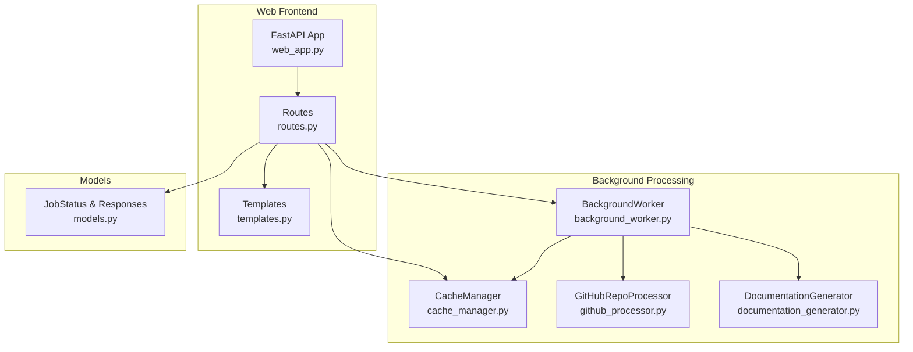
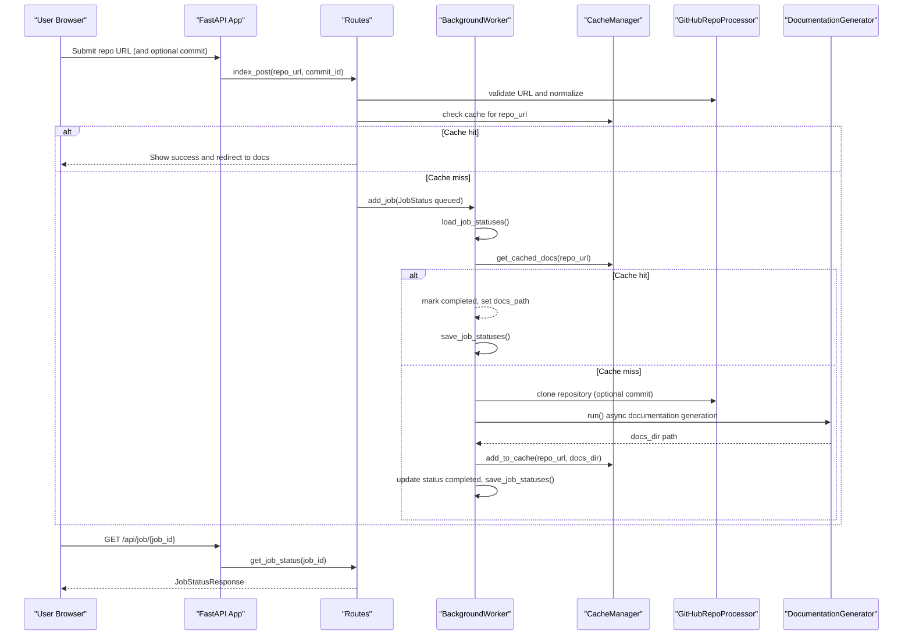
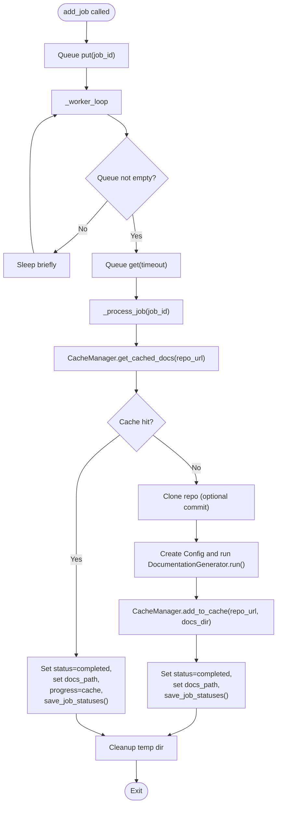
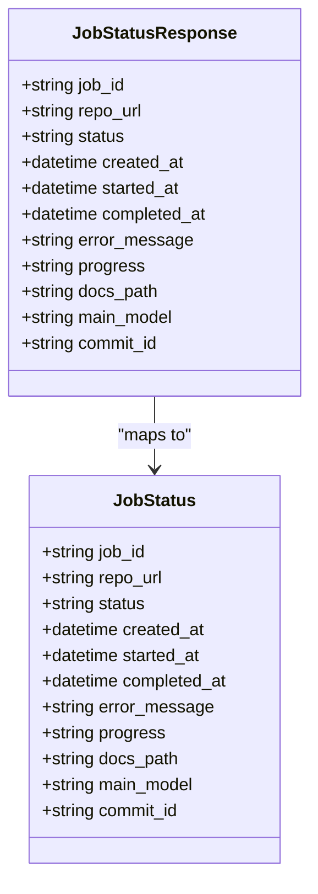
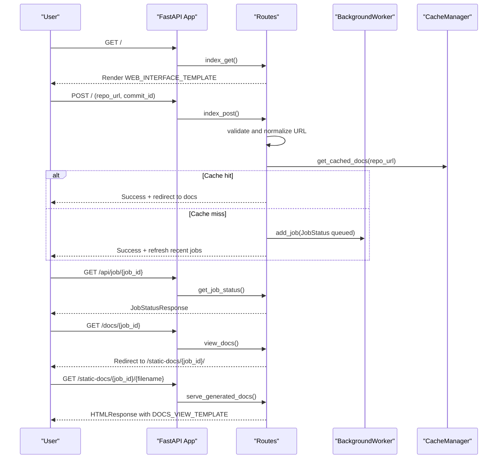
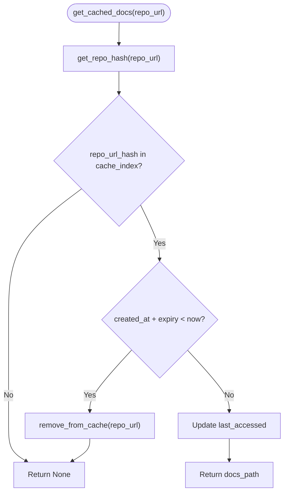
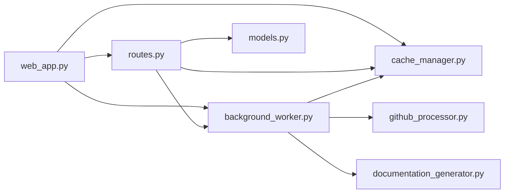

# Job Status and Background Processing

<cite>
**Referenced Files in This Document**
- [background_worker.py](file://codewiki/src/fe/background_worker.py)
- [models.py](file://codewiki/src/fe/models.py)
- [cache_manager.py](file://codewiki/src/fe/cache_manager.py)
- [routes.py](file://codewiki/src/fe/routes.py)
- [config.py](file://codewiki/src/fe/config.py)
- [github_processor.py](file://codewiki/src/fe/github_processor.py)
- [web_app.py](file://codewiki/src/fe/web_app.py)
- [documentation_generator.py](file://codewiki/src/be/documentation_generator.py)
- [templates.py](file://codewiki/src/fe/templates.py)
- [visualise_docs.py](file://codewiki/src/fe/visualise_docs.py)
</cite>

## Table of Contents
1. [Introduction](#introduction)
2. [Project Structure](#project-structure)
3. [Core Components](#core-components)
4. [Architecture Overview](#architecture-overview)
5. [Detailed Component Analysis](#detailed-component-analysis)
6. [Dependency Analysis](#dependency-analysis)
7. [Performance Considerations](#performance-considerations)
8. [Troubleshooting Guide](#troubleshooting-guide)
9. [Conclusion](#conclusion)

## Introduction
This document explains the job management system powering CodeWiki’s web interface. It focuses on how the BackgroundWorker class queues and processes documentation generation jobs, tracks job status, integrates with the web interface, and manages caching and cleanup. It also covers the asynchronous processing model, real-time status updates, and monitoring/debugging techniques.

## Project Structure
The job management system spans the frontend FastAPI application and the backend documentation generator:
- Frontend FastAPI app initializes the cache manager, background worker, and routes.
- Routes handle user submissions, job status retrieval, and serving generated documentation.
- BackgroundWorker runs in a separate thread, processes jobs asynchronously, and persists job state.
- CacheManager stores generated documentation and enforces expiration policies.
- GitHubRepoProcessor clones repositories and validates URLs.
- Backend DocumentationGenerator performs the heavy lifting of building dependency graphs, clustering modules, and generating markdown documentation.

**Diagram sources**
- [web_app.py](file://codewiki/src/fe/web_app.py#L1-L133)
- [routes.py](file://codewiki/src/fe/routes.py#L1-L299)
- [background_worker.py](file://codewiki/src/fe/background_worker.py#L1-L256)
- [cache_manager.py](file://codewiki/src/fe/cache_manager.py#L1-L119)
- [github_processor.py](file://codewiki/src/fe/github_processor.py#L1-L93)
- [documentation_generator.py](file://codewiki/src/be/documentation_generator.py#L1-L292)
- [models.py](file://codewiki/src/fe/models.py#L1-L55)
- [templates.py](file://codewiki/src/fe/templates.py#L1-L680)

**Section sources**
- [web_app.py](file://codewiki/src/fe/web_app.py#L1-L133)
- [routes.py](file://codewiki/src/fe/routes.py#L1-L299)
- [background_worker.py](file://codewiki/src/fe/background_worker.py#L1-L256)
- [cache_manager.py](file://codewiki/src/fe/cache_manager.py#L1-L119)
- [github_processor.py](file://codewiki/src/fe/github_processor.py#L1-L93)
- [documentation_generator.py](file://codewiki/src/be/documentation_generator.py#L1-L292)
- [models.py](file://codewiki/src/fe/models.py#L1-L55)
- [templates.py](file://codewiki/src/fe/templates.py#L1-L680)

## Core Components
- BackgroundWorker: Manages a bounded queue of jobs, tracks status in memory, persists state to disk, and executes jobs in a dedicated thread. It checks cache first, clones repositories, and invokes the backend documentation generator.
- CacheManager: Stores generated documentation paths keyed by repository hash, enforces expiry, and cleans up expired entries.
- Routes: Handles form submission, deduplication/cooldown logic, job creation, status retrieval, and serving generated docs.
- Models: Defines JobStatus and JobStatusResponse for status representation and API responses.
- GitHubRepoProcessor: Validates GitHub URLs and clones repositories (optionally at a specific commit).
- DocumentationGenerator: Orchestrates dependency analysis, clustering, and markdown generation.

**Section sources**
- [background_worker.py](file://codewiki/src/fe/background_worker.py#L1-L256)
- [cache_manager.py](file://codewiki/src/fe/cache_manager.py#L1-L119)
- [routes.py](file://codewiki/src/fe/routes.py#L1-L299)
- [models.py](file://codewiki/src/fe/models.py#L1-L55)
- [github_processor.py](file://codewiki/src/fe/github_processor.py#L1-L93)
- [documentation_generator.py](file://codewiki/src/be/documentation_generator.py#L1-L292)

## Architecture Overview
The system uses a threaded background worker to process jobs asynchronously while the web app remains responsive. Jobs are represented by JobStatus objects and persisted to disk for resilience across restarts. Caching avoids redundant processing for the same repository within the configured expiry period.

**Diagram sources**
- [routes.py](file://codewiki/src/fe/routes.py#L55-L162)
- [background_worker.py](file://codewiki/src/fe/background_worker.py#L50-L256)
- [cache_manager.py](file://codewiki/src/fe/cache_manager.py#L61-L119)
- [github_processor.py](file://codewiki/src/fe/github_processor.py#L54-L93)
- [documentation_generator.py](file://codewiki/src/be/documentation_generator.py#L249-L292)

## Detailed Component Analysis

### BackgroundWorker
Responsibilities:
- Queue management: bounded Queue with configurable size.
- Status tracking: in-memory dictionary keyed by job_id.
- Persistence: loads/saves job statuses to a JSON file for durability.
- Lifecycle: starts/stops a daemon thread that drains the queue and processes jobs.
- Cache-first policy: checks CacheManager before cloning and generating.
- Progress reporting: updates progress strings during each stage.
- Cleanup: removes temporary repository directories after processing.

Key behaviors:
- add_job(job_id, JobStatus) inserts into queue and status map.
- _worker_loop periodically dequeues and calls _process_job.
- _process_job:
  - Sets status to processing, records started_at, sets progress.
  - Checks cache; if hit, marks completed and saves.
  - Clones repository (with optional commit checkout).
  - Builds Config and runs DocumentationGenerator.run() in a new asyncio event loop.
  - Adds docs to cache and marks completed.
  - On failure, sets status to failed, records error_message and completed_at.
  - Cleans up temp directory.

**Diagram sources**
- [background_worker.py](file://codewiki/src/fe/background_worker.py#L50-L256)
- [cache_manager.py](file://codewiki/src/fe/cache_manager.py#L61-L119)
- [github_processor.py](file://codewiki/src/fe/github_processor.py#L54-L93)
- [documentation_generator.py](file://codewiki/src/be/documentation_generator.py#L249-L292)

**Section sources**
- [background_worker.py](file://codewiki/src/fe/background_worker.py#L1-L256)

### Job Status Model
Fields:
- job_id: Unique identifier derived from normalized repository full name.
- repo_url: Normalized repository URL.
- status: queued, processing, completed, failed.
- created_at: Timestamp job was created.
- started_at: Timestamp processing began.
- completed_at: Timestamp processing finished.
- error_message: Error text if failed.
- progress: Human-readable progress string.
- docs_path: Path to generated documentation.
- main_model: LLM model used for generation.
- commit_id: Optional commit identifier.

API representation:
- JobStatusResponse mirrors JobStatus for JSON responses.

**Diagram sources**
- [models.py](file://codewiki/src/fe/models.py#L17-L55)

**Section sources**
- [models.py](file://codewiki/src/fe/models.py#L17-L55)

### Routes and Web Interaction
- index_get: Renders the main page with recent jobs and a submission form.
- index_post:
  - Validates and normalizes URL.
  - Deduplicates by checking existing job status and cooldown window.
  - If cache hit, creates a dummy completed job and redirects to docs.
  - Otherwise, creates a queued job and adds it to the background worker.
- get_job_status: Returns JobStatusResponse for a given job_id.
- view_docs: Redirects to static docs viewer if job is completed.
- serve_generated_docs: Serves markdown files from docs_dir, builds navigation from module_tree.json, and renders with DOCS_VIEW_TEMPLATE.

**Diagram sources**
- [routes.py](file://codewiki/src/fe/routes.py#L32-L299)
- [templates.py](file://codewiki/src/fe/templates.py#L322-L680)
- [visualise_docs.py](file://codewiki/src/fe/visualise_docs.py#L1-L268)

**Section sources**
- [routes.py](file://codewiki/src/fe/routes.py#L32-L299)
- [templates.py](file://codewiki/src/fe/templates.py#L1-L680)
- [visualise_docs.py](file://codewiki/src/fe/visualise_docs.py#L1-L268)

### Cache Manager
Responsibilities:
- Index management: maintains cache_index keyed by repo_url_hash with CacheEntry.
- Expiry enforcement: checks created_at vs current time to decide validity.
- Operations: get_cached_docs, add_to_cache, remove_from_cache, cleanup_expired_cache.
- Persistence: loads/saves cache_index.json.

Expiration policy:
- Entries older than CACHE_EXPIRY_DAYS are removed.

**Diagram sources**
- [cache_manager.py](file://codewiki/src/fe/cache_manager.py#L61-L119)

**Section sources**
- [cache_manager.py](file://codewiki/src/fe/cache_manager.py#L1-L119)

### GitHubRepoProcessor
Responsibilities:
- URL validation and normalization.
- Repository cloning with shallow depth by default and full depth when a commit is specified.
- Commit checkout when required.

**Section sources**
- [github_processor.py](file://codewiki/src/fe/github_processor.py#L1-L93)

### Backend DocumentationGenerator
Responsibilities:
- Builds dependency graphs and clusters modules.
- Generates documentation using an orchestrator and LLM prompts.
- Produces metadata.json and module_tree.json alongside markdown files.
- Uses an async run() method to coordinate processing.

**Section sources**
- [documentation_generator.py](file://codewiki/src/be/documentation_generator.py#L1-L292)

## Dependency Analysis
- web_app.py initializes CacheManager, BackgroundWorker, and WebRoutes, then registers FastAPI endpoints.
- Routes depends on BackgroundWorker for job status and CacheManager for cache lookups.
- BackgroundWorker depends on CacheManager, GitHubRepoProcessor, and DocumentationGenerator.
- Models define shared data structures used across routes and worker.

**Diagram sources**
- [web_app.py](file://codewiki/src/fe/web_app.py#L1-L133)
- [routes.py](file://codewiki/src/fe/routes.py#L1-L299)
- [background_worker.py](file://codewiki/src/fe/background_worker.py#L1-L256)
- [cache_manager.py](file://codewiki/src/fe/cache_manager.py#L1-L119)
- [github_processor.py](file://codewiki/src/fe/github_processor.py#L1-L93)
- [documentation_generator.py](file://codewiki/src/be/documentation_generator.py#L1-L292)
- [models.py](file://codewiki/src/fe/models.py#L1-L55)

**Section sources**
- [web_app.py](file://codewiki/src/fe/web_app.py#L1-L133)
- [routes.py](file://codewiki/src/fe/routes.py#L1-L299)
- [background_worker.py](file://codewiki/src/fe/background_worker.py#L1-L256)
- [cache_manager.py](file://codewiki/src/fe/cache_manager.py#L1-L119)
- [github_processor.py](file://codewiki/src/fe/github_processor.py#L1-L93)
- [documentation_generator.py](file://codewiki/src/be/documentation_generator.py#L1-L292)
- [models.py](file://codewiki/src/fe/models.py#L1-L55)

## Performance Considerations
- Concurrency model:
  - BackgroundWorker runs in a daemon thread; jobs are processed sequentially from a bounded queue.
  - Documentation generation is invoked in a new asyncio event loop to support async run().
- Queue sizing:
  - QUEUE_SIZE limits concurrent processing capacity; tune based on system resources.
- Cache hit rate:
  - CACHE_EXPIRY_DAYS balances storage usage and performance; longer expiry reduces repeated work.
- Repository cloning:
  - Shallow clone by default reduces bandwidth/time; commit-specific checkout triggers full clone.
- Disk I/O:
  - Frequent JSON reads/writes for job and cache indices; ensure adequate disk throughput.

[No sources needed since this section provides general guidance]

## Troubleshooting Guide
Common issues and diagnostics:
- Job not found:
  - Routes.get_job_status raises 404 if job_id absent; verify job_id correctness and persistence.
- Cache-related failures:
  - If docs_path exists but files missing, verify cache integrity and cleanup_expired_cache.
  - If cache expired, expect regeneration; confirm expiry settings.
- Repository clone errors:
  - Validate URL via GitHubRepoProcessor.is_valid_github_url.
  - Check timeouts and network connectivity; shallow vs full clone behavior.
- Async processing hangs:
  - Ensure BackgroundWorker runs and that DocumentationGenerator.run() completes; inspect logs for exceptions.
- Cleanup policies:
  - Routes.cleanup_old_jobs removes completed/failed jobs older than JOB_CLEANUP_HOURS.
  - CacheManager.cleanup_expired_cache removes expired entries.

Monitoring tips:
- Inspect job statuses via /api/job/{job_id}.
- Review console logs for worker errors and progress messages.
- Verify cache_index.json and jobs.json for expected entries.
- Use uvicorn logs and debug mode for detailed traces.

**Section sources**
- [routes.py](file://codewiki/src/fe/routes.py#L155-L299)
- [background_worker.py](file://codewiki/src/fe/background_worker.py#L150-L256)
- [cache_manager.py](file://codewiki/src/fe/cache_manager.py#L106-L119)
- [config.py](file://codewiki/src/fe/config.py#L10-L51)

## Conclusion
The job management system combines a threaded background worker, robust caching, and a FastAPI-driven web interface to deliver responsive documentation generation. Jobs are tracked with granular status and progress, persisted across restarts, and served efficiently via cache hits. The asynchronous processing model allows handling multiple concurrent requests while maintaining simplicity and reliability.