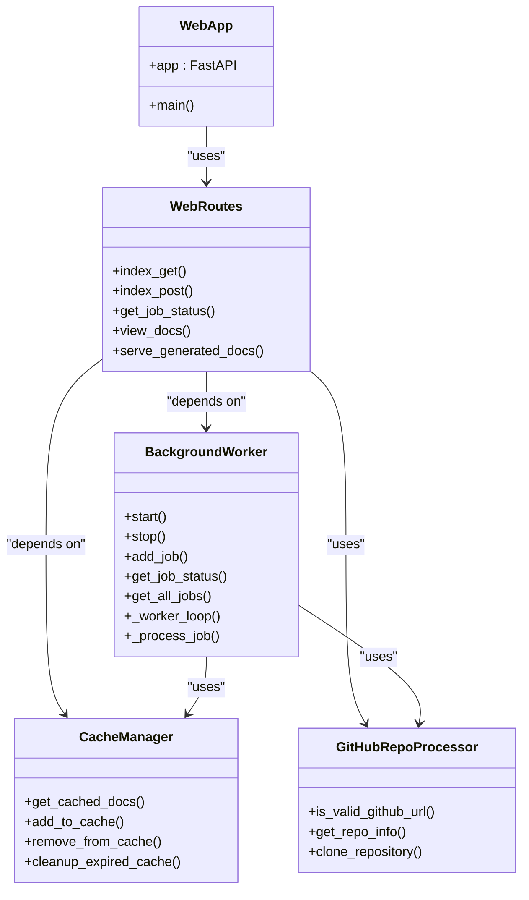
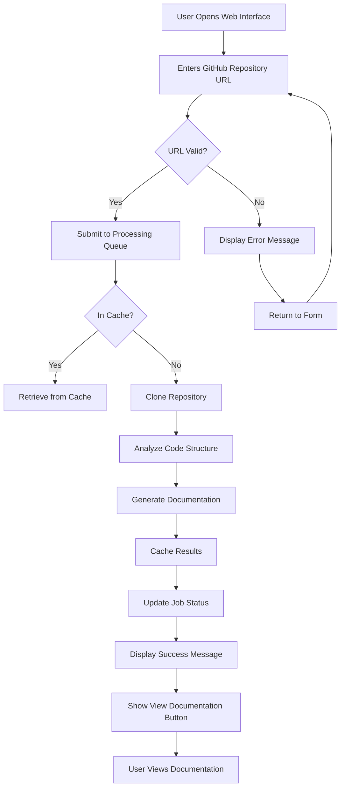
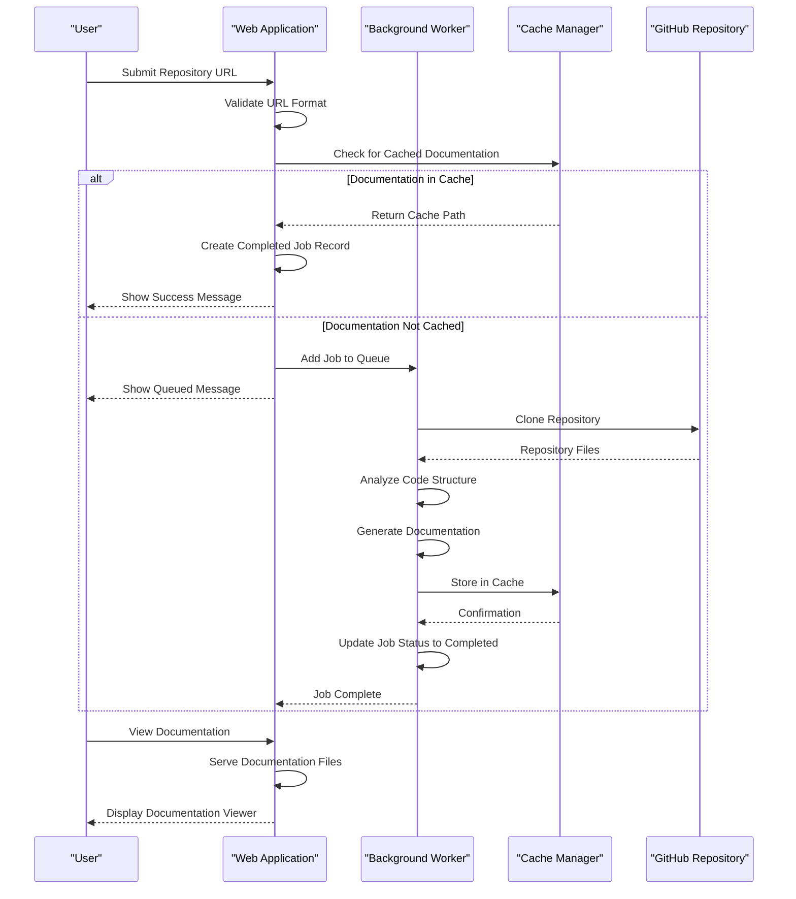

# Web Application Interface

<cite>
**Referenced Files in This Document**   
- [run_web_app.py](file://codewiki/run_web_app.py)
- [web_app.py](file://codewiki/src/fe/web_app.py)
- [routes.py](file://codewiki/src/fe/routes.py)
- [github_processor.py](file://codewiki/src/fe/github_processor.py)
- [background_worker.py](file://codewiki/src/fe/background_worker.py)
- [config.py](file://codewiki/src/fe/config.py)
- [models.py](file://codewiki/src/fe/models.py)
- [cache_manager.py](file://codewiki/src/fe/cache_manager.py)
- [templates.py](file://codewiki/src/fe/templates.py)
- [template_utils.py](file://codewiki/src/fe/template_utils.py)
- [visualise_docs.py](file://codewiki/src/fe/visualise_docs.py)
- [documentation_generator.py](file://codewiki/src/be/documentation_generator.py)
- [generate.py](file://codewiki/cli/commands/generate.py)
</cite>

## Table of Contents
1. [Introduction](#introduction)
2. [Starting the Web Server](#starting-the-web-server)
3. [Core Components](#core-components)
4. [User Interface](#user-interface)
5. [GitHub Integration](#github-integration)
6. [Job Management System](#job-management-system)
7. [API Endpoints](#api-endpoints)
8. [Troubleshooting](#troubleshooting)
9. [Conclusion](#conclusion)

## Introduction

CodeWiki provides a web interface for generating comprehensive documentation for GitHub repositories using AI-powered analysis. The web application offers a user-friendly interface to submit repositories, monitor job status, and view generated documentation. Built on FastAPI, the application features a background worker system for processing documentation generation jobs, a caching mechanism for improved performance, and integration with GitHub for repository analysis.

The web interface serves as an accessible alternative to the CLI functionality, allowing users to interact with CodeWiki through a browser-based interface. It maintains the same core functionality as the command-line interface while providing visual feedback and status updates throughout the documentation generation process.

## Starting the Web Server

To start the CodeWiki web server, execute the `run_web_app.py` script from the project root directory. This script initializes the web application and starts the FastAPI server.

```bash
python codewiki/run_web_app.py
```

By default, the server runs on `http://127.0.0.1:8000`. The application can be accessed by navigating to this URL in a web browser. The server startup process includes several key steps:

1. **Path Configuration**: The script adds the `src` directory to the Python path, ensuring that all modules can be imported correctly.
2. **Component Initialization**: The web application initializes the cache manager, background worker, and route handlers.
3. **Directory Creation**: Required directories for caching and temporary files are created if they don't exist.
4. **Server Launch**: The Uvicorn server is started with the specified host and port configuration.

The server accepts several command-line arguments to customize its behavior:

- `--host`: Specify the host to bind the server to (default: 127.0.0.1)
- `--port`: Specify the port to run the server on (default: 8000)
- `--debug`: Run the server in debug mode with verbose logging
- `--reload`: Enable auto-reload for development

For example, to run the server on a different port:
```bash
python codewiki/run_web_app.py --port 8080
```

**Section sources**
- [run_web_app.py](file://codewiki/run_web_app.py#L1-L16)
- [web_app.py](file://codewiki/src/fe/web_app.py#L75-L133)

## Core Components

The CodeWiki web application consists of several interconnected components that work together to provide a seamless documentation generation experience.

### FastAPI Backend

The application is built on FastAPI, a modern Python web framework known for its high performance and automatic API documentation. The FastAPI backend handles HTTP requests, manages routing, and serves both HTML content and JSON API responses.

Key features of the FastAPI implementation include:
- Automatic OpenAPI/Swagger documentation
- Asynchronous request handling for improved performance
- Built-in data validation using Pydantic models
- Support for both HTML responses and JSON API endpoints

The backend is initialized with metadata including the application title and description, which are displayed in the API documentation interface.

### Route Handlers

The route handlers, defined in the `routes.py` file, manage all incoming HTTP requests to the application. Each route corresponds to a specific functionality:

- **GET /**: Displays the main submission form
- **POST /**: Handles repository submission
- **GET /api/job/{job_id}**: Returns JSON status information for a specific job
- **GET /docs/{job_id}**: Redirects to the generated documentation viewer
- **GET /static-docs/{job_id}/**: Serves generated documentation files

The route handlers use dependency injection to access the background worker and cache manager, ensuring proper separation of concerns.

### GitHub Repository Processor

The GitHub repository processor handles all interactions with GitHub repositories. It validates repository URLs, extracts repository information, and manages the cloning process.

Key responsibilities include:
- Validating that submitted URLs are valid GitHub repository URLs
- Extracting owner, repository name, and other metadata from URLs
- Normalizing URLs for consistent processing
- Cloning repositories to a temporary directory for analysis

The processor supports optional specification of a commit ID, allowing users to generate documentation for a specific point in the repository's history.

### Background Worker System

The background worker system manages the asynchronous processing of documentation generation jobs. It operates as a separate thread from the main web server, allowing the application to handle multiple requests simultaneously.

The worker system features:
- A job queue with configurable size limits
- Persistent job status tracking across server restarts
- Automatic cleanup of old job records
- Integration with the caching system to avoid redundant processing

Jobs progress through several states: queued, processing, completed, or failed. The system provides real-time status updates through the web interface and API endpoints.



**Diagram sources**
- [web_app.py](file://codewiki/src/fe/web_app.py#L23-L133)
- [routes.py](file://codewiki/src/fe/routes.py#L25-L299)
- [background_worker.py](file://codewiki/src/fe/background_worker.py#L26-L256)
- [cache_manager.py](file://codewiki/src/fe/cache_manager.py#L16-L119)
- [github_processor.py](file://codewiki/src/fe/github_processor.py#L14-L93)

**Section sources**
- [web_app.py](file://codewiki/src/fe/web_app.py#L13-L133)
- [routes.py](file://codewiki/src/fe/routes.py#L25-L299)
- [background_worker.py](file://codewiki/src/fe/background_worker.py#L26-L256)
- [github_processor.py](file://codewiki/src/fe/github_processor.py#L14-L93)
- [cache_manager.py](file://codewiki/src/fe/cache_manager.py#L16-L119)

## User Interface

The CodeWiki web interface provides a simple and intuitive user experience for submitting repositories and accessing generated documentation.

### Repository Submission Form

The main page features a form where users can submit a GitHub repository URL for documentation generation. The form includes:

- **Repository URL field**: A required input for the GitHub repository URL
- **Commit ID field**: An optional input for specifying a particular commit
- **Generate Documentation button**: Submits the form to start processing

The interface validates the URL format and provides immediate feedback if the URL is invalid. When a repository has been previously processed, the system indicates this status to prevent unnecessary reprocessing.

### Job Status Monitoring

After submitting a repository, users can monitor the status of their documentation generation jobs. The interface displays a list of recent jobs with the following information:

- Repository URL
- Job status (queued, processing, completed, failed)
- Progress message
- Generation model used
- View Documentation button for completed jobs

The job list is automatically updated when the page is refreshed, allowing users to track the progress of their requests. Completed jobs remain in the list for quick access to previously generated documentation.

### Documentation Viewer

Generated documentation is presented in a dedicated viewer with a sidebar navigation panel. The viewer features:

- **Sidebar navigation**: A hierarchical view of the documentation structure based on the module tree
- **Content area**: Rendered Markdown content with syntax highlighting
- **Generation metadata**: Information about the model used, generation timestamp, and commit ID
- **Mermaid diagram support**: Interactive rendering of architecture diagrams and other visual artifacts

The viewer automatically detects and renders Mermaid diagrams embedded in the documentation, providing visual representations of system architecture, data flows, and sequence diagrams.



**Diagram sources**
- [templates.py](file://codewiki/src/fe/templates.py#L7-L680)
- [routes.py](file://codewiki/src/fe/routes.py#L163-L269)
- [visualise_docs.py](file://codewiki/src/fe/visualise_docs.py#L107-L182)

**Section sources**
- [templates.py](file://codewiki/src/fe/templates.py#L7-L680)
- [routes.py](file://codewiki/src/fe/routes.py#L32-L299)
- [visualise_docs.py](file://codewiki/src/fe/visualise_docs.py#L1-L268)

## GitHub Integration

CodeWiki's web interface provides seamless integration with GitHub for repository analysis and documentation generation.

### Repository Analysis

When a user submits a GitHub repository URL, the system performs several analysis steps:

1. **URL Validation**: The GitHub repository processor validates that the URL follows the correct format (https://github.com/owner/repository).
2. **Repository Information Extraction**: The processor extracts the owner, repository name, and constructs the clone URL.
3. **Repository Cloning**: The system clones the repository to a temporary directory for analysis. By default, a shallow clone with depth 1 is performed for efficiency.
4. **Commit Specification**: If a specific commit ID is provided, the system checks out that commit after cloning.

The analysis process supports all programming languages that CodeWiki can document, including Python, Java, JavaScript, TypeScript, C, C++, and C#.

### Branch Creation Capabilities

While the web interface doesn't directly expose branch creation options like the CLI, it integrates with the underlying documentation generation system that supports this functionality. When documentation is generated for a repository, the system can be configured to create a new git branch specifically for documentation changes.

This feature is particularly useful for:
- Maintaining documentation in a separate branch from main development
- Creating pull requests for documentation updates
- Preserving the current state of documentation while continuing development

The branch creation process includes validation to ensure the repository has a clean working directory before creating a new branch, preventing conflicts with uncommitted changes.

**Section sources**
- [github_processor.py](file://codewiki/src/fe/github_processor.py#L14-L93)
- [documentation_generator.py](file://codewiki/src/be/documentation_generator.py#L29-L292)
- [generate.py](file://codewiki/cli/commands/generate.py#L34-L266)

## Job Management System

The job management system tracks the progress of documentation generation across multiple dimensions.

### Job Status Tracking

Each documentation generation request is assigned a unique job ID based on the repository's full name (converted to a URL-safe format). The system tracks several key pieces of information for each job:

- **Job ID**: A unique identifier for the job
- **Repository URL**: The GitHub URL of the repository being processed
- **Status**: Current state (queued, processing, completed, failed)
- **Creation timestamp**: When the job was submitted
- **Start and completion timestamps**: Processing timeline
- **Progress message**: Current status description
- **Error message**: Details if the job failed
- **Documentation path**: Location of generated files

Jobs are stored in memory and persisted to disk in a JSON file (`jobs.json`), allowing status information to survive server restarts.

### Caching Mechanism

The system implements a comprehensive caching mechanism to improve performance and reduce redundant processing:

- **Cache Directory**: Documentation results are stored in `./output/cache/`
- **Cache Expiry**: Cached results expire after 365 days by default
- **Cache Index**: A JSON file tracks cached repositories and their metadata
- **Cache Validation**: Before processing a job, the system checks if documentation already exists in the cache

The cache uses SHA-256 hashes of repository URLs as keys, ensuring consistent identification of repositories regardless of URL formatting differences.

### Job Cleanup

To prevent unbounded growth of job records, the system implements automatic cleanup:

- **Completed Jobs**: Jobs that have successfully completed are retained for 24,000 hours (approximately 2.7 years)
- **Failed Jobs**: Jobs that failed are retained for 3 minutes before becoming eligible for reuse
- **Expired Jobs**: Old completed and failed jobs are automatically removed from the job status dictionary

This cleanup policy balances the need to maintain access to previously generated documentation with the need to manage memory usage.



**Diagram sources**
- [background_worker.py](file://codewiki/src/fe/background_worker.py#L26-L256)
- [cache_manager.py](file://codewiki/src/fe/cache_manager.py#L16-L119)
- [routes.py](file://codewiki/src/fe/routes.py#L28-L299)

**Section sources**
- [background_worker.py](file://codewiki/src/fe/background_worker.py#L26-L256)
- [cache_manager.py](file://codewiki/src/fe/cache_manager.py#L16-L119)
- [models.py](file://codewiki/src/fe/models.py#L32-L55)
- [config.py](file://codewiki/src/fe/config.py#L10-L51)

## API Endpoints

The web application exposes several API endpoints that provide programmatic access to its functionality, mirroring the capabilities available through the CLI.

### API Endpoint Reference

| Endpoint | Method | Description | Parameters | Response |
|---------|--------|-------------|------------|----------|
| `/` | GET | Retrieve the main web interface | None | HTML form for repository submission |
| `/` | POST | Submit a repository for documentation generation | repo_url (form), commit_id (form, optional) | HTML response with submission status |
| `/api/job/{job_id}` | GET | Get status of a specific job | job_id (path) | JSON with job status information |
| `/docs/{job_id}` | GET | Redirect to documentation viewer | job_id (path) | 302 redirect to documentation |
| `/static-docs/{job_id}/{filename}` | GET | Serve generated documentation files | job_id (path), filename (path, optional) | HTML content of requested file |

### Relationship to CLI Functionality

The web application's API endpoints correspond directly to CLI commands:

- **Web Form Submission** ↔ `codewiki generate` command
- **Job Status API** ↔ Status monitoring during CLI execution
- **Documentation Viewing** ↔ Generated files in `./docs/` directory
- **Caching** ↔ `--no-cache` flag behavior

The underlying documentation generation process is identical whether initiated through the web interface or CLI. Both use the same `DocumentationGenerator` class and configuration system, ensuring consistent output regardless of the interface used.

The web interface essentially provides a RESTful API wrapper around the core CLI functionality, making it accessible through HTTP requests while maintaining the same processing pipeline.

**Section sources**
- [web_app.py](file://codewiki/src/fe/web_app.py#L41-L73)
- [routes.py](file://codewiki/src/fe/routes.py#L25-L299)
- [generate.py](file://codewiki/cli/commands/generate.py#L34-L266)

## Troubleshooting

This section provides guidance for common issues encountered when using the CodeWiki web interface.

### Port Conflicts

If the default port (8000) is already in use, the server will fail to start with an error message indicating that the address is already in use.

**Solution**: Use a different port by specifying the `--port` argument:

```bash
python codewiki/run_web_app.py --port 8080
```

To identify which process is using port 8000, use one of these commands:

On Linux/Mac:
```bash
lsof -i :8000
```

On Windows:
```cmd
netstat -ano | findstr :8000
```

### CORS Settings

The web application does not implement CORS (Cross-Origin Resource Sharing) restrictions by default, as it is designed to be accessed directly by users rather than embedded in other applications. However, if you need to access the API from a different origin, you may need to configure CORS headers.

The application could be extended to include CORS middleware if needed for specific deployment scenarios.

### Common Issues and Solutions

| Issue | Possible Cause | Solution |
|------|---------------|----------|
| "Repository URL is invalid" | URL format incorrect | Ensure URL follows https://github.com/owner/repository format |
| "Failed to clone repository" | Network issues or private repository | Check internet connection; ensure repository is public or use appropriate authentication |
| "Documentation generation failed" | LLM API issues or rate limits | Verify API key configuration; check provider status |
| "Job stuck in queued state" | Worker thread not running | Restart the server; check for Python errors during startup |
| "Documentation not found" | Cache or file system issues | Check output directory permissions; clear cache if corrupted |

### Configuration Issues

Ensure that the LLM API is properly configured before using the web interface. The web application relies on the same configuration system as the CLI, which stores API keys in the system keychain and settings in `~/.codewiki/config.json`.

If documentation generation fails due to API configuration issues, configure the CLI first:
```bash
codewiki config set --api-key YOUR_KEY --base-url https://api.provider.com --main-model model-name
```

**Section sources**
- [web_app.py](file://codewiki/src/fe/web_app.py#L75-L133)
- [config.py](file://codewiki/src/fe/config.py#L10-L51)
- [background_worker.py](file://codewiki/src/fe/background_worker.py#L26-L256)

## Conclusion

The CodeWiki web application interface provides a powerful and user-friendly way to generate comprehensive documentation for GitHub repositories. By leveraging FastAPI for the backend, the application delivers a responsive web interface that allows users to submit repositories, monitor job status, and view generated documentation without needing command-line expertise.

The system's architecture, with its separation of concerns between the web interface, background worker, and caching system, ensures reliable and scalable documentation generation. The integration with GitHub enables seamless analysis of repositories, while the job management system provides transparent tracking of processing progress.

Whether used as a standalone web application or alongside the CLI, CodeWiki offers a complete solution for AI-powered documentation generation that makes sophisticated code analysis accessible to developers of all skill levels.