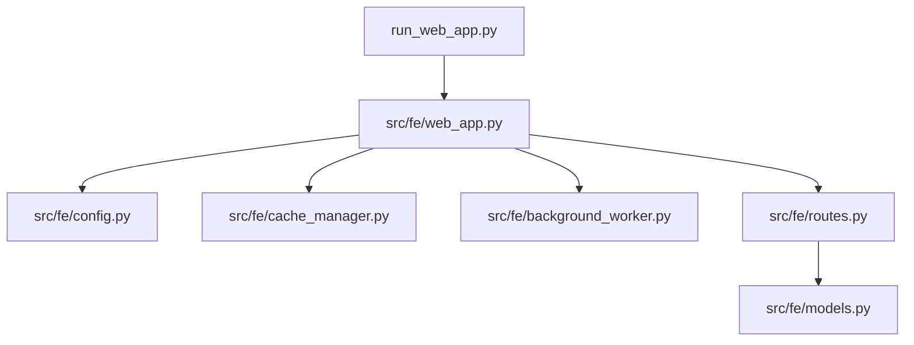
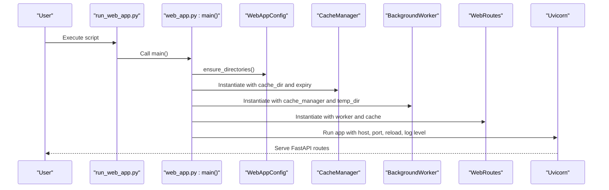
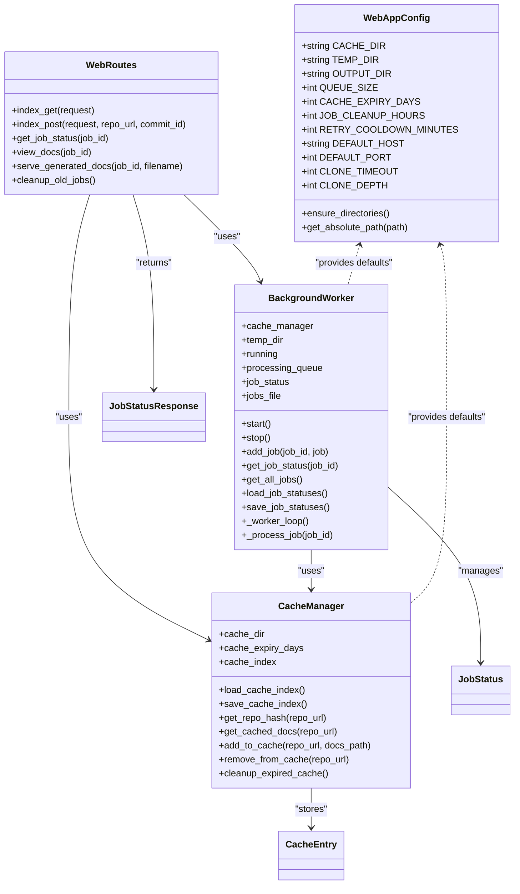
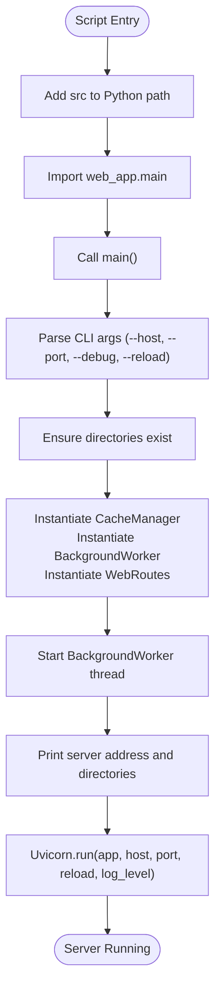
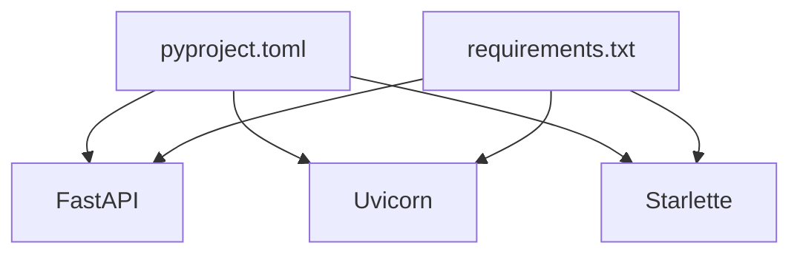

# Web Application Startup and Configuration

<cite>
**Referenced Files in This Document**
- [run_web_app.py](file://codewiki/run_web_app.py)
- [web_app.py](file://codewiki/src/fe/web_app.py)
- [config.py](file://codewiki/src/fe/config.py)
- [background_worker.py](file://codewiki/src/fe/background_worker.py)
- [cache_manager.py](file://codewiki/src/fe/cache_manager.py)
- [routes.py](file://codewiki/src/fe/routes.py)
- [models.py](file://codewiki/src/fe/models.py)
- [requirements.txt](file://requirements.txt)
- [pyproject.toml](file://pyproject.toml)
- [DEVELOPMENT.md](file://DEVELOPMENT.md)
</cite>

## Table of Contents
1. [Introduction](#introduction)
2. [Project Structure](#project-structure)
3. [Core Components](#core-components)
4. [Architecture Overview](#architecture-overview)
5. [Detailed Component Analysis](#detailed-component-analysis)
6. [Dependency Analysis](#dependency-analysis)
7. [Performance Considerations](#performance-considerations)
8. [Troubleshooting Guide](#troubleshooting-guide)
9. [Conclusion](#conclusion)

## Introduction
This document explains how to launch the CodeWiki web application and how the startup process initializes the FastAPI server, background workers, caches, and routes. It covers the command-line arguments supported by the web application entry point, the configuration defaults and directory layout, and the initialization sequence leading to server startup via Uvicorn. It also provides practical examples, troubleshooting tips, and best practices for development versus production deployments.

## Project Structure
The web application is organized into a dedicated frontend package with a FastAPI application, background worker, cache manager, routes, and configuration. The entry point scripts add the source directory to the Python path and delegate to the web application’s main function.

**Diagram sources**
- [run_web_app.py](file://codewiki/run_web_app.py#L1-L16)
- [web_app.py](file://codewiki/src/fe/web_app.py#L1-L133)
- [config.py](file://codewiki/src/fe/config.py#L1-L51)
- [cache_manager.py](file://codewiki/src/fe/cache_manager.py#L1-L119)
- [background_worker.py](file://codewiki/src/fe/background_worker.py#L1-L256)
- [routes.py](file://codewiki/src/fe/routes.py#L1-L299)
- [models.py](file://codewiki/src/fe/models.py#L1-L55)

**Section sources**
- [run_web_app.py](file://codewiki/run_web_app.py#L1-L16)
- [web_app.py](file://codewiki/src/fe/web_app.py#L1-L133)
- [DEVELOPMENT.md](file://DEVELOPMENT.md#L1-L120)

## Core Components
- Web application entry and server runner
  - The entry script adds the source directory to the Python path and invokes the main function from the web application module.
  - The main function parses command-line arguments, ensures required directories exist, starts the background worker, prints startup messages, and runs the Uvicorn ASGI server.

- Configuration settings
  - Directory paths: cache, temp, and output directories are defined with defaults and helpers to ensure existence and resolve absolute paths.
  - Queue and cache settings: queue capacity, cache expiry days, job cleanup hours, and retry cooldown minutes.
  - Server defaults: default host and port.
  - Git-related timeouts and clone depth.

- Background worker
  - Manages a queue of documentation generation jobs, tracks job statuses, persists them to disk, and performs cleanup of temporary repositories after processing.

- Cache manager
  - Provides caching of generated documentation with expiration checks and index persistence.

- Routes and models
  - Route handlers for the web UI and API endpoints, plus Pydantic and dataclass models for requests and responses.

**Section sources**
- [run_web_app.py](file://codewiki/run_web_app.py#L1-L16)
- [web_app.py](file://codewiki/src/fe/web_app.py#L75-L133)
- [config.py](file://codewiki/src/fe/config.py#L10-L51)
- [background_worker.py](file://codewiki/src/fe/background_worker.py#L26-L125)
- [cache_manager.py](file://codewiki/src/fe/cache_manager.py#L16-L119)
- [routes.py](file://codewiki/src/fe/routes.py#L25-L180)
- [models.py](file://codewiki/src/fe/models.py#L12-L55)

## Architecture Overview
The startup sequence orchestrates directory creation, component instantiation, route registration, and server startup.

**Diagram sources**
- [run_web_app.py](file://codewiki/run_web_app.py#L1-L16)
- [web_app.py](file://codewiki/src/fe/web_app.py#L75-L133)
- [config.py](file://codewiki/src/fe/config.py#L36-L51)
- [cache_manager.py](file://codewiki/src/fe/cache_manager.py#L16-L25)
- [background_worker.py](file://codewiki/src/fe/background_worker.py#L26-L45)
- [routes.py](file://codewiki/src/fe/routes.py#L25-L31)

## Detailed Component Analysis

### Web Application Entry and Startup
- Entry script behavior
  - Adds the source directory to the Python path and imports the web application’s main function.
  - Executes main when invoked as the script entry point.

- main() function responsibilities
  - Parses command-line arguments for host, port, debug, and reload.
  - Ensures required directories exist.
  - Starts the background worker thread.
  - Prints startup information including server address and directory locations.
  - Runs Uvicorn with host, port, reload, and log level derived from arguments.

- Command-line arguments
  - --host: Host binding address for the server. Defaults to the configured default host.
  - --port: Port number for the server. Defaults to the configured default port.
  - --debug: Enables debug logging level for the server.
  - --reload: Enables auto-reload for development.

- Server startup via Uvicorn
  - The application is served as an ASGI app named “fe.web_app:app”.
  - Reload and log level are controlled by the parsed arguments.

**Section sources**
- [run_web_app.py](file://codewiki/run_web_app.py#L1-L16)
- [web_app.py](file://codewiki/src/fe/web_app.py#L75-L133)
- [config.py](file://codewiki/src/fe/config.py#L28-L35)

### Configuration Settings (WebAppConfig)
- Directory paths
  - CACHE_DIR: Default cache directory for generated documentation.
  - TEMP_DIR: Default temporary directory for cloning repositories during processing.
  - OUTPUT_DIR: Default output base directory.
  - ensure_directories(): Creates all required directories if missing.

- Queue and cache settings
  - QUEUE_SIZE: Maximum size of the processing queue.
  - CACHE_EXPIRY_DAYS: Days after which cached documentation is considered expired.
  - JOB_CLEANUP_HOURS: Hours after which completed or failed jobs are cleaned up.
  - RETRY_COOLDOWN_MINUTES: Minutes to wait before allowing a retry for recently failed jobs.

- Server defaults
  - DEFAULT_HOST: Default host address for the server.
  - DEFAULT_PORT: Default port number for the server.

- Git settings
  - CLONE_TIMEOUT: Timeout for repository cloning operations.
  - CLONE_DEPTH: Shallow clone depth for performance.

- Utility methods
  - get_absolute_path(): Resolves absolute path for a given relative path.

**Section sources**
- [config.py](file://codewiki/src/fe/config.py#L10-L51)

### Background Worker Initialization and Lifecycle
- Instantiation
  - Receives a CacheManager and optional temp directory.
  - Initializes an in-memory job status dictionary and a persistent jobs file path.
  - Loads persisted job statuses from disk if available.

- Lifecycle
  - start(): Starts a daemon thread running the worker loop.
  - stop(): Stops the worker loop gracefully.
  - add_job(): Enqueues a new job and updates status.
  - get_job_status()/get_all_jobs(): Retrieves job status by ID or all statuses.
  - load_job_statuses(): Loads persisted statuses and reconstructs from cache if needed.
  - save_job_statuses(): Persists job statuses to disk.
  - _worker_loop(): Processes queued jobs with periodic polling and error handling.
  - _process_job(): Orchestrates cache checks, repository cloning, documentation generation, caching, and cleanup of temporary directories.

- Job persistence and reconstruction
  - Jobs are saved to a JSON file with timestamps and progress.
  - If the jobs file is missing, the worker attempts to reconstruct completed jobs from cache entries.

- Cleanup policy
  - Temporary repositories are removed after processing.
  - Completed or failed jobs older than JOB_CLEANUP_HOURS are pruned.

**Section sources**
- [background_worker.py](file://codewiki/src/fe/background_worker.py#L26-L125)
- [background_worker.py](file://codewiki/src/fe/background_worker.py#L150-L256)
- [routes.py](file://codewiki/src/fe/routes.py#L288-L299)

### Cache Manager Initialization and Policies
- Instantiation
  - Ensures cache directory exists and loads the cache index from disk if present.

- Operations
  - get_repo_hash(): Generates a short hash for repository URLs.
  - get_cached_docs(): Returns cached documentation path if still valid; otherwise removes expired cache entry.
  - add_to_cache(): Adds a new cache entry with timestamps.
  - remove_from_cache(): Removes a cache entry by repository URL hash.
  - cleanup_expired_cache(): Removes expired entries and persists the updated index.

- Expiration policy
  - Entries older than CACHE_EXPIRY_DAYS are considered expired and removed.

**Section sources**
- [cache_manager.py](file://codewiki/src/fe/cache_manager.py#L16-L119)

### Route Registration and API Endpoints
- Route handlers
  - GET "/": Renders the main web interface with recent jobs.
  - POST "/": Handles repository submission, validates URL, checks cache, enqueues jobs, or redirects to cached results.
  - GET "/api/job/{job_id}": Returns job status as a structured response.
  - GET "/docs/{job_id}": Redirects to static documentation viewer.
  - GET "/static-docs/{job_id}/" and "/static-docs/{job_id}/{filename:path}": Serves generated documentation files, with fallback to cache-based reconstruction.

- Job lifecycle integration
  - Routes coordinate with BackgroundWorker and CacheManager to manage job states and cached results.

**Section sources**
- [web_app.py](file://codewiki/src/fe/web_app.py#L41-L73)
- [routes.py](file://codewiki/src/fe/routes.py#L25-L180)
- [models.py](file://codewiki/src/fe/models.py#L12-L55)

### Data Models
- JobStatusResponse: Pydantic model for job status API responses, including timestamps, progress, and optional fields.
- JobStatus: Dataclass representing job state with fields for status, timestamps, error messages, and optional metadata.
- CacheEntry: Dataclass representing cached documentation entries with timestamps and paths.

**Section sources**
- [models.py](file://codewiki/src/fe/models.py#L12-L55)

## Architecture Overview

**Diagram sources**
- [config.py](file://codewiki/src/fe/config.py#L10-L51)
- [cache_manager.py](file://codewiki/src/fe/cache_manager.py#L16-L119)
- [background_worker.py](file://codewiki/src/fe/background_worker.py#L26-L125)
- [routes.py](file://codewiki/src/fe/routes.py#L25-L180)
- [models.py](file://codewiki/src/fe/models.py#L12-L55)

## Detailed Component Analysis

### Startup Sequence Flow

**Diagram sources**
- [run_web_app.py](file://codewiki/run_web_app.py#L1-L16)
- [web_app.py](file://codewiki/src/fe/web_app.py#L75-L133)
- [config.py](file://codewiki/src/fe/config.py#L36-L51)
- [cache_manager.py](file://codewiki/src/fe/cache_manager.py#L16-L25)
- [background_worker.py](file://codewiki/src/fe/background_worker.py#L26-L45)
- [routes.py](file://codewiki/src/fe/routes.py#L25-L31)

**Section sources**
- [web_app.py](file://codewiki/src/fe/web_app.py#L75-L133)

### Command-Line Arguments and Behavior
- --host
  - Controls the host address the server binds to. Defaults to the configured default host.
- --port
  - Controls the TCP port the server listens on. Defaults to the configured default port.
- --debug
  - Sets the server log level to debug for more verbose logs.
- --reload
  - Enables auto-reload for development, restarting the server when source files change.

Impact summary:
- Changing host/port affects network accessibility and port availability.
- Debug mode increases logging verbosity for diagnostics.
- Reload enables rapid iteration during development but is not recommended for production.

**Section sources**
- [web_app.py](file://codewiki/src/fe/web_app.py#L79-L103)
- [web_app.py](file://codewiki/src/fe/web_app.py#L120-L127)

### Directory Creation and Paths
- ensure_directories() creates cache, temp, and output directories if they do not exist.
- get_absolute_path() resolves absolute paths for display and logging.
- CACHE_DIR, TEMP_DIR, OUTPUT_DIR define the storage layout for cache, temporary clones, and generated documentation.

**Section sources**
- [config.py](file://codewiki/src/fe/config.py#L36-L51)

### Route Registration Details
- Index endpoints register GET "/" and POST "/" with FastAPI decorators.
- API endpoints include GET "/api/job/{job_id}" returning structured job status.
- Static documentation serving includes GET "/docs/{job_id}" redirect and GET "/static-docs/{job_id}/..." for file serving.

**Section sources**
- [web_app.py](file://codewiki/src/fe/web_app.py#L41-L73)
- [routes.py](file://codewiki/src/fe/routes.py#L155-L178)
- [routes.py](file://codewiki/src/fe/routes.py#L179-L269)

## Dependency Analysis
External dependencies relevant to the web application startup and runtime include FastAPI, Uvicorn, and related HTTP/ASGI libraries. These are declared in the project metadata and requirements.

**Diagram sources**
- [pyproject.toml](file://pyproject.toml#L26-L54)
- [requirements.txt](file://requirements.txt#L1-L165)

**Section sources**
- [pyproject.toml](file://pyproject.toml#L26-L54)
- [requirements.txt](file://requirements.txt#L1-L165)

## Performance Considerations
- Queue sizing and concurrency
  - QUEUE_SIZE controls the maximum number of concurrent jobs. Tune based on available CPU and memory resources.
- Cache expiry and cleanup
  - CACHE_EXPIRY_DAYS balances storage usage and reusability of generated documentation.
  - JOB_CLEANUP_HOURS prevents accumulation of stale job records.
- Logging verbosity
  - Use --debug only during development to reduce overhead in production.
- Auto-reload
  - Disable --reload in production environments to avoid unnecessary restarts.

[No sources needed since this section provides general guidance]

## Troubleshooting Guide
Common startup and runtime issues:

- Port conflicts
  - Symptom: Server fails to bind to the configured port.
  - Resolution: Change --port to an available port or stop the conflicting service. Verify with netstat/ss on your platform.

- Permission issues
  - Symptom: Failures to create directories or write cache/index files.
  - Resolution: Ensure the user has write permissions to the cache, temp, and output directories. Run with appropriate privileges.

- Environment setup
  - Symptom: Missing dependencies or incompatible Python version.
  - Resolution: Install dependencies from requirements.txt and ensure Python 3.12+ is used. Follow the development setup steps.

- Background worker not processing jobs
  - Symptom: Jobs remain queued or processing indefinitely.
  - Resolution: Check worker thread status, logs, and queue size. Confirm cache and temp directories are writable.

- Documentation not found
  - Symptom: 404 when accessing generated documentation.
  - Resolution: Verify job completion status, cache presence, and static-docs path. Ensure the documentation was generated and not cleaned up by cleanup policies.

Best practices:
- Development
  - Use --reload for rapid iteration and --debug for verbose logs.
  - Keep queue size moderate and monitor cache growth.
- Production
  - Disable --reload and keep --debug off.
  - Monitor disk usage for cache and temp directories.
  - Use a reverse proxy and HTTPS in front of the server.

**Section sources**
- [web_app.py](file://codewiki/src/fe/web_app.py#L120-L129)
- [background_worker.py](file://codewiki/src/fe/background_worker.py#L150-L256)
- [routes.py](file://codewiki/src/fe/routes.py#L155-L178)
- [routes.py](file://codewiki/src/fe/routes.py#L179-L269)
- [DEVELOPMENT.md](file://DEVELOPMENT.md#L43-L70)

## Conclusion
The CodeWiki web application startup process is straightforward: the entry script delegates to the web application’s main function, which initializes configuration, components, registers routes, and starts Uvicorn. Command-line arguments control host, port, logging, and reload behavior. Configuration defines directory paths, queue sizes, cache policies, and cleanup windows. The background worker and cache manager provide robust job processing and caching, while routes expose a simple web interface and API. For development, enable reload and debug; for production, disable reload, keep logs at info level, and monitor resource usage.