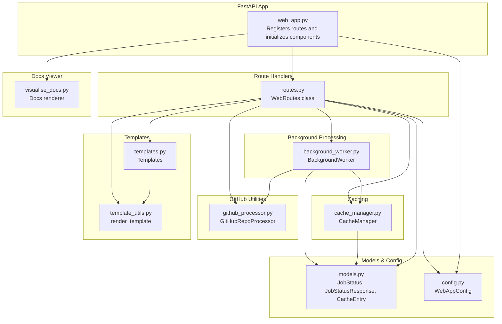
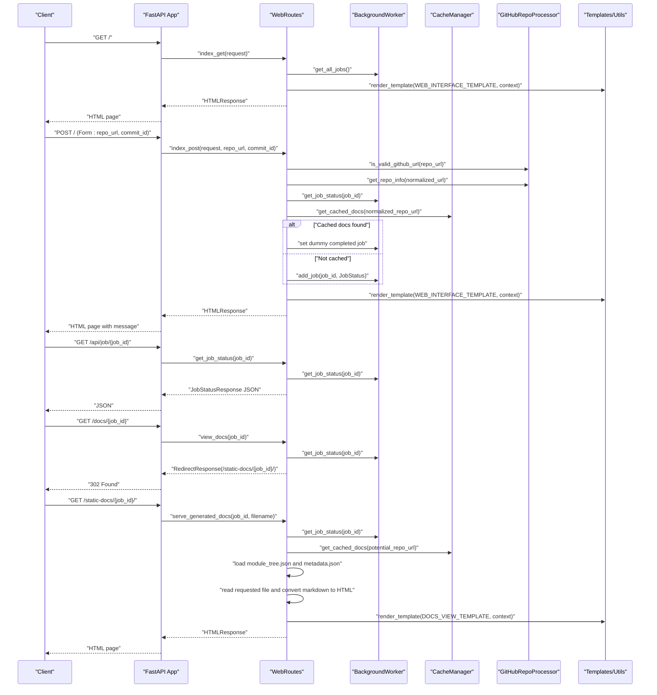
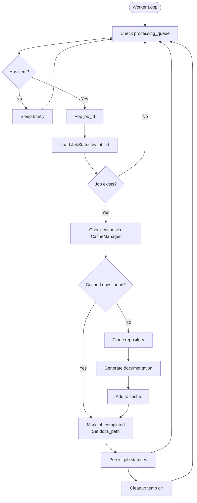
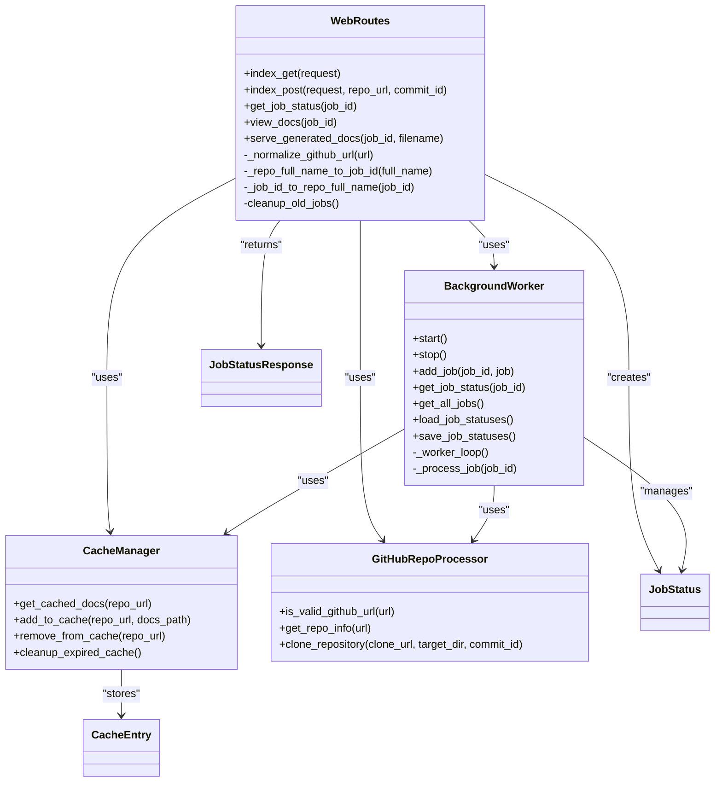

# Web Routes and API Endpoints

<cite>
**Referenced Files in This Document**
- [web_app.py](file://codewiki/src/fe/web_app.py)
- [routes.py](file://codewiki/src/fe/routes.py)
- [background_worker.py](file://codewiki/src/fe/background_worker.py)
- [cache_manager.py](file://codewiki/src/fe/cache_manager.py)
- [models.py](file://codewiki/src/fe/models.py)
- [config.py](file://codewiki/src/fe/config.py)
- [github_processor.py](file://codewiki/src/fe/github_processor.py)
- [templates.py](file://codewiki/src/fe/templates.py)
- [template_utils.py](file://codewiki/src/fe/template_utils.py)
- [visualise_docs.py](file://codewiki/src/fe/visualise_docs.py)
- [run_web_app.py](file://codewiki/run_web_app.py)
</cite>

## Table of Contents
1. [Introduction](#introduction)
2. [Project Structure](#project-structure)
3. [Core Components](#core-components)
4. [Architecture Overview](#architecture-overview)
5. [Detailed Component Analysis](#detailed-component-analysis)
6. [Dependency Analysis](#dependency-analysis)
7. [Performance Considerations](#performance-considerations)
8. [Troubleshooting Guide](#troubleshooting-guide)
9. [Conclusion](#conclusion)
10. [Appendices](#appendices)

## Introduction
This document describes the web routing system of the CodeWiki FastAPI application. It covers all HTTP endpoints exposed by the application, including the root GET/POST routes, the API endpoint for job status, and the endpoints for serving generated documentation. It explains how form submissions are processed, how job status is retrieved, and how documentation files are served. It also details the integration between route handlers and backend components such as BackgroundWorker and CacheManager, and provides practical guidance on interacting with the API programmatically, including response caching, error handling strategies, and security considerations.

## Project Structure
The web application is organized around a FastAPI application that registers route handlers and delegates business logic to dedicated components:
- FastAPI app and route registration live in the web application module.
- Route handlers are implemented in a dedicated routes module.
- Background processing and job lifecycle are managed by a background worker.
- Documentation caching is handled by a cache manager.
- Data models define the shape of job status and API responses.
- Configuration centralizes runtime settings.
- GitHub repository processing utilities validate and clone repositories.
- Templates and template utilities render HTML for the web interface and documentation viewer.
- A separate visualizer module demonstrates how documentation is rendered for standalone usage.

**Diagram sources**
- [web_app.py](file://codewiki/src/fe/web_app.py#L23-L73)
- [routes.py](file://codewiki/src/fe/routes.py#L25-L299)
- [background_worker.py](file://codewiki/src/fe/background_worker.py#L26-L256)
- [cache_manager.py](file://codewiki/src/fe/cache_manager.py#L16-L119)
- [models.py](file://codewiki/src/fe/models.py#L12-L55)
- [config.py](file://codewiki/src/fe/config.py#L10-L51)
- [github_processor.py](file://codewiki/src/fe/github_processor.py#L14-L93)
- [templates.py](file://codewiki/src/fe/templates.py#L1-L680)
- [template_utils.py](file://codewiki/src/fe/template_utils.py#L1-L114)
- [visualise_docs.py](file://codewiki/src/fe/visualise_docs.py#L1-L268)

**Section sources**
- [web_app.py](file://codewiki/src/fe/web_app.py#L23-L73)
- [routes.py](file://codewiki/src/fe/routes.py#L25-L299)
- [background_worker.py](file://codewiki/src/fe/background_worker.py#L26-L256)
- [cache_manager.py](file://codewiki/src/fe/cache_manager.py#L16-L119)
- [models.py](file://codewiki/src/fe/models.py#L12-L55)
- [config.py](file://codewiki/src/fe/config.py#L10-L51)
- [github_processor.py](file://codewiki/src/fe/github_processor.py#L14-L93)
- [templates.py](file://codewiki/src/fe/templates.py#L1-L680)
- [template_utils.py](file://codewiki/src/fe/template_utils.py#L1-L114)
- [visualise_docs.py](file://codewiki/src/fe/visualise_docs.py#L1-L268)

## Core Components
- WebRoutes: Implements all route handlers for the web application, including form submission, job status retrieval, documentation viewing, and static documentation serving.
- BackgroundWorker: Manages the job queue, job lifecycle, and coordinates documentation generation, including cache checks and cleanup.
- CacheManager: Provides caching of generated documentation with expiration and index persistence.
- GitHubRepoProcessor: Validates GitHub URLs, extracts repository info, and clones repositories (optionally at a specific commit).
- Models: Defines JobStatus, JobStatusResponse, and CacheEntry data structures.
- Config: Centralizes configuration such as directories, queue sizes, cache expiry, and server defaults.
- Templates and Template Utils: Provide HTML rendering for the web interface and documentation viewer.
- Docs Renderer: Demonstrates how documentation is rendered for standalone usage.

**Section sources**
- [routes.py](file://codewiki/src/fe/routes.py#L25-L299)
- [background_worker.py](file://codewiki/src/fe/background_worker.py#L26-L256)
- [cache_manager.py](file://codewiki/src/fe/cache_manager.py#L16-L119)
- [github_processor.py](file://codewiki/src/fe/github_processor.py#L14-L93)
- [models.py](file://codewiki/src/fe/models.py#L12-L55)
- [config.py](file://codewiki/src/fe/config.py#L10-L51)
- [templates.py](file://codewiki/src/fe/templates.py#L1-L680)
- [template_utils.py](file://codewiki/src/fe/template_utils.py#L1-L114)
- [visualise_docs.py](file://codewiki/src/fe/visualise_docs.py#L1-L268)

## Architecture Overview
The FastAPI application registers route handlers that delegate to WebRoutes. WebRoutes interacts with BackgroundWorker to manage jobs and with CacheManager to check for cached documentation. GitHubRepoProcessor validates and clones repositories. Templates and template utilities render HTML responses. The documentation viewer is served via static-docs endpoints that read markdown files and render them into HTML with navigation and metadata.

**Diagram sources**
- [web_app.py](file://codewiki/src/fe/web_app.py#L41-L73)
- [routes.py](file://codewiki/src/fe/routes.py#L32-L269)
- [background_worker.py](file://codewiki/src/fe/background_worker.py#L50-L125)
- [cache_manager.py](file://codewiki/src/fe/cache_manager.py#L61-L119)
- [github_processor.py](file://codewiki/src/fe/github_processor.py#L18-L93)
- [templates.py](file://codewiki/src/fe/templates.py#L1-L680)
- [template_utils.py](file://codewiki/src/fe/template_utils.py#L20-L42)

## Detailed Component Analysis

### Root Routes: GET "/" and POST "/"
- Purpose: Present a web form for submitting GitHub repository URLs and process submissions.
- GET "/": Renders the main web interface with a form and recent jobs list.
- POST "/": Validates the submitted URL, normalizes it, checks for existing jobs and cache, enqueues a new job if needed, and renders the page with appropriate messages.

Key behaviors:
- Validation: Ensures non-empty URL and valid GitHub URL format.
- Normalization: Converts URLs to a canonical form for consistent comparisons.
- Duplicate handling: Checks existing jobs and recent failures to prevent redundant processing.
- Cache-first: If cached docs exist, sets a dummy completed job and redirects to the viewer.
- Queueing: Creates a queued job and adds it to the background worker.

Error conditions:
- Empty or invalid URL.
- Failure to enqueue a job (e.g., queue full or internal error).
- Message types include success and error, surfaced to the UI.

Response format:
- HTMLResponse with rendered template.

**Section sources**
- [web_app.py](file://codewiki/src/fe/web_app.py#L41-L52)
- [routes.py](file://codewiki/src/fe/routes.py#L32-L154)
- [github_processor.py](file://codewiki/src/fe/github_processor.py#L18-L33)
- [routes.py](file://codewiki/src/fe/routes.py#L270-L287)
- [templates.py](file://codewiki/src/fe/templates.py#L1-L320)
- [template_utils.py](file://codewiki/src/fe/template_utils.py#L20-L42)

### API Endpoint: GET "/api/job/{job_id}"
- Purpose: Retrieve the status of a documentation generation job.
- Request parameters:
  - job_id: String identifier derived from the repository full name.
- Response format:
  - JSON object conforming to JobStatusResponse model.
- Error conditions:
  - 404 Not Found if the job does not exist.

Implementation highlights:
- Delegates to BackgroundWorker to fetch job status.
- Converts JobStatus to JobStatusResponse for serialization.

**Section sources**
- [web_app.py](file://codewiki/src/fe/web_app.py#L54-L58)
- [routes.py](file://codewiki/src/fe/routes.py#L155-L162)
- [background_worker.py](file://codewiki/src/fe/background_worker.py#L55-L62)
- [models.py](file://codewiki/src/fe/models.py#L17-L30)

### Documentation View: GET "/docs/{job_id}"
- Purpose: Redirect to the static documentation viewer for a completed job.
- Behavior:
  - Validates job existence and completion status.
  - Redirects to "/static-docs/{job_id}/" if available.
- Error conditions:
  - 404 Not Found if job missing or not completed.

**Section sources**
- [web_app.py](file://codewiki/src/fe/web_app.py#L60-L64)
- [routes.py](file://codewiki/src/fe/routes.py#L163-L178)
- [background_worker.py](file://codewiki/src/fe/background_worker.py#L55-L62)

### Static Documentation Serving: GET "/static-docs/{job_id}" and GET "/static-docs/{job_id}/{filename}"
- Purpose: Serve generated documentation files as HTML pages with navigation and metadata.
- Request parameters:
  - job_id: String identifier.
  - filename: Path parameter for the requested markdown file (defaults to overview.md).
- Behavior:
  - Resolves job status and docs_path.
  - Optionally reconstructs job status from cache if no job exists.
  - Loads module_tree.json and metadata.json if present.
  - Reads the requested file, converts markdown to HTML, and renders with DOCS_VIEW_TEMPLATE.
- Error conditions:
  - 404 Not Found if job missing, docs not available, or file not found.
  - 500 Internal Server Error on read or conversion failures.

Response format:
- HTMLResponse with rendered documentation page.

Security considerations:
- The endpoint reads files from the documented path and serves them as HTML. Ensure the docs_path is trusted and corresponds to legitimate generated documentation.

**Section sources**
- [web_app.py](file://codewiki/src/fe/web_app.py#L66-L73)
- [routes.py](file://codewiki/src/fe/routes.py#L179-L269)
- [templates.py](file://codewiki/src/fe/templates.py#L322-L680)
- [template_utils.py](file://codewiki/src/fe/template_utils.py#L20-L42)
- [visualise_docs.py](file://codewiki/src/fe/visualise_docs.py#L68-L105)

### WebRoutes Class and Methods
The WebRoutes class encapsulates all route handler logic and orchestrates interactions with BackgroundWorker and CacheManager.

Key methods and responsibilities:
- index_get(request): Renders the main page with recent jobs.
- index_post(request, repo_url, commit_id): Processes form submissions, validates, normalizes, checks cache and existing jobs, enqueues new jobs, and renders feedback.
- get_job_status(job_id): Returns job status as JSON.
- view_docs(job_id): Redirects to the documentation viewer for completed jobs.
- serve_generated_docs(job_id, filename): Serves documentation files, loads metadata/navigation, and renders HTML.
- Helper methods: normalize GitHub URLs, convert between job IDs and repository full names, and clean up old jobs.

Integration points:
- BackgroundWorker: Adds jobs, retrieves statuses, persists job states, and runs the background loop.
- CacheManager: Checks for cached documentation and persists cache index.
- GitHubRepoProcessor: Validates URLs and clones repositories.
- Templates and Template Utils: Render HTML for web interface and documentation viewer.

**Section sources**
- [routes.py](file://codewiki/src/fe/routes.py#L25-L299)
- [background_worker.py](file://codewiki/src/fe/background_worker.py#L26-L256)
- [cache_manager.py](file://codewiki/src/fe/cache_manager.py#L16-L119)
- [github_processor.py](file://codewiki/src/fe/github_processor.py#L14-L93)
- [templates.py](file://codewiki/src/fe/templates.py#L1-L680)
- [template_utils.py](file://codewiki/src/fe/template_utils.py#L1-L114)

### BackgroundWorker: Job Lifecycle and Processing
BackgroundWorker manages the job queue and executes documentation generation tasks.

Responsibilities:
- Start/stop the worker thread.
- Enqueue jobs and track statuses in memory.
- Persist job statuses to disk.
- Reconstruct job statuses from cache for backward compatibility.
- Process jobs: check cache, clone repository, generate documentation, cache results, update statuses, and persist.

Processing logic flow:

**Diagram sources**
- [background_worker.py](file://codewiki/src/fe/background_worker.py#L150-L256)
- [cache_manager.py](file://codewiki/src/fe/cache_manager.py#L61-L119)
- [github_processor.py](file://codewiki/src/fe/github_processor.py#L55-L93)

**Section sources**
- [background_worker.py](file://codewiki/src/fe/background_worker.py#L26-L256)
- [cache_manager.py](file://codewiki/src/fe/cache_manager.py#L16-L119)
- [github_processor.py](file://codewiki/src/fe/github_processor.py#L14-L93)

### CacheManager: Caching and Expiration
CacheManager provides persistent caching of generated documentation with expiration.

Key operations:
- get_repo_hash(repo_url): Hashes repository URL for indexing.
- get_cached_docs(repo_url): Returns docs_path if cache is valid and recent.
- add_to_cache(repo_url, docs_path): Adds a cache entry with timestamps.
- remove_from_cache(repo_url): Removes an entry.
- cleanup_expired_cache(): Removes expired entries and persists index.

Expiration policy:
- Uses cache_expiry_days from configuration to decide validity.

**Section sources**
- [cache_manager.py](file://codewiki/src/fe/cache_manager.py#L16-L119)
- [config.py](file://codewiki/src/fe/config.py#L10-L51)

### GitHubRepoProcessor: URL Validation and Cloning
- is_valid_github_url(url): Validates GitHub URLs and ensures minimal path structure.
- get_repo_info(url): Parses owner, repo, full_name, and clone_url.
- clone_repository(clone_url, target_dir, commit_id): Clones repository with shallow depth by default or full clone when a commit is specified.

**Section sources**
- [github_processor.py](file://codewiki/src/fe/github_processor.py#L18-L93)

### Data Models and Configuration
- JobStatus: In-memory representation of a job with status, timestamps, progress, and optional fields.
- JobStatusResponse: Pydantic model for API responses.
- CacheEntry: Persistent cache entry with timestamps and hashes.
- WebAppConfig: Central configuration for directories, queue size, cache expiry, cleanup intervals, and server defaults.

**Section sources**
- [models.py](file://codewiki/src/fe/models.py#L12-L55)
- [config.py](file://codewiki/src/fe/config.py#L10-L51)

### Templates and Rendering
- WEB_INTERFACE_TEMPLATE: Main web form and recent jobs display.
- DOCS_VIEW_TEMPLATE: Documentation viewer with navigation, metadata, and Mermaid rendering.
- render_template(template, context): Renders Jinja2 templates from strings with context.

**Section sources**
- [templates.py](file://codewiki/src/fe/templates.py#L1-L680)
- [template_utils.py](file://codewiki/src/fe/template_utils.py#L1-L114)

### Programmatic API Interactions
Below are practical examples of how to interact with the API programmatically. Replace placeholders with actual values.

- Submit a repository for documentation generation:
  - Method: POST
  - URL: /
  - Headers: Content-Type: application/x-www-form-urlencoded
  - Body: repo_url=<repository_url>&commit_id=<optional_commit_hash>
  - Expected response: HTML page with success/error message and updated recent jobs.

- Retrieve job status:
  - Method: GET
  - URL: /api/job/{job_id}
  - Expected response: JSON object with job_id, repo_url, status, timestamps, progress, and optional fields.

- View generated documentation:
  - Method: GET
  - URL: /docs/{job_id}
  - Expected response: 302 Found redirect to /static-docs/{job_id}/.

- Serve documentation files:
  - Method: GET
  - URL: /static-docs/{job_id}/overview.md or /static-docs/{job_id}/{filename}
  - Expected response: HTML page with rendered markdown content, navigation, and metadata.

Notes:
- The job_id is derived from the repository full name by replacing '/' with '--'.
- The filename defaults to overview.md if omitted.

**Section sources**
- [web_app.py](file://codewiki/src/fe/web_app.py#L41-L73)
- [routes.py](file://codewiki/src/fe/routes.py#L155-L269)
- [routes.py](file://codewiki/src/fe/routes.py#L280-L287)

## Dependency Analysis
The following diagram shows the primary dependencies among components:

**Diagram sources**
- [routes.py](file://codewiki/src/fe/routes.py#L25-L299)
- [background_worker.py](file://codewiki/src/fe/background_worker.py#L26-L256)
- [cache_manager.py](file://codewiki/src/fe/cache_manager.py#L16-L119)
- [github_processor.py](file://codewiki/src/fe/github_processor.py#L14-L93)
- [models.py](file://codewiki/src/fe/models.py#L12-L55)

**Section sources**
- [routes.py](file://codewiki/src/fe/routes.py#L25-L299)
- [background_worker.py](file://codewiki/src/fe/background_worker.py#L26-L256)
- [cache_manager.py](file://codewiki/src/fe/cache_manager.py#L16-L119)
- [github_processor.py](file://codewiki/src/fe/github_processor.py#L14-L93)
- [models.py](file://codewiki/src/fe/models.py#L12-L55)

## Performance Considerations
- Queue sizing: The queue capacity is configurable and affects throughput. Ensure it matches expected concurrency.
- Cache expiry: Long cache expiry reduces repeated generation but increases storage usage. Adjust based on workload.
- Job cleanup: Old completed/failed jobs are periodically removed to keep memory usage manageable.
- Background worker: Running as a daemon thread ensures responsiveness; consider monitoring and health checks in production deployments.
- File I/O: Reading and writing JSON and markdown files is synchronous; for high-throughput scenarios, consider asynchronous I/O or batching.

[No sources needed since this section provides general guidance]

## Troubleshooting Guide
Common issues and resolutions:
- Job not found:
  - Symptom: 404 from /api/job/{job_id} or /docs/{job_id}.
  - Cause: job_id does not exist or job was cleaned up.
  - Resolution: Submit a new job or verify the job_id.

- Documentation not available:
  - Symptom: 404 from /docs/{job_id} or /static-docs/{job_id}/.
  - Cause: Job not completed or docs_path missing.
  - Resolution: Wait for processing to finish or check cache availability.

- File not found:
  - Symptom: 404 from /static-docs/{job_id}/{filename}.
  - Cause: Requested file does not exist under docs_path.
  - Resolution: Verify filename and ensure documentation generation completed successfully.

- Read errors:
  - Symptom: 500 from /static-docs/{job_id}/{filename}.
  - Cause: File read or markdown conversion failure.
  - Resolution: Inspect logs and verify file integrity.

- URL validation failures:
  - Symptom: Form submission returns error.
  - Cause: Invalid GitHub URL format.
  - Resolution: Enter a valid GitHub repository URL.

- Queue full or processing delays:
  - Symptom: Jobs remain queued for extended periods.
  - Cause: Queue size exceeded or background worker busy.
  - Resolution: Increase queue size or reduce concurrent jobs.

**Section sources**
- [routes.py](file://codewiki/src/fe/routes.py#L155-L178)
- [routes.py](file://codewiki/src/fe/routes.py#L179-L269)
- [github_processor.py](file://codewiki/src/fe/github_processor.py#L18-L33)

## Conclusion
The CodeWiki web routing system provides a cohesive set of endpoints for submitting repositories, tracking job status, and serving generated documentation. WebRoutes centralizes route logic and integrates with BackgroundWorker and CacheManager to deliver a robust, cache-aware documentation generation pipeline. The system offers clear error handling, configurable behavior, and straightforward programmatic access for client integrations.

[No sources needed since this section summarizes without analyzing specific files]

## Appendices

### Endpoint Reference Summary
- GET /
  - Purpose: Main web interface with form and recent jobs.
  - Response: HTML page.
- POST /
  - Purpose: Submit repository URL and optional commit ID.
  - Response: HTML page with success/error message.
- GET /api/job/{job_id}
  - Purpose: Retrieve job status.
  - Response: JSON (JobStatusResponse).
- GET /docs/{job_id}
  - Purpose: Redirect to documentation viewer.
  - Response: 302 Found.
- GET /static-docs/{job_id}/
  - Purpose: Serve documentation overview.
  - Response: HTML page.
- GET /static-docs/{job_id}/{filename}
  - Purpose: Serve specific documentation file.
  - Response: HTML page.

**Section sources**
- [web_app.py](file://codewiki/src/fe/web_app.py#L41-L73)
- [routes.py](file://codewiki/src/fe/routes.py#L155-L269)

### Startup and Entry Point
- The web application is started via a dedicated entry point that ensures the source path and invokes the main function in the web application module.

**Section sources**
- [run_web_app.py](file://codewiki/run_web_app.py#L1-L16)
- [web_app.py](file://codewiki/src/fe/web_app.py#L75-L133)