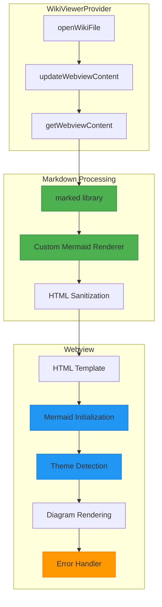

# Design Document: Mermaid Rendering Improvements

## Overview

This design document outlines the technical approach for improving Mermaid diagram rendering in the Qoder Wiki VSCode extension. The current implementation has a custom markdown-to-HTML parser with basic Mermaid support that attempts to fix syntax issues on-the-fly. This approach is fragile and doesn't scale to all Mermaid diagram types. The improved design will use a proper markdown parsing library, implement robust Mermaid initialization, add theme detection, and provide comprehensive error handling.

The solution involves three main components:
1. **Markdown Processing Layer**: Replace custom parser with a mature markdown library
2. **Mermaid Integration Layer**: Improve initialization, configuration, and error handling
3. **Theme Management Layer**: Detect and apply VSCode theme to diagrams

## Architecture

### Current Architecture Issues

The current implementation in `wikiViewerProvider.ts` has several problems:

1. **Custom Markdown Parser**: The `markdownToHtml()` method uses regex-based parsing which is error-prone and doesn't handle edge cases
2. **Syntax Manipulation**: The code attempts to "fix" Mermaid syntax by modifying diagram code, which can break valid diagrams
3. **No Error Handling**: Failed diagrams render as blank spaces with no user feedback
4. **Hard-coded Theme**: Only supports dark theme
5. **Timing Issues**: Mermaid initialization may not complete before diagrams are rendered

### Proposed Architecture



## Components and Interfaces

### 1. Markdown Processing Component

**Purpose**: Convert markdown to HTML using a robust library instead of custom regex

**Implementation**:
- Use the `marked` library (already available in VSCode ecosystem)
- Create a custom renderer for code blocks to handle Mermaid specially
- Preserve all other markdown features (links, images, tables, etc.)

**Interface**:
```typescript
interface IMarkdownProcessor {
  /**
   * Convert markdown content to HTML
   * @param markdown Raw markdown content
   * @param options Processing options
   * @returns HTML string with Mermaid blocks preserved
   */
  convertToHtml(markdown: string, options?: MarkdownOptions): string;
}

interface MarkdownOptions {
  /** Base path for resolving relative links */
  basePath?: string;
  /** Whether to sanitize HTML output */
  sanitize?: boolean;
}
```

### 2. Mermaid Configuration Component

**Purpose**: Manage Mermaid library initialization and configuration

**Implementation**:
- Detect VSCode theme (dark/light) and pass to Mermaid
- Configure Mermaid with appropriate security settings
- Handle initialization timing to ensure library is ready
- Provide error callbacks for failed diagrams

**Interface**:
```typescript
interface IMermaidConfig {
  /** Mermaid theme based on VSCode theme */
  theme: 'dark' | 'light' | 'neutral';
  /** Security level for rendering */
  securityLevel: 'strict' | 'loose';
  /** Starting on load */
  startOnLoad: boolean;
  /** Log level for debugging */
  logLevel: 'debug' | 'info' | 'warn' | 'error' | 'fatal';
  /** Error callback */
  errorCallback?: (error: string, diagram: string) => void;
}
```

### 3. Theme Detection Component

**Purpose**: Detect current VSCode theme and communicate to webview

**Implementation**:
- Read VSCode theme kind (light, dark, high contrast)
- Pass theme information to webview via initial HTML
- Listen for theme changes and update diagrams
- Map VSCode themes to Mermaid themes

**Interface**:
```typescript
interface IThemeInfo {
  /** VSCode theme kind */
  kind: 'light' | 'dark' | 'highContrast';
  /** Mermaid theme name */
  mermaidTheme: string;
  /** CSS variables for custom styling */
  cssVariables: Record<string, string>;
}
```

### 4. Error Handling Component

**Purpose**: Provide user feedback when diagrams fail to render

**Implementation**:
- Catch Mermaid parsing errors
- Display error messages in place of failed diagrams
- Log errors to console for debugging
- Provide option to view raw diagram code

**Interface**:
```typescript
interface IDiagramError {
  /** Error message from Mermaid */
  message: string;
  /** Diagram code that failed */
  diagramCode: string;
  /** Diagram index in document */
  index: number;
}
```

## Data Models

### Mermaid Diagram Block

```typescript
interface MermaidBlock {
  /** Unique identifier for this diagram */
  id: string;
  /** Raw Mermaid code */
  code: string;
  /** Diagram type (graph, classDiagram, sequenceDiagram, etc.) */
  type: string;
  /** Position in document */
  index: number;
  /** Rendering status */
  status: 'pending' | 'rendered' | 'error';
  /** Error message if status is 'error' */
  error?: string;
}
```

### Webview State

```typescript
interface WebviewState {
  /** File path being displayed */
  filePath: string;
  /** Current theme */
  theme: IThemeInfo;
  /** All Mermaid blocks in document */
  mermaidBlocks: MermaidBlock[];
  /** Mermaid library loaded */
  mermaidReady: boolean;
}
```

## Error Handling

### Error Categories

1. **Library Loading Errors**
   - CDN unavailable
   - Network timeout
   - Script loading failure
   - **Handling**: Display fallback message, offer retry

2. **Diagram Syntax Errors**
   - Invalid Mermaid syntax
   - Unsupported diagram type
   - Malformed diagram structure
   - **Handling**: Show error message with diagram code, link to Mermaid docs

3. **Rendering Errors**
   - Browser compatibility issues
   - Memory constraints
   - SVG generation failure
   - **Handling**: Log error, show simplified error message

4. **Theme Application Errors**
   - Theme detection failure
   - CSS variable unavailable
   - **Handling**: Fall back to neutral theme

### Error Display Strategy

```html
<div class="mermaid-error">
  <div class="error-header">
    <span class="error-icon">⚠️</span>
    <span class="error-title">Diagram Rendering Failed</span>
  </div>
  <div class="error-message">{error message}</div>
  <details class="error-details">
    <summary>View diagram code</summary>
    <pre><code>{diagram code}</code></pre>
  </details>
  <div class="error-actions">
    <button onclick="retryDiagram()">Retry</button>
    <a href="https://mermaid.js.org/intro/" target="_blank">Mermaid Documentation</a>
  </div>
</div>
```

## Testing Strategy

### Unit Tests

1. **Markdown Processing Tests**
   - Test conversion of various markdown elements
   - Verify Mermaid blocks are preserved correctly
   - Test edge cases (nested code blocks, special characters)

2. **Theme Detection Tests**
   - Test theme mapping for all VSCode theme kinds
   - Verify CSS variable extraction
   - Test theme change handling

3. **Error Handling Tests**
   - Test error message generation
   - Verify error display formatting
   - Test retry functionality

### Integration Tests

1. **End-to-End Rendering Tests**
   - Load markdown files with various diagram types
   - Verify all diagrams render correctly
   - Test multiple diagrams in single document

2. **Theme Integration Tests**
   - Test diagram rendering in light theme
   - Test diagram rendering in dark theme
   - Test theme switching while document is open

3. **Error Scenario Tests**
   - Test with invalid Mermaid syntax
   - Test with CDN unavailable (mock)
   - Test with unsupported diagram types

### Manual Testing

1. **Visual Regression Testing**
   - Compare rendered diagrams against reference images
   - Verify styling consistency across themes
   - Check diagram layout and spacing

2. **Performance Testing**
   - Test with documents containing many diagrams
   - Measure initialization time
   - Check memory usage

## Implementation Approach

### Phase 1: Replace Markdown Parser

1. Add `marked` library as dependency
2. Create custom renderer for code blocks
3. Implement Mermaid block extraction
4. Remove custom regex-based parser
5. Test with existing wiki content

### Phase 2: Improve Mermaid Integration

1. Implement proper initialization sequence
2. Add error callbacks and handling
3. Create error display UI
4. Test with various diagram types
5. Handle edge cases (empty diagrams, very large diagrams)

### Phase 3: Add Theme Support

1. Implement theme detection in extension
2. Pass theme info to webview
3. Configure Mermaid with appropriate theme
4. Add theme change listener
5. Test theme switching

### Phase 4: Polish and Optimization

1. Add loading indicators for diagrams
2. Implement diagram caching if needed
3. Optimize for documents with many diagrams
4. Add user preferences (if needed)
5. Update documentation

## Dependencies

### New Dependencies

- `marked` (v11.x or later): Markdown parsing library
- `dompurify` (optional): HTML sanitization if needed

### Existing Dependencies

- `mermaid` (v10.x): Already loaded via CDN
- VSCode API: Theme detection and webview management

## Configuration

### Extension Settings (Optional)

```json
{
  "qoderWiki.mermaid.theme": {
    "type": "string",
    "enum": ["auto", "dark", "light", "neutral"],
    "default": "auto",
    "description": "Theme for Mermaid diagrams"
  },
  "qoderWiki.mermaid.errorDisplay": {
    "type": "string",
    "enum": ["inline", "notification", "console"],
    "default": "inline",
    "description": "How to display Mermaid rendering errors"
  }
}
```

## Security Considerations

1. **HTML Sanitization**: Ensure markdown-generated HTML is sanitized to prevent XSS
2. **Mermaid Security Level**: Use 'strict' security level by default
3. **CDN Integrity**: Consider using Subresource Integrity (SRI) for CDN resources
4. **Content Security Policy**: Ensure webview CSP allows Mermaid rendering

## Performance Considerations

1. **Lazy Rendering**: Consider rendering diagrams only when visible (intersection observer)
2. **Caching**: Cache rendered SVGs to avoid re-rendering on theme change
3. **Debouncing**: Debounce theme change events to avoid excessive re-renders
4. **Memory Management**: Dispose of old webview panels properly to prevent memory leaks

## Migration Strategy

1. **Backward Compatibility**: Ensure existing wiki content continues to work
2. **Gradual Rollout**: Test with subset of users first
3. **Fallback**: Keep ability to view raw markdown if rendering fails
4. **Documentation**: Update wiki authoring guidelines with best practices

## Success Metrics

1. **Rendering Success Rate**: >99% of valid Mermaid diagrams render correctly
2. **Error Clarity**: Users can understand and fix diagram errors
3. **Performance**: Diagrams render within 500ms of page load
4. **Theme Accuracy**: Diagrams match VSCode theme colors
5. **User Satisfaction**: Positive feedback from wiki users
