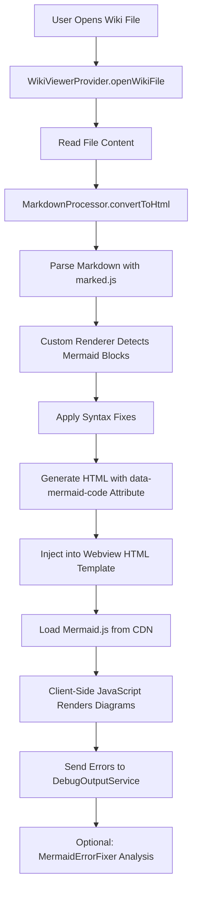
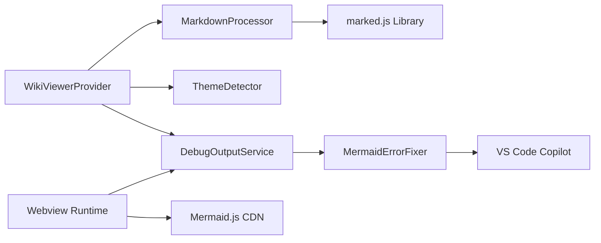

# Architecture Review: Mermaid Rendering in VSCode Extension

## Executive Summary

The current architecture for rendering Mermaid diagrams in markdown files demonstrates a **well-structured, separation-of-concerns approach** that is fundamentally sound. However, there are several architectural concerns and opportunities for enhancement that should be addressed.

**Verdict**: The architecture is **mostly correct** with important areas requiring improvement.

## Current Architecture Analysis

### High-Level Component Structure

The extension follows a layered architecture pattern with clear separation between concerns:

| Layer | Components | Responsibility |
|-------|-----------|----------------|
| **Presentation Layer** | WikiTreeProvider, WikiViewerProvider | UI rendering and user interaction |
| **Processing Layer** | MarkdownProcessor | Content transformation and syntax correction |
| **Service Layer** | ThemeDetector, DebugOutputService, MermaidErrorFixer | Cross-cutting concerns and utilities |
| **Data Layer** | File System Access | Reading markdown content from disk |

### Mermaid Rendering Flow

The current rendering pipeline follows this sequence:



### Component Interaction Model



## Architecture Strengths

### Separation of Concerns

The architecture properly isolates responsibilities:

- **MarkdownProcessor**: Exclusively handles markdown-to-HTML transformation with Mermaid-specific logic
- **WikiViewerProvider**: Manages webview lifecycle, theme integration, and message passing
- **ThemeDetector**: Centralizes theme detection and mapping logic
- **DebugOutputService**: Provides unified logging and error collection

This separation enables independent testing, maintenance, and evolution of each component.

### Data Attribute Strategy for Code Preservation

The use of `data-mermaid-code` attributes to store diagram code is architecturally sound:

- Avoids HTML escaping issues that corrupt special characters
- Separates data from presentation
- Enables client-side rendering flexibility
- Preserves diagram source for error recovery and retry operations

### Client-Side Rendering Approach

Loading Mermaid.js in the webview and performing client-side rendering is the correct architectural choice because:

- Leverages browser's native rendering capabilities
- Reduces extension host load (no server-side SVG generation)
- Enables dynamic theme updates without full document reloads
- Aligns with Mermaid.js's designed usage pattern

### Error Handling and Observability

The multi-layered error handling architecture provides excellent observability:

- Console interception in webview captures all runtime messages
- DebugOutputService acts as centralized error repository
- MermaidErrorFixer provides actionable error analysis
- Integration with Copilot enables AI-assisted troubleshooting

## Architecture Concerns and Issues

### Critical Issue: Overly Aggressive Syntax Transformation

**Severity**: High  
**Location**: `MarkdownProcessor.fixMermaidClassDiagramSyntax()`

The current implementation contains 400+ lines of complex regex-based syntax rewriting that transforms diagram source code before rendering. This violates several architectural principles:

#### Problem Manifestation

The method performs extensive pattern matching and replacement operations:

- Replaces inline object types with named types
- Adds helper class definitions automatically
- Transforms union types and complex generics
- Modifies array syntax and method signatures

#### Why This Is Problematic

| Issue | Impact | Architectural Principle Violated |
|-------|--------|----------------------------------|
| **Tight Coupling to Mermaid Version** | Breaking changes when Mermaid.js updates its parser | Dependency Inversion |
| **Loss of Source Fidelity** | Users cannot trust that their diagrams render as-written | Principle of Least Surprise |
| **Maintenance Burden** | Each new syntax pattern requires custom handling | Open/Closed Principle |
| **Testing Complexity** | Requires extensive test coverage for all transformation paths | Single Responsibility |
| **Debugging Difficulty** | Errors reference transformed code, not original source | Transparency |

#### Root Cause Analysis

This pattern suggests the extension is compensating for:

- Malformed diagram syntax in source files
- Misunderstanding of Mermaid syntax limitations
- Lack of validation at authoring time

#### Recommended Architectural Solution

**Move validation and correction to authoring time, not rendering time:**

1. **Design Pattern**: Command Pattern for Diagram Validation
   - Create a `DiagramValidator` service with pluggable validation rules
   - Provide VS Code CodeActions (Quick Fixes) for common syntax issues
   - Enable users to fix diagrams at authoring time with full visibility

2. **Separation Strategy**: Read-Only Rendering vs. Active Fixing
   - Rendering pipeline should be read-only and faithful to source
   - Fixing should be an explicit, user-initiated action
   - Store validated/fixed diagrams back to files, not transform in-memory

3. **Configuration-Driven Approach**:
   - Allow users to opt-in to syntax tolerance modes
   - Provide strict mode that rejects invalid syntax
   - Document supported syntax patterns clearly

### Moderate Issue: CDN Dependency for Mermaid.js

**Severity**: Moderate  
**Location**: `WikiViewerProvider.getWebviewContent()`, line 408

The extension loads Mermaid.js from a CDN:

```
https://cdn.jsdelivr.net/npm/mermaid@10/dist/mermaid.min.js
```

#### Architectural Concerns

| Concern | Impact |
|---------|--------|
| **Network Dependency** | Extension fails when offline or CDN is unreachable |
| **Version Unpredictability** | `@10` allows patch updates that may introduce breaking changes |
| **Security Risk** | Reliance on third-party CDN integrity |
| **Performance** | Network latency on first load |

#### Recommended Solution

**Bundle Mermaid.js as Extension Resource:**

- Include Mermaid.js in extension package as a static resource
- Serve from `extensionUri` using `asWebviewUri()` API
- Lock to specific, tested version
- Fallback to CDN only if local resource fails
- Reduces external dependencies and improves reliability

### Minor Issue: Message Passing Protocol Lacks Typing

**Severity**: Low  
**Location**: Message handling in `WikiViewerProvider` and webview script

The message passing between extension and webview uses untyped message objects:

```typescript
panel.webview.onDidReceiveMessage(async (message) => {
    switch (message.command) {
        case 'openWikiLink':
        case 'openExternalLink':
        case 'consoleLog':
```

#### Architectural Concern

Lack of type safety creates maintenance risks:

- Typos in command strings go undetected until runtime
- Message payload structure is implicit, not enforced
- Refactoring is error-prone

#### Recommended Solution

**Define Message Protocol with TypeScript Interfaces:**

```
Define discriminated union types for messages:
- WebviewMessage base interface with 'type' discriminator
- Specific message types: OpenWikiLinkMessage, ConsoleLogMessage, etc.
- Compile-time enforcement of message structure
- Shared type definitions between extension and webview contexts
```

### Minor Issue: Theme Update Mechanism

**Severity**: Low  
**Location**: `WikiViewerProvider` constructor and theme listener

The current theme change handling re-initializes Mermaid and re-renders all diagrams. This is functionally correct but potentially inefficient.

#### Architectural Enhancement Opportunity

- Consider incremental theme updates using CSS variable injection
- Evaluate Mermaid's `updateTheme()` API for in-place updates
- Avoid full re-render if diagram structure hasn't changed

## Architectural Enhancement Opportunities

### Opportunity 1: Caching Layer for Rendered Diagrams

**Current State**: Every webview load re-renders all diagrams from scratch.

**Enhancement**: Introduce Rendering Cache

| Aspect | Design Specification |
|--------|---------------------|
| **Cache Key** | Hash of diagram code + theme configuration |
| **Cache Storage** | Extension's global state or filesystem-based cache |
| **Cache Invalidation** | On source file modification or theme change |
| **Benefit** | Faster load times for frequently viewed documents |

### Opportunity 2: Progressive Rendering for Large Documents

**Current State**: All diagrams render sequentially in a single pass.

**Enhancement**: Implement Intersection Observer Pattern

The rendering strategy should defer diagram rendering until diagrams enter viewport:

- Use Intersection Observer API to detect when diagram elements become visible
- Render only visible diagrams initially
- Render remaining diagrams as user scrolls
- Improves perceived performance for documents with many diagrams

### Opportunity 3: Diagram Editing Integration

**Current State**: Users must edit markdown files directly with no preview.

**Enhancement**: Bidirectional Editing Experience

Architecture to support inline diagram editing:


This would require:

- New message protocol for edit requests
- Mermaid code extraction from markdown AST
- File modification with position tracking
- Optional: Integration with Mermaid Live Editor

### Opportunity 4: Offline-First Architecture

**Current State**: Extension relies on CDN and network access.

**Enhancement**: Fully Offline-Capable Design

Architectural changes needed:

| Component | Offline Strategy |
|-----------|------------------|
| **Mermaid.js** | Bundle as extension resource |
| **Fonts** | Include web-safe font fallbacks |
| **Icons** | Use VS Code's icon library or bundle SVG icons |
| **Documentation Links** | Detect offline state and provide cached docs |

### Opportunity 5: Extensible Diagram Type Support

**Current State**: Only Mermaid diagrams are supported.

**Enhancement**: Plugin Architecture for Diagram Renderers

Design a plugin system that allows:

- Registration of custom diagram renderers (PlantUML, Graphviz, D2, etc.)
- Consistent rendering interface
- Configuration-driven renderer selection
- Fallback to text display if renderer unavailable

Plugin interface specification:

| Method | Purpose |
|--------|---------|
| `canRender(code: string, language: string): boolean` | Determine if plugin handles this diagram type |
| `render(code: string, options: RenderOptions): Promise<string>` | Generate HTML/SVG output |
| `validate(code: string): ValidationResult` | Syntax validation before rendering |
| `getErrorMessage(error: Error): string` | Human-readable error formatting |

## Recommended Architecture Evolution

### Phase 1: Critical Fixes (High Priority)

**Objective**: Address architectural issues that impact reliability and maintainability.

| Task | Rationale | Effort Estimate |
|------|-----------|-----------------|
| Remove or dramatically simplify `fixMermaidClassDiagramSyntax()` | Reduce coupling and complexity | Medium |
| Bundle Mermaid.js as extension resource | Improve offline reliability | Low |
| Add TypeScript interfaces for message protocol | Type safety and maintainability | Low |

### Phase 2: Quality Improvements (Medium Priority)

**Objective**: Enhance user experience and performance.

| Task | Rationale | Effort Estimate |
|------|-----------|-----------------|
| Implement diagram rendering cache | Performance optimization | Medium |
| Add progressive rendering with Intersection Observer | Better UX for large documents | Medium |
| Improve error messages with actionable suggestions | Developer experience | Low |

### Phase 3: Feature Expansion (Low Priority)

**Objective**: Expand capabilities and extensibility.

| Task | Rationale | Effort Estimate |
|------|-----------|-----------------|
| Diagram editing integration | Enhanced workflow | High |
| Plugin architecture for additional diagram types | Extensibility | High |
| Offline-first architecture completion | Robustness | Medium |

## Design Principles for Future Development

All future enhancements should adhere to these architectural principles:

### Principle 1: Fidelity to Source
The rendering pipeline must preserve user intent and render diagrams as authored, without silent transformations.

### Principle 2: Fail Explicitly
When diagrams cannot render, provide clear, actionable error messages. Never silently modify source code.

### Principle 3: Offline-Capable
The extension should function fully without network access, except for optional features clearly marked as online-only.

### Principle 4: Type Safety
All communication protocols and data structures should be strongly typed to catch errors at compile time.

### Principle 5: Progressive Enhancement
Core functionality should work with minimal dependencies. Advanced features can require additional setup.

### Principle 6: Testability
All rendering logic should be unit-testable without requiring VS Code API mocking.

## Conclusion

The current architecture demonstrates solid engineering practices with clear separation of concerns and a well-designed rendering pipeline. The primary architectural issue is the overly aggressive syntax transformation logic, which should be refactored to move validation and correction to authoring time rather than rendering time.

The recommended enhancement path prioritizes reliability and maintainability improvements before feature expansion, ensuring a stable foundation for future development.
