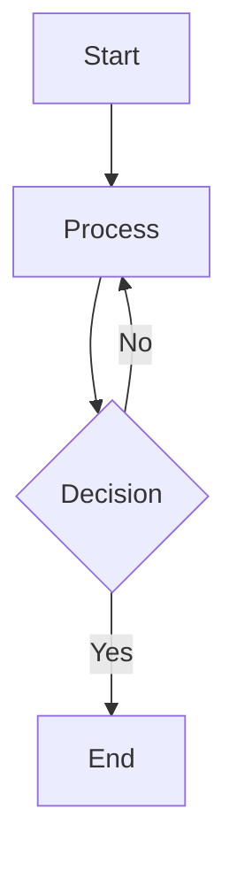

# Code Wiki Extension

View and navigate Code Wiki repository documentation directly in VS Code, with built-in wiki generation capabilities.

## Features

- 📚 Browse your repository's Code Wiki structure in a dedicated Activity Bar view
- � Generate wiki documentation directly from your repository
- �📖 View wiki files in a custom webview with proper markdown rendering
- 📊 Full Mermaid diagram support with theme-aware rendering
- 🔄 Auto-refresh when workspace folders change
- 🎨 Matches VS Code theme colors
- ⚠️ Comprehensive error handling for diagram rendering failures
- 🔐 Secure API key management with system keychain integration

## Installation

### Build from Source

1. **Install dependencies:**
   ```bash
   cd vscode-ext
   npm install
   ```

2. **Compile the TypeScript code:**
   ```bash
   npm run compile
   ```

3. **Package the extension:**
   ```bash
   npm run package
   ```
   This builds and packages the extension, creating a `code-wiki-0.2.0.vsix` file.

4. **Install the extension:**

   **For Local VS Code:**
   ```bash
   code --install-extension code-wiki-0.2.0.vsix
   ```
   
   Or via VS Code UI:
   - Open VS Code
   - Go to Extensions view (Ctrl+Shift+X / Cmd+Shift+X)
   - Click the `...` menu → "Install from VSIX..."
   - Select the `code-wiki-0.2.0.vsix` file

   **For Remote VS Code (SSH/WSL/Containers):**
   - Connect to your remote environment in VS Code
   - Open Extensions view (Ctrl+Shift+X / Cmd+Shift+X)
   - Click the `...` menu → "Install from VSIX..."
   - Select the `code-wiki-0.2.0.vsix` file from your local machine
   - The extension will be installed on the remote environment

5. **Reload VS Code:**
   - Press Ctrl+Shift+P / Cmd+Shift+P
   - Run "Developer: Reload Window"

## Usage

### Viewing Documentation

1. Open a folder containing Code Wiki documentation at `.codewiki/`
2. Click the **RepoWiki icon** in the Activity Bar (left sidebar)
3. Browse the wiki tree structure
4. Click on any folder or file to view its contents in the webview
5. Folders with a corresponding markdown file (e.g., `FolderName/FolderName.md`) are directly clickable

**Quick Start (Try Viewer First):**

The repository includes a `.codewiki` folder with reference documentation. You can immediately:
- Click the **RepoWiki icon** in the Activity Bar
- Browse and explore the viewer features
- See how the documentation looks

**To Test the Generation Flow:**

If you want to test the wiki generation process:

```bash
# Rename the existing .codewiki folder
mv .codewiki .codewiki.backup
```

Then reload VS Code (Ctrl+Shift+P / Cmd+Shift+P → "Developer: Reload Window") to see the "Generate Wiki from Repo" button and try the full generation workflow.

### Generating Documentation

If your repository doesn't have wiki documentation yet, you can generate it directly from the extension:

1. Open your repository folder in VS Code
2. Click the **RepoWiki icon** in the Activity Bar
3. Click the **"Generate Wiki from Repo"** button (shown when no `.codewiki` folder exists)
4. The extension will automatically:
   - Create/activate a Python virtual environment (`.venv`)
   - Install CodeWiki and its dependencies
   - Check for API key configuration
   - Generate comprehensive documentation for your repository

**First-time setup:**
- If you haven't configured an API key, the extension will prompt you
- Click "Set API Key" to open a terminal with setup instructions
- Run: `codewiki config set --api-key YOUR_API_KEY`
- Get an API key from:
  - [iFlow](https://platform.iflow.cn/profile?tab=apiKey)
  - [OpenAI](https://platform.openai.com/api-keys)
  - [Anthropic](https://console.anthropic.com/settings/keys)
  - Or your custom LLM provider

**During generation:**
- Monitor progress via the notification in VS Code
  - Generation typically takes 30-60 minutes depending on your repository size
- View detailed output in the "CodeWiki Generate" output channel (View → Output)
- Cancel anytime by clicking the ❌ button on the progress notification

**After generation:**
- The wiki tree will automatically refresh
- Browse and view the generated documentation
- Documentation is saved in `.codewiki/` folder

## Wiki Structure

The extension expects your wiki to be located at:
```
<workspace>/.codewiki/
```

## Mermaid Diagram Support

The extension provides comprehensive support for Mermaid diagrams embedded in your wiki markdown files. All standard Mermaid diagram types are supported:

- **Flowcharts and Graphs** - Visualize processes and workflows
- **Sequence Diagrams** - Show interactions between components
- **Class Diagrams** - Document object-oriented structures
- **State Diagrams** - Represent state machines
- **Entity-Relationship Diagrams** - Model database schemas
- **And more** - All Mermaid diagram types from the official documentation

### Features

- **Theme-Aware Rendering**: Diagrams automatically adapt to your VS Code theme (light/dark)
- **Error Handling**: Clear error messages when diagrams fail to render, with retry options
- **Standard Syntax**: Use standard Mermaid syntax without modifications or workarounds
- **Multiple Diagrams**: Render multiple diagrams in a single document independently

### Configuration

You can customize Mermaid rendering through VS Code settings:

- `codewiki.mermaid.theme`: Choose diagram theme (`auto`, `dark`, `light`, `neutral`)
- `codewiki.mermaid.errorDisplay`: Control how errors are displayed (`inline`, `notification`, `console`)

### Example

````markdown

````

## Commands

- **Code Wiki: Generate Wiki from Repo** - Generate comprehensive documentation for your repository
- **Code Wiki: Refresh** - Manually refresh the wiki tree view
- **Code Wiki: Show Debug Output** - View captured console output for debugging
- **Code Wiki: Show Mermaid Errors** - Display Mermaid diagram rendering errors
- **Code Wiki: Fix Mermaid Errors with Copilot** - Get AI-powered suggestions to fix diagram errors

## Development

### Automated Mermaid Error Detection

The extension includes automation tools for detecting and fixing Mermaid diagram rendering errors:

```bash
# Scan all wiki files for Mermaid errors
npm run scan:mermaid

# This will:
# - Scan all 115+ markdown files
# - Validate 650+ Mermaid diagrams
# - Generate MERMAID_FIX_PROMPT.txt with errors
# - Provide Copilot-ready prompts for fixes
```

See [AUTOMATION_SUMMARY.md](AUTOMATION_SUMMARY.md) for quick start guide and [docs/MERMAID_ERROR_AUTOMATION.md](docs/MERMAID_ERROR_AUTOMATION.md) for complete documentation.

## Requirements

- VS Code 1.85.0 or higher
- A workspace with a Code Wiki structure (for viewing)

**For documentation generation:**
- Python 3.8 or higher
- [`uv`](https://github.com/astral-sh/uv) package manager (recommended)
- LLM API key (iFlow, OpenAI, Anthropic, or custom provider)

## Known Issues

None at this time.

## Release Notes

### 0.1.0

Initial release of Code Wiki extension.

- Browse and view Code Wiki documentation
- Full Mermaid diagram support with theme-aware rendering
- Comprehensive error handling
- Configurable diagram themes

## License

MIT
