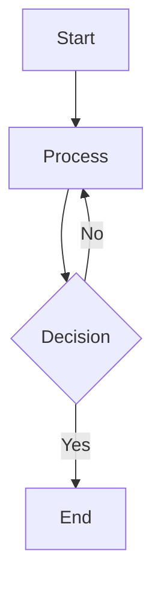

# Code Wiki Extension

View and navigate Code Wiki repository documentation directly in VS Code.

## Features

- 📚 Browse your repository's Code Wiki structure in the Explorer view
- 📖 View wiki files in a custom webview with proper markdown rendering
- 📊 Full Mermaid diagram support with theme-aware rendering
- 🔄 Auto-refresh when workspace folders change
- 🎨 Matches VS Code theme colors
- ⚠️ Comprehensive error handling for diagram rendering failures

## Usage

1. Open a folder containing a Code Wiki at `.codewiki/`
2. The "Code Wiki" view will appear in the Explorer sidebar
3. Click on any folder or file to view its contents
4. Folders with a corresponding markdown file (e.g., `FolderName/FolderName.md`) are directly clickable

## Wiki Structure

The extension expects your wiki to be located at:
```
<workspace>/.codewiki/
```

## Mermaid Diagram Support

The extension provides comprehensive support for Mermaid diagrams embedded in your wiki markdown files. All standard Mermaid diagram types are supported:

- **Flowcharts and Graphs** - Visualize processes and workflows
- **Sequence Diagrams** - Show interactions between components
- **Class Diagrams** - Document object-oriented structures
- **State Diagrams** - Represent state machines
- **Entity-Relationship Diagrams** - Model database schemas
- **And more** - All Mermaid diagram types from the official documentation

### Features

- **Theme-Aware Rendering**: Diagrams automatically adapt to your VS Code theme (light/dark)
- **Error Handling**: Clear error messages when diagrams fail to render, with retry options
- **Standard Syntax**: Use standard Mermaid syntax without modifications or workarounds
- **Multiple Diagrams**: Render multiple diagrams in a single document independently

### Configuration

You can customize Mermaid rendering through VS Code settings:

- `codewiki.mermaid.theme`: Choose diagram theme (`auto`, `dark`, `light`, `neutral`)
- `codewiki.mermaid.errorDisplay`: Control how errors are displayed (`inline`, `notification`, `console`)

### Example

````markdown

````

## Commands

- **Code Wiki: Refresh** - Manually refresh the wiki tree view

## Development

### Automated Mermaid Error Detection

The extension includes automation tools for detecting and fixing Mermaid diagram rendering errors:

```bash
# Scan all wiki files for Mermaid errors
npm run scan:mermaid

# This will:
# - Scan all 115+ markdown files
# - Validate 650+ Mermaid diagrams
# - Generate MERMAID_FIX_PROMPT.txt with errors
# - Provide Copilot-ready prompts for fixes
```

See [AUTOMATION_SUMMARY.md](AUTOMATION_SUMMARY.md) for quick start guide and [docs/MERMAID_ERROR_AUTOMATION.md](docs/MERMAID_ERROR_AUTOMATION.md) for complete documentation.

## Requirements

- VS Code 1.85.0 or higher
- A workspace with a Code Wiki structure

## Known Issues

None at this time.

## Release Notes

### 0.1.0

Initial release of Code Wiki extension.

- Browse and view Code Wiki documentation
- Full Mermaid diagram support with theme-aware rendering
- Comprehensive error handling
- Configurable diagram themes

## License

MIT
